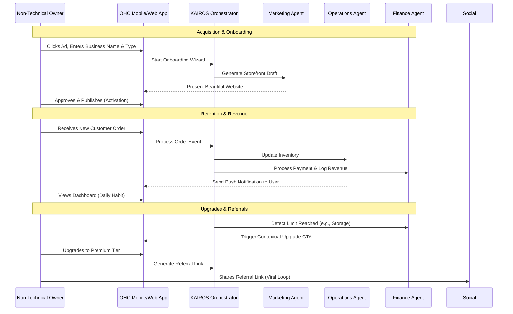

# Issue Brief: Business Journey Architecture

## Title
Business Journey Architecture

## Problem Statement
Small business owners—from bakers to handymen to food cart operators—often lack technical expertise and quickly become overwhelmed by traditional platform onboarding (like Shopify or Wix) that requires manual setup, configuration, and design. They need a frictionless, guided path from idea to live business in under 10 minutes. Without a seamless journey spanning acquisition, onboarding, activation, retention, revenue, and referral, these non-technical users abandon the platform before realizing its value.

## Research Report
Based on an analysis of competitor platforms and small business needs:
- **Shopify & Wix**: Onboarding can take 30-60 minutes. Users are bombarded with technical jargon ("DNS", "Payment Gateways", "SEO Meta Tags") which leads to high drop-off rates for non-technical users.
- **Squarespace & GoDaddy**: Simpler than Shopify but lack deep business operational support (like background AI agents).
- **Small Business Needs**: Our personas (Maya the baker, Carlos the handyman, Priya the boutique owner, Leo the tutor, Fatima the food cart operator) need an immediate sense of accomplishment. The "Aha!" moment comes when they see their business online and ready to accept orders/bookings.
- **OHC Opportunity**: By treating AI as invisible infrastructure, we can auto-generate the website, inventory structure, and booking calendars during a minimalist onboarding wizard, drastically reducing time-to-value and keeping users engaged through continuous AI-driven interactions.

## Design Doc

### User Journeys

#### Maya (The Home Baker)
- **Acquisition**: Sees an Instagram Ad for "Launch your bakery online in 10 minutes." Landing page CTA: "Start Selling."
- **Onboarding**: Enters business name, uploads a few cake photos, selects "Bakery/Custom Orders". AI auto-generates a storefront and suggests deposit settings.
- **Activation**: Day 1: Storefront live, first custom order received via Instagram bio link.
- **Retention**: Receives push notifications for new DMs (auto-replied by AI) and daily summary of new custom orders.
- **Revenue**: Upgrades to Starter when her storage for high-res cake photos exceeds 500MB.
- **Referral**: Sends an auto-generated referral code to a fellow baker when discussing how easy it is to manage orders.

#### Carlos (The Freelance Handyman)
- **Acquisition**: Word of mouth from another contractor. CTA: "Get Booked Faster."
- **Onboarding**: Selects "Services". Chooses a pre-built template for "Home Repair". Sets availability calendar.
- **Activation**: Day 1: First customer books a time slot and pays a deposit.
- **Retention**: Daily push notification: "You have 2 jobs today." Weekly AI report on completed jobs.
- **Revenue**: Upgrades to Starter for a custom domain (carlosrepairs.com) to print on his truck.
- **Referral**: Mentions the app on a local contractors' Facebook group with his link.

#### Priya (The Boutique Owner)
- **Acquisition**: Searches Google for "sync in-store and online inventory."
- **Onboarding**: Connects Stripe Terminal, adds 5 products with variants.
- **Activation**: Day 1: First online sale via synced inventory.
- **Retention**: Checks mobile dashboard daily for revenue trends and AI suggestions on low stock.
- **Revenue**: Upgrades to Pro to get unlimited products and custom domain with SSL.
- **Referral**: Invites another local shop owner via the "Refer a Business" button in the app.

#### Leo (The Music Tutor)
- **Acquisition**: TikTok video showing an easy link-in-bio for booking.
- **Onboarding**: Connects Google Calendar, sets up recurring subscription packages.
- **Activation**: Day 1: A student books a recurring weekly lesson.
- **Retention**: AI auto-reminds him of upcoming lessons and follows up with inactive students.
- **Revenue**: Upgrades to Starter to use a custom domain for his professional portfolio.
- **Referral**: Shares his link-in-bio on TikTok, which includes a "Powered by OHC" footer.

#### Fatima (The Food Cart Operator)
- **Acquisition**: Local community flyer or word of mouth (translated to Arabic).
- **Onboarding**: Selects "Food & Beverage", uploads menu photos, sets up Arabic + English UI.
- **Activation**: Day 1: First pre-order received with a phone notification.
- **Retention**: Relies on the daily printable order list and simple sold-out toggles.
- **Revenue**: Remains on the Free tier initially; upgrades to Starter when order volume exceeds the Free tier's AI actions limit.
- **Referral**: Tells other food cart owners at the commissary kitchen.

### Architecture Diagram

### UI Wireframes & Mobile UX Flow (375px first)
- **Step 1: The Hook (Acquisition)**: Clean landing page with a single input: "What's the name of your business?" and a "Get Started" button.
- **Step 2: The Wizard (Onboarding)**: 3 steps maximum.
    1. Select Business Type (Visual grid: Food, Services, Retail, etc.).
    2. Upload 1-3 photos or connect Instagram.
    3. AI Generation Screen (Shimmer effect with text "Our AI is building your store...").
- **Step 3: The Dashboard (Retention)**: A "Today" tab showing a plain-language summary: "You have 2 new orders" and a "Agent Actions" feed.
- **Step 4: Upgrade CTA (Revenue)**: Contextual, non-intrusive bottom sheet when a limit is approached: "You're growing! Get a custom domain to look even more professional. Upgrade to Starter."
- **Step 5: Share (Referral)**: A prominent "Share your store" button that generates a QR code and link-in-bio.

### AI Agent Integration Points
- **Onboarding**: "The Promoter" (Marketing) creates the initial site design and copy based on minimal input.
- **Retention**: "The Advisor" (Business Advisory) sends weekly push notifications with actionable insights.
- **Revenue**: "The Accountant" (Finance) tracks usage and triggers the right upgrade prompt at the right time.

### Key Design Decisions
- **Deferred Complexity**: Payment gateway connection and legal policy generation are deferred until the first order is ready or upon publishing, reducing upfront friction.
- **Mobile-First Real-Time Updates**: Critical retention features (order notifications) must be pushed real-time to the mobile device.
- **Contextual Upgrades**: Avoid aggressive paywalls. Instead, upsell based on value ("You need more space for these great photos") rather than feature gating initially.

## Implementation Prompt
"Implement the OHC Onboarding Wizard and Business Dashboard mobile flows. The onboarding flow must be a maximum of 3 steps, supporting business name entry, category selection, and photo upload. It should trigger the KAIROS Orchestrator to generate a draft storefront. The Dashboard must present a 'Today' view at 375px width, displaying plain-language order summaries and an 'Agent Actions' feed. Integrate contextual upgrade CTAs that trigger when usage limits (e.g., storage, AI actions) approach the tier threshold. Ensure all screens use the OHC premium tokens (Glassmorphism, Outfit/Inter typography)."

## Priority
P0

## Estimated Scope
Large
