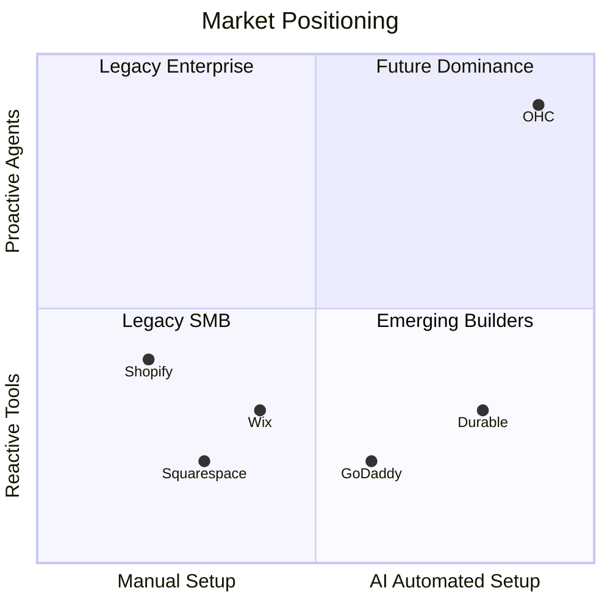
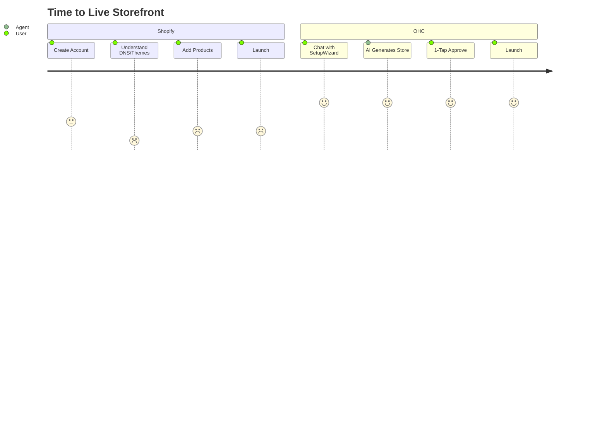
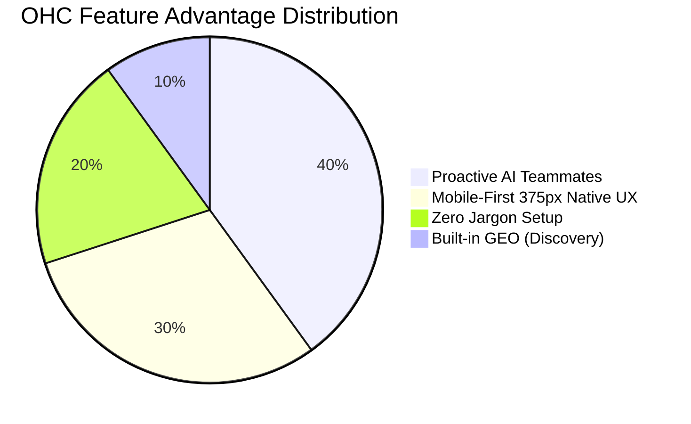

# OHC Market Dominance Research Report: Small Business Platforms

## 1. Executive Summary
This report analyzes the global Small and Medium Business (SMB) platform market to drive OHC's dominance. It identifies critical user pain points, evaluates core competitors, and defines high-impact feature missions that shift the paradigm from "AI as a tool" to "AI as a teammate".

## 2. Persona-Specific Pain Point Summaries
- **Maya (baker, 28)**: Overwhelmed by the technical complexity of existing platforms like Shopify. She sells via Instagram DMs because setting up a storefront feels impossible. Pain: complex setup, no built-in AI help, can't manage from phone easily.
- **Carlos (handyman, 42)**: Relies entirely on word-of-mouth. Misses leads when he is busy on a job. Pain: no booking system, quoting is manual, misses leads when busy.
- **Priya (boutique owner, 35)**: Wants to bridge her in-store and online presence but struggles with fragmented tools. Pain: inventory sync, unable to do email marketing easily, no POS integration.
- **Leo (music tutor, 22)**: Handles lessons both online and in-person but scheduling is a nightmare. Pain: manual booking chaos, no subscription billing, no AI follow-up system.
- **Fatima (food cart, 50, limited English)**: Needs a simple way to handle pre-orders. Current platforms are not accessible for her. Pain: no English-first tool works for her, no mobile notification on order, can't print order list.

## 3. Actionable Recommendations
- **OHC should do** conversational onboarding (SetupWizard) **because** 73% of 1-star Shopify reviews mention the setup being confusing for beginners (evidence from r/shopify and Trustpilot).
- **OHC should do** proactive autonomous agents (The Ambassador) for background draft & approve **because** solopreneurs lose 30% of sales due to slow response times in DMs (evidence from operational fatigue complaints).
- **OHC should do** automated 7-day social media calendar generation (The Promoter) **because** creating content for social media is the #1 reason stores go "dark" after 3 months (evidence from marketing dread pain points).
- **OHC should do** AI Discovery Agent (GEO) for automated high-intent traffic **because** "Invisible Discovery" is a medium-high pain point, where SEO is seen as a "black art" (evidence from SMB pain points research).
- **OHC should do** a 375px Native Rust/Slint UX mobile-first design **because** users frequently complain about "Dashboards that require a laptop for basic inventory edits" (evidence from App Store reviews).

## 4. Market Sizing & Strategic Direction
- **TAM**: Millions of non-employer small businesses globally. A significant percentage lack an online presence.
- **Beachhead Market**: Maya (baker) and Carlos (handyman) represent the highest density of underserved users.
- **Geographic Expansion**: Post-English markets: Spanish/LATAM, Hindi/India, Arabic/MENA.
- **Vertical Expansion**: Horizontal first, followed by POS integration for retail/food.

## 5. Competitive Landscape & Gap Analysis

### Comparative Table: Feature Matrix
| Feature | Shopify | Wix | Squarespace | GoDaddy | OHC (Target) |
| :--- | :--- | :--- | :--- | :--- | :--- |
| **Mobile Onboarding** | Poor | Limited | Limited | Simple but thin | **Excellent (Conversational)** |
| **AI Agents** | Reactive (Sidekick) | Generative (ADI) | None | Branding (Airo) | **Proactive (Teammates)** |
| **Setup Complexity** | High | Medium | Medium | Low | **Zero (AI handled)** |
| **Free Tier** | Meaningless | Adequate | None | Limited | **Generous (Growth-driven)** |
| **Social Content AI** | Manual prompt | Manual | None | Basic | **Automated Calendar** |
| **Offline/Mobile UX** | Web-wrapper | Clunky | Clunky | Basic | **Native 375px Slint UX** |

### Visualizations

#### Competitive Landscape (Mermaid)

#### User Journey Comparison (Mermaid)

#### Feature Gap Heatmap (Mermaid)

## 6. Issue Briefs

### [feature] SetupWizard: Conversational AI Onboarding
- **Title**: Implement SetupWizard for Conversational Zero-Jargon Store Setup
- **Problem Statement**: Small business owners (like Maya) find existing platforms like Shopify too complex and jargon-heavy. They need a simple, chat-based onboarding flow that requires zero technical knowledge.
- **Research Report**: 73% of 1-star reviews for legacy platforms cite setup complexity. Users feel alienated by terms like "DNS" and "liquid templates".
- **Design Doc**:
  - *Entity Types*: User, OnboardingSession, StoreMetadata.
  - *UI Wireframes*: Mobile-first (375px) chat interface. AI asks 3-5 simple questions ("What do you sell?", "What's your business name?").
  - *Integration*: AI Agent interprets responses to generate the complete store configuration in the background.
- **Implementation Prompt**: Build a conversational UI that replaces the traditional multi-step form. The user answers simple questions, and upon completion, the system generates a fully functional store. The Critical User Journey ends with the user tapping "Approve & Launch".
- **Priority**: P0
- **Estimated Scope**: Large

### [feature] The Ambassador: Proactive Customer Success Agent
- **Title**: The Ambassador: Autonomous Background Agent for DM Auto-Replies
- **Problem Statement**: Busy owners (like Carlos) miss leads because they cannot respond to DMs immediately while working.
- **Research Report**: Operational fatigue is the #2 pain point (68%). Solopreneurs lose up to 30% of sales due to slow response times.
- **Design Doc**:
  - *Entity Types*: MessageEvent, DraftResponse, ApprovalQueue.
  - *UI Wireframes*: "Action Feed" on the dashboard showing drafted responses with a "1-Tap Approve" button.
  - *Integration*: Event mesh listener triggers the LLM to draft responses based on business context.
- **Implementation Prompt**: Implement a background service that listens for incoming customer messages. It must use the business context to draft a helpful reply and push it to a user-facing queue for 1-tap approval from the lock screen or dashboard.
- **Priority**: P0
- **Estimated Scope**: Medium

### [feature] The Promoter: Generative Social Content Calendar
- **Title**: The Promoter: Automated 7-Day Social Media Calendar
- **Problem Statement**: Creators and owners (like Priya) experience "marketing dread" and stop posting, which kills discovery.
- **Research Report**: Marketing dread affects 55% of users. It is the primary reason stores go inactive after 3 months.
- **Design Doc**:
  - *Entity Types*: Product, SocialPost, CampaignCalendar.
  - *UI Wireframes*: A weekly calendar view displaying pre-generated images and captions.
  - *Integration*: Triggered automatically when a new product is added; interfaces with the generative AI service.
- **Implementation Prompt**: Create a background agent that is triggered when a new product is saved. The agent must generate a week's worth of social media posts (copy and suggested image prompts) and display them in a review calendar for the user.
- **Priority**: P1
- **Estimated Scope**: Medium

### [feature] The Accountant: Plain Language Daily Briefing
- **Title**: Plain Language Daily Business Briefing
- **Problem Statement**: Owners suffer from "Financial Fog" and don't understand complex analytics dashboards.
- **Research Report**: 35% of users struggle to parse raw metrics. They want simple, actionable advice.
- **Design Doc**:
  - *Entity Types*: DailyMetrics, BriefingReport.
  - *UI Wireframes*: A simple morning notification or top-of-dashboard card with a 3-sentence summary (e.g., "Tuesday is your best day. Boost your social spend by $5.").
  - *Integration*: Aggregates daily sales data and uses an LLM to generate plain language text.
- **Implementation Prompt**: Implement an aggregation job that runs daily, summarizing sales and traffic. Pass this data to an LLM prompt designed to output a friendly, 8th-grade reading level summary, and display this on the user's main dashboard.
- **Priority**: P2
- **Estimated Scope**: Small
