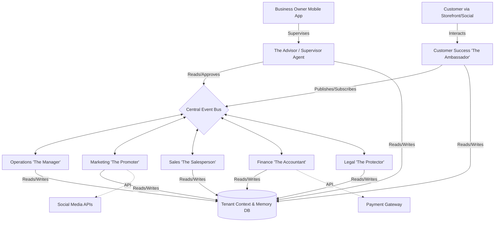

# AI Agent Department Architecture

## Problem Statement

Small business owners—whether a local baker like Maya, a food cart operator like Fatima, or a music tutor like Leo—often struggle with the operational complexity of running a business. They are experts in their craft, not in managing marketing campaigns, handling accounting, or tracking inventory. The sheer volume of administrative tasks creates a significant barrier to entry and growth. They need a system that handles these operations invisibly and autonomously, using terminology they understand, without requiring them to learn complex software or technical jargon. The current technical landscape forces them to stitch together multiple SaaS tools (Shopify for storefront, Mailchimp for marketing, QuickBooks for accounting), which is expensive, fragile, and overwhelming.

## Research Report

### Market Analysis & Competitive Landscape

*   **Shopify/Wix/Squarespace:** These platforms provide powerful tools but expect the user to be the operator. They offer "apps" and "plugins," requiring the user to act as a system integrator. The learning curve is steep, and they do not fundamentally reduce the operational burden; they only provide a digital interface for it.
*   **GoDaddy:** Offers simpler onboarding but lacks the depth needed for a growing business, especially concerning modern, automated operations.
*   **The "All-in-One" Illusion:** Many platforms claim to be all-in-one but still require manual operation of each module (e.g., manually sending an invoice, manually updating inventory).
*   **The Gap:** There is a massive gap for a "Do-It-For-Me" (DIFM) platform where AI agents act as actual employees, structured into logical departments, running the business autonomously under the owner's supervision.

### Core User Needs

*   **Simplicity:** No code, no technical manuals, no jargon.
*   **Automation:** Tasks must be handled invisibly in the background.
*   **Trust & Control:** The owner needs to know what the AI is doing, with clear approval mechanisms (auto-execute vs. draft-for-review) and health reports.
*   **Mobile-First Parity:** 100% of the platform must be operable from a smartphone (crucial for users like Maya and Carlos).

## Design Doc

### High-Level Architecture

The AI Agent ecosystem in OneHumanCorp (OHC) is modeled as a virtual corporate structure, divided into "Departments." Each department comprises specialized AI agents responsible for specific business domains.

#### The "Departments" Model

1.  **Operations ("The Manager"):** Handles order and booking processing, inventory tracking, fulfillment, and refunds.
2.  **Marketing & Advertising ("The Promoter"):** Manages website design, SEO, social media, promotional content, and QR codes.
3.  **Sales & Acquisition ("The Salesperson"):** Generates quotes, follows up on leads, tracks referrals, and suggests upsells.
4.  **Customer Success ("The Ambassador"):** Replies to messages, updates orders, requests reviews, and runs re-engagement campaigns.
5.  **Finance & Payments ("The Accountant"):** Processes payments, generates financial reports, handles subscription billing, and prepares tax summaries.
6.  **Legal & Compliance ("The Protector"):** Manages terms/policies, contracts, GDPR compliance, and license tracking.
7.  **Business Advisory ("The Advisor"):** Provides weekly health reports, next-action suggestions, identifies seasonal trends, and recommends pricing adjustments.

### Architecture Diagram

### AI Agent Mechanics & Inter-Departmental Coordination

*   **Trigger Mechanisms:**
    *   *Event-Driven:* A customer places an order (Event: `OrderPlaced`) -> Operations processes inventory -> Operations emits `InventoryUpdated` -> Customer Success sends confirmation.
    *   *Schedule-Driven:* The Accountant runs daily revenue summaries at 11:00 PM; The Advisor generates weekly health reports on Sunday morning.
    *   *Demand-Driven:* The owner explicitly asks, "Can you create a 20% off Halloween promo?"
*   **Context & Memory:**
    *   Agents share a unified Tenant Context. If Customer Success learns a customer prefers vegan options, this is stored in the customer's profile (Memory DB) so Sales can suggest vegan products in the future.
*   **Approval Workflows:**
    *   Actions are categorized by risk. Low-risk actions (sending an order confirmation) are *auto-executed*. High-risk actions (issuing a full refund, publishing a new public policy) are *drafted for review*. The owner receives a push notification to approve/reject.
*   **Resource Management:**
    *   AI usage is metered and throttled per tenant based on their SaaS tier (Free, Starter, Pro, Business).

### UI Wireframes & Mobile UX Flow (375px First)

**Screen 1: The Dashboard (The Advisor's View)**
*   *Header:* Glassmorphic greeting ("Good morning, Maya!").
*   *Action Center:* A feed of cards.
    *   Card 1: "3 new custom cake inquiries. [Review Draft Replies]" (Sales)
    *   Card 2: "Weekly health report is ready. Revenue is up 12%." (Advisor)
*   *Quick Actions:* Big, easy-to-tap buttons (Add Product, New Invoice).

**Screen 2: Department Detail (e.g., Marketing)**
*   *Header:* "Marketing & Advertising"
*   *Status:* "Active campaigns: 2"
*   *Recent Activity:* "Generated Halloween promo banner. [View]"
*   *Chat Interface:* A natural language text box at the bottom: "Ask The Promoter to do something..."

**Screen 3: Approval Flow (Interacting with Customer Success)**
*   *Notification:* "The Ambassador drafted a reply to Leo's Instagram DM."
*   *View:* Shows the incoming message ("Do you do vegan?") and the drafted reply ("Yes! We have a great vegan chocolate cake. Would you like to see the menu?").
*   *Actions:* [Send Now] | [Edit] | [Discard]

### Key Design Decisions

1.  **Anthropomorphized Departments:** Naming agents "The Manager" or "The Accountant" grounds the AI in reality. A business owner understands what an accountant does; they do not need to understand "LLM-driven financial aggregation services."
2.  **Shared Memory Core:** Prevents the "silo effect." All agents must read from and write to the same tenant-isolated vector/graph database to provide a cohesive experience.
3.  **Draft-for-Review as Default for High-Risk Actions:** Builds trust. The owner never feels like the AI will accidentally ruin their business.

## Implementation Prompt

**Prompt for Implementer Agent:**

We need to implement the core orchestration harness for the "Operations" (The Manager) and "Customer Success" (The Ambassador) AI departments.

**User Journey (CUJ):**
A customer places an order via the storefront. The Operations agent must automatically process the inventory deduction. Once successful, the Operations agent must signal the Customer Success agent to draft a personalized order confirmation message (based on the customer's purchase history) and queue it for sending.

**Acceptance Criteria:**
1.  **Event Subscription:** Implement a mechanism where the Operations agent listens for an `OrderPlaced` event.
2.  **State Mutation:** The Operations agent successfully mutates the database to reflect the inventory change.
3.  **Inter-Agent Communication:** The Operations agent triggers the Customer Success agent, passing the necessary order and customer context.
4.  **Action Queuing:** The Customer Success agent generates the personalized message and places it in an outbound queue (auto-execute).
5.  **Multi-Tenancy:** Ensure all context retrieval and state mutations are strictly isolated to the correct `tenant_id` derived from the event context.
6.  **Plain Language Logging:** Internal agent logs and state transitions must be readable and understandable if surfaced to the Business Advisory agent later.

*Note: You are responsible for designing the specific data structures, internal event queues, and function signatures required to satisfy this behavior within the existing Bazel/Rust architecture. Ensure 100% unit test coverage for the orchestration logic.*

## Metadata

*   **Priority:** P0 (Critical - Foundational Architecture)
*   **Estimated Scope:** Large
