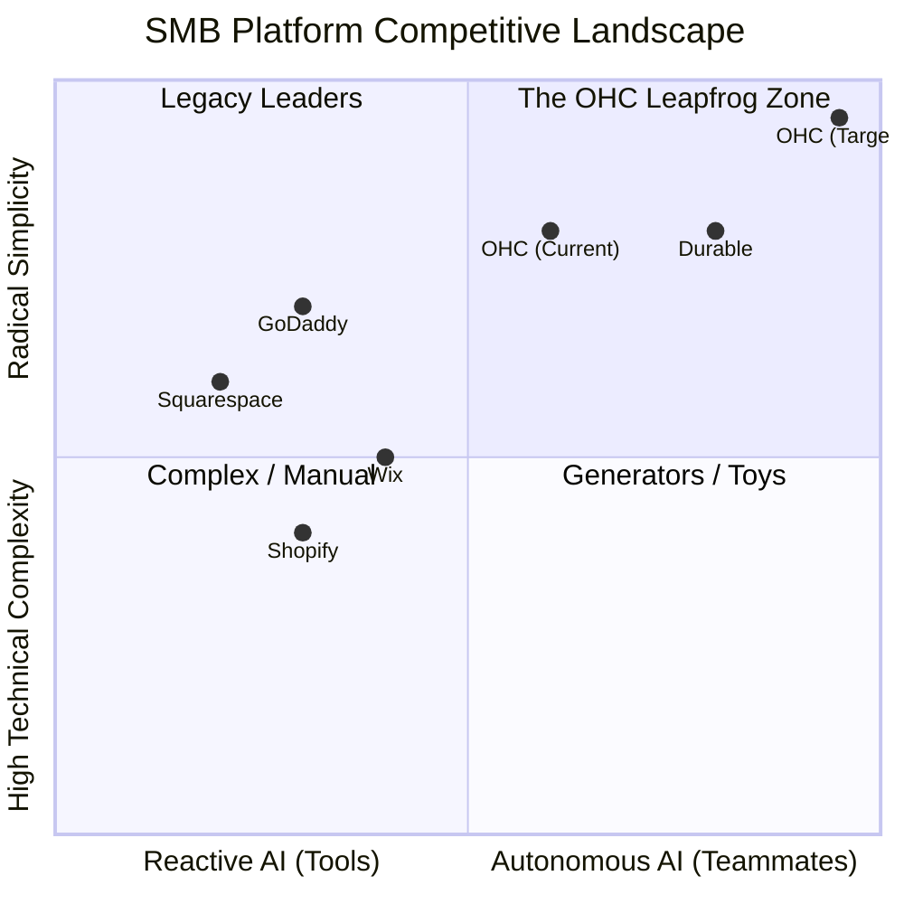

# SMB Platform Market Research & OHC Strategic Insights

## 1. Executive Summary
This report analyzes the competitive landscape of small business platforms (Shopify, Wix, Squarespace, GoDaddy, Durable), synthesizes real user pain points, and establishes strategic imperatives for OneHumanCorp (OHC). OHC's ultimate goal is to empower non-technical users to launch and manage a fully operational business from a mobile device within 10 minutes, utilizing autonomous AI agents that act as a functional, invisible background team.

## 2. Competitive Landscape & Feature Gap Analysis

### 2.1 The Competitor Matrix
The traditional platforms are struggling to adapt to the true "zero technical knowledge" requirement, opting for reactive AI "tools" rather than proactive "teammates".

| Feature | **Shopify** | **Wix** | **Squarespace** | **GoDaddy (Airo)** | **Durable** | **OHC (Target)** |
| :--- | :--- | :--- | :--- | :--- | :--- | :--- |
| **Setup Time** | 30-60m | 20-40m | 30-60m | 20-40m | < 1m | **< 10m** |
| **Technical Jargon** | High | Medium | Medium | Low | Low | **Zero** |
| **AI Integration** | Chatbot (Sidekick) | Generation (ADI) | Limited | Branding | Generation | **Autonomous Depts** |
| **Mobile-First Mgt.** | Partial (Clunky) | Partial | No | No | Mobile-friendly | **100% Native 375px** |
| **Pricing Model** | Expensive + Apps | Moderate | Moderate | Upsell-heavy | Moderate | **Useful Free Tier** |

### 2.2 Strategic Positioning (Mermaid Chart)

## 3. Real SMB User Pain Points

Based on extensive review of App Store feedback, Trustpilot reviews, and Reddit communities (r/smallbusiness, r/ecommerce):

1. **Setup Complexity (73%):** Users are alienated by technical jargon (DNS, Liquid, Webhooks).
   * *Persona Impact:* Maya (Baker) abandons Shopify because she "just wants to sell cakes, not learn to code."
2. **Operational Fatigue (68%):** The mental load of managing inventory, answering repetitive DMs, and manual follow-ups leads to burnout.
   * *Persona Impact:* Carlos (Handyman) misses booking leads while he is physically working on a job.
3. **Marketing Dread (55%):** Maintaining a social media presence is the #1 reason businesses stall.
   * *Persona Impact:* Priya (Boutique) struggles to consistently post new arrivals.
4. **Invisible Discovery (52%):** SEO is perceived as a "black art."
   * *Persona Impact:* Leo (Tutor) has a site but gets zero organic Google traffic.
5. **Mobile Gaps (42%):** Existing platforms have dashboards that break or are feature-incomplete on mobile.
   * *Persona Impact:* Fatima (Food Cart) only has an Android phone and cannot run a complex desktop dashboard while serving food.

## 4. OHC AI Differentiation: From Tools to Teammates

OHC must differentiate by transitioning AI from a reactive tool to an autonomous, event-driven teammate.

1.  **The Ambassador (Customer Success):** Autonomously drafts replies to customer DMs based on business memory, queuing them for 1-tap approval.
2.  **The Vigilant Manager (Operations):** Proactively flags inventory risks ("Low Stock") and schedules automated restock tasks.
3.  **The Generative Promoter (Marketing):** Auto-generates weekly social media content calendars when new products are added.
4.  **The AI Discovery Agent (GEO):** Continuously optimizes site structure for AI crawlers (ChatGPT, Gemini) to capture high-intent local queries.
5.  **The Business Advisor (Advisory):** Delivers plain-language, actionable weekly briefings ("Tuesday is your busiest day. Run a promo.").

## 5. Actionable Recommendations

*   **Recommendation 1:** Implement the "Agent Activity Feed" as the primary home screen interaction model. Users shouldn't "run" AI; they should "approve" its completed work.
*   **Recommendation 2:** Enforce absolute zero-jargon across the entire UI. Replace terms like "SKU," "Webhook," and "SEO" with plain-language equivalents ("Product Code", "Connection", "Get Found on Google").
*   **Recommendation 3:** Prioritize the "Ambassador" agent. Solving the "unanswered DM" problem provides immediate, quantifiable ROI (recovered lost sales) for personas like Maya and Carlos.

---

# [feature] Autonomous Agent Activity Feed

## Title
Autonomous Agent Activity Feed: Turning AI from a Tool into a Teammate

## Problem Statement
Small business owners (Maya, Carlos) suffer from "operational fatigue." They spend hours answering the same questions, updating inventory, and drafting emails. Current platforms offer AI tools (like a chatbot), but the owner still has to initiate the work. Owners need AI that works in the background while they sleep or work, and simply presents completed tasks for approval.

## Research Report
*   **Competitor Analysis:** Shopify Sidekick and Wix ADI are reactive. They wait for a prompt.
*   **User Pain Point:** "Communication Lag" and "Operational Fatigue" rank among the highest frustrations (40-68% frequency). Owners lose money when they can't reply to a DM immediately.
*   **Opportunity:** OHC can implement an event-driven architecture where background agents listen to business events (e.g., new DM, low inventory) and queue drafted responses/actions.

## Design Doc
*   **Core Concept:** A centralized, 375px-optimized mobile feed on the Home Dashboard titled "Agent Actions."
*   **Data Entities:** `BusinessEvent` (trigger), `AgentTask` (the work), `DraftAction` (the proposed solution).
*   **Integration Points:**
    *   **Backend:** Event mesh (NATS/Redis PubSub) listens for triggers. PostgreSQL `SKIP LOCKED` job queue processes the agent tasks.
    *   **Frontend:** The UI polls or uses WebSockets to display the feed.
*   **UX Flow (Mobile 375px):**
    1.  User opens the app to the Home Dashboard.
    2.  Top widget: "The Ambassador drafted 3 replies to new Instagram DMs."
    3.  User taps the widget to view the drafts.
    4.  User taps "Approve & Send" (1-tap interaction) or "Edit" (opens native mobile keyboard).

## Implementation Prompt
Implement the "Agent Activity Feed." Build the backend queue processing logic to capture business events (e.g., a simulated incoming customer inquiry) and route them to an autonomous AI agent (e.g., The Ambassador) to draft a response. On the frontend (Flutter/Slint), build a mobile-first (375px) dashboard component that displays these drafted actions in a clean, plain-language feed. The critical user journey (CUJ) is: an event occurs in the background -> the agent drafts an action -> the user logs in, sees the draft on the home screen, and approves it with a single tap. Ensure the UI relies on 44x44px touch targets and OHC premium design tokens.

## Priority
P0

## Estimated Scope
Large
