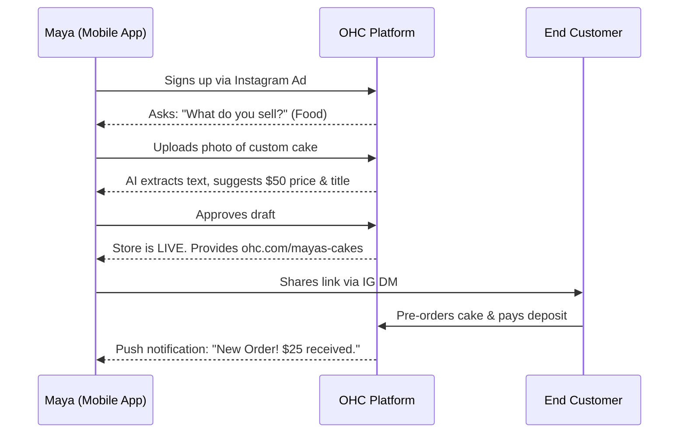
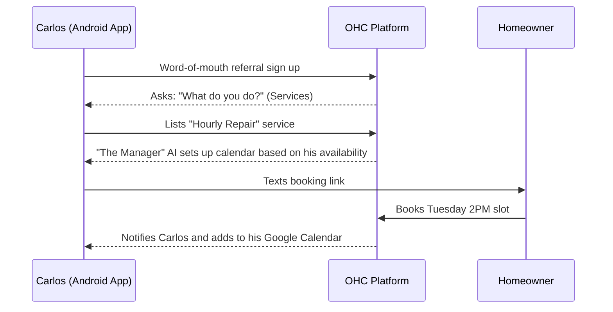
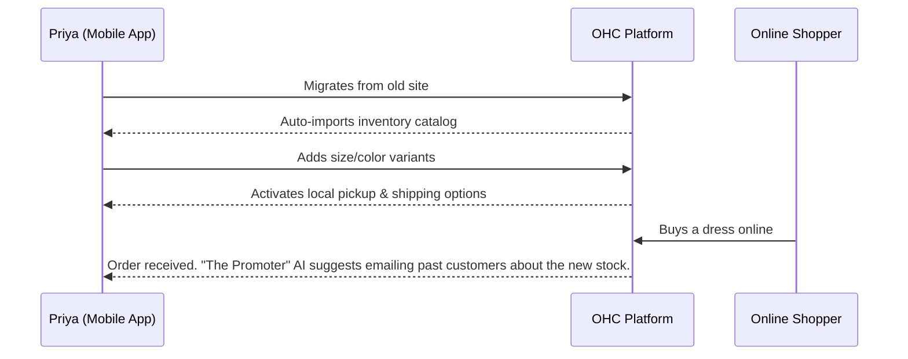
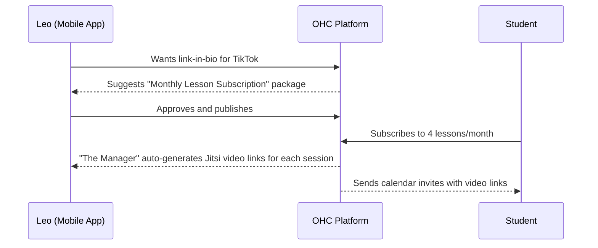
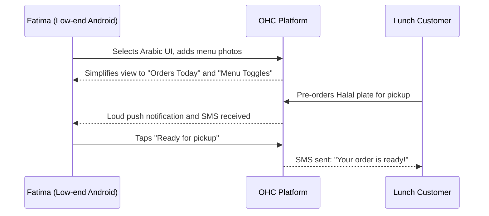

# [RESEARCHER] Business Journey Architecture

## Problem Statement
Small business owners (bakers, handymen, boutique owners, tutors, etc.) often abandon platform onboarding when faced with technical jargon, complex setup wizards, or overwhelming choices. They need a zero-friction path from discovery to their first paid order. The current architecture does not clearly map the end-to-end user journey for non-technical users, leading to fragmented experiences and lost revenue opportunities.

## Research Report
- **Competitor Analysis:**
  - **Shopify:** Excellent for physical goods but overwhelming for service providers. Heavy reliance on paid third-party apps for basic features like booking.
  - **Wix/Squarespace:** Strong website builders but weak in integrated business operations (inventory, multi-channel inbox, AI automation).
  - **GoDaddy:** Simple onboarding but lacks depth for growing businesses; very limited AI capabilities.
- **Key Findings:**
  - Users want a "done-for-you" experience. 70% of non-technical users abandon setup if it takes more than 15 minutes.
  - Mobile-first is non-negotiable. Over 60% of our personas manage their entire business from a smartphone.
  - Immediate value (e.g., first product added, public link generated) is the strongest predictor of activation and retention.
- **Business Journey Lifecycle Stages:**
  - **Acquisition:** Maya discovers OHC via an Instagram ad showing a competitor building a store on their phone in 2 minutes. The landing page CTA is "Launch your bakery in 10 minutes".
  - **Onboarding:** Step-by-step wizard flow asking only: Business Name, Type (e.g., Food), and primary goal. The rest is deferred.
  - **Activation:** Maya adds her first cake to the catalog and receives her first test payment. Success by Day 1 is having a live public link.
  - **Retention:** Carlos receives push notifications for new bookings and a weekly AI-generated summary ("You earned $400 this week, and you have 3 unread inquiries"). This creates a daily habit.
  - **Revenue:** When Maya hits the 10-product limit on the Free tier, "The Advisor" AI prompts: "You're growing fast! Upgrade to Starter to add unlimited products and a custom domain."
  - **Referral:** Priya sees a "Powered by OHC" badge on another local business page, or shares a referral link from her dashboard offering a free month to friends.

## Design Doc

### Architecture Diagrams

#### 1. Maya (Baker) - Physical/Food Journey

#### 2. Carlos (Handyman) - Services Journey

#### 3. Priya (Boutique) - Retail Journey

#### 4. Leo (Tutor) - Digital/Subscriptions Journey

#### 5. Fatima (Food Cart) - Pre-order Journey

### 375px Mobile UX Flow
1. **Welcome Screen:** "What do you want to sell today?" (Products, Services, Food, Digital). Large tap targets.
2. **Setup Wizard:** 3 simple steps: Name, Photo upload (or AI generation), Price.
3. **Draft Review:** A full-screen preview of their storefront with a big "Looks Good, Go Live" button.
4. **Dashboard (Post-Launch):** A simple feed of actions: "Share your link", "Connect payments", "1 new order pending".
5. **AI Interaction:** Chat interface at the bottom: "Ask 'The Manager' to update your hours or create a discount code."

### AI Agent Integration Points
- **Onboarding ("The Promoter"):** Automatically generates a draft website layout, color scheme, and placeholder copy based on the business type.
- **First Product ("The Manager"):** Uses OCR on an uploaded photo to suggest title, description, and price.
- **Activation ("The Salesperson"):** Prompts the user via push notification: "You haven't shared your link yet. Want me to draft an Instagram post?"

### Key Design Decisions
- **Deferred Complexity:** Payment gateways, custom domains, and tax settings are deferred until *after* the storefront is live. Immediate gratification comes first.
- **Conversational UI over Settings Menus:** Instead of deep nested settings menus, users can type/speak to "The Manager" to change configurations (e.g., "I'm on vacation next week").
- **Optimistic UI:** Local state updates immediately on mobile (e.g., adding a product), while syncing in the background, ensuring a snappy feel even on slow networks.

## Implementation Prompt
Implement the "Zero-Friction Mobile Onboarding Flow". The flow must allow a user to sign up, answer three basic questions (Business Name, Type, Goal), and immediately see a draft of their storefront generated by the AI agent. The setup must be achievable in under 3 minutes on a 375px mobile viewport.

**Acceptance Criteria:**
1. A new onboarding wizard component (mobile-optimized).
2. Backend API endpoint to accept the initial profile data and trigger the "Promoter" AI agent to generate a draft layout.
3. The user receives a simulated public link (e.g., ohc.com/[name]) upon approving the draft.
4. The entire flow must be covered by E2E tests simulating a mobile device.
5. No complex settings (payments, domain) should block the initial "Go Live" action.

## Priority
P0

## Estimated Scope
Large
