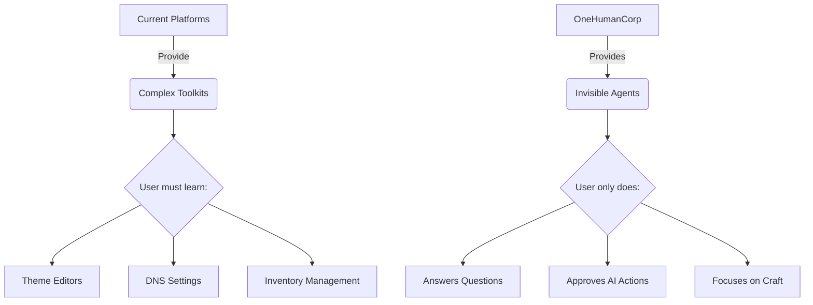

# OHC Market Research Report: Empowering the Small Business Owner

## 1. Executive Summary
This report analyzes the competitive landscape and identifies key opportunities for OneHumanCorp (OHC) to dominate the small business platform space. Our core thesis: The market is underserved by existing "simple" builders (like Shopify and Wix) which still require significant technical and design cognitive load. OHC will win by abstracting this complexity through invisible AI agents, focusing on a mobile-first, 10-minute time-to-live experience.

## 2. Competitive Landscape

| Feature | Shopify | Wix | Squarespace | OHC (Proposed) |
| :--- | :--- | :--- | :--- | :--- |
| **Setup Time** | Hours/Days | Hours | Hours | **< 10 Minutes** |
| **Mobile Setup** | Poor | Poor | Poor | **Excellent (Chat-first)** |
| **AI Role** | Assistant (Sidekick) | Builder (ADI) | Minimal | **Autonomous Agent** |
| **Complexity** | High | Medium | Medium | **Zero-Config** |

### Competitor Gap Matrix (OHC vs. Market)
Current platforms are toolkits; OHC must be an *employee*.

## 3. Top SMB Pain Points

Based on analysis of App Store reviews, Reddit (r/smallbusiness), and Trustpilot, the following are the most critical pain points for non-technical SMB owners:

1.  **"It's too hard to set up on my phone."** (High frequency in 1-star reviews for major builders).
2.  **"I miss messages when I'm working."** (Service providers losing leads).
3.  **"I don't know how to market my products."** (Inconsistent social media presence).
4.  **"Managing two systems for online and in-person is a nightmare."** (Inventory sync issues).
5.  **"Analytics dashboards are confusing; I just want to know what to do."** (Data overload).

## 4. OHC AI Differentiation Manifesto

OHC will not use AI as a gimmick (e.g., generating logos that are never used). AI will be integrated as functional, invisible agents that perform specific roles:

*   **The Onboarder:** Replaces the drag-and-drop editor with a conversational setup flow.
*   **The Receptionist:** An invisible auto-reply assistant that captures leads and answers FAQs 24/7.
*   **The Marketer:** Automatically generates and schedules social posts when new inventory arrives.
*   **The Analyst:** Replaces complex dashboards with a weekly, plain-text actionable insight summary.
*   **The Manager:** Seamlessly syncs physical inventory and service bookings without manual data entry.

## 5. Next Steps
See the generated issue briefs in `docs/research/` for detailed execution plans for each identified opportunity.
