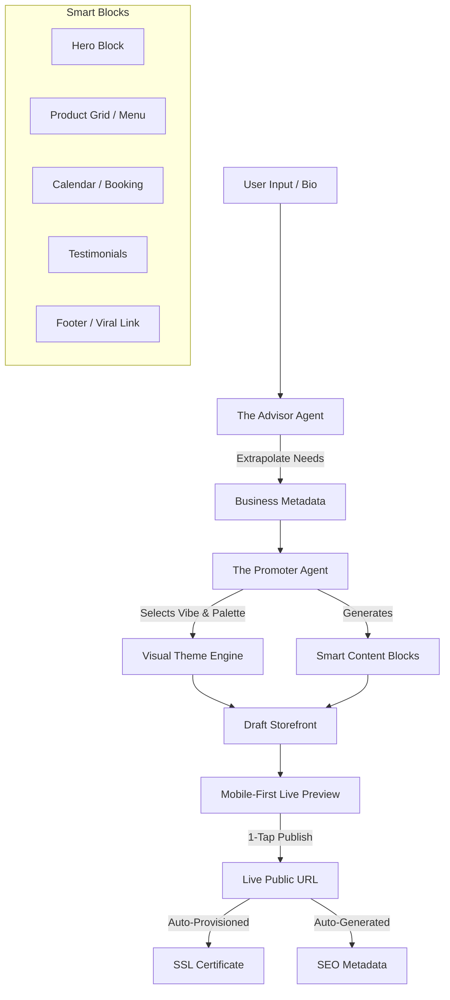

# Architecture Brief: Website & Storefront Builder

## Title
[architecture]_website_storefront_builder: Drag-and-Drop Website & Storefront Builder Architecture

## Problem Statement
Small business owners (like Maya the Baker, Carlos the Handyman, and Fatima the Food Cart Operator) find traditional website builders overly complex, filled with confusing technical jargon (e.g., DNS, SSL, padding), and poorly optimized for mobile devices. They need a system that translates a simple description or business profile into a professional, mobile-ready storefront instantly. If they cannot go from zero to a live, functional, and payment-ready URL in under 60 seconds directly from their phone, the platform fails the "Grandmother Test".

## Research Report
- **Competitive Analysis**: Platforms like Shopify and Squarespace use a section-based approach that can become cumbersome on small screens. AI-driven platforms like Durable and Wix ADI can generate sites quickly but often lack deep integration into downstream business operations (like automated booking or variant-level inventory).
- **Persona Pain Points**:
  - **Maya (Baker)**: Needs a highly visual, photo-first layout to showcase cakes, with integrated deposits and an AI agent to handle DM inquiries.
  - **Carlos (Handyman)**: Requires a clean service menu, a booking calendar with time slots, and quote generation capabilities.
  - **Fatima (Food Cart)**: Needs an ultra-simple, fast-loading menu with a one-tap "Sold Out" toggle and low-data usage.
- **Actionable Recommendations**:
  - Implement a "Smart Block" architecture instead of free-form drag-and-drop. Each block represents a specific business function (e.g., Hero, Menu, Booking, Testimonials).
  - Use AI "Vibe Coding" where an LLM selects layout, typography, and color schemes based on a natural language business description.
  - Automate all underlying technical requirements (custom domain provisioning, SSL certification, SEO meta tags).

### High-Level Architecture (Mermaid.js)

## Design Doc
### UI Wireframes & Mobile UX Flow (375px first)
1. **Initial Prompt**: A single text box asking "Describe your business in a few sentences" (or voice input).
2. **Generation Shimmer**: A skeleton loading screen with a Glassmorphism shimmer effect while the AI agent builds the site.
3. **Live Preview**: The generated storefront is presented immediately. The bottom navigation bar contains "Publish", "Edit Mode", and "Change Vibe".
4. **Edit Mode**: Tapping a section expands a full-screen, focused editor for that specific "Smart Block" (e.g., editing the Hero text or swapping an image). No complex layout controls are exposed.
5. **Publish**: One-tap action that makes the site live on an OHC subdomain and provisions SSL in the background.

### AI Agent Integration Points
- **The Promoter Agent**: Translates the business description into a concrete set of Smart Blocks, selects the appropriate layout, and generates initial placeholder copy.
- **The Marketing & Advertising Agent**: Automatically generates SEO meta titles, descriptions, and social sharing images based on the content of the Smart Blocks.

### Key Design Decisions
- **Smart Blocks over Free-form Layouts**: Constraining customization to predefined functional blocks ensures the layout never breaks on mobile and guarantees accessibility.
- **Progressive Disclosure**: Advanced settings (like custom domains) are hidden behind an "Advanced Mode" toggle, ensuring the initial flow remains simple and jargon-free.
- **Mobile-First Editing**: The entire editing experience must be comfortable to use with one thumb on a 375px screen.

## Implementation Prompt
**To Implementer Agent:**
Implement the foundational data model and backend services for the "Smart Block" website builder. Define the JSON schema for the various `SmartBlock` types (Hero, Menu, Booking, etc.) and create the REST/gRPC endpoints required to save and retrieve a `Storefront` configuration associated with a `Tenant`. Ensure the API supports partial updates so individual blocks can be modified efficiently from a mobile client. The backend must automatically generate standard SEO metadata based on the storefront configuration upon saving. Do not prescribe specific database tables; focus on the API contracts and the logical structure of the Smart Blocks. Acceptance criteria: A tenant can generate a draft storefront composed of multiple Smart Blocks, retrieve it, modify a single block, and publish the configuration, triggering a mock event for SSL/Domain provisioning.

## Priority
P0

## Estimated Scope
Medium
