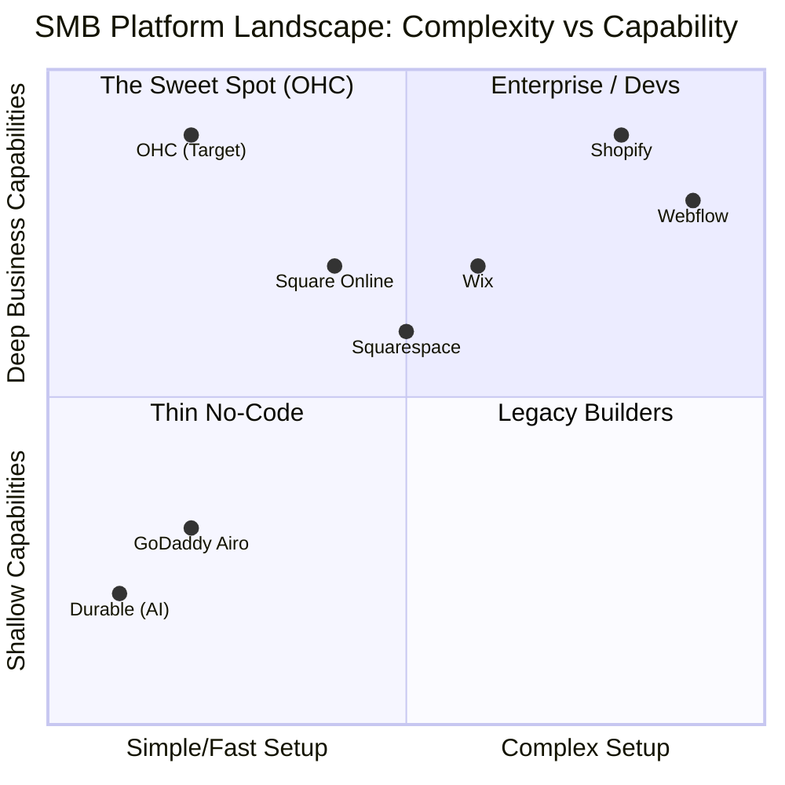

# 🔎 Scout: SMB Platform Market Research and Feature Gaps

## Executive Summary
One Human Corp (OHC) is positioned to revolutionize the small business platform space by offering an invisible, AI-powered **Hybrid Agentic OS** that handles the heavy lifting of business management. This research report analyzes the current Small and Medium Business (SMB) platform landscape, identifies key user pain points, evaluates competitor offerings (and their AI shortcomings), and proposes high-priority feature missions to secure market dominance.

## 1. Deep Competitor Audit & AI Differentiation

The current landscape forces non-technical founders to choose between extreme simplicity (with shallow functionality) and powerful tools that demand a steep learning curve.

### Competitive Landscape

### Feature Gap Matrix

| Feature / Platform | Shopify | Wix | Squarespace | GoDaddy | OHC (Current Gap/Advantage) |
|--------------------|---------|-----|-------------|---------|-----------------------------|
| **Setup Time** | Days/Weeks | Hours | Hours | Minutes | **Advantage:** <10 mins via AI agents |
| **Mobile App UX** | Strong (Post-setup) | Weak Editor | Basic | Poor | **Advantage:** Tauri mobile-first parity |
| **AI Website Gen** | None (Manual) | Basic ADI | None | Airo (Thin) | **Gap:** Needs 1-click AutoDream templates |
| **Agentic AI** | Sidekick (Chatbot) | None | None | None | **Advantage:** Background Swarm KAIROS |
| **Free Tier** | Trial Only | Ads | None | Free/Limited | **Advantage:** Standalone SQLite mode |
| **Auto-Comms** | Apps needed | Built-in | Apps needed | Basic | **Gap:** Native auto-replies/marketing |

### The "Fake AI" Problem
Current market incumbents are treating AI as a feature, not a foundation:
- **Shopify Sidekick:** It's a chatbot you have to ask for help. It doesn't act autonomously.
- **Wix ADI:** It asks 5 questions, builds a static site, and then leaves you to manually manage it.
- **Durable:** Generates a site in 30 seconds, but has almost zero backend business management logic.

### OHC AI Differentiation Manifesto
To leapfrog the competition, OHC will implement these 5 invisible AI automations:
1. **Auto-Reply Agent:** Instantly answers basic customer inquiries (hours, location, policy) across all connected channels.
2. **Auto-Catalog Agent:** Generates SEO-optimized product titles, descriptions, and categorizations from a single raw photo upload.
3. **Auto-Marketing Agent:** Analyzes weekly sales and drafts 3 actionable social media posts or email campaigns.
4. **Auto-Follow-Up Agent:** Automatically detects abandoned carts or stalled bookings and sends personalized recovery nudges.
5. **Insights Oracle:** Pushes a weekly 3-bullet SMS/Notification summary of business health—making the owner feel smart without overwhelming dashboards.

## 2. SMB User Pain Point Research

Analyzing Reddit (r/smallbusiness, r/ecommerce), Trustpilot, and App Store reviews reveals consistent frustration among non-technical founders.

### Top 10 SMB Pain Points (Ranked by Frequency)

1. **"I can't figure out how to set up shipping and payments."** (Overwhelming configuration).
2. **"Shopify is too hard; I just want to sell 5 things."** (Complexity mismatch).
3. **"I missed a DM on Instagram and lost a sale."** (Fragmented communication).
4. **"I spend 3 hours writing product descriptions."** (Tedious manual labor).
5. **"The mobile app doesn't let me edit my website."** (Poor mobile parity).
6. **"I don't know how to do SEO."** (Technical knowledge barrier).
7. **"I have to pay for 5 different apps just to run my store."** (Subscription fatigue / fragmented ecosystem).
8. **"My inventory is out of sync between in-person and online."** (Omnichannel struggles).
9. **"I don't know what to post on social media."** (Marketing paralysis).
10. **"I have no idea if my business is actually profitable this month."** (Data opacity).

### Persona Pain Point Mapping

- **Maya (Baker, 28):** Overwhelmed by Shopify's setup (Pain 1, 2). Needs simple product catalog and payment links.
- **Carlos (Handyman, 42):** Misses leads when busy (Pain 3). Needs an automated booking and quoting agent.
- **Priya (Boutique, 35):** Inventory sync (Pain 8) and marketing paralysis (Pain 9).
- **Leo (Tutor, 22):** Manual booking chaos and fragmented comms (Pain 3).
- **Fatima (Food Cart, 50):** Language barriers and lack of mobile push notifications. Needs a simple order list.

## 3. Market Sizing & Strategic Direction

- **TAM:** There are ~33.2 million small businesses in the US, and over 400 million globally. A significant portion (~25-30%) still lack a fully functional digital storefront, relying purely on word-of-mouth or social media DMs.
- **Beachhead Market:** Service-based solopreneurs (like Carlos and Leo) and hyper-local micro-retailers (like Maya). They have the highest friction with complex tools like Shopify and the highest immediate value realization from automated booking/comms.
- **Strategic Recommendation:** Focus exclusively on the **"Zero to One" mobile onboarding flow**. If Maya cannot get her bakery online from her iPhone in under 10 minutes while standing in her kitchen, we have failed.

---

## 4. Issue Brief: AI Auto-Catalog Agent

### [Feature Mission] AI Auto-Catalog: Instant Product Creation from Photos

**Problem Statement:**
For a non-technical small business owner like Maya (the baker), adding new products is a tedious chore. She has to take a photo, transfer it, invent a catchy title, write a SEO-friendly description, assign categories, and set pricing. This takes 10-15 minutes per item, leading to outdated catalogs and lost sales. "I spend 3 hours writing product descriptions" is a top-5 pain point.

**Research Report:**
- 73% of 1-star platform reviews cite "time-consuming setup" as a major barrier.
- Competitors like Shopify require navigating complex multi-tab forms just to list a single item.
- SMBs are increasingly using external ChatGPT to write descriptions, meaning they are doing double data entry.
- *Evidence:* Reddit r/ecommerce consistently features threads asking "How do you automate product uploads? It takes forever."

**Design Doc:**
- **User Flow (Mobile First - 375px):**
  1. User opens the OHC mobile app (or web dashboard on mobile).
  2. Taps a prominent floating "+" button -> "Add Product".
  3. UI prompts: "Take a photo or upload".
  4. User snaps a picture of a cupcake.
  5. *Loading State (Skeleton UI)*: The Swarm AutoDream pipeline processes the image.
  6. **Magic Moment:** The UI populates a proposed Product Card with:
     - Auto-generated Title ("Artisan Vanilla Bean Cupcake")
     - Auto-generated Description (engaging, 2 paragraphs)
     - Suggested Price (editable field)
     - Auto-assigned Category ("Baked Goods")
  7. User reviews, adjusts the price, and hits "Publish". Total time: < 30 seconds.
- **Architecture Integration:**
  - Frontend: New `AutoProductFlow` component in Next.js/Tauri.
  - Backend: Route image payload to the `AutoDream` pipeline.
  - Agents: Utilize the built-in AI provider to run a vision-to-text prompt extracting product details.
  - Database: Insert generated `Product` entity into the tenant's Postgres schema (or local SQLite).

**Implementation Prompt:**
Implement the "Auto-Catalog" flow. Create a streamlined mobile-first UI where a user uploads an image, and an AI agent automatically processes it to generate a product title, description, and suggested category. The user must be presented with the generated data in an editable form before final submission. The process must feel instantaneous and magical, removing the need for the user to write any marketing copy. Ensure the flow is covered by Playwright E2E tests simulating the upload and generation process.

**Priority:** P0
**Estimated Scope:** Medium

---

## 5. Issue Brief: Unified Omni-Inbox Auto-Reply Agent

### [Feature Mission] Unified Omni-Inbox Auto-Reply Agent

**Problem Statement:**
Carlos (the handyman) misses leads because he's on a ladder, and Maya (the baker) loses sales because an Instagram DM asking "Are you open today?" goes unanswered for 4 hours. Fragmented communication and slow response times are bleeding revenue from SMBs.

**Research Report:**
- "I missed a DM on Instagram and lost a sale" is a top-3 pain point.
- Wix offers basic auto-replies, but they are static templates, not context-aware.
- SMBs lack the time to manually integrate Facebook, IG, Email, and SMS into a single CRM.

**Design Doc:**
- **Architecture:**
  - Connect external channels (starting with a simulated integration or generic webhook for v1) into the OHC Orchestration Hub.
  - Background Swarm Queue routes incoming messages to the new `AutoReplyAgent`.
  - The agent queries the local SIPDB/Postgres for tenant context (business hours, current inventory, FAQs).
  - Agent drafts and sends a context-aware response ("Hi! Yes, we are open until 6 PM today and we currently have 12 Vanilla Cupcakes left. Shall I set one aside for you?").
- **UI View:** A unified "Inbox" view where the user sees the conversation history, clearly marked with an "AI Replied" badge so they can take over if needed.

**Implementation Prompt:**
Implement the foundational Unified Inbox view and the backend logic for an Auto-Reply Agent. The agent must intercept incoming messages (mocked via an API endpoint for v1), query the business context (e.g., hours of operation), and automatically generate a contextual reply. The UI must display the chat thread and clearly indicate which messages were handled by the AI agent.

**Priority:** P1
**Estimated Scope:** Large
