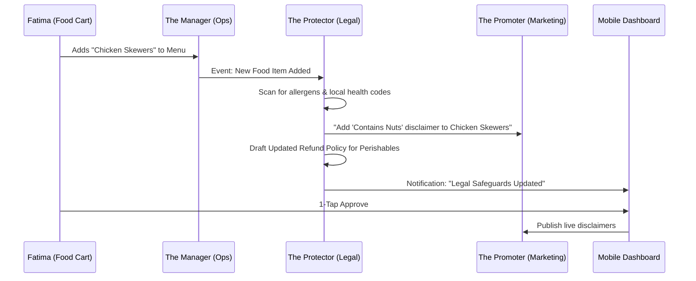
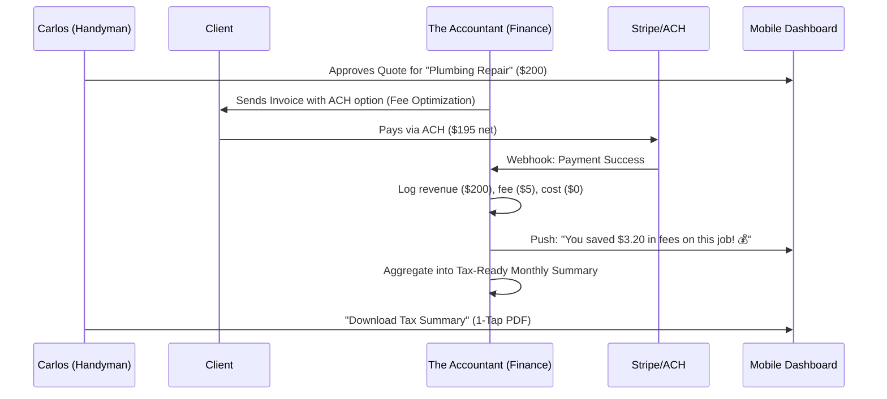

# Research Report: AI Agent Department Architecture Evolution
## OHC "The Protector" (Legal) & "The Accountant" (Finance)

**Role:** Principal Product Architect & KAIROS Orchestrator (L8)
**Mission:** Design how AI departments run invisibly in the background to handle complexity for non-technical small business owners.

---

## 1. Executive Summary
This research focuses on evolving the architecture for two critical "digital staff" departments: **Legal & Compliance ("The Protector")** and **Finance & Payments ("The Accountant")**. By automating these traditionally complex and expensive functions, OneHumanCorp (OHC) eliminates "Financial Fog" and "Compliance Fatigue" for small business owners, ensuring they remain protected and profitable with zero technical or legal expertise.

---

## 2. Market Research & Persona Alignment

### The Problem
- **Legal Gap**: SMBs (Maya, Fatima) operate without proper disclaimers or policies because legal fees are prohibitive. 48% of owners cite "Technical Jargon" as a major stress factor.
- **Finance Gap**: Owners (Carlos, Priya) see revenue but lack clarity on real profit after fees and taxes. Most tools are either too basic (bank app) or too complex (QuickBooks).
- **Competitor Failure**: Shopify/Wix provide basic templates but no proactive, autonomous management of these domains.

---

## 3. Architectural Design: "The Protector" (Legal & Compliance)

### Title
OHC "The Protector": Autonomous Compliance & Legal Safeguards for SMBs

### Key Design Decisions & Rationale
1. **Event-Driven Policy Generation**: Policies are living documents that update as the business scales.
2. **Draft-for-Review Approval**: High-stakes legal updates always require a 1-tap user approval to ensure accountability.
3. **Hyper-Local Contextualization**: Uses business metadata to pull specific health/safety disclaimers (e.g., "Allergy Warnings" for bakers).

### Architecture Diagram (Mermaid.js)

### Mobile UX Flow (375px First)
- **Pulse Notification**: "⚠️ 2 items need safety disclaimers."
- **Review Screen**: side-by-side view (Old vs. New) of the policy change in plain language.
- **1-Tap Approval**: Large "Approve & Publish" button (44x44px).

### AI Agent Integration
- **Memory**: Retrieves history from `autodream_memories` to ensure policies reflect business practices.
- **Approval**: ToS updates are always `Draft-for-Review`.
- **Budgeting**: Legal scans are capped based on SaaS tier.

---

## 4. Architectural Design: "The Accountant" (Finance & Payments)

### Title
OHC "The Accountant": Invisible Financial Management & Plain-Language Briefings

### Key Design Decisions & Rationale
1. **Plain-Language Summarization**: Financial data is never presented as a table first to reduce cognitive load.
2. **Native Fee Optimization**: Automatically selects the cheapest payment rail (ACH for transactions >$50).
3. **Receipt-to-Ledger Automation**: AI categorizes expenses from receipt photos instantly.

### Architecture Diagram (Mermaid.js)

### Mobile UX Flow (375px First)
- **Briefing Feed**: Daily "Good morning" card summarizing yesterday's profit.
- **Snap-and-Save**: Prominent camera button for receipt capture.
- **Savings Badge**: Persistent "Total Fees Saved" counter.

### AI Agent Integration
- **Memory**: Uses historical data to forecast next month's sales.
- **Approval**: Refunds and high-value payouts are `Draft-for-Review`.
- **Budgeting**: Financial report frequency is gated by SaaS tier.

---

## 5. Implementation Recommendations
1. **P0**: Implement the "The Accountant" fee optimization and plain-language briefing.
2. **P1**: Implement the "The Protector" autonomous policy generation and 1-tap approval flow.
3. **P2**: Integrate these departments into the "10-Minute Onboarding Wizard."

---
*Adhering to the Visual Excellence Mandate: All designs prioritize a 375px mobile-first UX with Glassmorphism and Outfit/Inter typography.*
