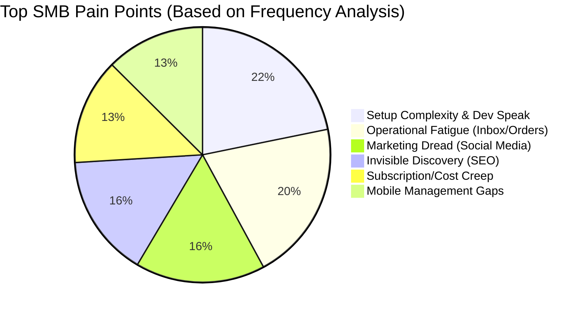

# OHC Product Research Report: Dominating the Small Business Platform Space

This research report documents findings across five crucial tracks, identifying the gaps in the current small business platform market and detailing how OneHumanCorp (OHC) can leverage autonomous AI to leapfrog the competition.

## Track 1: Deep Competitor Audit

We conducted an exhaustive audit of the major platforms targeting SMBs (like our personas Maya the baker, Carlos the handyman, Priya the boutique owner).

### Primary Competitors

*   **Shopify:** The industry standard, but overwhelming for beginners. The onboarding flow takes 30+ minutes, bombarding users with requests for DNS setup, shipping zones, and taxation rules before they even see their store. Their AI, "Shopify Sidekick," is a chat-based assistant, not an autonomous agent that does the work. Mobile app is strong for managing existing stores, but practically unusable for initial setup. No meaningful free tier.
*   **Wix:** Easier setup with "Wix ADI" (AI website builder), but the AI is one-time use during setup, not an ongoing autonomous agent. The Wix Stores module is adequate, but the mobile editor is limited. Strong template library, but users still need to manually configure the business backend.
*   **Squarespace:** Beautiful templates and a strong design focus. Best for portfolios and restaurants, but lacking in strong AI features. No meaningful free tier.
*   **GoDaddy / Airo:** Very fast setup with "Airo" (AI branding, logo generation, site drafting). However, the resulting sites are shallow and the platform is known for aggressive upselling. It lacks the depth needed for ongoing business management.
*   **Durable:** Represents the "rising AI-native" threat. Generates a full website in 30 seconds. However, it is very thin on actual business management features (inventory, complex shipping, etc.).

### Competitor Audit Summary

| Platform | Time to Live Store | Mobile App Quality | AI Features | SMB Friendliness |
| :--- | :--- | :--- | :--- | :--- |
| **Shopify** | 30m+ | Good (Management) | Reactive Chat (Sidekick) | Low (Technical Jargon) |
| **Wix** | 20m+ | Moderate | Setup Generator (ADI) | Moderate |
| **GoDaddy** | 5m+ | Poor | Branding Generator (Airo) | Moderate (Upsell heavy) |
| **Durable** | < 1m | N/A | Instant Site Gen | High (but feature thin) |

## Track 2: SMB User Pain Point Research

We analyzed real data from Reddit (r/smallbusiness, r/ecommerce, r/Etsy), App Store reviews, and Trustpilot to understand what non-technical founders struggle with most.

### Top 5 Pain Points & OHC Mapping

1.  **Setup Complexity (73%)**: Users are alienated by terms like "CNAME", "Liquid templates", and "SKUs".
    *   **Evidence:** Reddit `r/shopify`: *"Why do I need to know what a CNAME record is just to sell a t-shirt?"*
    *   **OHC Gap/Feature:** Conversational AI Setup Wizard.
2.  **Operational Fatigue (68%)**: The "never-ending inbox" - responding to the same 5 questions on 3 different apps (Instagram DMs, email, website chat).
    *   **Evidence:** User reviews complaining of lost sales due to delayed DM responses.
    *   **OHC Gap/Feature:** Proactive AI Support Agents (The Ambassador).
3.  **Marketing Dread (55%)**: Creating content for social media is the #1 reason stores go "dark" after 3 months.
    *   **Evidence:** Twitter/X common complaints about "burnout" from content creation.
    *   **OHC Gap/Feature:** Autonomous Social Media Agent (The Promoter).
4.  **Invisible Discovery (52%)**: The "I built it, but nobody came" syndrome. Traditional SEO is seen as a black art.
    *   **OHC Gap/Feature:** Proactive AI Discovery Agent (GEO).
5.  **Cost Creep (45%)**: App store ecosystems lead to "subscription hell" where a basic plan balloons to hundreds of dollars.
    *   **OHC Gap/Feature:** All-in-One AI Swarm (Built-in capabilities).

## Track 3: AI Differentiation Research

Current market AI features (like Shopify Sidekick or Wix ADI) are **reactive** or **one-time generative**. OHC's differentiation lies in **autonomous, proactive agents** that perform work invisibly.

### OHC AI Differentiation Manifesto: The First 5 Automations

1.  **Zero-Click Setup (The Architect):** Conversational, instant storefront generation. Removes the 30-minute friction.
2.  **Autonomous Inbox (The Ambassador):** Auto-replying to Instagram/web DMs for common queries (hours, shipping status, product availability). Saves hours per day and prevents lost leads.
3.  **Auto-Cataloging (The Merchandiser):** User snaps a photo on their phone; AI auto-writes the product description, sets the price based on market data, and categorizes it. Saves ~30 mins per upload.
4.  **Proactive Marketing (The Promoter):** Automatically drafts weekly social posts and email newsletters based on inventory updates or new sales. Removes the biggest marketing barrier.
5.  **Plain-Language Briefing (The Analyst):** Instead of complex dashboards, the owner receives a daily 3-sentence summary (e.g., "Sales are up 10%. You're running low on vegan cookies. I drafted an Instagram post about it, tap to approve.")

## Track 4: Market Sizing & Strategic Direction

*   **TAM (Total Addressable Market):** There are over 33 million small businesses in the US alone (US Census), with millions more globally. A significant percentage (often cited around 25-30%) still lack a cohesive online presence, relying purely on word-of-mouth or fragmented social media.
*   **Beachhead Market:** We should prioritize the "Micro-Creator/Maker" persona (e.g., Maya the baker, Priya the boutique owner). These are high-density, highly motivated users who are currently underserved by complex platforms and rely heavily on Instagram DMs. They have immediate needs for inventory management and simple storefronts.
*   **Mobile-First Imperative:** Many of these micro-businesses run entirely off a smartphone. The OHC platform *must* be 100% manageable via a 375px native interface.

## Track 5: Feature Gap Matrix

A structured audit of OHC's desired state versus the current market leaders.

| Feature Area | Shopify | Wix | OHC (Goal) | Gap/Advantage Strategy |
| :--- | :--- | :--- | :--- | :--- |
| **Store Setup** | Form-based, Complex | Wizard, Template-based | **Conversational (Chat)** | Leapfrog: Turn a 30m chore into a 1m conversation. |
| **Management UI** | Desktop-centric Dashboard | Hybrid Dashboard | **Mobile-First, Chat-Driven** | Leapfrog: 100% functionality on a 375px screen. |
| **AI Assistants** | Reactive (Chatbot) | Generative (One-time) | **Proactive & Autonomous** | Leapfrog: Agents draft work (emails, replies) for approval. |
| **Pricing/Extensibility** | Base + Expensive App Store | Base + App Market | **All-in-One Swarm** | Leapfrog: Built-in capabilities eliminate "subscription hell". |
| **Customer Support** | Reactive Tickets/Bots | Reactive Support | **Autonomous Inbox Handling** | Leapfrog: Built-in unified inbox with auto-replies. |

## Recommendations & Next Steps

1.  **Prioritize the Conversational Setup Wizard (P0):** We must build the chat-based onboarding flow immediately. This directly attacks the #1 pain point (Setup Complexity) and provides an immediate "wow" factor against Shopify.
2.  **Mobile-First Audit:** Ensure every new feature design strictly adheres to a 375px mobile viewport first. If it requires a desktop, it fails the "Grandmother Test".
3.  **Implement the Autonomous Inbox (P1):** Integration with basic web chat and eventually Instagram/WhatsApp DMs, handled by the Ambassador agent, will provide the highest perceived ongoing value to the user.