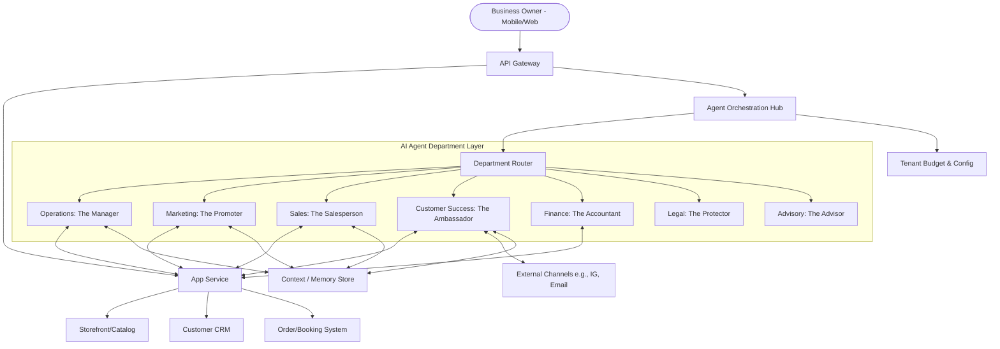

# AI Agent Department Architecture Research

## Title
Design AI Agent Department Architecture for OneHumanCorp

## Problem Statement
Small business owners (bakers, handymen, boutique owners, tutors, food cart operators) face overwhelming operational complexity. They have to manage orders, inventory, marketing, sales inquiries, customer support, and finances manually. Our platform aims to guide users from zero to a live business in under 10 minutes. However, the true value of the platform lies in its ability to automate the day-to-day operations seamlessly. We need an architecture that organizes AI agents into departments mirroring a real business structure (e.g., Operations, Marketing, Sales, Customer Success, Finance, Legal, Advisory) that non-technical users can easily understand and interact with. These agents must handle complexity invisibly in the background.

## Research Report
The core goal of OneHumanCorp (OHC) is to enable real small businesses to operate entirely from mobile devices or browsers, abstracting away technical complexity. The platform targets diverse personas (Maya the baker, Carlos the handyman, Priya the boutique owner, Leo the tutor, Fatima the food cart operator) and various business types (physical/digital products, services, food, subscriptions, portfolios).

### Key Findings & Needs
- **Operations ("The Manager"):** Needs to process orders, track inventory, handle bookings, and process refunds. Must be able to interact with the catalog and inventory systems. For example, updating inventory when Priya makes an in-person sale or sending Fatima a notification on low stock.
- **Marketing & Advertising ("The Promoter"):** Needs to assist with website design (e.g., template selection based on business type), generate social media posts, and create promotional content.
- **Sales & Acquisition ("The Salesperson"):** Essential for service providers like Carlos to generate quotes from inquiries. Needs to track leads and suggest upsells.
- **Customer Success ("The Ambassador"):** Must handle DM replies (e.g., Maya's Instagram inquiries about vegan cakes), provide order updates, and run re-engagement campaigns.
- **Finance & Payments ("The Accountant"):** Needs to process payments, generate financial reports, and handle subscription billing.
- **Legal & Compliance ("The Protector"):** Handles terms, GDPR compliance, and disclaimers.
- **Business Advisory ("The Advisor"):** Provides weekly health reports and next-action suggestions based on platform analytics.

### Competitive Landscape
- **Shopify:** Excellent for e-commerce, but complex setup and relies heavily on third-party apps for advanced automation.
- **Wix/Squarespace:** Good builders, but lacks native deep AI operational automation. AI is mostly used for initial site generation and content creation.
- **GoDaddy:** Basic site builders, limited automation.

OHC's differentiation is the invisible, pervasive AI layer that acts as a virtual staff, categorized into understandable departments.

## Design Doc

### Architecture Diagram

### Mobile UX Flows (375px First)

1. **Dashboard Overview:**
   - The user opens the app to a simplified dashboard showing key metrics (sales today, pending bookings).
   - A unified inbox at the top shows notifications from all departments (e.g., "The Manager: 3 new cake orders", "The Salesperson: New quote requested").

2. **Agent Interaction:**
   - User taps on a notification or navigates to the "Staff" tab.
   - User selects a department (e.g., Customer Success).
   - A chat interface opens. The user can see recent actions the agent took (e.g., "Replied to 5 Instagram DMs").
   - User can give high-level instructions: "Draft a promotion for Mother's day cakes."

3. **Approval Flow (Draft vs. Auto-execute):**
   - For critical actions (e.g., sending a mass email, issuing a refund), the agent prepares a draft.
   - A push notification is sent: "The Promoter drafted an email campaign for your review."
   - User opens the app, sees a preview, and taps "Approve & Send" or "Edit."

### AI Agent Integration Points

- **Triggers:**
  - **Event-driven:** New order received, DM received, low inventory alert.
  - **Scheduled:** Weekly advisory report, daily marketing post.
  - **On-demand:** User explicitly asks an agent to perform a task.
- **Memory/Context:** Agents share a common memory store (per tenant) to maintain context. If Operations processes an order, Customer Success knows about it to answer subsequent queries.
- **Coordination:** The `Agent Orchestration Hub` acts as the dispatcher. If a task requires multiple departments (e.g., a refund request might involve CS receiving the request, Ops verifying the return, and Finance processing the payment), the Hub coordinates the state handoff.
- **Throttling/Budgeting:** AI usage is tracked per tenant based on their tier (e.g., Free vs. Pro). The `AgentHub` checks the `TenantConfig` before dispatching tasks to ensure limits are respected.

### Key Design Decisions
- **Department Abstraction:** We use friendly names ("The Manager", "The Ambassador") rather than technical terms to make the system approachable for non-technical users.
- **Centralized Orchestration Hub:** Ensures consistent policy enforcement (tenant limits, privacy) and facilitates inter-department communication without tight coupling between individual agents.
- **Shared Memory Store:** Critical for a cohesive experience. Agents must not contradict each other or ask the user for information the platform already has.

## Implementation Prompt

**Outcome:** Implement the Agent Orchestration Hub and the foundational Department routing logic.
**CUJ:** A user receives an Instagram DM asking about pricing. The Customer Success agent automatically intercepts the message, retrieves pricing context from the Operations agent (or shared memory), and drafts a reply. The Hub coordinates this interaction and enforces tenant usage limits.

**Acceptance Criteria:**
1. The orchestration hub can receive events (e.g., an incoming message) and route them to the correct department (e.g., Customer Success).
2. Agents within a tenant share a memory context.
3. The system supports draft vs. auto-execute approval flows for agent actions.
4. Tenant tier limits (AI actions/month) are enforced before an agent action is executed.
5. All background tasks initiated by agents are trackable and their status can be retrieved for mobile dashboard display.
6. The entire implementation must support mobile-first API consumption with optimized payloads.

## Priority
P0

## Estimated Scope
Large
