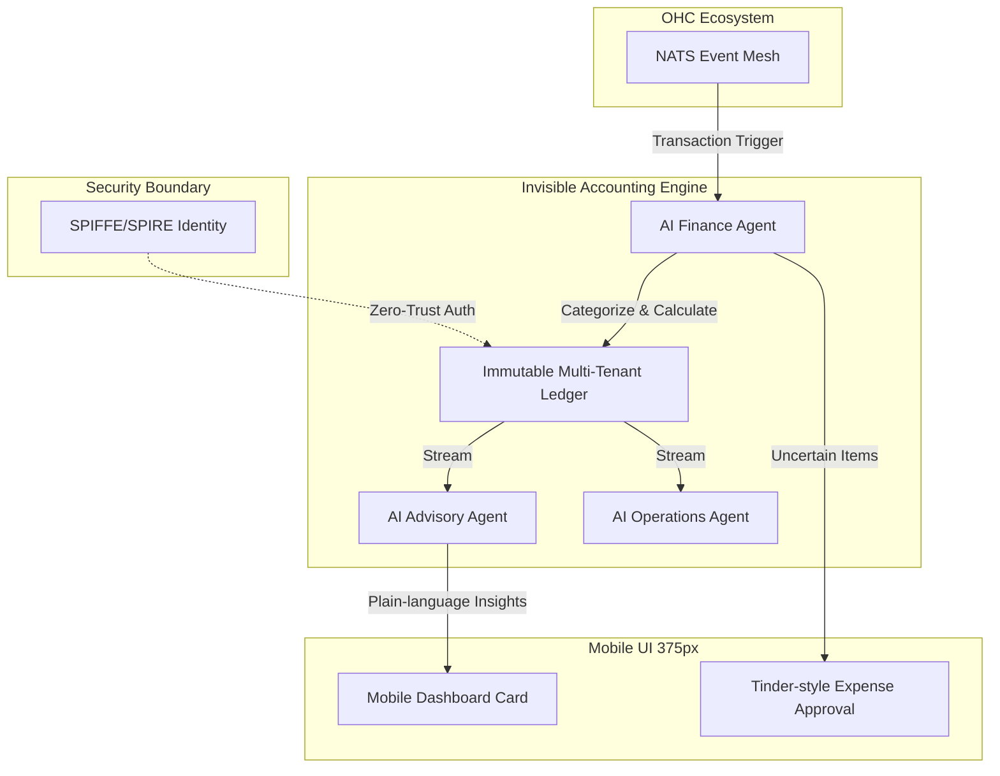

# [architecture]_invisible_micro_accounting_tax_engine.md

## Title: Invisible Micro-Accounting & Autonomous Tax Reconciliation Engine

## Problem Statement
One of the most persistent and debilitating pain points for non-technical small business owners (the "Financial Fog" reported by 35% of SMBs) is managing money behind the scenes. Personas like Maya (baker) and Carlos (handyman) track their profitability in their heads or on scratchpads. Come tax season, they are overwhelmed by trying to calculate expenses, separate personal from business funds, and estimate tax liabilities. Current platforms like Shopify or Wix offer basic revenue reporting but lack predictive tax calculations and real-time profitability tracking without forcing the user to act as an accountant. They need an invisible teammate to do the math.

## Research Report
**Findings & Competitor Audit:**
- **Shopify & Wix:** Focus heavily on Gross Merchandise Value (GMV) and revenue. To get net profit or tax estimations, users must integrate complex third-party tools like QuickBooks or Xero, leading to "Cost Creep" and "Technical Jargon."
- **Square:** Offers good transaction reporting but weak autonomous categorization of off-platform expenses.
- **Pain Points Addressed:** Financial Fog (35%), Cost Creep (45%), Operational Fatigue (68%).

**Opportunity (The OHC Gap):**
OHC can leapfrog legacy platforms by treating accounting as an *invisible*, real-time background process rather than a monthly reconciliation chore. By leveraging an event-driven architecture, every financial transaction (sales, refunds, supply purchases) automatically updates a multi-tenant unified ledger. An autonomous AI Finance Department predicts tax liabilities and operational runways, presenting simple, plain-language insights to the user.

## Design Doc

### Architecture & Data Model
The system is built around an immutable, append-only double-entry ledger optimized for real-time aggregation and strict multi-tenant isolation.

- **Ledger System:** An immutable event-sourced log of all financial activities (credits, debits, pending deposits).
- **AI Finance Department:** A specialized autonomous agent that listens to the event mesh for ledger entries, categorizes expenses, estimates tax liabilities based on local jurisdictions, and flags anomalies.
- **Multi-Tenancy & Zero Trust:** Every ledger entry is cryptographically tied to a tenant ID. Read/write operations require SPIFFE/SPIRE identity tokens, ensuring that no tenant can access another's financial data, even within the same database cluster.

### AI Department Coordination
- **Finance Agent:** Subscribes to the `TransactionEvent` stream. Calculates running tax liabilities and categorizes expenses.
- **Advisory Agent:** Consumes the outputs of the Finance Agent to generate human-readable insights (e.g., "Set aside $400 for taxes this month").
- **Operations Agent:** Notifies the user if cash flow is insufficient to cover upcoming automated supply purchases.

### Mobile-First UX Flow (375px)
The user interface avoids traditional spreadsheets or complex charts.
1. **Home Screen Card:** A clean, translucent "Glassmorphism" card showing "Real Profit" (Revenue - Estimated Expenses - Tax).
2. **Tax Vault UI:** A single progress ring showing how much money is automatically earmarked for taxes.
3. **Expense Swipe Flow:** A Tinder-like interface for the user to quickly approve AI-categorized expenses (Swipe right to approve "Home Depot - Supplies").

### System Diagram

## Implementation Prompt
**Context for Implementer:**
We are building the "Invisible Micro-Accounting & Autonomous Tax Reconciliation Engine" to eliminate the "Financial Fog" for our business owners. Your goal is to implement the underlying ledger service and the AI Finance Agent event handlers.

**Requirements & Critical User Journey (CUJ):**
- Implement a high-performance, append-only double-entry ledger capable of tracking credits, debits, and tax earmarks.
- Ensure strict multi-tenant data isolation; cross-tenant data spillage is a P0 failure.
- Create the event listener for the AI Finance Agent that intercepts transaction events and updates the ledger with categorized entries and calculated tax liabilities.
- Expose an API endpoint that the Mobile UI can poll to retrieve the "Real Profit" and "Tax Vault" metrics for the current user.
- **Acceptance Criteria:** A completed transaction successfully routes through the event mesh, is categorized by the Finance Agent, securely persists in the ledger, and accurately updates the Mobile Dashboard API within strict latency targets (sub-200ms).

## Priority
`P0`

## Estimated Scope
Large
