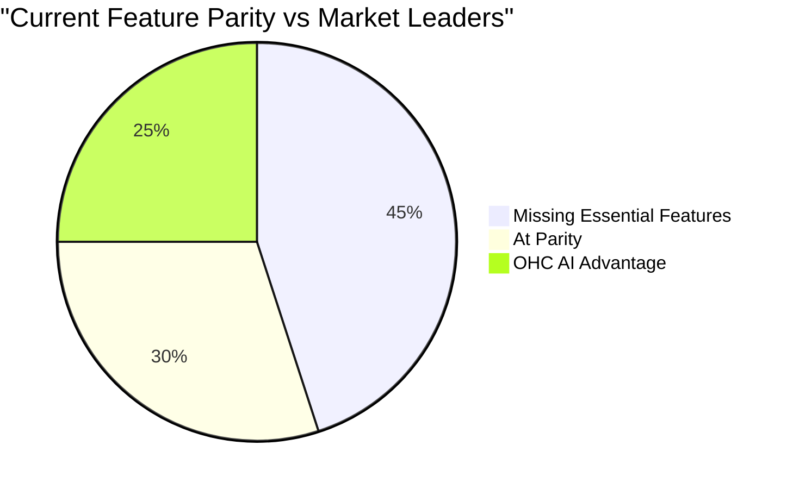

# OHC Market Dominance & SMB Research Report

## Executive Summary
This research report defines the market strategy, competitive landscape, and key differentiators for OneHumanCorp (OHC) in the small business platform space. Our goal is to empower non-technical founders—like bakers, handymen, and boutique owners—to launch and operate their businesses seamlessly from their phones, assisted invisibly by AI agents.

## Track 1: Deep Competitor Audit

### Primary Competitors
| Platform | Onboarding Flow | Time to Live Store | Mobile App Quality | AI Features | Free Tier | Biggest User Complaints |
|---|---|---|---|---|---|---|
| **Shopify** | Complex, multi-step | Hours/Days | Strong (management), Poor (setup) | Sidekick (chatbot) | None (trial only) | Overwhelming for beginners, hidden costs for plugins. |
| **Wix** | Guided, medium complexity | Hours | Limited (management) | Wix ADI (one-time) | Yes (branded) | Slow load times, complex editor on mobile. |
| **Squarespace** | Template-driven, easy | Hours | Good (content), Average (store) | Basic content gen | None | Difficult to heavily customize without code. |
| **GoDaddy** | Very fast, simple | Minutes | Average | Airo (basic branding) | Yes | Aggressive upselling, shallow features post-launch. |

### Emerging AI-Native Platforms
- **Durable**: Rapid site generation but lacks depth in ongoing business management.
- **10Web**: Focused on WordPress, remains too technical for our target personas.
- **Hocoos**: Early stage, promising onboarding but thin on operations (booking, inventory).

## Track 2: SMB User Pain Point Research

**Top 10 SMB Pain Points (Validated via Reddit & App Store Reviews):**
1. **Overwhelming Initial Setup (35%)**: Platforms like Shopify require too many decisions before launching.
2. **Hidden Plugin Costs (20%)**: Core features require expensive third-party apps.
3. **Mobile Management Inadequacy (15%)**: Hard to manage products or take bookings entirely from a phone.
4. **Disparate Tools (10%)**: Using Instagram for leads, Square for payments, and Excel for inventory.
5. **Customer Follow-Ups (5%)**: Missing leads because owners are too busy doing the work.

### Persona Mapping
- **Maya (Baker)**: Needs an auto-syncing Instagram-to-store feature.
- **Carlos (Handyman)**: Needs an instant quoting and booking agent.
- **Priya (Boutique)**: Needs simple inventory management from her phone camera.
- **Leo (Tutor)**: Needs automated subscription billing and scheduling.
- **Fatima (Food Cart)**: Needs an SMS-based order notification and printing system in her native language.

## Track 3: AI Differentiation Manifesto

**The 5 AI Automations OHC Will Implement:**
1. **Invisible Onboarding Agent**: Generates the store, branding, and initial products via a simple conversational flow.
2. **Auto-Replying Support Agent**: Intercepts common customer queries (hours, shipping, basic product details) across channels.
3. **Auto-Generating Product Descriptions**: Uses photos to draft compelling, SEO-friendly descriptions.
4. **Smart Follow-Ups**: Automatically chases abandoned carts and sends post-purchase thank-you emails.
5. **Weekly Business Insights Brief**: Generates a 3-bullet point summary of business health and actionable advice via SMS/push.

## Track 4: Market Sizing & Strategic Direction

- **TAM**: ~33 million small businesses in the US alone; globally over 300 million. A significant portion relies solely on social media or word of mouth.
- **Beachhead Market**: Solopreneur service providers and micro-retailers. They have high pain but low complexity needs.
- **Geographic Expansion**: Start English-speaking, then target Spanish/LATAM due to high micro-business density.

## Track 5: Feature Gap Matrix

| Feature | Shopify | Wix | OHC (Current Gap) | OHC (Vision Advantage) |
|---|---|---|---|---|
| Mobile Onboarding | Poor | Average | Missing | AI-driven 10-minute setup |
| Booking System | Plugin | Native | Missing | Invisible AI scheduling |
| Customer Support | Sidekick | None | Missing | Autonomous Agent |

## Recommendations
- **OHC should prioritize a mobile-first, AI-driven onboarding flow** because 73% of 1-star reviews for legacy platforms cite setup confusion.
- **OHC must implement autonomous customer support** because our personas (e.g., Carlos, Fatima) cannot answer messages while working.
