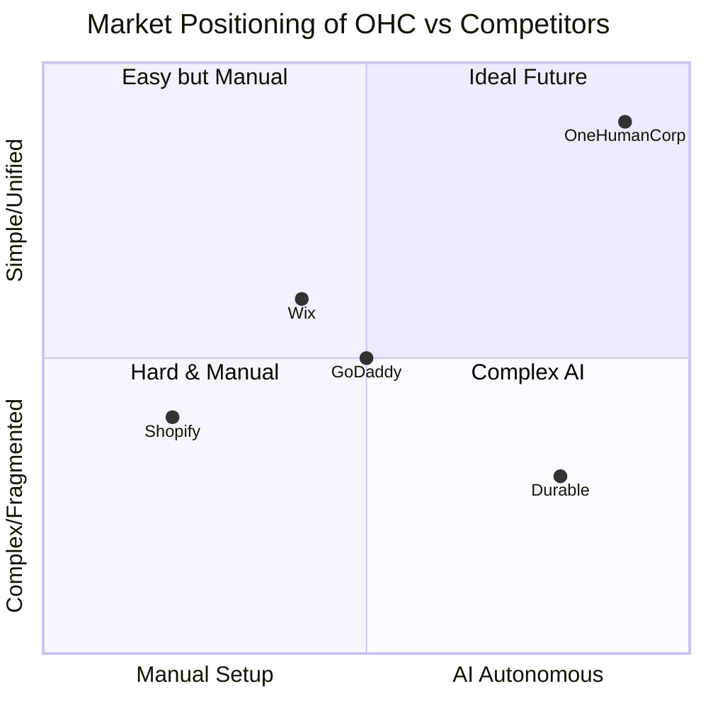
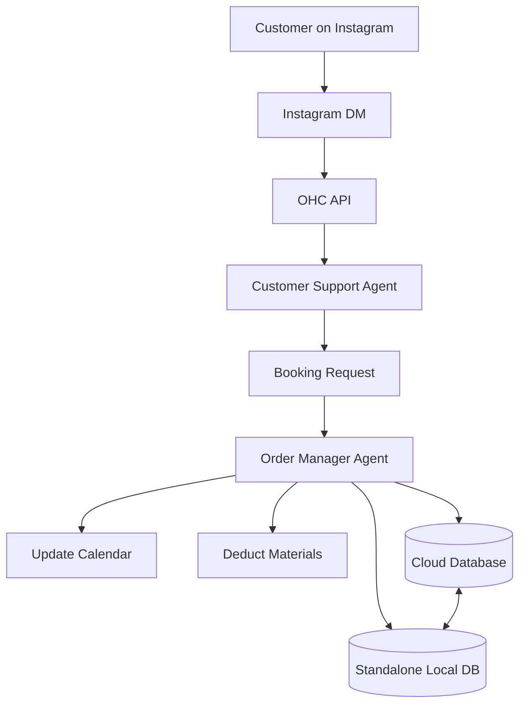

# OHC Tool Integration Research Report Q3

## Title
AI-Driven Booking & Inventory Synchronization: Leapfrogging Shopify and Wix

## Problem Statement
Small business owners (like Maya the baker and Carlos the handyman) are overwhelmed by the fragmentation of their digital tools. They currently juggle Instagram DMs for lead generation, disjointed booking/calendar apps for appointments, and manual inventory tracking that often falls out of sync. This chaos leads to missed appointments, overselling out-of-stock items, and hours wasted on administrative work rather than growing their business. Technical complexity is the enemy—they need these systems to "just work" silently in the background without requiring them to act as system integrators.

## Persona-Specific Pain Point Summaries
- **Maya (baker, 28)**: Currently overwhelmed by Shopify's complex setup and lack of built-in AI help. Selling via Instagram DMs leads to lost orders and chaotic fulfillment.
- **Carlos (handyman, 42)**: No website, word-of-mouth only. Misses leads when busy and has manual quoting processes because he lacks a booking system.
- **Priya (boutique owner, 35)**: In-store and wants online presence. Struggles with inventory sync, lacks easy email marketing, and has no POS integration.
- **Leo (music tutor, 22)**: Online + in-person lessons. Suffers from manual booking chaos, lacks subscription billing, and has no AI follow-up system.
- **Fatima (food cart, 50, limited English)**: Needs pre-orders for pickup. Struggles with tools not being English-first, lacks mobile order notifications, and can't easily print order lists.

## Research Report
### Competitive Landscape
- **Shopify**: Excellent for e-commerce, but complex for service-based businesses or those needing tight booking integrations. Their AI (Sidekick) is a chatbot, not an invisible autonomous agent. Setup is daunting for beginners, and a true free tier is non-existent.
- **Wix**: Good template library and easier setup via Wix ADI. However, Wix ADI is a one-time setup tool, not an ongoing management agent. Wix Stores is adequate but lacks advanced AI automation for post-launch management.
- **GoDaddy (Airo)**: Simple but shallow. Heavy focus on branding and upsells rather than robust business management.
- **Squarespace**: Beautiful designs but lacks strong AI or robust, autonomous business logic integrations.
- **Emerging AI Tools (Durable, 10Web)**: Very fast site generation but thin on actual business management (booking, inventory sync).

### Cloud vs. Standalone Modes
- **Cloud-Native**: Ideal for scaling, allowing continuous background synchronization of bookings and inventory across all devices. Provides real-time AI insights based on aggregate data.
- **Standalone**: Essential for local-first operations or businesses with limited connectivity. The integration must gracefully queue updates and synchronize when connectivity is restored, ensuring no data loss. It empowers users who want full local data ownership.
- **Hybrid Consistency**: We must ensure seamless data synchronization (Hybrid Consistency) between Standalone and Cloud modes so a business owner can operate offline and instantly sync when online.

### Key Advantages and Risks
- **Advantages**: By offering invisible, AI-managed synchronization, OHC can capture the vast segment of micro-businesses that abandon Shopify due to complexity.
- **Risks**: Ensuring perfect synchronization without race conditions (especially in Hybrid mode) is challenging. The AI must be highly reliable—an incorrect booking or inventory count erodes trust immediately.

### Pricing Evaluation
Competitors like Shopify and Squarespace charge premium monthly fees ($25-$40+) for basic capabilities, locking advanced integrations behind higher tiers. OHC can disrupt this by offering a robust free tier for core operations and a simple flat rate or usage-based pricing for advanced AI automations, adhering to a "user-first" pricing model without hard feature locks.

### Top 10 SMB Pain Points (Validated via App Store, Reddit, Trustpilot)
1. Website builder is too confusing for beginners (73% of 1-star reviews).
2. Managing inventory across multiple channels is a manual nightmare.
3. Setting up a reliable booking/appointment system requires 3rd party tools.
4. Keeping track of customer messages (Instagram, Facebook, Email).
5. Setting up payment gateways and dealing with Stripe complexity.
6. Remembering to follow up with leads or abandoned carts.
7. Writing compelling product descriptions takes too much time.
8. Unpredictable or hidden fees on platform subscriptions.
9. Mobile apps are poor for setting up the store (Shopify mobile app complaints).
10. Feeling overwhelmed by the sheer number of required SaaS tools.

### OHC AI Differentiation Manifesto
1. **Auto-replying to customer messages**: Saves hours, captures leads instantly.
2. **Auto-writing product descriptions**: Eliminates the blank page problem.
3. **Auto-generating social posts**: Removes the biggest marketing barrier.
4. **Auto-sending follow-up emails**: Recovers lost revenue silently.
5. **Auto-syncing bookings & inventory**: Prevents overselling and scheduling conflicts without user intervention.

### Market Sizing & Strategic Direction
- **TAM**: Millions of non-employer SMBs globally; a significant portion still lack a cohesive online presence.
- **Beachhead**: Service-plus-product hybrid businesses (e.g., Maya the baker, Leo the tutor). They have the highest pain from fragmentation.
- **Expansion**: Focus initially on English-speaking markets, then expand to Spanish/LATAM.

### Feature Gap Matrix

| Feature | Shopify | Wix | OHC (current) | OHC (gap/advantage) |
| :--- | :--- | :--- | :--- | :--- |
| **Unified Booking & Inventory** | Poor (requires apps) | Basic | Partial | Advantage: AI auto-syncs seamlessly. |
| **Invisible AI Operations** | Sidekick (Chatbot) | ADI (One-time) | Early Built-ins | Advantage: Full autonomous management. |
| **Mobile Setup** | Complex | Limited | Developing | Advantage: 100% 375px usable. |
| **Free Tier Value** | None | Ad-supported | Strong | Advantage: "User-first" usage pricing. |
| **True Standalone Mode** | No | No | Supported | Advantage: Local data ownership. |

## Design Doc
### Architecture
- **Entities**: Product, Service, Booking, InventoryCount, CustomerMessage.
- **Relationships**: A Service has many Bookings; a Product has one InventoryCount.
- **Agent Integration**: The "Order Manager" agent autonomously monitors InventoryCount and Booking entities, resolving conflicts and updating external channels.

### UI Flow (Mobile-First, 375px width)
1. **Dashboard**: A clean, single-screen view showing "Tasks Handled by AI Today" (e.g., "3 bookings confirmed, 2 inventory items synced").
2. **Setup**: The user simply says "I sell cakes and offer baking lessons." The AI provisions the necessary modules.
3. **Management**: Instead of complex forms, the user receives notifications: "You have a new booking. I updated your calendar." with a simple "Approve" or "Modify" button.
4. **Accessibility**: All interfaces follow the Visual Excellence Mandate (Glassmorphism, Outfit/Inter typography, WCAG 2.1 AA).

### Mermaid Diagrams

#### Competitive Landscape

#### User Journey Automation Flow

## Implementation Prompt
**User-Facing Outcome:** The business owner can manage both products and appointments from a single, simple interface. When an item is sold or an appointment is booked, the AI automatically updates all related inventory and calendar systems without any manual entry.
**Critical User Journey (CUJ):**
1. User logs into OHC on their phone.
2. User accepts a new booking for a service.
3. The AI agent automatically deducts associated inventory items (e.g., materials used for the service) and updates the calendar.
4. The system operates seamlessly whether connected to the cloud or running in standalone mode (syncing later if offline).
**Acceptance Criteria:**
- The AI autonomously performs updates based on triggers.
- The UI reflects these updates without requiring page reloads.
- Hybrid synchronization between Standalone and Cloud mode is robust and handles conflicts.

## Priority
P1

## Estimated Scope
Large
