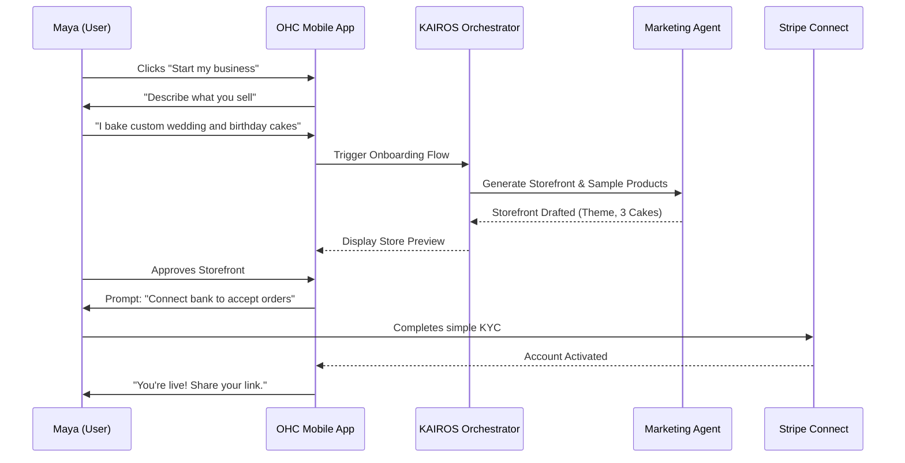
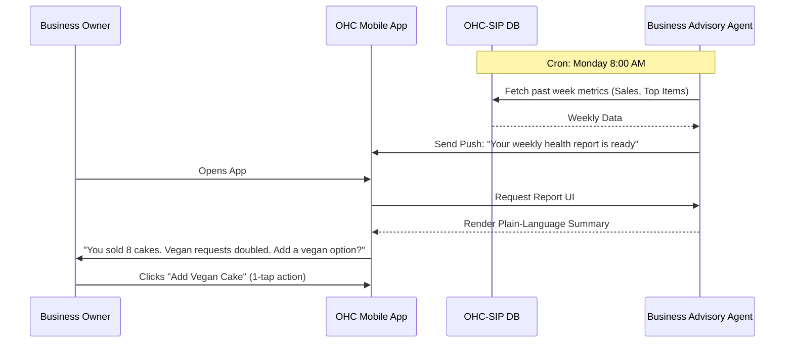

# [architecture] Business Journey Architecture

## Title
Business Journey Architecture Mapping & Optimization

## Problem Statement
Non-technical small business owners—like Maya the home baker, Carlos the freelance handyman, and Fatima the food cart operator—want to start selling and managing their business online but are consistently overwhelmed by complex platform setups, fragmented tools, and unclear steps to achieve their first sale. They need a guided, frictionless, zero-jargon path that takes them from "idea" to "live business" in under 10 minutes without writing code, and then helps them effortlessly manage operations and growth via an invisible, AI-powered system that works perfectly on their mobile phones.

## Research Report

### Goal
Architect the complete end-to-end user journey for non-technical personas across six key lifecycle stages: Acquisition, Onboarding, Activation, Retention, Revenue, and Referral.

### Personas Analyzed & End-to-End Journeys
- **Maya (Baker, 28, Non-technical):**
  - *Acquisition:* Clicks an Instagram ad showing how easy it is to manage DMs and take custom cake orders.
  - *Onboarding:* Uses voice-to-text to describe her bakery; AI auto-generates a storefront with sample cakes.
  - *Activation:* Connects her bank and receives her first deposit for a custom order.
  - *Retention:* Relies on the AI Customer Success agent to handle nighttime "vegan cake" inquiries, bringing her back to the app each morning to review drafted responses.
- **Carlos (Handyman, 42, Non-technical, Android):**
  - *Acquisition:* Hears about OHC from another tradesman (Referral loop).
  - *Onboarding:* Selects "Service", inputs his hourly rate. AI builds a booking page.
  - *Activation:* Shares his new OHC booking link via SMS to a past client.
  - *Retention:* Uses the unified inbox to review AI-generated quotes for new jobs.
- **Priya (Boutique, 35, Semi-technical):** Requires seamless transition from Free to Pro tier once her in-store and online inventory needs scaling (Revenue point).
- **Leo (Music Tutor, 22):** Values the "Link-in-bio" export to TikTok to drive Gen-Z student bookings (Acquisition point).
- **Fatima (Food Cart, 50, Limited English):** Needs extreme simplicity. Her retention loop is driven by the daily printable pre-order list and real-time push notifications.

### Competitive Analysis
- **Shopify:** High friction for first-time sellers. 30-60 min setup. Assumes tech savviness and a pre-existing inventory mindset. Complex dashboard.
- **Wix / Squarespace:** Template-heavy, unstructured onboarding. Often leads to "blank canvas paralysis" where users spend hours tweaking designs instead of selling.
- **GoDaddy:** Disjointed experience between domain registration, website builder, and marketing tools.
- **OHC Differentiation:** AI-driven onboarding that dynamically creates the business structure (products, services, bookings) based on simple natural language prompts in under 10 minutes, all managed from a mobile-first interface.

### Friction Points Identified
- **Catalog Entry Drop-off:** Users abandon setup when faced with adding 20 products manually. *Solution:* AI auto-generates 3-5 starting items based on the business description.
- **Payment Gateway Complexity:** Setting up Stripe/PayPal requires technical keys and business docs. *Solution:* Abstracted "Get Paid" flow with simplified OHC Stripe Connect onboarding deferred until *after* the storefront is designed.
- **Fear of Marketing:** "How do I get customers?" *Solution:* The Marketing & Advertising agent generates the first Instagram post automatically upon activation.

## Design Doc

### Architecture Diagrams

#### Journey: Acquisition to Activation (Maya)

#### Journey: Retention & Advisory Loop

### Mobile UX Flow & UI Wireframes (375px First)
1. **Acquisition (Landing):** A clean screen with a single, massive call-to-action: "What do you want to build today?"
2. **Onboarding Wizard (Chat-like Interface):** Instead of sterile forms, a conversational UI. "What's the name of your business?" followed by "What do you sell?". Uses native mobile dictation.
3. **Magic Generation Screen:** A beautiful loading screen (Glassmorphism blur, subtle pulsing animations) explaining that the AI is building the store, writing descriptions, and setting up the calendar.
4. **Activation Dashboard:**
   - Top card: "First Sale Checklist" (1. Share Link, 2. Get Paid).
   - Touch targets are 44x44px minimum. Typography is Outfit + Inter.
5. **Retention Feed:** The main view post-activation. A unified inbox combining customer messages, order notifications, and AI insights ("You have 2 unread DMs").

### AI Agent Integration Points
- **Marketing & Advertising ("The Promoter"):** Handles the initial heavy lifting during onboarding. Generates site copy, selects color palettes, and populates initial placeholder products.
- **Sales & Acquisition ("The Salesperson"):** Steps in at the Activation phase, offering to generate the user's first social media post or referral email to share with friends.
- **Business Advisory ("The Advisor"):** Drives Retention by sending personalized, plain-language weekly summaries ("Tuesday was your busiest day") via push notifications.

### Key Design Decisions
- **Chat-First Onboarding:** Opted for a guided, conversational setup over traditional forms to eliminate "blank canvas paralysis."
- **Deferred Complexity:** Shipping rates, tax settings, and domain registration are intentionally hidden until the user makes their first sale, focusing entirely on getting them to the Activation "Aha!" moment.
- **Optimistic UI Updates:** All mobile actions (like approving an AI draft or toggling an item out-of-stock) update instantly on the device while syncing to the Go backend via the retry queue, crucial for users like Fatima on slow cellular connections.

## Implementation Prompt

"Implement the OHC Core Business Onboarding Flow (Acquisition to Activation). The user must be able to navigate a highly streamlined, conversational 3-step wizard on a 375px mobile screen.

1. Capture the business name and a natural language description of what they sell.
2. The system must trigger the `MarketingAgent` to generate a draft storefront configuration and populate it with at least 3 sample products/services appropriate for their business type.
3. Upon completion, land the user on the Activation Dashboard featuring a 'First Sale Checklist' (Share your store, Connect bank).

Ensure all UI components utilize the OHC Premium Token design system (Glassmorphism effects, 44x44px touch targets, Outfit/Inter fonts). Do NOT prescribe specific DB tables or API endpoints; design the Flutter mobile UI, the Riverpod state management, and the Go backend service layer. Include comprehensive Playwright E2E tests simulating the entire CUJ from the home screen to the Activation Dashboard using mocked AI responses."

## Priority
P0

## Estimated Scope
Large