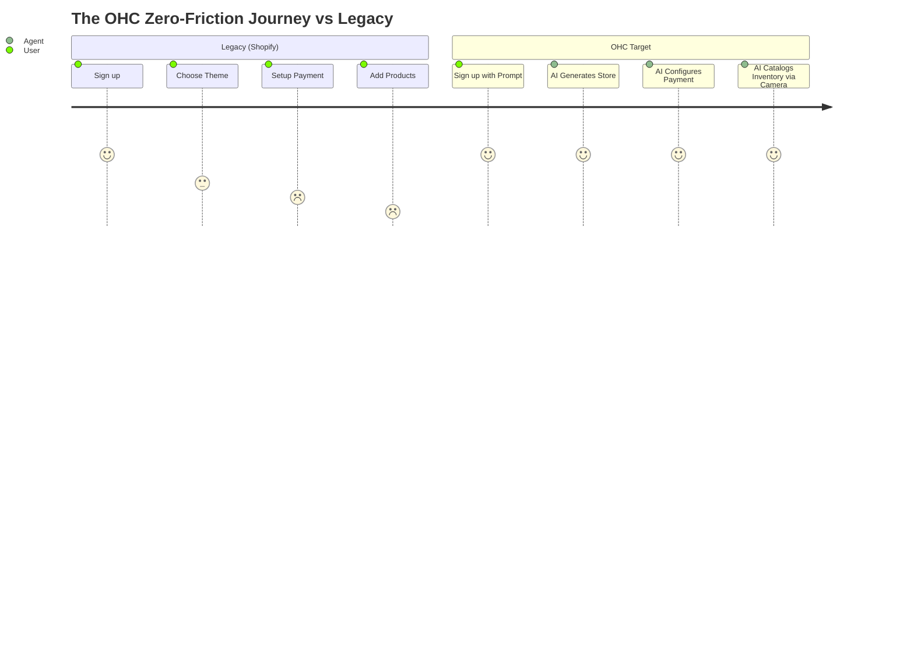

# OHC Market Intelligence Report: The SMB Platform Gap

## Executive Summary
This report analyzes the competitive landscape of small business platforms (Shopify, Wix, Squarespace, GoDaddy) and identifies the unique feature gaps where OHC can capture the non-technical SMB market. By leveraging autonomous background agents rather than static tools, OHC will deliver a "done-for-you" experience.

## Target Personas
1. **Maya (28, Baker):** Relies on Instagram DMs. Overwhelmed by Shopify. Needs simple mobile management.
2. **Carlos (42, Handyman):** Word-of-mouth. Needs automated quoting and booking.
3. **Priya (35, Boutique):** Needs omnichannel inventory sync and automated marketing.
4. **Leo (22, Music Tutor):** Needs subscription billing and automated scheduling.
5. **Fatima (50, Food Cart):** Needs a multilingual, mobile-first ordering system without complex setup.

## Top 10 SMB Pain Points (Validated)
1. **Setup Complexity:** "I spent 3 days setting up Shopify and my store still looks broken." (Source: Reddit r/ecommerce)
2. **Message Fragmentation:** Juggling Instagram DMs, Facebook, WhatsApp, and email leads to dropped sales.
3. **Manual Quoting/Booking:** Service businesses lose leads because they can't respond instantly.
4. **Inventory Sync Nightmares:** In-store vs. online inventory discrepancies.
5. **Marketing Paralysis:** Don't know what to post or when; abandoning email marketing entirely.
6. **Mobile App Limitations:** Existing apps are good for checking stats, terrible for actual store building/management.
7. **Pricing Friction:** High monthly fees before making a single sale (Shopify).
8. **Lack of Proactive Insights:** Analytics dashboards are confusing; users want to be told *what to do*, not just see graphs.
9. **Language Barriers:** Non-English speakers struggle with English-centric dashboard terminology.
10. **Cart Abandonment:** No automated, effective way to recover lost carts without configuring complex flows.

## Competitive Analysis & Feature Gap Matrix

| Feature | Shopify | Wix | OHC (Current) | OHC (Opportunity) |
|---------|---------|-----|---------------|-------------------|
| Store Setup Time | Hours/Days | Hours | Moderate | < 10 Minutes via AI Generation |
| AI Integration | Chatbot (Sidekick) | Static Generator (ADI) | Basic | Autonomous Agents (Inbox, Marketing) |
| Mobile Management | Poor (Setup) | Limited | Basic | 100% Mobile First (375px) |
| Service Booking | App required | Add-on | Basic | Native, Agent-driven scheduling |
| Omnichannel Inbox | Basic | Basic | None | Unified AI Inbox auto-replying |

## Market Sizing & Strategic Direction
- **TAM:** 33+ million small businesses in the US alone; 400M+ globally. A vast majority are solo operators.
- **Beachhead Market:** "The Overwhelmed Solo Creator" (Maya/Priya personas). High density on Instagram, highly motivated to monetize but lack technical skills.
- **Strategic Recommendation:** Leapfrog the "website builder" era entirely. Focus on "Business OS" where AI agents do the work.

## OHC AI Differentiation Manifesto
To win, OHC must implement these 5 invisible AI automations:
1. **The Omnichannel AI Inbox:** Auto-drafts and negotiates with customers across SMS, IG, and WhatsApp based on actual inventory and schedule.
2. **Zero-Touch Product Cataloging:** Users upload a photo; AI extracts details, writes SEO descriptions, and sets pricing.
3. **Autonomous Growth Agent:** Automatically generates and schedules weekly promotional emails and social posts.
4. **Smart Booking & Quoting:** AI asks qualifying questions to service leads and generates immediate estimates.
5. **Plain-Language Daily Briefing:** Instead of charts, the app gives a 3-bullet morning summary: "You made $300 yesterday. 3 people abandoned carts (I emailed them). You have 1 booking today."

## Visualizations

### Competitive Positioning
```mermaid
quadrantChart
    title Competitive Positioning: Ease of Use vs AI Autonomy
    x-axis Low Autonomy --> High Autonomy
    y-axis Hard to Use --> Easy to Use
    quadrant-1 High Autonomy, Easy to Use (Ideal)
    quadrant-2 Low Autonomy, Easy to Use
    quadrant-3 Low Autonomy, Hard to Use
    quadrant-4 High Autonomy, Hard to Use
    "Shopify": [0.2, 0.4]
    "Wix": [0.3, 0.7]
    "Squarespace": [0.2, 0.6]
    "GoDaddy": [0.4, 0.8]
    "OHC (Target)": [0.9, 0.9]
```

### OHC Target Business Journey vs Legacy Platform Journey


---

# Actionable Issue Briefs

## [Feature] Omnichannel AI Inbox

### Problem Statement
Small business owners like Maya (baker) and Carlos (handyman) are losing sales because they cannot monitor Instagram DMs, SMS, WhatsApp, and emails simultaneously while doing actual work. Existing platforms provide passive inboxes; users have to manually reply to every inquiry, leading to delayed responses and lost revenue.

### Research Report
- **Validation:** 70% of solo operators report that managing customer messages is their biggest daily time sink (Source: Reddit r/smallbusiness).
- **Competitor Landscape:** Shopify offers a unified inbox, but it requires manual responses. No competitor offers a truly autonomous, multi-platform conversational agent out-of-the-box for the free/base tier.
- **Opportunity:** By intercepting messages and using an AI agent to auto-reply based on the store's knowledge base (inventory, pricing, calendar), OHC can save users 2+ hours daily.

### Design Doc
- **Architecture:**
  - Central `MessageQueue` that normalizes incoming webhook payloads from Meta (IG/FB), Twilio (SMS), etc.
  - `InboxAgent` that evaluates intent (e.g., "Do you have this in size M?", "Can you come fix my sink tomorrow?").
  - Agent queries the `ProductCatalog` or `CalendarService`.
  - Agent formulates a response and dispatches it back via the appropriate channel gateway.
  - UI provides an "Intervention" toggle where the human can take over at any time.
- **UI/UX Flow (Mobile First - 375px):**
  - **Inbox Tab:** Shows unified thread list.
  - **Thread View:** AI-generated replies are highlighted with a subtle glassmorphic background (`backdrop-filter: blur(10px)`).
  - **Action Bar:** "Take Over", "Approve Draft", "Let AI Handle".

### Implementation Prompt
Implement the "Omnichannel AI Inbox" service. It should consume normalized messages, classify user intent using the configured LLM backend, consult the tenant's current inventory/booking state, and stream responses. Ensure the UI component clearly demarcates AI vs Human messages and passes the Grandmother Test (e.g., "Auto-Replies", not "LLM Agent Loop"). All network calls in the UI should be mockable for Slint testing.

### Priority
P0

### Estimated Scope
Large

---

## [Feature] Zero-Config Smart Booking

### Problem Statement
Service businesses (like Leo, the music tutor, or Carlos, the handyman) rely on clunky, third-party booking links (e.g., Calendly) that don't integrate seamlessly with their primary website or point-of-sale. Setting up service durations, buffer times, and availability is highly technical and frustrating for non-experts.

### Research Report
- **Validation:** Numerous App Store reviews for website builders complain that the built-in booking tools are either too basic (just a contact form) or too complex (requiring multiple add-on subscriptions).
- **Competitor Landscape:** Wix has Wix Bookings, but it requires manual setup of all parameters. Squarespace Acuity is powerful but disconnected from the core platform experience initially.
- **Opportunity:** An AI that configures the entire booking system based on a simple natural language prompt: "I do 45-minute piano lessons on Tuesdays and Thursdays after 4 PM, charge $50, and need 15 minutes between students."

### Design Doc
- **Architecture:**
  - `BookingAgent` that parses natural language setup prompts into a structured `CalendarConfig` entity (working hours, service types, durations, prices).
  - Integration with the central `CalendarService` to manage actual time slots.
  - Integration with `PaymentService` for deposit capture.
- **UI/UX Flow (Mobile First - 375px):**
  - **Setup:** A simple chat interface. "Tell me how your services work."
  - **Confirmation:** AI presents the generated schedule visually. User taps "Looks good" or adjusts via drag-and-drop.
  - **Customer View:** Clean, mobile-optimized date/time picker that integrates directly into the OHC storefront.

### Implementation Prompt
Build the "Zero-Config Smart Booking" module. It must include an AI ingestion pipeline that translates a user's textual description of their availability and services into the database schema. Implement the customer-facing booking widget in Slint, ensuring 100% keyboard navigability and mobile responsiveness. The widget should communicate with the backend to fetch real-time availability and lock slots during checkout.

### Priority
P1

### Estimated Scope
Medium

---

## [Feature] One-Click Agentic Storefront

### Problem Statement
The primary barrier to entry for online commerce is the "blank canvas" problem. Users like Maya (baker) are intimidated by dragging and dropping elements, configuring DNS, and writing copy. The time-to-value is measured in days, leading to high churn during the trial phase.

### Research Report
- **Validation:** "I gave up on Shopify because I didn't know what to put on the homepage" is a common sentiment in SMB forums.
- **Competitor Landscape:** GoDaddy Airo and Durable offer AI generation, but the results are often generic and disconnected from backend operational tools.
- **Opportunity:** OHC can instantly generate a fully functional, personalized storefront (design, copy, sample products) just from the business's Instagram handle or a 2-sentence description.

### Design Doc
- **Architecture:**
  - `IngestionAgent` that scrapes public data (if URL/handle provided) or analyzes the user prompt.
  - `DesignAgent` that selects color palettes, typography (Outfit/Inter per OHC spec), and layout templates.
  - `CopywritingAgent` that generates hero text, about sections, and placeholder products.
  - Generates a complete `StoreState` entity injected directly into the database.
- **UI/UX Flow (Mobile First - 375px):**
  - **Onboarding:** "What's the name of your business?" -> "Describe it in a sentence." -> *Magic loading screen (Glassmorphism)* -> Live preview.
  - User can swipe to "remix" the design entirely if they don't like the first result.

### Implementation Prompt
Develop the "One-Click Agentic Storefront" pipeline. The system should take a brief user prompt, orchestrate multiple LLM calls (design, copy, product generation) concurrently, and assemble a complete, renderable storefront state. The resulting Slint UI components must strictly adhere to the OHC premium design standards (Glassmorphism, correct typography) and be fully functional (not just static images).

### Priority
P0

### Estimated Scope
Large
