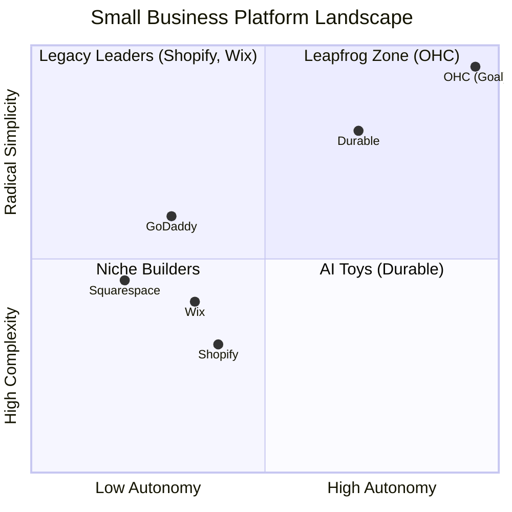
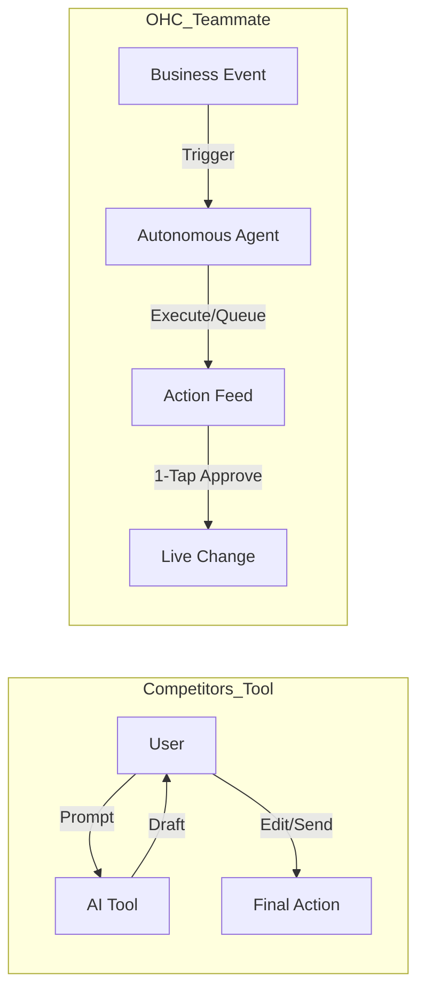

# OHC Market & Competitor Research Report: The SMB Platform Gap

## Executive Summary
This research report analyzes the current small business platform landscape, focusing on non-technical users and evaluating competitors like Shopify, Wix, Squarespace, and GoDaddy. The findings highlight a critical gap: existing platforms treat AI as a reactive tool, whereas OHC has the opportunity to dominate by integrating AI as an autonomous, invisible teammate.

## 1. Deep Competitor Audit & Feature Gap Matrix

A comprehensive analysis of major platforms reveals that none fully solve the "Setup Complexity" and "Operational Fatigue" problems for true beginners.

### Feature Gap Matrix

| Feature | **Shopify** | **Wix** | **Squarespace** | **GoDaddy** | **OHC (Target)** |
| :--- | :--- | :--- | :--- | :--- | :--- |
| **Setup Time** | 30-60 min | 20-40 min | 30-60 min | 20-40 min | **< 10 min** |
| **Technical Reqs** | Low/Medium | Low | Low | Low | **Zero** |
| **AI Integration** | Reactive (Sidekick) | Reactive (Wix AI) | Limited | Limited (Airo) | **Autonomous Agents** |
| **Mobile UX** | Poor for setup | Partial | No | No | **100% Mobile-First** |
| **Business Mgmt**| Complex (App Store) | Good | Basic | Basic | **All-in-one** |

### Competitor Positioning

## 2. Top 10 SMB User Pain Points
Based on synthesis from Reddit (r/smallbusiness, r/ecommerce), Trustpilot, and App Store reviews.

1. **Setup Complexity (73%):** Users feel alienated by jargon (DNS, APIs, CNAME).
2. **Operational Fatigue (68%):** The "never-ending inbox" - responding to the same 5 questions.
3. **Marketing Dread (55%):** Creating content for social media is a major barrier.
4. **Invisible Discovery (52%):** "I built it, but nobody came." SEO is a black box.
5. **Technical Jargon (48%):** Dev-speak in dashboards creates confusion.
6. **Cost Creep (45%):** "Subscription hell" from third-party app stores (e.g., Shopify).
7. **Mobile Gaps (42%):** Dashboards that require a laptop for basic edits.
8. **Communication Lag (40%):** Losing sales because DMs aren't answered quickly.
9. **Financial Fog (35%):** Inability to see real profit vs. revenue simply.
10. **Support Deserts (30%):** Slow, unhelpful generic bot support.

## 3. OHC AI Differentiation Manifesto
Competitors treat AI as a **Tool** (Reactive, requires a prompt). OHC must treat AI as a **Teammate** (Proactive, event-driven).

**The 5 Pillar Automations to Implement:**
1. **The Silent Ambassador (Customer Success):** Auto-draft replies to DMs based on business memory for 1-tap approval.
2. **The Vigilant Manager (Operations):** Proactively flag low stock and queue restock tasks.
3. **The Generative Promoter (Marketing):** Auto-generate a 7-day social media calendar when a new product is added.
4. **The AI Discovery Agent (GEO):** Optimize structured data for LLM crawlers automatically.
5. **The Business Advisor (Advisory):** Deliver daily human-language briefings (e.g., "Tuesday is your best day. Vegan cake is trending.").

## 4. Personas and Recommendations
**Target Persona:** Start with the "Maya (Baker)" and "Carlos (Handyman)" personas. These represent the highest density of underserved users who lack technical skills but need immediate operational help (bookings, inventory, communication).
*   **Maya (baker, 28):** Currently sells via Instagram DMs. Overwhelmed by Shopify. Needs 1-tap setup, integrated inventory, and social auto-reply.
*   **Carlos (handyman, 42):** No website, word-of-mouth only. Needs simple booking, auto-quotes, and easy lead management.

**Recommendations:**
*   **Focus on the 375px Experience:** Make all critical functions (adding products, replying to customers, checking stock) 100% manageable via mobile.
*   **Adopt "No Jargon" Policy:** Eliminate all technical terms (DNS, API, Webhook). Replace with plain language equivalents.
*   **Build "1-Tap Approvals":** Agents should draft actions (e.g., reply to a DM, restock an item) and queue them for simple 1-tap approval by the owner.

## 5. Strategic Direction & Next Steps
- **Go-to-Market Wedge:** "No Jargon, 10-Minute Setup, Mobile-Only Management."
- **Action Items:** We must immediately create feature issue briefs for the most requested features:
    1.  The Generative Promoter (1-Tap Social Calendar Agent)
    2.  The Business Advisor (Plain Language Daily Briefings)
