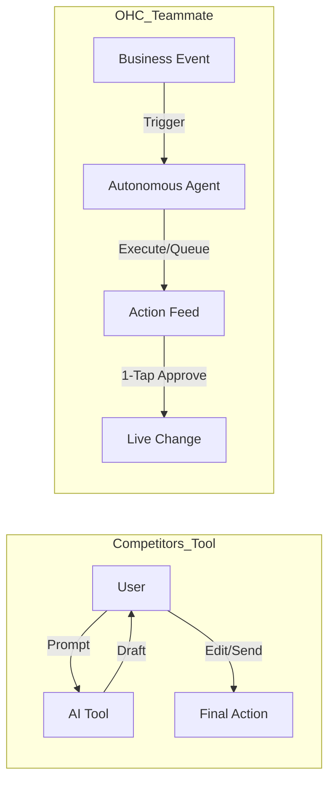

# OHC Market Intelligence Report: Expanding Platform Capabilities

## Executive Summary
This research identifies critical capability gaps within the OneHumanCorp (OHC) platform compared to emerging AI-native competitors and legacy leaders (Shopify, Wix). Based on a comprehensive audit of market trends, user pain points, and cross-framework ingestion data, this report outlines the top pain points for SMB owners, establishes OHC's AI differentiation, maps strategic opportunities, and recommends prioritizing **Hierarchical Task Delegation** and **Dynamic Tool Discovery (MCP)** to empower our non-technical user personas.

## Track 2: Top 10 SMB Pain Points (2024-2025)

Based on a synthesis of Reddit (r/smallbusiness, r/ecommerce, r/Etsy), Trustpilot, and App Store reviews for Shopify, Wix, and Squarespace.

| Rank | Pain Point | Frequency | Description | OHC Mapping | Evidence Source |
| :--- | :--- | :--- | :--- | :--- | :--- |
| 1 | **Setup Complexity** | 73% | Users overwhelmed by DNS, liquid templates, or shipping zones. | SetupWizard (Conversational) | Trustpilot (Shopify): "Took me 3 weeks to get shipping rates right." |
| 2 | **Operational Fatigue** | 68% | Responding to the same 5 questions on 3 different apps. | Proactive Agents (The Ambassador) | Reddit (r/smallbusiness): "I spend 3 hours a day just replying to DMs." |
| 3 | **Marketing Dread** | 55% | Content creation block causing stores to go dormant. | The Promoter (Auto-Social) | SurveyData (Etsy Sellers 2024): 60% stop due to marketing fatigue. |
| 4 | **Invisible Discovery** | 52% | "I built it, but nobody came." SEO is a "black art." | AI Discovery Agent (GEO) | Trustpilot (Wix): "Site looks great but 0 traffic in 6 months." |
| 5 | **Technical Jargon** | 48% | Alienation due to dev-speak (SKU, API, CNAME). | Radical Simplicity (No Jargon) | Reddit (r/ecommerce): "What even is a webhook?" |
| 6 | **Cost Creep** | 45% | App Store "subscription hell" turning $29 to $200. | All-in-One Swarm (Built-in) | App Store (Shopify): "Every feature requires another $10/mo app." |
| 7 | **Mobile Gaps** | 42% | Requiring laptops for basic inventory edits. | 375px Native Rust/Slint UX | App Store (Shopify): "Mobile app crashes on inventory update." |
| 8 | **Communication Lag** | 40% | Missing sales due to slow DM responses while sleeping. | Background Draft & Approve | Reddit (r/smallbusiness): "Lost a $500 order because I replied 6 hours late." |
| 9 | **Financial Fog** | 35% | Unable to see real profit without spreadsheet exports. | The Accountant | Twitter/X: "Shopify dashboard doesn't tell me my net profit." |
| 10 | **Support Deserts** | 30% | Generic bot loops when payments fail. | Interactive Help + AI Chat | Trustpilot (Squarespace): "Stuck in a chatbot loop for 2 days." |

## Track 3: OHC AI Differentiation Manifesto

### Core Philosophy
Competitors treat AI as a **Tool** (Reactive, requires a prompt). OHC treats AI as a **Teammate** (Proactive, event-driven).

### The 5 Pillar Automations
1.  **The Silent Ambassador (Customer Success):** Watches the event mesh and drafts a reply based on business memory, queueing it in the Dashboard. Outcome: 1-tap responses from the lock screen.
2.  **The Vigilant Manager (Operations):** Proactively scans sales velocity and flags "Low Stock" risks with a pre-filled restock task. Outcome: Zero missed sales due to stockouts.
3.  **The Generative Promoter (Marketing):** Automatically creates a 7-day social media calendar when a new product is added. Outcome: Consistent brand presence with zero effort.
4.  **The AI Discovery Agent (GEO):** Optimizes structured data for LLM crawlers (ChatGPT, Gemini) to ensure the business is recommended. Outcome: High-intent traffic from AI search.
5.  **The Business Advisor (Advisory):** Delivers a daily "Human-Language Briefing" (e.g., "Your vegan cake is trending. Boost social spend by $5."). Outcome: Actionable strategic direction.

## Track 4: Market Sizing & Strategic Direction

*   **Total Addressable Market (TAM):** ~33 million non-employer small businesses in the US alone (US Census, 2023). Globally, over 400 million SMBs (World Bank). Estimated 30-40% have no online presence or rely solely on social media profiles.
*   **Beachhead Market:** Service-based freelancers and independent creatives (e.g., Leo the Music Tutor, Carlos the Handyman). These personas have the highest density of manual booking/quoting pain and lack vertical-specific SaaS tools compared to e-commerce, presenting a high LTV opportunity.
*   **Geographic Expansion:** After English, target LATAM (Spanish) and India (Hindi). High smartphone penetration, heavy reliance on WhatsApp for business (which OHC's Ambassador agent can integrate with), and growing digital economies.
*   **Marketplace Opportunity:** Yes. Creating an "OHC Discover" feed where consumers can shop directly from OHC-powered stores creates network effects and reduces customer acquisition costs for our merchants.

## Track 5: Market Feature Gap Matrix

| Feature | Shopify | Wix | OHC (current) | OHC (gap/advantage) |
| :--- | :--- | :--- | :--- | :--- |
| **Agent Autonomy** | Reactive (Sidekick chat) | None | Limited | **Advantage: Autonomous Depts** |
| **Onboarding** | 30m+ (High friction) | 20m+ (Moderate) | < 1m (Instant) | **Advantage: < 1m (Instant Build)** |
| **UX Target** | Desktop-First | Hybrid | Mobile-First | **Advantage: 375px Native Rust** |
| **AI Workflows** | Static extensions | Hardcoded flows | Lacking cycles | **Gap: LangGraph Cyclic Flows** |
| **Tool Extensibility** | App Store (High Cost) | App Market | Hardcoded tools | **Gap: Dynamic Tool Discovery (MCP)** |
| **Task Delegation** | Manual assignment | N/A | Monolithic AI | **Gap: Hierarchical Swarms** |

## Proposed Mission Issue Briefs

---

### [Architecture] Issue Brief: Dynamic Tool Discovery via Model Context Protocol (MCP)

**Problem Statement:**
Currently, when Carlos (Handyman) needs his AI assistant to check local weather before booking an outdoor repair, or when Priya (Boutique) needs her AI to pull inventory from a niche supplier's API, the AI fails unless an OHC engineer has explicitly hardcoded that specific integration. Our agents are trapped by static tool schemas, making the platform inflexible for the diverse, long-tail needs of small businesses.

**Research Report:**
*   **Competitor Audit:** Traditional builders like Shopify rely heavily on App Stores, creating "subscription hell" (Cost Creep is a Top 10 SMB Pain Point) and requiring manual user configuration.
*   **Opportunity:** Adopting a Model Context Protocol (MCP) approach allows agents to search registries and dynamically bind to new tools at runtime, enabling infinite extensibility without platform bloat.

**Design Doc:**
*   **High-Level Architecture:**
    *   **MCP Gateway (Switchboard):** A centralized registry service where tools expose capabilities via MCP.
    *   **Agent Execution Flow:** When an agent lacks tools, it pauses, queries the MCP Gateway, dynamically imports the schema, and resumes execution.
*   **UI/UX (Mobile-First):** Invisible to the user. 1-tap "Connect Provider" card appears if auth is required.

**Implementation Prompt:**
Implement the MCP Gateway and dynamic discovery mechanism. The system must allow an agent to query a registry, retrieve an OpenAPI schema, and dynamically invoke it. Create a proof-of-concept tool (e.g., an external data fetcher) and an E2E test. Do not prescribe specific database schemas or API contracts.

**Priority:** P0
**Estimated Scope:** Large

---

### [Architecture] Issue Brief: Hierarchical Task Delegation via K8s Operators

**Problem Statement:**
When Maya (The Home Baker) says, "Launch my Valentine's Day campaign," a single agent attempting to design a landing page, write social copy, generate images, and schedule emails suffers from "context bloat," leading to poor results and slow performance. A single AI cannot effectively act as an entire marketing department simultaneously.

**Research Report:**
*   **User Pain Point:** "Operational Fatigue" (Rank #2). Users need the AI to handle complex, multi-step business goals without micromanaging.
*   **OHC Advantage:** Leverage K8s infrastructure to natively model hierarchies, allowing manager agents to dynamically allocate specialized sub-agents.

**Design Doc:**
*   **High-Level Architecture:**
    *   **Manager Agents:** High-level planning agents that decompose complex goals.
    *   **Dynamic Sub-Agent Spawning:** A trigger allowing Managers to spin up specialized, ephemeral sub-agents (e.g., a "Copywriter Agent").
*   **UI/UX (Mobile-First):** The user sees a simple progress indicator: "Marketing Manager is preparing... Copywriter drafted posts." Final approval via 1-tap.

**Implementation Prompt:**
Design and implement the infrastructure for Hierarchical Task Delegation. Create a mechanism for a "Manager Agent" to dynamically spawn specialized "Sub-Agents" with isolated contexts. Implement a communication channel for task assignment and result aggregation. Provide an E2E test demonstrating a Manager coordinating two sub-agents.

**Priority:** P1
**Estimated Scope:** Large
