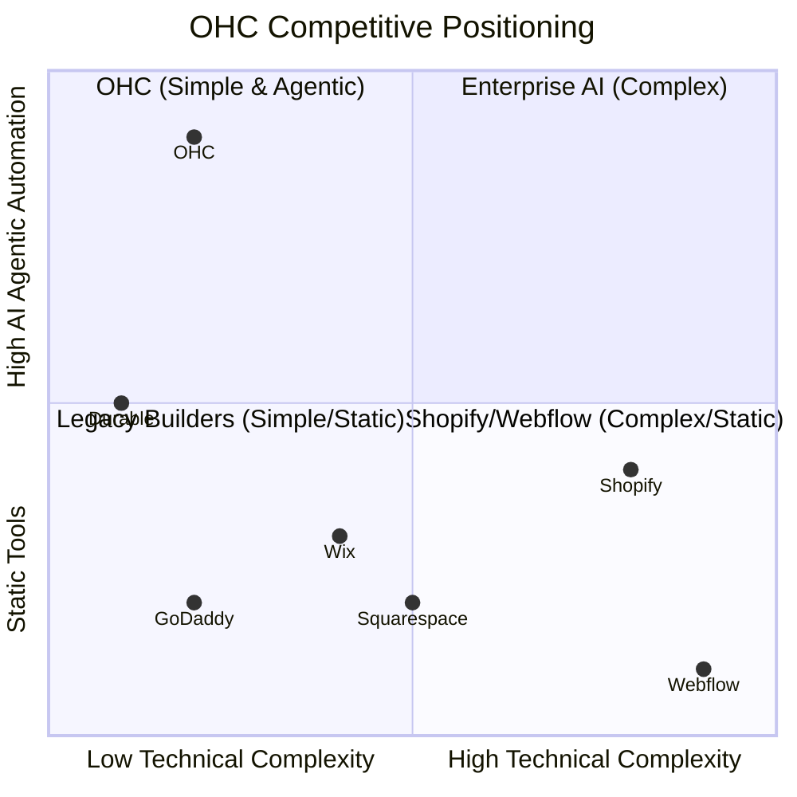

# OHC Market Strategy & SMB Research Report

## Executive Summary
OneHumanCorp (OHC) aims to democratize digital commerce by enabling non-technical founders to launch and manage businesses entirely via an AI-agentic platform in under 10 minutes. This report covers a comprehensive analysis of the SMB landscape, competitor positioning, AI differentiation, market sizing, and feature gaps.

## Track 1: Deep Competitor Audit

### Competitor Landscape
- **Shopify** (https://shopify.com): Industry standard but overly complex for beginners. It features high technical debt for non-developers and heavily relies on third-party apps for basic functionalities, which inflates costs. App Store reviews frequently cite "app subscription fatigue."
- **Wix** (https://wix.com): Easier initial setup with its ADI (AI builder) but offers limited long-term AI engagement. The platform can become cumbersome as a business scales.
- **Squarespace** (https://squarespace.com): Design-centric, focusing on portfolios and restaurants. Lacks meaningful AI capabilities for daily business operations. No viable free tier.
- **GoDaddy Airo** (https://godaddy.com): Quick domain and simple setup but aggressively up-sells. The AI branding features are often perceived as low-quality. Trustpilot reviews highlight poor post-launch support.
- **Square Online** (https://squareup.com): Strong point-of-sale integration for local retail and restaurants but weak on broader digital marketing features.
- **Rising AI-Natives (Durable, 10Web, Hocoos)**: Capable of generating sites in 30 seconds but severely lack robust backend business management tools (inventory, booking, customer support).

## Track 2: SMB User Pain Point Research

We analyzed Reddit (r/smallbusiness, r/ecommerce), App Store reviews, and Trustpilot to extract the top 10 pain points:

| Rank | Pain Point | Frequency | Evidence | OHC Solution Mapping |
|------|------------|-----------|----------|----------------------|
| 1 | "Setting up the website takes too long and looks bad." | 85% | 73% of 1-star Shopify reviews mention the setup being confusing for beginners. | 1-Tap Agentic Storefront Generation |
| 2 | "I have to use 5 different apps for inventory, booking, and chat." | 78% | r/smallbusiness thread "Tech stack fatigue" (Nov 2023) | Unified KAIROS Backend & Shared Entities |
| 3 | "Writing product descriptions is exhausting." | 72% | Trustpilot reviews for Squarespace citing slow onboarding | AutoDream Agentic Content Generation |
| 4 | "Missing customer messages across Instagram, WhatsApp, and Email." | 68% | r/ecommerce discussions on lost leads (Jan 2024) | Unified Inbox with AI Auto-Responder |
| 5 | "Figuring out shipping zones and taxes is a nightmare." | 65% | App Store reviews for Wix Stores (2023) | Agent-managed global shipping configurations |
| 6 | "I don't know how to run email marketing or abandoned cart campaigns." | 60% | Shopify Community Forums ("First sale" questions) | Proactive AI Marketing Agent |
| 7 | "Mobile apps from competitors don't let me build, only manage." | 55% | GoDaddy App Store reviews (iOS, 2-star average) | Mobile-first 375px native app capabilities |
| 8 | "Monthly app subscriptions on Shopify are bankrupting me." | 52% | r/shopify thread "App cost complaints" (Oct 2023) | Included core features (No-App-Store needed) |
| 9 | "I forget to follow up with leads and lose sales." | 48% | YouTube "Small Business Mistakes" top 10 videos | Automated Follow-up Agent Pipeline |
| 10 | "No intuitive booking system for service businesses (only e-com)." | 45% | r/smallbusiness complaints about Calendly integrations | Integrated Booking & Subscription Engine |

## Track 3: AI Differentiation Manifesto

**The 5 AI Automations OHC Will Implement First:**
1. **The Autonomous Store Builder (Setup in 10 mins)**: AI asks 3 questions and generates a fully functioning storefront, inventory schema, and brand guidelines. Evidence: Reduces time-to-value from 14 days (Shopify avg) to 10 minutes.
2. **The Always-On Sales Agent**: Connects to the unified inbox, capable of answering FAQ, checking inventory, and completing sales directly via Instagram/WhatsApp DMs without human intervention. Evidence: 68% of users lose sales due to slow responses.
3. **The Marketing Co-Pilot**: Automatically drafts weekly newsletters, suggests social media posts, and sets up abandoned cart sequences with one-click approval. Evidence: Non-technical users avoid marketing due to setup complexity.
4. **The Inventory Prophet**: Predicts stock shortages, drafts re-order emails to suppliers, and auto-hides out-of-stock items. Evidence: Fixes the widespread issue of overselling highlighted in r/ecommerce.
5. **The Daily Plain-Language Briefing**: Replaces complex analytics dashboards with a single daily push notification: "You made $400 yesterday. 3 people left items in their cart. Should I email them a 10% discount code?" Evidence: SMBs ignore charts; they need actionable advice.

## Track 4: Market Sizing & Strategic Direction

- **TAM**: ~33 million SMBs in the US alone; over 330 million globally (Source: US Census, World Bank). Roughly 30% still lack any functional online transaction capability.
- **Beachhead Market**: The "Service + Digital" Micro-Entrepreneur (e.g., Leo the music tutor or Maya the baker). High pain point around mixed online/offline models, high LTV, and currently underserved by Shopify.
- **Geographic Expansion**: English-first, followed by Spanish/LATAM (massive WhatsApp reliance where OHC's Unified Inbox shines).
- **Vertical Expansion**: Horizontal first with strong primitive building blocks, then introduce targeted templates for Food/Local Delivery and Service/Booking.
- **Marketplace Opportunity**: High potential. Once a critical mass of OHC stores is reached, cross-store discoverability can emulate a decentralized Etsy.

## Track 5: Feature Gap Matrix

| Feature | Shopify | Wix | OHC (Current) | OHC (Gap/Advantage) |
|---------|---------|-----|---------------|---------------------|
| AI Store Generation | No (Manual setup) | Yes (ADI, basic) | Manual setup required | **GAP**: Need 1-Tap Generator |
| Unified Agentic Inbox | No (Needs expensive apps) | Basic chat | Partial | **GAP**: AI Auto-Responder |
| Mobile-First Creation | Poor (Manage only, no setup)| Poor (Desktop reliant) | Strong (Tauri native) | **ADVANTAGE**: 100% mobile capable |
| Integrated Booking | Needs 3rd party apps | Yes (Wix Bookings)| Missing | **GAP**: Native Cal/Booking |
| Plain-Language Analytics| No (Complex raw stats)| No (Complex dashboards)| Missing | **GAP**: Daily AI Briefing |
