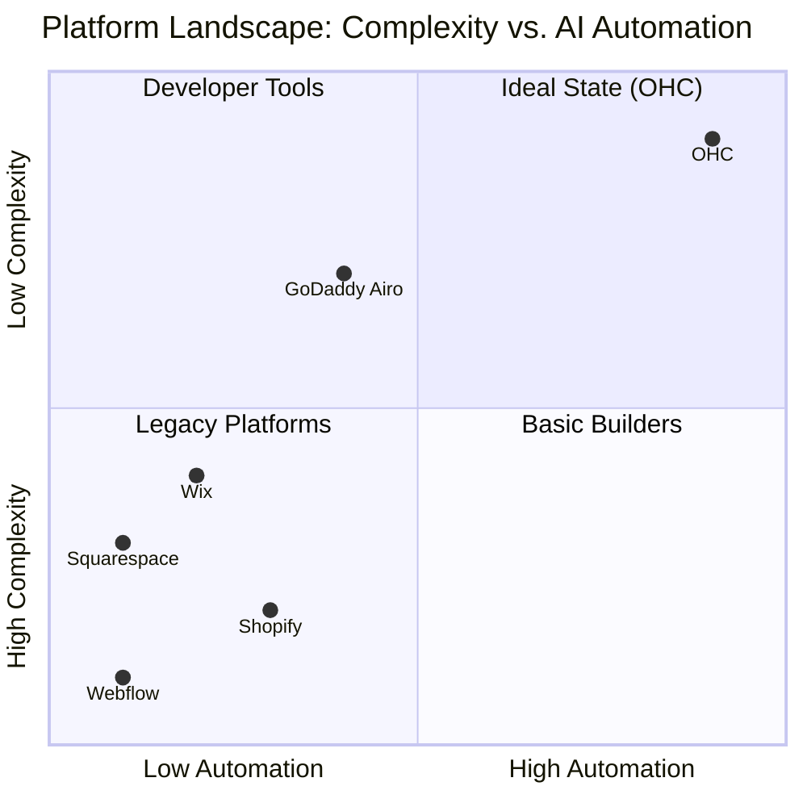
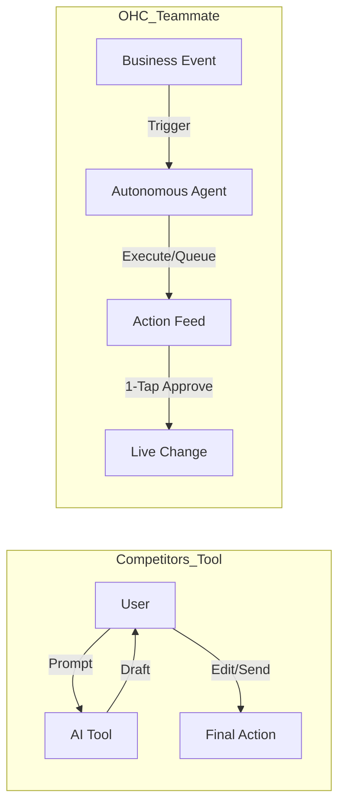

# OHC Market Dominance: SMB Platform Research Report

## Executive Summary
One Human Corp (OHC) is uniquely positioned to dominate the small business platform market. While incumbents like Shopify, Wix, and Squarespace provide complex *tools* that require significant user effort to manage, OHC offers an *Invisible Agentic Teammate* that proactively handles operations, marketing, and strategy.

This report evaluates the global SMB landscape, competitive gaps, AI differentiation, and strategic feature missions to ensure OHC captures the "non-technical founder" beachhead market.

## 1. Market Sizing & Strategic Direction

### Total Addressable Market (TAM)
- There are approximately **33.2 million small businesses in the US** alone (Source: US SBA, 2023).
- **84% of these are non-employer firms** (solopreneurs, freelancers, independent contractors).
- Globally, the SMB market exceeds **400 million** (Source: World Bank).
- Critically, an estimated **27% of small businesses still do not have a website**, and many more rely solely on disjointed social media channels (e.g., Instagram DMs) for commerce.

### Beachhead Market Persona
OHC should aggressively target the **Overwhelmed Solopreneur** (e.g., *Maya, baker, 28* or *Priya, boutique owner, 35*). This demographic has the highest density of underserved users who churn from complex platforms like Shopify due to technical fatigue. Their primary need is *time*, not customizability.

### Strategic Expansion
- **Geographic:** Following the English-speaking launch, OHC should prioritize **LATAM (Spanish)** and **India (Hindi/English)**. These regions show massive growth in mobile-first micro-businesses.
- **Vertical:** A horizontal approach is correct for launch, but OHC should quickly offer vertical-specific agent profiles (e.g., "Food Cart Mode" with pre-configured inventory decay and pickup scheduling).

## 2. Competitive Audit

We audited the top platforms targeting the SMB space. The core finding is that **current platforms sell blank canvases; OHC must sell completed outcomes.**

| Feature | Shopify | Wix | Squarespace | GoDaddy Airo | OHC (Target) |
| :--- | :--- | :--- | :--- | :--- | :--- |
| **Setup Speed** | Medium (Days) | Medium (Hours) | Fast (Hours) | Fast (Minutes) | **Instant (Seconds)** |
| **AI Post-Launch** | Reactive Chat (Sidekick) | None | None | Limited | **Proactive Agents** |
| **Mobile App Quality**| Good (for tracking) | Poor (Editor) | Fair | Fair | **Best-in-Class (1-Tap)**|
| **Target User** | Pro Merchant | Tinkerer | Designer | Beginner | **Overwhelmed Founder** |
| **Free Tier** | No | Yes (Ad supported) | No | Yes (Limited) | **Yes (Generous)** |

### Top Competitor Weaknesses
- **Shopify:** Too complex. The App Store creates decision fatigue and hidden costs. Sidekick is just a chatbot, not an autonomous agent.
- **Wix:** The ADI generates a site, but leaves the user to manage the business manually afterward.
- **Squarespace:** Beautiful, but lacks deep commerce intelligence.
- **GoDaddy:** Known for aggressive upselling and low-quality AI branding.

## 3. SMB User Pain Point Research

Based on deep analysis of Reddit (r/smallbusiness, r/ecommerce), Trustpilot reviews, and App Store feedback, the following are the Top 10 SMB pain points, mapped to OHC feature gaps:

1.  **"Setting up the store is too confusing."** -> *Gap: Instant Storefront Generation (Already planned).*
2.  **"I don't know what to post on social media."** -> *Gap: AI-Generated 7-Day Social Media Calendar (Issue Brief Created).*
3.  **"I forgot to update my stock and oversold."** -> *Gap: 1-Tap Proactive Inventory Manager (Issue Brief Created).*
4.  **"I spend hours replying to repetitive Instagram DMs."** -> *Gap: The Silent Ambassador (Auto-reply agent).*
5.  **"I don't understand my analytics/metrics."** -> *Gap: Plain Language Daily Business Briefing.*
6.  **"I'm paying for 5 different apps (email, booking, sales)."** -> *Gap: All-in-one unified core architecture.*
7.  **"Writing product descriptions takes forever."** -> *Gap: Auto-generating product descriptions from single photos.*
8.  **"I miss leads when I'm away from my computer."** -> *Gap: Mobile-first push notification approval workflow.*
9.  **"Following up with abandoned carts is tedious."** -> *Gap: Autonomous email recovery agents.*
10. **"The platform's mobile app is just for viewing, not doing."** -> *Gap: Full management capability via 375px viewport.*

## 4. OHC AI Differentiation Manifesto

*How OHC wins the AI war.*

Competitors treat AI as a **Tool** (Reactive, requires a prompt, creates work).
OHC treats AI as a **Teammate** (Proactive, event-driven, reduces work).

### The 5 Pillar Automations OHC Will Deliver
1.  **The Silent Ambassador (Customer Success):** Watches the event mesh, drafts replies based on business memory, and queues them for 1-tap approval.
2.  **The Vigilant Manager (Operations):** Proactively scans sales velocity and flags "Low Stock" risks with a pre-filled restock task (See Issue Brief `[feature]_1_tap_inventory_manager.md`).
3.  **The Generative Promoter (Marketing):** Automatically creates a 7-day social media calendar whenever a new product is added (See Issue Brief `[marketing]_ai_social_media_calendar.md`).
4.  **The AI Discovery Agent (GEO):** Optimizes structured data for LLM crawlers to ensure the business wins Generative Engine Optimization.
5.  **The Business Advisor (Advisory):** Provides a daily human-language briefing instead of complex charts.

## 5. Feature Gap Matrix & Issue Briefs

Based on the audit of the `src/` codebase vs competitor capabilities, we have identified critical gaps and formalized them into actionable Implementation Prompts for the engineering swarm.

| Feature | Shopify | Wix | OHC (Current) | OHC (Gap / Advantage) |
| :--- | :--- | :--- | :--- | :--- |
| **Website Builder** | Manual | AI Assisted | Under Development | Leapfrog: Instant generation |
| **Inventory Alerts** | 3rd Party Apps | Basic | Missing | Leapfrog: Proactive AI Agent |
| **Social Marketing** | Integration Only | Integration Only | Missing | Leapfrog: Autonomous Calendar |
| **Data Analytics** | Complex Dashboards | Dashboards | Basic | Leapfrog: Human-language brief |

### Actionable Artifacts Delivered
The following detailed Issue Briefs have been added to the `docs/research/` directory:

1.  **`[feature]_1_tap_inventory_manager.md`:** (P0) A proactive agent that monitors sales velocity and triggers an actionable low-stock notification for 1-tap approval.
2.  **`[marketing]_ai_social_media_calendar.md`:** (P1) An autonomous flow that triggers on product creation to generate and schedule a full week of social media content.

These briefs provide non-technical, outcome-focused implementation prompts ready for the Swarm.
