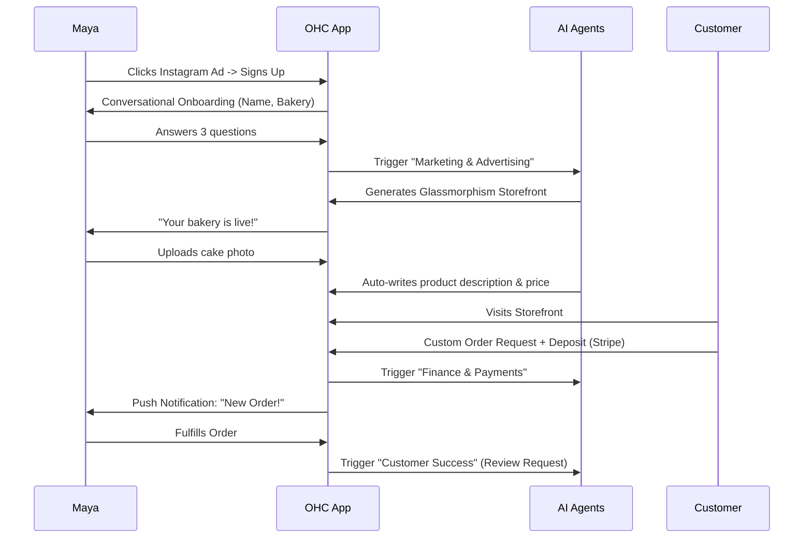
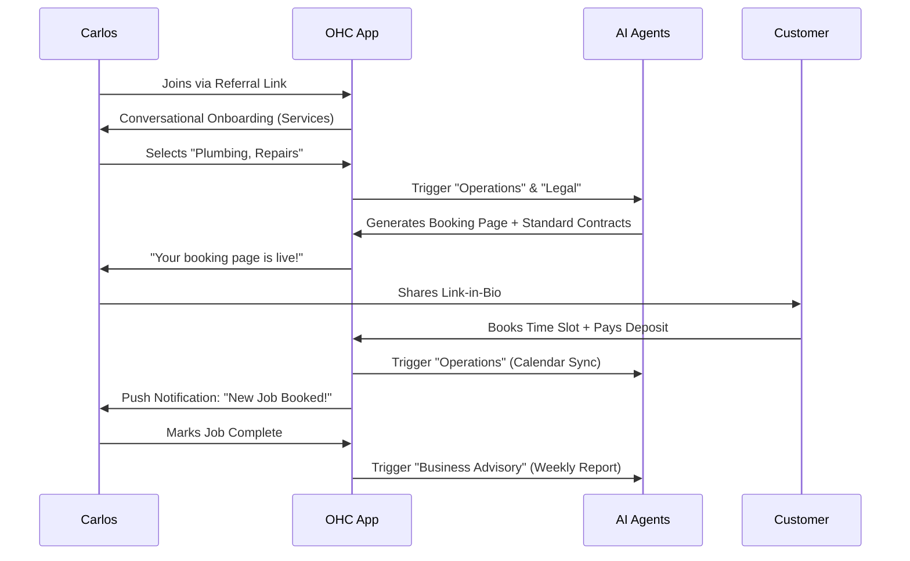

# Business Journey Architecture

## Problem Statement
Small business owners—often entirely non-technical—face significant friction when launching, running, and scaling their businesses online. Existing platforms like Shopify or Wix are too complex and desktop-oriented for personas like Maya (a baker running her business entirely from her iPhone), Carlos (a handyman with no website), or Fatima (a food cart operator needing simple offline-friendly tools). They abandon the setup process when faced with jargon ("DNS," "Themes," "SEO") or excessive upfront configuration. The problem is how to design an end-to-end user journey from Acquisition to Referral that feels effortless, is purely mobile-first, and relies on AI agents to do the heavy lifting invisibly.

## Research Report
Current platforms fail the "grandmother test." A comparative analysis reveals:
- **Shopify**: 30-60 min setup. Assumes ecommerce knowledge. Mobile app is mainly for management, not initial design.
- **Wix/Squarespace**: 20-60 min setup. Requires desktop for a reasonable design experience. Overwhelming options.
- **GoDaddy**: Fast setup but rigid and limited growth capabilities.

**Key Opportunities for OHC:**
- **Zero-Jargon Onboarding**: Use conversational AI to gather business details instead of long forms.
- **Immediate Value**: Give users a live, functional, premium-looking (Glassmorphism) site within 10 minutes.
- **Daily Utility**: Push notifications and plain-language AI advisory reports drive retention.
- **Contextual Upsells**: Introduce premium features (like custom domains) only when the user's business naturally needs them.

## Design Doc

### User Journeys

#### Acquisition & Onboarding
- **Maya (The Home Baker)**: Discovers OHC via an Instagram ad showing a competitor baker managing orders easily. The CTA is "Start your bakery online in 2 minutes."
- **Carlos (The Handyman)**: Referred by another contractor. CTA is "Get a booking page that works on your phone."

Onboarding is a conversational AI flow ("Hi Maya, what's the name of your bakery?"). Minimum inputs: Business Name, Business Type, and Contact Info. Complex setup (policies, advanced SEO) is deferred to AI agents working in the background.

#### Activation
Success is defined as:
- **Day 1**: Live storefront and first product/service added.
- **Week 1**: First booking or payment received.
- **Month 1**: A consistent habit of checking the daily AI advisory report.

#### Retention
Users return for the utility of the AI agents. Carlos checks the app daily for:
- Push notifications of new bookings.
- Plain-language AI summaries ("You have 3 jobs today. I've sent reminders to all of them.").
- Weekly revenue reports.

#### Revenue & Upgrades
Maya upgrades from Free to Starter when she reaches the 100-product limit or wants a custom domain to look more professional. The CTA appears contextually when she tries to add her 11th product or when the AI advisor suggests, "Your business is growing! A custom domain like mayascakes.com can increase trust. Upgrade now."

#### Referral
Priya (Boutique Owner) shares OHC with a friend. The viral loop is powered by a built-in "Powered by OHC" badge on free tier sites and a 1-click "Refer a Friend" button in her mobile dashboard that auto-generates a WhatsApp message.

### Friction Points
- **Initial Setup**: Abandonment if the AI asks too many questions. Mitigation: Limit onboarding to 3-5 questions.
- **Payment Gateway**: Stripe KYC can be daunting. Mitigation: Start with a simple "reserve with deposit" flow or offline payments until the business proves viable.
- **Mobile Text Entry**: Typing long product descriptions on a phone. Mitigation: The AI agent ("The Promoter") drafts descriptions from photos.

### Architecture Diagrams

#### Maya (The Home Baker) Journey

#### Carlos (The Handyman) Journey

## Implementation Prompt
**Objective:** Implement the end-to-end mobile-first onboarding and core journey flow as described in the Business Journey Architecture.

**Tasks:**
1. Build a conversational onboarding UI in Flutter (mobile-first, 375px baseline) using OHC Premium Tokens (Glassmorphism, Outfit/Inter typography).
2. Integrate the frontend with the AI Agent backend to generate the initial storefront/booking page based on 3-5 user inputs.
3. Implement push notifications and contextual upgrade CTAs.
4. Ensure 100% E2E test coverage starting from a simulated user ad-click/referral through full site generation and the first customer order.

**Acceptance Criteria:** A user can complete the entire onboarding flow in under 2 minutes with no technical jargon, resulting in a live, functional, and aesthetically premium mobile page.

## Priority
P0 (Critical)

## Estimated Scope
Large
