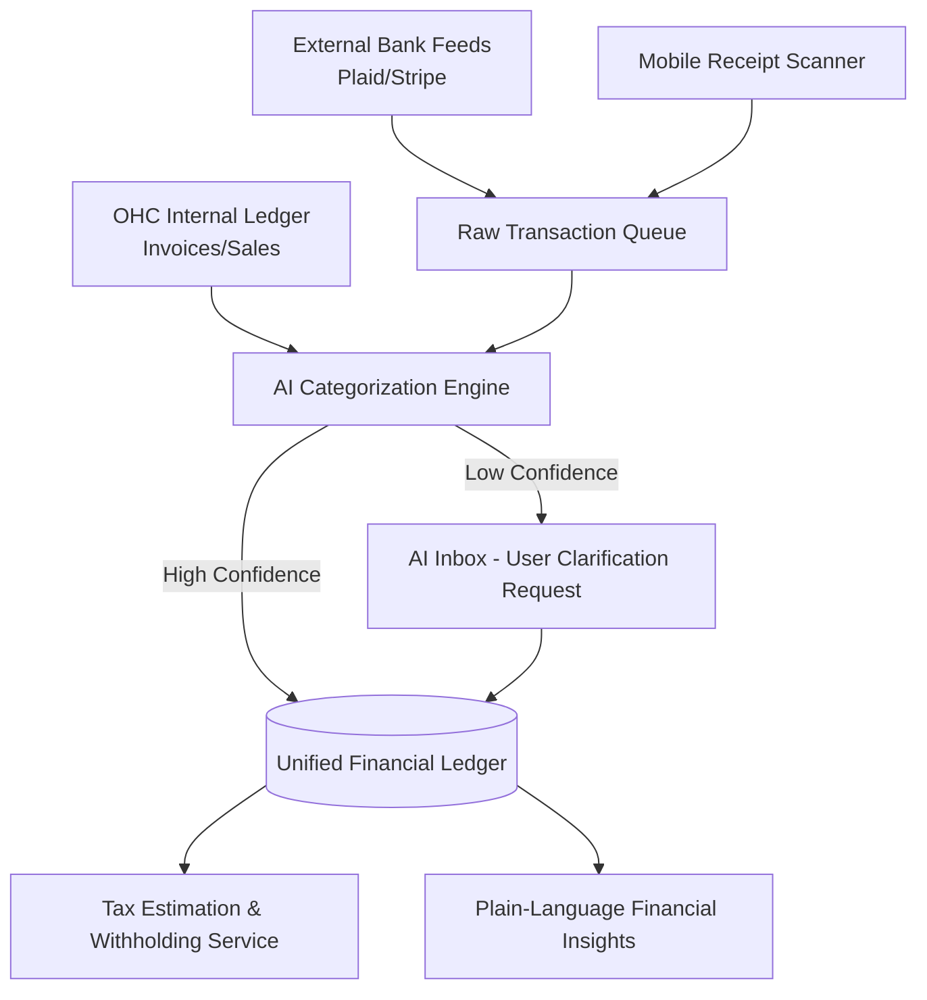

# [Architecture] Invisible AI Bookkeeping and Tax Engine

## Title
Invisible AI Bookkeeping and Tax Engine

## Problem Statement
Small business owners (like Maya the baker and Carlos the handyman) are experts in their craft, not in accounting. They frequently mix personal and business expenses, lose track of receipts, and dread the complexity of tax season. Traditional accounting software like QuickBooks or Xero requires them to learn complex concepts (chart of accounts, reconciliation, double-entry bookkeeping). They need an invisible, zero-touch system that automatically tracks cash flow, categorizes expenses, sets aside tax money, and provides actionable financial insights without requiring them to read a manual or hire an expensive accountant.

## Research Report
- **Competitor Analysis:**
  - **QuickBooks / Xero:** Powerful but built for accountants. High learning curve, intimidating interface for mobile-first micro-businesses.
  - **Modern Fintechs (Novo, Mercury):** Better UI and some auto-categorization, but disconnected from the operational context of the business (e.g., they don't know that a specific Amazon purchase was for Maya's vegan cake order).
  - **Shopify / Stripe:** Good at revenue tracking, but weak on external expense tracking and full-picture profitability without third-party apps.
- **OHC's Unfair Advantage:** As the unified platform handling storefronts, booking, and invoicing, OHC possesses the complete operational context. By integrating a virtual Finance Agent, OHC can leverage LLMs to contextually auto-categorize bank feeds and match them directly with OHC operations, achieving >95% accuracy without human intervention.

## Design Doc

### Architecture Diagram

### Mobile-First UX Flow (375px Viewport)
1. **The Finances Dashboard:** A clean, translucent glass-morphism card showing simply: "Net Profit This Month: $4,200" and "Estimated Tax Set Aside: $850".
2. **Actionable Insights:** Below the summary, a simple feed replaces standard P&L statements. E.g., "You spent $150 more on supplies this week compared to last week."
3. **One-Tap Clarification:** When the AI is unsure about a transaction (e.g., a generic Amazon purchase), it pushes a card to the AI Inbox: "Was this $45 Amazon purchase for the business? [Yes, Supplies] [No, Personal]".
4. **Receipt Capture:** A persistent floating action button to snap a photo of a receipt, which the AI instantly OCRs and matches to a bank transaction.

### AI Agent Integration Points
- **Finance Department Agent:** A background worker that continuously listens to new bank transactions and OHC ledger events. It uses contextual memory to infer categorization.
- **Operations Department Synergy:** The Operations Agent shares context with the Finance Agent. If Carlos the handyman schedules a large deck-building job, the Finance Agent expects corresponding lumber purchases and categorizes them automatically.

### Key Design Decisions and Rationale
- **Zero-Touch Baseline:** The system must auto-categorize transactions automatically if confidence is >95%. The user should only be bothered for edge cases.
- **Hide the Double-Entry:** Never show "Debits", "Credits", or "Chart of Accounts". Use plain language terms like "Money In", "Money Out", and "Taxes".
- **Real-Time Tax Bucketing:** Instead of an end-of-year surprise, the system continuously calculates estimated tax liabilities and optionally moves funds into a virtual "Tax Vault" via Stripe Treasury.

## Implementation Prompt
Design and implement the AI-driven transaction categorization and tax estimation backend. Create the core data models for Bank Accounts, External Transactions, and Tax Vaults, ensuring strict multi-tenant isolation via OHC's TenantRegistry. Implement the asynchronous background worker (Finance Agent) that processes external feeds (simulated Plaid/Stripe) and utilizes the LLM provider to categorize expenses based on the tenant's operational history. For the UI, build the Tauri mobile-first views demonstrating the simple "Finances" dashboard and the one-tap clarification cards for unsure transactions. Do not expose traditional accounting terminology; focus entirely on the plain-language CuJ (Customer User Journey).

## Priority
P0

## Estimated Scope
Large
