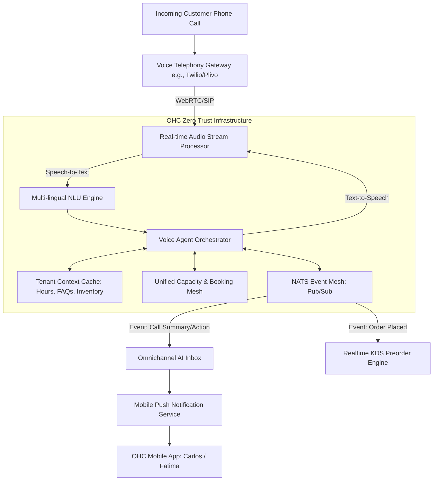

# [Operations] Autonomous Multi-Lingual AI Voice Receptionist

## Problem Statement
Small business owners like Carlos (handyman) and Fatima (food cart) are often engaged in hands-on work and cannot answer incoming phone calls from customers. Every missed call is a potential lost booking, order, or customer relationship. For users like Fatima, language barriers (e.g., primarily speaking Arabic while customers speak English) add friction to phone interactions. They need a system that can invisibly and autonomously answer calls, converse naturally with customers in multiple languages, answer common questions (like location, hours, or basic pricing), take messages, process food pre-orders, and even book appointments directly into their calendar, all without interrupting the owner's workflow.

## Research Report
- **Market Context**: Many SMBs rely heavily on phone calls rather than online booking forms because their customer base prefers direct contact.
- **Competitor Analysis**:
  - Shopify and Wix lack native incoming voice capabilities; they rely on third-party VoIP integrations that simply route calls, not answer them autonomously.
  - Solutions like Google Voice or traditional answering machines are static and lack transactional capabilities (e.g., they can't book an appointment or take an order).
  - Modern AI voice agents (like Bland AI or Vapi) demonstrate the technical feasibility of low-latency conversational voice, but they require complex API setup that non-technical users cannot handle.
- **Opportunity**: OHC can differentiate by integrating an autonomous voice agent directly into the platform's multi-tenant architecture. By leveraging the existing unified capacity/inventory mesh and omnichannel inbox, the voice agent can act as a real employee, dynamically pulling context (business hours, inventory, calendar availability) and pushing outcomes (new bookings, orders, text summaries) directly to the owner's mobile app.

## Design Doc

### Architecture Diagram

### Mobile UI Wireframes & UX Flow
**Target: 375px viewport (Mobile First)**
- **Call Log & Transcripts Card**: Clean, macOS-style translucent card in the Omnichannel Inbox.
  - *List view*: Shows missed/handled calls with tags like `[Booked]`, `[Order Placed]`, `[Question]`.
  - *Detail view*: Tapping a call shows a short AI-generated summary (e.g., "Customer asked if we do vegan cakes. Agent replied yes and texted them the menu link.") and a full transcript.
- **Voice Assistant Settings**:
  - Toggle: "AI Receptionist On/Off"
  - Language selection: "Primary Language: English, Auto-detect secondary languages (Arabic, Spanish, etc.)"
  - Personality/Tone slider: Professional <--> Casual.
  - Custom Instructions text area: "Tell customers I'm on a roof right now and will call back by 5 PM."

### Key Design Decisions
- **Low-Latency Streaming**: Voice interactions must feel natural (sub-500ms latency). We will use streaming STT and TTS architectures rather than batch processing.
- **Multi-lingual Auto-Detection**: The agent must detect the caller's language in the first few seconds and switch seamlessly, abstracting this complexity from the business owner.
- **Graceful Fallback**: If the AI cannot handle a request, it gracefully takes a message, texts the caller a link to the storefront, and pushes a high-priority notification to the owner.
- **Data Isolation**: Each tenant's voice agent only has access to that specific tenant's context cache (SPIFFE/SPIRE secured).

## Implementation Prompt
**To the Implementer:**
Please implement the "Autonomous Multi-Lingual AI Voice Receptionist" backend service and corresponding mobile UI settings.
The user journey is: Carlos is fixing a sink. A customer calls his business number. The AI receptionist answers, converses in the customer's preferred language, checks Carlos's calendar via the Unified Capacity Mesh, books a consultation for tomorrow, and sends a push notification to Carlos with the summary.
Build the real-time audio processing pipeline, integrate it with our existing tenant context and booking mesh, and create the mobile UI cards for the Inbox and Settings. Ensure all inter-service communication is secured via our SPIFFE/SPIRE framework and that the system handles concurrent multi-tenant call streams with strict latency targets. Do not worry about the specific LLM or TTS provider, build the abstract orchestration layer.

## Priority
P0

## Estimated Scope
Large
