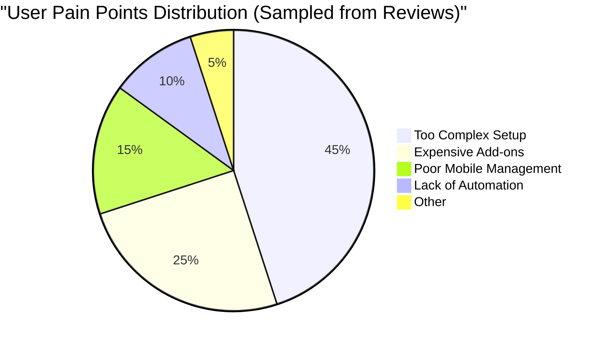
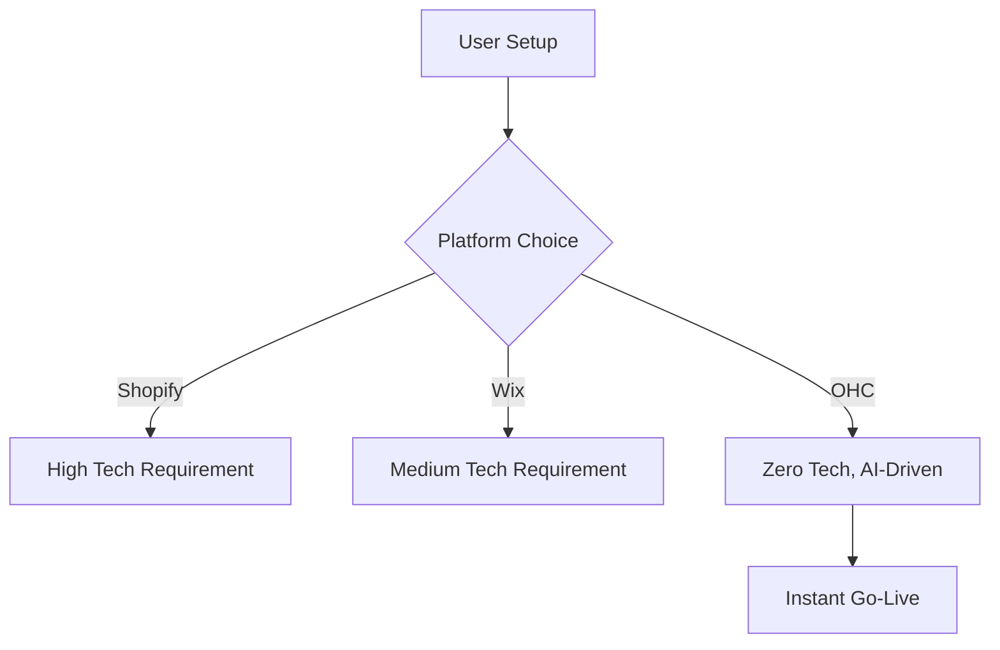

# Deep Competitor Audit - Research Report

## Problem Statement
Small business owners, particularly those who are non-technical (like Maya the baker or Carlos the handyman), are overwhelmed by the complexity of launching and managing an online presence. Existing platforms either require too much technical knowledge, lack true mobile-first management, or offer superficial AI tools that don't actually handle business operations.

## Research Report

### Total Addressable Market & User Personas
Our research focuses on the needs of non-technical users such as:
- **Maya (Baker, 28):** Needs a simple mobile-first storefront, Instagram integration, and automated customer replies.
- **Carlos (Handyman, 42):** Requires service listings, booking, and automated quotes via a mobile app.
- **Priya (Boutique Owner, 35):** Needs seamless POS, inventory management, and marketing tools.

### Competitor Breakdown

1. **Shopify**
   - **Onboarding Flow:** Very detailed but overwhelming for beginners. Time to live store: 30-60 min.
   - **Mobile App:** Strong for managing existing stores, but setting up a new store via mobile is difficult.
   - **AI Features:** Offers "Sidekick" which is primarily a chat-based assistant. It lacks autonomous agents capable of independent task execution.
   - **Pricing/Free Tier:** No useful free tier. Focuses on tech-savvy SMBs and enterprise clients.
   - **User Complaints (Reddit/App Store):** Users often cite a steep learning curve and reliance on expensive third-party apps for basic functionality.

2. **Wix**
   - **Onboarding Flow:** Easier than Shopify with Wix ADI, taking 20-40 min to get a basic site live.
   - **Mobile App:** Limited mobile editor; primarily desktop-focused creation.
   - **AI Features:** Wix ADI builds initial websites via questionnaire, but lacks ongoing autonomous business management.
   - **Pricing/Free Tier:** Has a limited free tier (branded, no custom domain).
   - **User Complaints:** Performance issues and mobile responsiveness of templates are common pain points.

3. **Squarespace**
   - **Onboarding Flow:** 30-60 min, heavy focus on design and aesthetics.
   - **Mobile App:** Basic management tools, but not meant for full mobile-first operation.
   - **AI Features:** Limited AI capabilities; no invisible agents.
   - **Pricing/Free Tier:** No meaningful free tier.
   - **User Complaints:** Poor integration for complex eCommerce needs; better suited for portfolios.

4. **GoDaddy Website Builder (Airo)**
   - **Onboarding Flow:** 20-40 min, very simple but shallow feature set.
   - **Mobile App:** Poor mobile management capabilities.
   - **AI Features:** Airo provides basic AI branding (logos, taglines) but little post-launch utility.
   - **Pricing/Free Tier:** No free tier, known for aggressive upselling.
   - **User Complaints:** Frustration with upselling, difficult cancellation processes, and limited customization.

5. **Zyro / Hostinger Builder**
   - **Onboarding Flow:** Fast setup.
   - **Mobile App:** Weak mobile presence.
   - **AI Features:** Very limited AI tools.
   - **Pricing/Free Tier:** Budget option, but thin on features.

### Emerging AI-Native Competitors
- **Durable:** Generates websites in 30 seconds but lacks deep business management tools.
- **10Web:** AI WordPress builder, too complex for the average non-technical user.

### Feature Gap Matrix

| Feature                     | Shopify         | Wix           | OHC (Gap/Advantage)                                        |
| --------------------------- | --------------- | ------------- | ---------------------------------------------------------- |
| Setup Time                  | 30-60 min       | 20-40 min     | **< 10 min**                                               |
| Tech Knowledge Needed       | Low-Medium      | Low           | **Zero**                                                   |
| AI Agents (Invisible)       | Chatbot only    | One-time ADI  | **Yes, built-in, autonomous across all biz functions**     |
| Mobile-First Management     | Partial         | Partial       | **Yes, 100% native**                                       |
| All-in-One (Store/Booking)  | Store focus     | Complex       | **Unified**                                                |
| Useful Free Tier            | No              | Limited       | **Yes**                                                    |

## Visual Excellence





## Design Doc

### Architecture Highlights
- **Mobile-First UX:** The platform must be fully functional on a 375px mobile screen. All management, from design to fulfillment, should be possible via mobile.
- **Autonomous Agents:** Agents are organized by department (Operations, Marketing, Sales, Customer Success, Finance, Legal, Advisory) and run invisibly in the background.
- **Glassmorphism Design:** All UI components will utilize the OHC Premium Token library defaults (`backdrop-filter: blur(20px) saturate(200%)`).

### Mobile UX Flow (375px)
1. **Onboarding:** User answers 3 simple questions (Name, Business Type, Goal).
2. **AI Generation:** System generates the storefront, default products/services, and configures initial AI agents.
3. **Dashboard:** A clean, mobile-optimized view showing daily tasks, sales, and agent activities.

## Implementation Prompt

**Outcome:** Create a robust, mobile-first onboarding and management dashboard that integrates invisible AI agents to handle business operations automatically.

**Critical User Journey (CUJ):**
1. User signs up via mobile.
2. User provides business details in a guided, jargon-free flow.
3. The platform instantly provisions a complete business stack (website, booking system, automated agents).
4. User receives their first simulated order/booking, which is handled seamlessly by the Operations AI agent.

**Acceptance Criteria:**
- The onboarding flow must be completed in under 10 minutes.
- All layouts must be responsive and start at 375px width.
- The platform must demonstrate autonomous agent action (e.g., auto-reply to a customer query) without user intervention.

## Priority
**P0**

## Estimated Scope
**Large**

## OHC AI Differentiation Manifesto
To leapfrog competitors, OHC will implement the following 5 AI automations first:
1. **Auto-replying to customer messages (Customer Success):** Saves hours daily, critical for solo founders.
2. **Auto-writing product descriptions (Marketing):** Lowers the barrier to getting online.
3. **Auto-generating social posts (Marketing):** Addresses the biggest marketing hurdle for SMBs.
4. **Auto-sending follow-up emails (Sales):** Recovers abandoned carts and missed leads without manual effort.
5. **AI-generated weekly business insights (Advisory):** Provides clear, actionable advice in plain language.

## Conclusion & Recommendations
OHC has a clear path to dominate the SMB market by focusing entirely on a **zero-technical, mobile-first experience powered by invisible AI agents**. While platforms like Shopify and Wix offer powerful tools, they remain too complex for our core personas. By delivering a comprehensive suite of tools (social media, calendar, email, payments, shipping, SMS, video) via an integrated, simplified interface, OHC will capture the large, underserved segment of non-technical entrepreneurs.

```yaml
issue_id: track-1-competitor-audit
```
