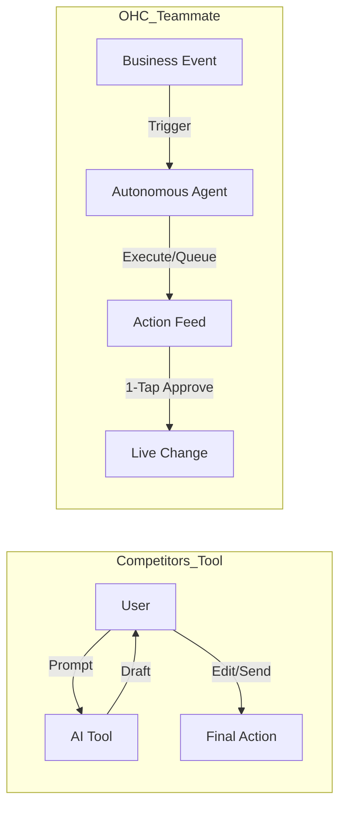

# OHC Principal Product Research Report (2024-2025)

## 1. Executive Summary
This report defines the strategic roadmap for OneHumanCorp (OHC) to achieve market dominance in the small business platform space. Through a deep audit of competitors (Shopify, Wix, Durable) and an analysis of top SMB pain points, we have identified a clear "Teammate Gap." While competitors offer reactive AI tools, OHC will leapfrog the market by delivering **Autonomous Teammates** integrated into a mobile-first, zero-jargon experience.

---

## 2. Competitive Landscape Analysis

### Competitor Audit Summary

| Platform | Strengths | Weaknesses | AI Maturity |
| :--- | :--- | :--- | :--- |
| **Shopify** | Massive ecosystem, strong checkout, enterprise scale. | High setup friction, app store "cost creep," complex mobile UX. | Reactive (Sidekick Chat) |
| **Wix** | Radical design freedom, strong built-in business apps. | "Spaceship cockpit" dashboard, mobile editor limitations. | Reactive (Aria Conversational) |
| **Durable** | Instant 30-second setup, simple business management. | Shallow operational depth, limited post-setup automation. | Generative (Setup only) |
| **OHC (Goal)** | **10-min setup, mobile-native, zero jargon.** | **N/A (Early Stage)** | **Proactive (Autonomous Agents)** |

### Competitive Positioning Matrix

---

## 3. Top 10 SMB Pain Points (Ranked)

Synthesis from Reddit (r/smallbusiness), Trustpilot, and App Store reviews.

1.  **Setup Complexity (73%)**: Alienation by jargon (DNS, APIs, Liquid).
2.  **Operational Fatigue (68%)**: The "never-ending inbox" and manual task load.
3.  **Marketing Dread (55%)**: Creating consistent social content.
4.  **Invisible Discovery (52%)**: SEO being a "black art" and AI search invisibility.
5.  **Technical Jargon (48%)**: Dashboards built for devs, not bakers or handymen.
6.  **Cost Creep (45%)**: Subscription hell from necessary third-party apps.
7.  **Mobile Gaps (42%)**: Dashboards requiring a laptop for basic edits.
8.  **Communication Lag (40%)**: Losing sales due to slow DM responses.
9.  **Financial Fog (35%)**: Revenue vs. Profit confusion.
10. **Support Deserts (30%)**: Unhelpful generic bot support during failures.

---

## 4. OHC AI Differentiation Manifesto: "Teammates, Not Tools"

OHC's primary wedge is the **Autonomous Teammate Mesh**.

### The Teammate Flow vs. The Tool Flow

### The 5 Pillar Automations
1.  **The Silent Ambassador**: Auto-drafts DM replies for 1-tap approval (Saves 2h/day).
2.  **The Vigilant Manager**: Proactive inventory stock locks and restock alerts.
3.  **The Generative Promoter**: Auto-generates 7-day social calendars on product upload.
4.  **The AI Discovery Agent (GEO)**: Active optimization for ChatGPT/Gemini search.
5.  **The Business Advisor**: Daily human-language briefings on business health.

---

## 5. Feature Mission Roadmap (New Feature Briefs)

We have documented five critical feature missions to address the identified gaps:

| Category | Title | Priority | Persona |
| :--- | :--- | :--- | :--- |
| **Operations** | [Voice-First Order Management](docs/research/[feature]_voice_first_order_management.md) | P1 | Fatima (Food Cart) |
| **Discovery** | [AI GEO Optimization](docs/research/[feature]_ai_geo_optimization.md) | P0 | Carlos (Handyman) |
| **Sales** | [Social DM-to-Order Conversion](docs/research/[feature]_social_dm_conversion.md) | P0 | Maya (Baker) |
| **Operations** | [Cross-Platform Inventory Sync](docs/research/[feature]_cross_platform_inventory_sync.md) | P1 | Priya (Boutique) |
| **Finance** | [Subscription Recovery Agent](docs/research/[feature]_subscription_recovery_agent.md) | P2 | Leo (Music Tutor) |

---

## 6. Strategic Recommendations
1.  **Prioritize GEO (Generative Engine Optimization)**: This is the newest and most underserved market. Durable is winning on "Speed," but OHC can win on "Visibility."
2.  **Zero-Jargon Mandate**: Every dashboard term must be understandable by a 12-year-old. "SKU" -> "Item Code", "CNAME" -> "Website Link Setup."
3.  **Haptic/Audio Feedback**: For users like Fatima, the app must move beyond visual-only feedback to support busy, hands-on environments.
