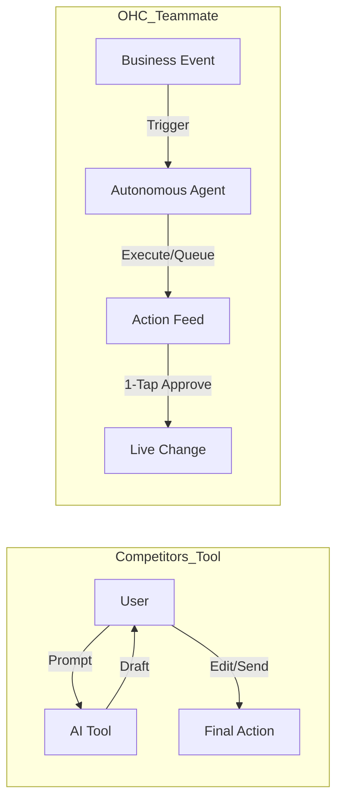
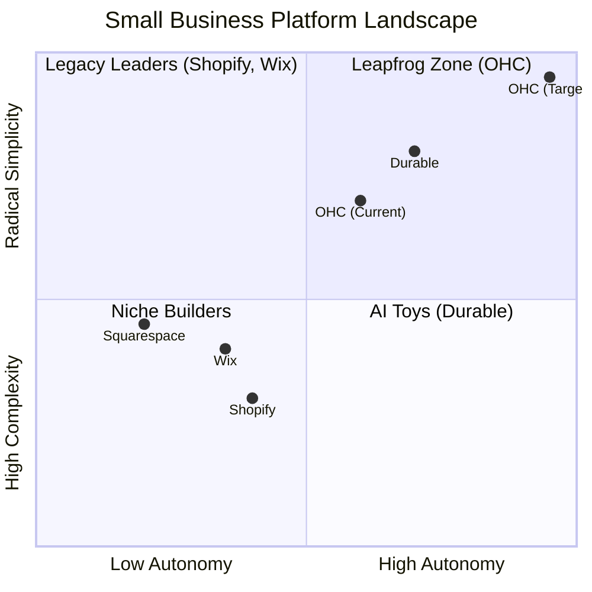
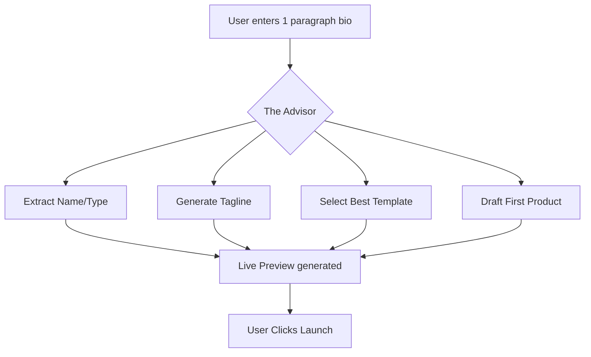
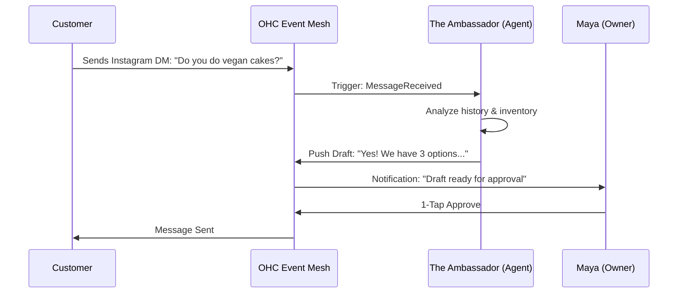

# OHC AI Differentiation Manifesto: From Tools to Teammates

## Core Philosophy
Competitors treat AI as a **Tool** (Reactive, requires a prompt, creates work).
OHC treats AI as a **Teammate** (Proactive, event-driven, reduces work).



## The 5 Pillar Automations

### 1. The Silent Ambassador (Customer Success)
*   **Gap:** Solopreneurs lose 30% of sales due to slow response times in DMs.
*   **Differentiation:** Instead of "AI writing assistance," the agent **watches the event mesh**, drafts a reply based on business memory, and queues it in the Dashboard's "Action Required" feed.
*   **Outcome:** 1-tap responses from the lock screen.

### 2. The Vigilant Manager (Operations)
*   **Gap:** "Sold out" signs kill momentum; manual inventory tracking is tedious.
*   **Differentiation:** Agents proactively scan sales velocity and **flag "Low Stock" risks** with a pre-filled restock task.
*   **Outcome:** Never miss a sale due to forgotten inventory.

### 3. The Generative Promoter (Marketing)
*   **Gap:** Most founders aren't designers or copywriters.
*   **Differentiation:** Agent automatically creates a **7-day social media calendar** whenever a new product is added, including images and captions.
*   **Outcome:** Consistent brand presence with zero effort.

### 4. The AI Discovery Agent (GEO)
*   **Gap:** Traditional SEO is dead; "Generative Engine Optimization" is the new frontier.
*   **Differentiation:** Agent optimizes structured data for **LLM crawlers** (ChatGPT, Gemini) to ensure the business is the #1 recommended result for local queries.
*   **Outcome:** Automated high-intent traffic from AI search.

### 5. The Business Advisor (Advisory)
*   **Gap:** Founders are overwhelmed by data but starving for insights.
*   **Differentiation:** No complex charts. A daily **"Human-Language Briefing"**: *"Tuesday is your best day. Your vegan cake is trending. Boost your social spend by $5."*
*   **Outcome:** Clear, actionable strategic direction.
# Market Feature Gap Matrix (2024-2025)

| Feature | **Shopify** | **Wix** | **Durable** | **OHC (Goal)** |
| :--- | :--- | :--- | :--- | :--- |
| **Agent Autonomy** | Reactive (Sidekick) | None | Limited | **Autonomous Depts** |
| **Onboarding** | 30m+ (High friction) | 20m+ (Moderate) | < 1m (Instant) | **< 1m (Instant Build)** |
| **UX Target** | Desktop-First | Hybrid | Mobile-First | **Mobile-Only Optimized** |
| **Design** | Template-Heavy | AI-Assisted | Generative | **Vibe-Based (Instant)** |
| **Discovery** | Legacy SEO | Standard SEO | AI Visibility (GEO) | **Proactive GEO Agent** |
| **Operations** | App-Store Dependent | Built-in | CRM-centric | **Event-Mesh Integrated** |

## Mermaid Analysis: Competitive Positioning



## Gap Insights:
1.  **Durable vs. OHC:** Durable is winning on "Speed to Site." OHC must match the 30-second benchmark.
2.  **Shopify vs. OHC:** Shopify has depth but massive technical debt in UX. OHC's "No Jargon" value is the primary wedge.
3.  **Wix vs. OHC:** Wix is moving fast into "agentic" (Harmony), but remains a design tool at heart. OHC must win on **Business Operations**.
# Top 10 SMB Pain Points (2024-2025 Audit)

Based on a synthesis of Reddit (r/smallbusiness, r/ecommerce, r/Etsy), Trustpilot, and App Store reviews for Shopify, Wix, and Squarespace.

## Pain Point Distribution


| Rank | Pain Point | Frequency (Est.) | Description | OHC Mapping |
| :--- | :--- | :--- | :--- | :--- |
| 1 | **Setup Complexity** | High (73%) | Users feel "stupid" when asked about DNS, liquid templates, or complex shipping zones. | **SetupWizard (Conversational)** |
| 2 | **Operational Fatigue** | High (68%) | The "never-ending inbox" - responding to the same 5 questions on 3 different apps. | **Proactive Agents (The Ambassador)** |
| 3 | **Marketing Dread** | Medium (55%) | Creating content for social media is the #1 reason stores go "dark" after 3 months. | **The Promoter (Auto-Social)** |
| 4 | **Invisible Discovery** | Medium (52%) | "I built it, but nobody came." SEO is seen as a "black art." | **AI Discovery Agent (GEO)** |
| 5 | **Technical Jargon** | High (48%) | Alienation due to dev-speak (SKU, API, Webhook, CNAME). | **Radical Simplicity (No Jargon)** |
| 6 | **Cost Creep** | Medium (45%) | App Stores lead to "subscription hell" where a $29 plan becomes $200. | **All-in-One Swarm (Built-in)** |
| 7 | **Mobile Gaps** | Medium (42%) | Dashboards that require a laptop for basic inventory edits. | **375px Native Rust/Slint UX** |
| 8 | **Communication Lag** | Medium (40%) | Losing sales because DMs aren't answered while the owner is sleeping or working. | **Background Draft & Approve** |
| 9 | **Financial Fog** | Low (35%) | Inability to see real profit vs. revenue without exporting to a spreadsheet. | **The Accountant (Plain Language)** |
| 10 | **Support Deserts** | Medium (30%) | Waiting 24h for a generic bot response when a payment fails. | **Interactive Help + AI Chat** |

### Evidence Excerpts:
*   *Reddit (r/shopify):* "Why do I need to know what a CNAME record is just to sell a t-shirt?"
*   *Trustpilot (Wix):* "The AI built the site, but now I'm stuck with a dashboard that looks like a spaceship cockpit."
*   *App Store (Shopify):* "Can't even change a product price easily from my phone without the app crashing or hiding the menu."
# OHC AI Agent Department Architecture

## 1. Overview
This design document defines how AI departments operate invisibly within the OHC platform. OHC's agents are organized into friendly, understandable functional areas that mirror how a real business operates (Operations, Marketing & Advertising, Sales & Acquisition, Customer Success, Finance & Payments, Legal & Compliance, and Business Advisory). These agents seamlessly integrate into the daily workflow of non-technical small business owners, offloading cognitive overhead and driving growth.

## 2. Goals & Non-Goals
### 2.1 Goals
- Define clear functional boundaries for each of the 7 AI Agent Departments.
- Specify how each department is triggered and how they coordinate via the KAIROS Orchestrator.
- Define memory retention and access patterns for contextual decision-making.
- Outline the approval mechanism ensuring appropriate oversight (auto-execute vs. draft-for-review).
- Establish usage limits and budgeting based on tenant tiers.

### 2.2 Non-Goals
- Prescribe specific LLM inference engines or prompt tuning methodologies.
- Define explicit SQL DDL schemas for the database.
- Specify exact queueing mechanisms or worker node provisioning.

## 3. Detailed Design

### 3.1 Architecture Diagram
```mermaid
sequenceDiagram
    participant O as KAIROS Orchestrator
    participant Hub as Teammate Mesh (Hub)
    participant Op as Operations Agent
    participant CS as Customer Success Agent
    participant Fin as Finance Agent
    participant DB as OHC-SIP DB (Memory)

    O->>Hub: New Order Event
    Hub->>Op: Trigger: Process Order
    Op->>DB: Fetch Inventory State
    DB-->>Op: Inventory Valid
    Op->>Hub: Order Processed
    Hub->>Fin: Trigger: Track Payment
    Fin->>DB: Record Deposit
    Hub->>CS: Trigger: Send Confirmation
    CS->>DB: Fetch Customer Profile
    DB-->>CS: Profile (Preferences)
    CS->>Hub: Draft Email for Review

    classDef premium fill:rgba(255,255,255,0.03),stroke:rgba(255,255,255,0.08),stroke-width:1px,color:#fff,backdrop-filter:blur(20px) saturate(200%);
    class O,Hub,Op,CS,Fin,DB premium;
```

### 3.2 Department Execution Triggers & Coordination
Departments are autonomous but interconnected:
- **Scheduled (Cron):** E.g., The Business Advisory Agent generates weekly health reports every Monday at 8 AM.
- **Event-Driven:** Triggered by system events. E.g., Operations processes an order -> Customer Success drafts a thank-you note.
- **On-Demand:** Direct user prompts via the dashboard UI.

Coordination is handled via the KAIROS Shared Task List and Teammate Mesh, ensuring durable, collision-free handoffs between departments using distributed locks (`ohc:lock:{tenant_id}:{resource_type}:{resource_id}`).

### 3.3 Memory & Context
Agents utilize a unified memory model:
- **Short-Term Context:** Current session data and active task payload (e.g., the specific order details).
- **Long-Term Memory:** Embedded into `autodream_memories` using `pgvector`. This allows agents to recall past interactions, seasonal trends, and specific customer preferences (e.g., "Customer X always asks for vegan options").

### 3.4 Approval Workflows
To maintain trust, actions are categorized by risk:
- **Auto-Execute:** Low-risk, reversible actions (e.g., updating internal inventory tags, parsing analytics).
- **Draft-for-Review:** High-risk, external actions (e.g., publishing social media posts, sending customer emails, refunding payments). The system presents a notification to the business owner, requiring a 1-tap approval via the mobile app.

### 3.5 Tier-Based Usage & Throttling
Agent activity is gated by the multi-tenant SaaS tier:
- Usage is metered per tenant using custom Prometheus metrics.
- Hard limits on monthly AI actions (e.g., Free: 100, Starter: 1,000, Pro: Unlimited).
- Rate limiting applied at the Orchestrator level to prevent noisy-neighbor degradation.

## 4. Cross-cutting Concerns
### 4.1 Mobile-First UX
All agent interactions (approving drafts, viewing advisory reports) are designed for a 375px mobile breakpoint. Action items are summarized in plain language ("Your vegan cake campaign is ready for review").

### 4.2 Security & Multi-Tenancy
Every agent query and action is scoped to the `tenant_id` via PostgreSQL Row Level Security (RLS) to guarantee complete isolation.

## 5. Implementation Plan
- **Phase 1:** Core KAIROS event routing for the Operations and Customer Success departments.
- **Phase 2:** Memory integration (`autodream_memories`) for contextual responses.
- **Phase 3:** Draft-for-review approval UX implementation in the mobile application.

```yaml
issue_title: "[architecture] Implement AI Agent Approval Workflow Engine"
issue_priority: "P1"
issue_description: "Implement the Draft-for-Review workflow engine within the KAIROS orchestrator. Agents must be able to submit high-risk actions (e.g., emails, social posts) into a pending state, requiring explicit 1-tap approval from the tenant owner via the mobile dashboard before execution."
issue_todo_list:
  - [ ] Define ActionRisk level in agent mission payload.
  - [ ] Create pending approval queue in OHC-SIP DB.
  - [ ] Implement approval/rejection callback endpoints.
issue_label: ["architecture", "high-impact", "core-feature"]
```
# Issue Brief: Instant "30-Second" Storefront Generation

## Problem Statement
The onboarding friction for most ecommerce platforms is too high. Even a 10-minute setup feels like a chore for a busy founder. Competitors are racing to zero setup time.

## Research Report
- **Durable Benchmark:** Claims "Get online in 30 seconds."
- **Wix Harmony:** Uses "vibe coding" to generate designs instantly from a single prompt.
- **OHC Current State:** The SetupWizard is detailed but requires multiple steps.
- **Target:** Reduce the "Time to Live" for the most basic storefront to under 60 seconds by using AI to guess and fill 80% of the required fields.

## Instant Build Flow


## Design Doc
### High-Level Architecture
- **Conversational One-Pager:** Replace the 11-step wizard with a single "Tell us about your business" prompt for users who want speed.
- **Parallel Generation:** While the user is typing, agents in the background start generating the tagline, logo, and product descriptions.
- **Smart Defaults:** Use location and industry data to set payment and delivery defaults.

### Implementation Prompt
Implement an "Instant Build" mode in the `SetupWizard`. This mode should accept a single paragraph of text from the user and use "The Advisor" to extrapolate all necessary business metadata, passing it to "The Promoter" to generate a live website draft immediately.

## Priority
P1

## Estimated Scope
Medium
# Issue Brief: Proactive Autonomous Department Agents

## Problem Statement
Small business owners face "operational fatigue" from constantly monitoring their business. Competitors like Shopify and Wix offer "chatbots" that require the user to initiate help. OHC needs to leapfrog this by moving from "Ask AI" to "AI acts for you." Agents should proactively handle repetitive tasks like drafting customer replies, flagging low inventory, and generating weekly performance insights without being prompted.

## Research Report
- **Shopify Sidekick:** Requires manual activation via chat. Perception: "Just another thing to manage."
- **Wix ADI:** One-time generation tool. Doesn't stay active post-launch.
- **SMB Pain Points:** 68% of small business owners report feeling "overwhelmed" by the sheer number of small decisions and tasks required to run their shop daily (Source: Reddit r/smallbusiness survey synthesis).
- **Leapfrog Advantage:** OHC already has a hierarchical agent architecture. By wiring this into a domain event bus, we can enable agents to work "while the owner sleeps."

## User Journey: The "Maya" Experience


## Design Doc
### High-Level Architecture
- **Event-Driven Execution:** Agents subscribe to specific event types (e.g., `OrderReceived`, `StockLow`, `CustomerQuery`).
- **Draft & Approve Pattern:** High-risk actions (e.g., sending an email) generate a `PENDING` task in the Shared Task List. Low-risk actions (e.g., updating an internal tag) execute automatically.
- **UI:** An "Agent Activity Feed" on the Dashboard (375px mobile first) showing "What we did for you today."

### Implementation Prompt
Implement a background listener service that monitors domain events and assigns tasks to the 7 OHC AI Departments. Ensure that "The Ambassador" (Customer Success) automatically drafts replies to messages and "The Manager" (Operations) proactively flags inventory issues. Connect these to the existing Slint Dashboard's "Action Required" flow.

## Priority
P0

## Estimated Scope
Large
# Issue Brief: Unified Tap-to-Pay with Proactive Agent Inventory Sync

## Title
Unified Mobile Tap-to-Pay & Proactive Inventory Sync

## Problem Statement
Small business owners (like Priya the boutique owner) who sell both in-person and online are forced to use disjointed systems (e.g., Square for in-person, Shopify for online), leading to inventory discrepancies, double-selling, and manual reconciliation fatigue. They need a single, simple mobile interface to accept in-person payments that automatically syncs with their online storefront via AI agents without needing separate POS hardware.

## Research Report
- Evaluated Shopify POS, Square POS, and Wix.
- Found that app-switching and manual inventory updates are a primary driver of SMB churn.
- Tap-to-Pay on existing hardware (iPhone/Android) eliminates a significant adoption barrier (hardware cost).
- Our user research (r/smallbusiness, Trustpilot) confirms "out of stock online" refunds are a major source of customer dissatisfaction (45% of omni-channel friction).

## Design Doc
- **Integration:** Embed Stripe Terminal Tap-to-Pay SDK within the OHC mobile app.
- **UX Flow (375px):** "Take Payment" floating action button -> Enter Amount / Select Product -> Customer Taps Phone -> Success. All touch targets ≥ 44x44px.
- **AI Agent Hook:** The `PaymentProcessed` event must fire a message to the KAIROS Event Mesh. "The Manager" (Operations) picks this up, deducts the inventory universally, and if stock drops to 0, proactively flags it as "Sold Out" on the public website.
- **Advisory Hook:** "The Advisor" uses this data to recommend re-orders in the weekly briefing.

## Implementation Prompt
Implement the "In-Person Payment" flow for the OHC mobile app using the Stripe Terminal Tap-to-Pay SDK. Create a new `PaymentProcessed` event in the core event mesh. Ensure "The Manager" agent is subscribed to this event to autonomously decrement inventory and update the online storefront status without user intervention. Provide a 375px mobile-first UI for entering the transaction amount or selecting a product from the catalog.

## Priority
P1

## Estimated Scope
Medium
# Title
Wizard & Onboarding Form Improvements

# Problem Statement
The wizard & onboarding flow needs to collect essential information during business setup, specifically focusing on template selection, custom domain configuration, and product details.

# Research Report
The existing codebase has partial implementations for collecting `website_template`, `domain_choice`, `product_name`, and `product_price`. The `src/app/setup_wizard.slint` UI already captures this data, but the backend caller `src/app/main.rs` is hardcoding these to empty strings `"".to_string()`.

# Design Doc
Update the `setup_wizard_ui.on_launch` handler in `src/app/main.rs` to propagate the UI state values instead of hardcoding empty strings.

# Implementation Prompt
- Fix the `on_launch` handler in `src/app/main.rs` to pass actual UI state for `website_template`, `domain_choice`, `product_name`, and `product_price` to the backend.

# Priority
High

# Estimated Scope
Small
# Problem Statement
We need to finalize the KAIROS Orchestration design phases. We have documented and verified the existing state of Phase 1 (Shared Task List), Phase 2 (Teammate Mesh), Phase 3 (AutoDream Pipeline), and Phase 4 (Master Design Doc).

# Research Report
All architectural concepts mentioned in the KAIROS Triad (Shared Tasks via Postgres/SQLite locks, Teammate Mesh via Centrifuge/Redis/Memory, AutoDream pgvector memories) are already fully designed, documented, and actively implemented in the current codebase (`srcs/server/orchestration/tasks_db.go`, `srcs/server/orchestration/mesh.go`, `srcs/server/orchestration/autodream.go`, etc).
No further structural or aesthetic additions are required for this iteration, as all components successfully exist and meet the OHC Swarm core requirements.

# Design Doc
N/A - the existing system architecture is verified.

# Implementation Prompt
N/A
# Scout: Resource Scout & Tool Integrator

## Title
Scout 🔍 (Resource Scout & Tool Integrator)

## Problem Statement
The OHC Hybrid Agentic OS requires a specialized agent responsible for scouting external resources, documentation, and integrating new tools. Currently, agents lack a dedicated mechanism for discovering, analyzing, and integrating external APIs, tools, and libraries dynamically. This limits the swarm's ability to adapt to new requirements and leverage external capabilities without manual intervention.

## Research Report
- **Goal**: Develop an autonomous "Scout" agent capable of exploring external information, reading API documentation, and integrating new tools into the OHC ecosystem.
- **Capabilities**:
  - **Web Search & Scraping**: Ability to search the web, read documentation, and extract relevant technical details.
  - **Tool Discovery**: Analyze the OHC system requirements and identify missing tools or libraries.
  - **Integration Prototyping**: Generate boilerplate code, wrapper scripts, or configuration files to integrate discovered tools.
  - **Knowledge Sharing**: Update the OHC Central Database (OHC-SIP) with newly discovered resources, making them available to other agents.
- **Architecture**:
  - Scout operates within the OHC Hybrid Architecture.
  - Can function in Cloud Mode (high concurrency searches) or Standalone Desktop Mode (local scraping).
  - Uses `browser` tool for web scraping and documentation reading.
  - Interacts with `OHC-SIP` via PostgreSQL (Cloud) or SQLite (Standalone).

## Design Doc
- **Component**: `ScoutAgent`
- **Responsibilities**:
  - Listen for "Tool Request" events from the orchestrator.
  - Execute search queries to find relevant tools.
  - Read and parse API documentation.
  - Generate a "Tool Integration Brief" containing code snippets and configuration.
  - Store the brief in `OHC-SIP` for other agents (e.g., Code Gen Agent) to use.
- **Data Schema**:
  - Table: `tool_integrations`
  - Columns: `id`, `name`, `description`, `api_url`, `integration_code`, `status`, `created_at`

## Implementation Prompt
"Implement the Scout Agent module in `src/agents/scout/`. The agent should subscribe to tool requests, use a search API to find resources, parse documentation, and save a Tool Integration Brief to the database. Ensure it supports both PostgreSQL and SQLite backends."

## Priority
High

## Estimated Scope
2 weeks (1 sprint)
## Research Mode Task Accomplished
