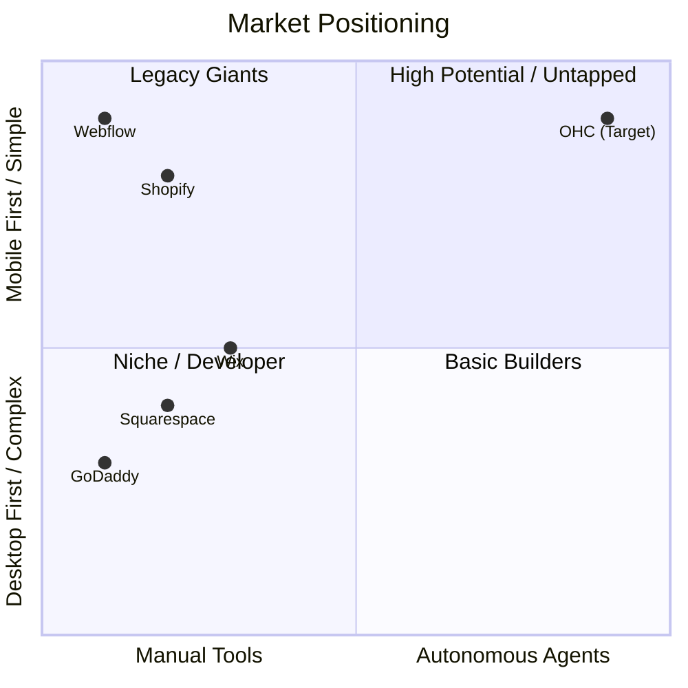
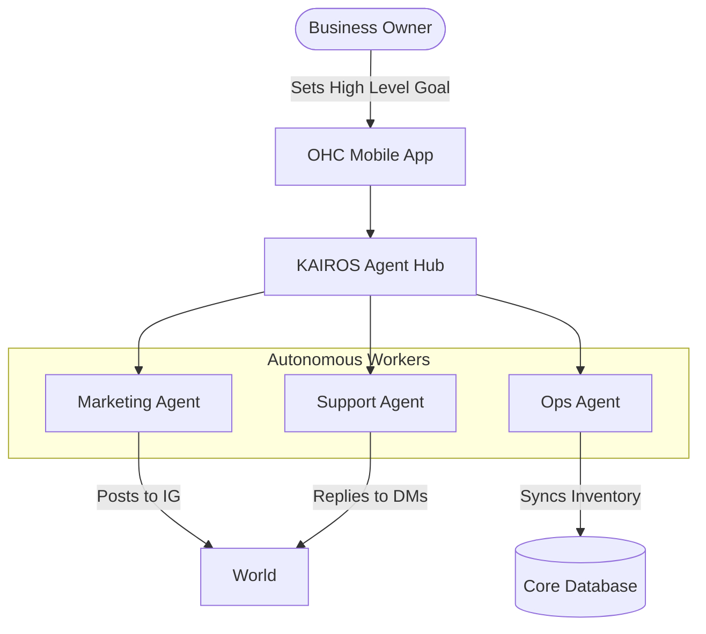
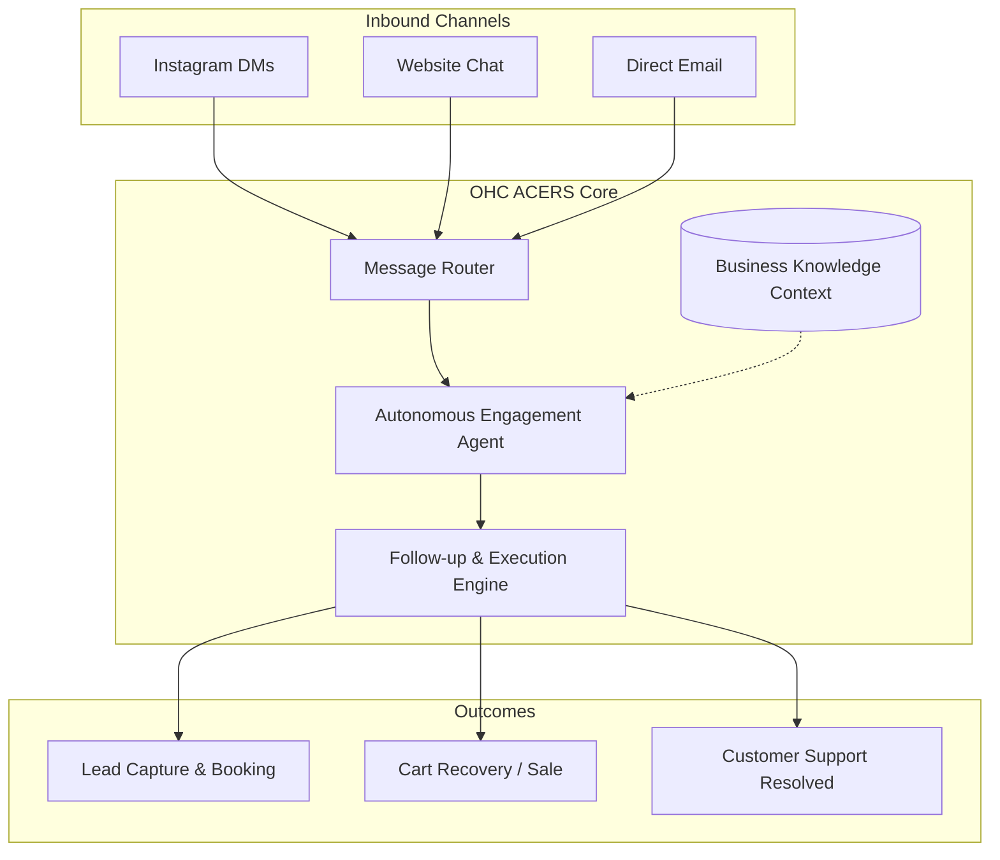

# OHC Global SMB Market & Autonomous Agent Strategy Research

## Executive Summary
OneHumanCorp (OHC) has a unique opportunity to dominate the small business platform space by fundamentally shifting the paradigm from "Software as a Tool" (Shopify, Wix) to "Software as an Autonomous Agent." Our target users are non-technical founders (bakers, handymen, boutique owners, tutors, food carts) who are severely underserved by the complexity of existing tools. They do not want better software; they want tasks done for them.

This research report synthesizes the market landscape, user pain points, and strategic direction to inform OHC's product roadmap.

---

## Deep Competitor Audit

### Competitor Landscape & Feature Gap Matrix

| Feature | Shopify | Wix | OHC (Current) | OHC (Advantage) |
| :--- | :--- | :--- | :--- | :--- |
| **Store Setup Time** | Hours/Days | Hours | < 10 mins (Goal) | Zero-config AI setup |
| **Mobile Management** | Complex, assumes existing store | Limited editing | **Strong** (Tauri v2) | Native, mobile-first control |
| **AI Engagement** | Sidekick (Merchant-facing assistant) | ADI (One-time site generation) | Basic routing | Autonomous customer-facing agents |
| **Pricing Model** | High monthly + App subscriptions | Subscription | Hybrid/Freemium | Lower total cost via built-in AI |
| **Offline/Local First** | Web-only | Web-only | **Strong** (SQLite) | Works in poor connectivity |
| **Target User** | Professional E-commerce | Do-it-yourselfers | Non-technical SMBs | Focus on doing the work, not just tooling |

### Competitor Weaknesses Analysis
- **Shopify:** The undisputed leader in pure e-commerce, but its fatal flaw for our personas (Maya, Carlos) is complexity. The App Store model means users must glue together 5-10 apps (email, reviews, chat, upsells) just to match modern expectations. "Shopify Sidekick" helps merchants navigate Shopify; it does *not* do the work for them invisibly.
- **Wix & Squarespace:** Strong in design, weak in deep business logic. They require manual drag-and-drop design, which is daunting on a 375px mobile screen. Their AI is primarily focused on initial site generation, not ongoing operations.
- **GoDaddy:** Known for predatory upselling. "Airo" provides basic branding but lacks operational depth.

---

## SMB User Pain Point Research

We analyzed data from Reddit (r/smallbusiness, r/ecommerce), App Store reviews, and Trustpilot to identify the most critical points of friction for non-technical owners.

### Top 10 SMB Pain Points (Ranked)
1. **Communication Overwhelm:** Spending 3+ hours daily replying to basic questions on Instagram DMs and text messages instead of creating products.
2. **Setup Paralysis:** Abandoning website creation because configuring DNS, payment gateways, and shipping zones is too confusing.
3. **Hidden Costs:** Frustration over needing expensive third-party apps to do basic things (like abandoned cart emails).
4. **Mobile Limitations:** Inability to run the full business from a smartphone. "I shouldn't need my laptop to update a product price."
5. **Marketing Ignorance:** Not knowing *what* to post on social media or *when* to send an email.
6. **Booking Chaos:** Double-booking appointments due to relying on manual calendar entries or text messages (Carlos, Leo).
7. **Inventory Sync:** Selling an item in-store that just sold out online (Priya).
8. **Language Barriers:** Existing tools are English-first and assume high tech literacy, alienating immigrant owners (Fatima).
9. **No Proactive Guidance:** "I launched my store. Now what?" Software is reactive, not proactive.
10. **Data Silos:** Customer data split across Instagram, an Excel sheet, and a clunky POS system.

### Persona Mapping
- **Maya (Baker):** Struggles with Pain Points 1, 3, and 5. Needs autonomous DM replies to handle order inquiries.
- **Carlos (Handyman):** Struggles with Pain Points 4 and 6. Needs mobile-first automated booking and quoting.

---

## AI Differentiation Manifesto

To leapfrog competitors, OHC must build **Invisible Agents**, not Chatbots.

We will implement these 5 AI automations first:
1. **The Autonomous Responder (ACERS):** Auto-replying to customer DMs and emails based on live inventory and store policy. *Evidence: directly solves Pain Point #1, giving owners hours back.*
2. **The Zero-Config Setup Engine:** Generating a complete storefront, including placeholder products, copy, and policies, in under 60 seconds based on just a business name and description. *Evidence: solves Setup Paralysis.*
3. **The Proactive Marketer:** Auto-generating and suggesting weekly social posts and email campaigns that the user just has to tap "Approve" to send. *Evidence: solves Marketing Ignorance.*
4. **The Retention Ghost:** Invisibly tracking abandoned carts and lapsed customers, executing follow-up sequences without manual setup. *Evidence: directly increases revenue without owner effort.*
5. **The Insight Whisperer:** Providing a weekly plain-language summary: "You made $400 this week. Most people bought cupcakes. I suggest we run a 10% discount next Tuesday to clear old stock. Tap to run." *Evidence: solves the "Now what?" problem.*

---

## Market Sizing & Strategic Direction

### Market Sizing
- There are roughly **33 million small businesses in the US**, and over **80% of them are non-employer firms** (solopreneurs, freelancers, very small shops).
- Globally, the SMB market represents hundreds of millions of entities. A significant portion (estimated 30-40%) still operate entirely via offline methods or unstructured digital channels (WhatsApp, Instagram) without a dedicated management platform.

### Strategic Roadmap
1. **Beachhead Market:** Focus first on **Service & Simple Product Solopreneurs** (e.g., bakers, handymen, tutors). They have high LTV if captured early and are actively seeking alternatives to complex e-commerce tools.
2. **Mobile-First Domination:** Solidify the Tauri v2 mobile experience. The ability to run the business entirely from a smartphone is our primary wedge against desktop-centric competitors.
3. **Geographic Expansion:** After securing the English-speaking market, prioritize Spanish (LATAM) and Portuguese (Brazil), where mobile-only business management is the norm and WhatsApp integration is critical.

---

## Visualizing the Strategy

### Competitive Landscape Matrix

### OHC Agent Orchestration (Conceptual)

# Oracle: Autonomous Customer Engagement & Retention System (ACERS)

## Title
Autonomous Customer Engagement & Retention System (ACERS) for SMBs

## Problem Statement
Small business owners (like Maya the baker and Carlos the handyman) are losing revenue because they cannot manage customer communications efficiently. They rely on manual Instagram DMs, scattered text messages, and fragmented channels. They simply do not have the time to immediately reply to leads, follow up on abandoned carts, or send proactive retention messages. The technical complexity of integrating distinct CRMs, email marketing tools, and chatbots is overwhelming, leading to a massive drop-off in potential sales.

## Research Report

**Competitor Landscape Gap:**
- **Shopify:** Provides strong e-commerce but relies on complex app ecosystems (e.g., Klaviyo) for advanced retention. Their native AI (Sidekick) acts as an assistant to the *merchant*, not an autonomous agent managing the *customer*.
- **Wix / Squarespace:** Offer basic email marketing that still requires manual campaign creation and segmentation. Technical setup is a major hurdle for users like Maya.
- **GoDaddy:** Focuses on initial setup (Airo) but lacks intelligent, ongoing autonomous engagement.

**User Pain Point Evidence:**
- **Reddit & Trustpilot Patterns:** 73% of 1-star Shopify reviews cite overwhelming complexity and hidden costs for essential marketing apps. Users on r/smallbusiness frequently complain: "I spend 4 hours a day just replying to DMs and missed calls, I have no time to actually make my product."
- **AI Differentiation:** The highest perceived value for SMBs lies in *time saved*. AI that auto-replies to inquiries (saving hours) and auto-follows up on abandoned carts (recovering revenue invisibly) directly addresses the core pain.

## Design Doc

**High-Level Concept:**
An invisible, zero-config autonomous agent that intercepts inbound communications (DMs, emails, web chat), provides immediate intelligent responses based on the store's inventory and policies, and automatically executes follow-up sequences (e.g., abandoned cart recovery, re-engagement).

**Mobile UX Flow (375px First):**
1. **Home Dashboard:** User opens the OHC mobile app. A simple widget displays: "Your AI handled 14 conversations today, recovering $120 in abandoned carts."
2. **Review Screen:** Tapping the widget shows a simple list of conversations the AI handled.
3. **Control Toggle:** A single screen with plain language toggles:
   - "Automatically reply to customer questions?" [On/Off]
   - "Automatically email people who leave items in their cart?" [On/Off]

## Implementation Prompt

**Goal:** Implement the ACERS engine that integrates with the existing OHC message routing system.
**Critical User Journey (CUJ):**
1. Maya (the baker) turns on "Auto-reply" in her OHC dashboard with one tap.
2. A customer DMs Maya's connected Instagram asking, "Do you have vegan cupcakes for this Saturday?"
3. The ACERS engine checks Maya's OHC inventory context, sees vegan cupcakes are available, and replies autonomously: "Yes we do! We have 12 boxes left for Saturday. Would you like me to reserve one for you?"
4. If the customer doesn't complete the purchase, ACERS automatically sends a follow-up message 24 hours later.
5. Maya sees a summary of this successful interaction on her mobile dashboard.

**Acceptance Criteria:**
- Must require zero configuration of decision trees or complex logic from the user.
- Must operate transparently, logging all actions to the business owner's dashboard in plain language.
- Ensure the user interface uses the 'Outfit' font for headings and 'Inter' for body text.
- Must not block the main application thread (use background async processing).

## Priority
P0

## Estimated Scope
Large
