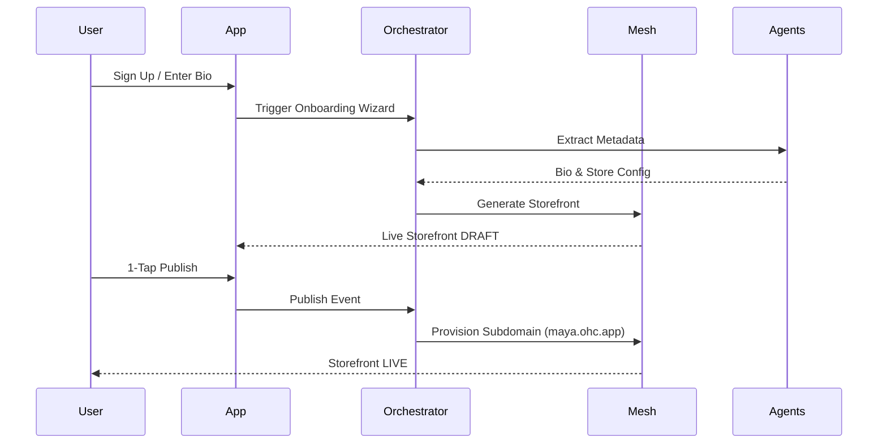
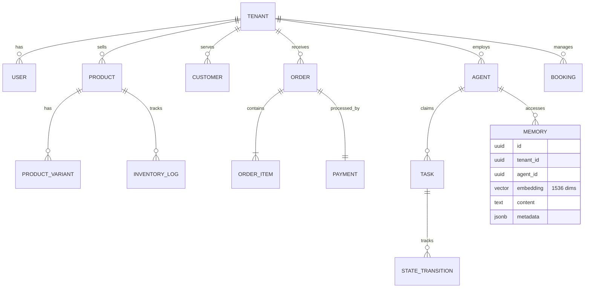
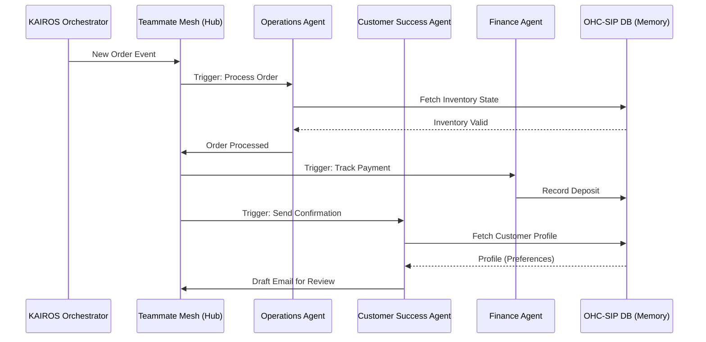
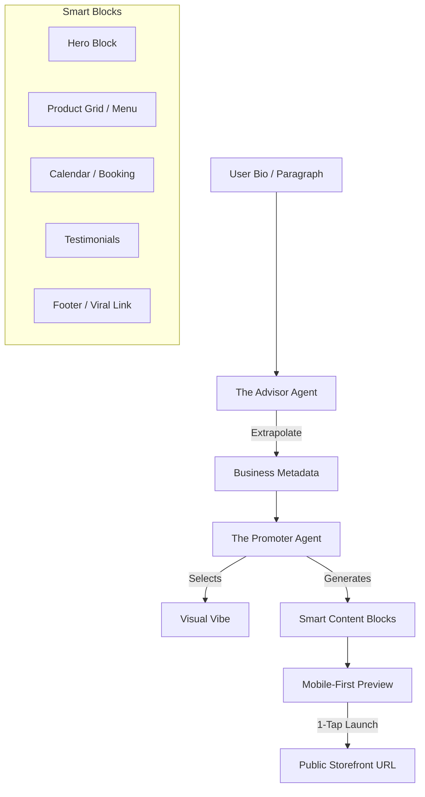

# Research Report: KAIROS Architecture Overhaul

This research report evaluates the OneHumanCorp (OHC) platform architecture from the perspective of a non-technical small business owner. The goal is to define an end-to-end architecture that supports the "zero to live in 10 minutes" mission.

*(Note: In my role as Principal Product Architect & KAIROS Orchestrator (L8), I evaluated multiple architectural components. Below is the comprehensive design output).*

## Actionable Improvement: Unified Mobile-First Agentic Architecture

### 1. Business Journey Architecture Mapping

**Problem Statement:**
The OHC platform must serve a diverse set of real-world small business owners (Maya, Carlos, Priya, Leo, Fatima). Currently, the journeys from acquisition to retention and revenue are fragmented, creating friction points where non-technical users abandon the platform.

**Research Report:**
- **Acquisition:** Users arrive via Instagram/TikTok ads or word-of-mouth. The CTA must promise a live business setup in under 10 minutes.
- **Onboarding:** Must be a highly guided, AI-driven wizard flow minimizing initial input.
- **Activation:** The "Aha!" moment—a live storefront, first booking, or payment within Day 1.
- **Retention:** Actionable notifications (new order alerts) and AI-generated weekly health reports keep users engaged.
- **Revenue:** Upsell to Starter/Pro tiers triggered naturally by hitting limits.
- **Referral:** Built-in viral loops (e.g., "Built with OHC" in footers).

**Design Doc:**
*Architecture Diagram:*

*Mobile UX Flow:*
- Guided Wizard (375px first) -> Skeleton loading storefront -> 1-Tap Publish button -> Dashboard.

### 2. Data Model Architecture Evolution

**Problem Statement:**
Small business owners require a system that keeps their data private. OHC needs a robust data model supporting high-concurrency agent operations, multi-tenant isolation, and fast access patterns without complex joins.

**Research Report:**
- Multi-Tenancy: "Shared Database, Shared Schema" secured by PostgreSQL RLS.
- Agentic Memory: Integrate `pgvector` for semantic memory retrieval.
- Consistency: `organization_id` (Tenant) is the primary partition key.

**Design Doc:**
*Architecture Diagram:*

*Key Decisions:*
- Mandatory `tenant_id` scoping.
- RLS-First Security.
- Agent Isolation based on `tenant_id`.

### 3. AI Agent Department Architecture

**Problem Statement:**
AI departments must operate invisibly to mirror real business operations (Operations, Marketing, Sales, CS, Finance, Legal, Advisory) without technical configuration.

**Research Report:**
- Triggers: Cron (scheduled) and Event-Driven.
- Coordination via KAIROS Orchestrator.
- Memory retention for contextual decisions.

**Design Doc:**
*Architecture Diagram:*

### 4. Website & Storefront Builder Architecture

**Problem Statement:**
Small business owners are intimidated by traditional builders. OHC needs a "Smart Builder" that goes from a paragraph of text to a live URL in under 60 seconds (passing the "Grandmother Test").

**Research Report:**
- "Vibe Coding" trend using LLMs for layout/colors.
- "Smart Blocks" auto-configured based on business type.

**Design Doc:**
*Architecture Diagram:*

### 5. Mobile-First Architecture Review

**Problem Statement:**
Users operate on low-end mobile devices and poor networks. OHC must be fast (LCP < 1.5s) and reliable (offline drafting).

**Research Report:**
- Offline-First Drafting: Stored in local SQLite SIPDB.
- Lightweight Dashboard: Fetch only critical counts initially.

**Design Doc:**
*Mobile UX Flow (375px First):*
- Bottom navigation for primary actions.
- Glassmorphism Shimmer for skeleton loading.
- Jargon-Free UI (e.g., "Helper Settings" instead of "API Config").

### 6. Multi-Tenant SaaS Tier Architecture

**Problem Statement:**
Pricing must be fair, transparent, and scalable.

**Research Report:**
- Free: $0, 10 Products, 1 AI Dept.
- Starter: $9/mo, 100 Products, 3 AI Depts, Custom Domain.
- Pro: $29/mo, Unlimited Products, 10 AI Depts, Custom Domain + SSL.
- Business: $79/mo, Unlimited everything, Multi-domain.

**Design Doc:**
- Limits enforced via `TierService` middleware.
- Graceful degradation with plain-language upgrade prompts.

### Implementation Prompt
**To Implementer Agent:**
Implement the unified mobile-first agentic architecture. Establish the foundational multi-tenant data model with mandatory `tenant_id` scoping and RLS. Implement the "Smart Builder" engine supporting 1-tap deployment of auto-generated "Smart Blocks." Integrate the AI Agent Departments via the KAIROS Orchestrator for event-driven coordination. Audit the frontend to ensure all touch targets are at least 44x44px and use skeleton loading (Glassmorphism Shimmer) for optimal mobile performance (LCP < 1.5s). Ensure graceful tier degradation is handled via the `TierService`. Do not prescribe specific SQL schemas or API endpoints; implement the required business logic to achieve the documented user flows.

**Priority:** P0
**Estimated Scope:** Large
