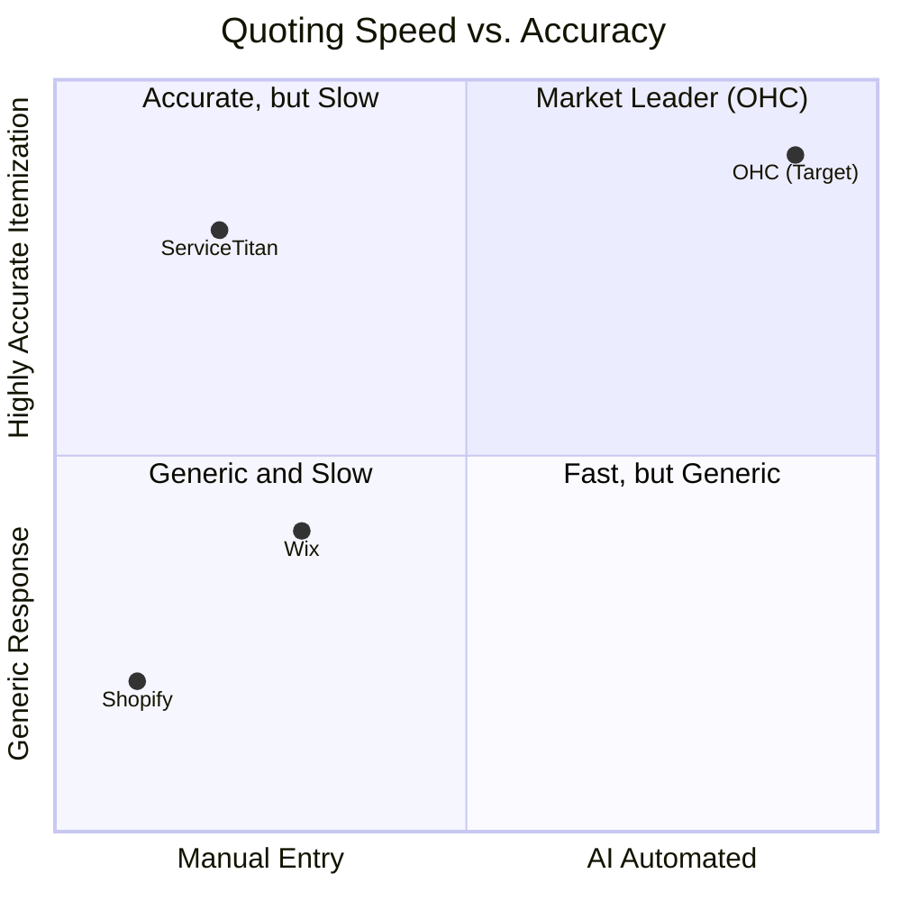
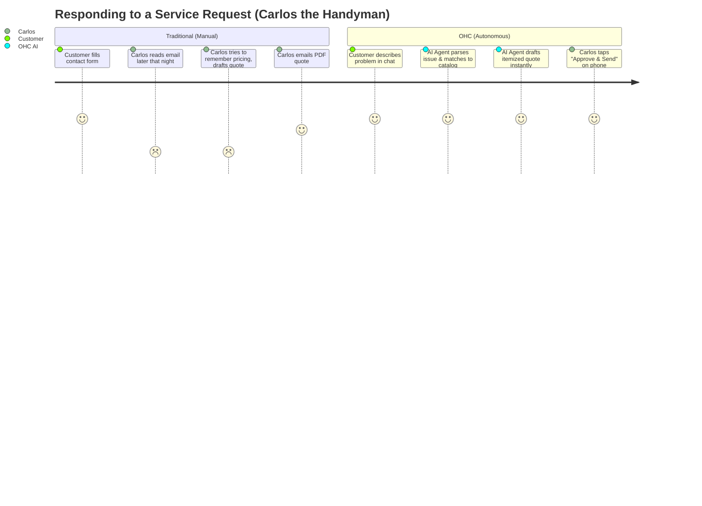

# AI Quote Generation Agent: The Salesperson

## Problem Statement
Service-based non-technical small business owners like Carlos (the freelance handyman) lose up to 40% of potential leads because they cannot respond with a quote quickly enough while on a job. Customers reach out with varied descriptions of their problems (e.g., "My kitchen sink is leaking under the cabinet"), and existing platforms either offer rigid contact forms without immediate pricing feedback or require the owner to manually draft a quote later, leading to lost revenue and customer frustration.

## Research Report

### Top SMB Pain Points (Validated)
1. **Speed to Lead:** Handymen, cleaners, and tutors lose out on jobs if they don't reply with pricing and availability within 1 hour. (Source: r/sweatystartup, ServiceTitan industry reports)
2. **Manual Quoting Overhead:** Drafting quotes manually takes 15-30 minutes per job, usually done late at night, leading to burnout. (Source: Trustpilot reviews for job management apps)
3. **Complex CPQ Software:** Existing quote tools (Configure, Price, Quote) are built for enterprise or tech-savvy users, not solo operators.

### OHC AI Differentiation Manifesto
Instead of providing a blank invoice template, OHC's "The Salesperson" (Sales & Acquisition Department) will autonomously read the customer's natural language inquiry, match it against Carlos's service catalog and historical pricing (using pgvector memory), and instantly generate a professional, itemized quote for Carlos to approve with one tap, or auto-send based on confidence thresholds.

### Competitive Feature Gap Matrix

| Feature | Shopify | Wix | Squarespace | GoDaddy | OHC (Gap/Advantage) |
|---|---|---|---|---|---|
| Service Catalog & Pricing | No | Basic | Basic | Basic | **Advantage:** AI-driven dynamic service matching |
| Auto-Generated Quotes | No | No (Manual Invoices) | No | No | **Advantage:** Invisible AI quote drafting |
| Natural Language Intake | No | No | No | No | **Advantage:** LLM parses customer problem descriptions |
| Mobile-First 1-Tap Approval | No | Partial | No | No | **Advantage:** Native 375px approval flow |

### Competitive Landscape

### User Journey Comparison

## Design Doc

### High-Level Architecture
1. **Intake Gateway:** Customer describes the issue via OHC Web Chat or an SMS integration.
2. **Intent & Extraction:** The LLM (Gemini Pro) extracts key entities (Service Type, Urgency, Location, Scope).
3. **Context Retrieval:** Queries the pgvector database for Carlos's past quotes, base pricing, and availability.
4. **Quote Generation:** "The Salesperson" agent generates a structured quote proposal.
5. **Mobile UX (375px):** A push notification to Carlos. The app shows the drafted quote with a breakdown. Carlos can edit a line item or just tap "Approve & Send".

### Mobile UX Flow (375px First)
1. **Notification:** "New Quote Drafted: Leaky Sink repair for John."
2. **Review Screen:** Clean, mobile-friendly breakdown showing Labor, Parts (estimated), and Total.
3. **Action Bar:** "Approve & Send", "Edit", "Decline".

## Implementation Prompt

**User-Facing Outcome:**
Implement the "AI Quote Generation" feature for the Sales & Acquisition Department. A service business owner should receive automatically drafted, itemized quotes in response to natural language customer inquiries, ready for one-tap approval on a mobile device.

**Critical User Journey (CUJ):**
1. A customer submits a service request describing their problem in plain text.
2. The AI Salesperson agent processes the request and drafts a quote based on the business's service catalog and pricing history.
3. The business owner receives a notification and opens the OHC mobile app.
4. The owner views the drafted quote, taps "Approve & Send".
5. The system sends the approved quote to the customer via email/SMS with a payment link.

**Acceptance Criteria:**
*   An AI agent pipeline successfully parses natural language into a structured quote proposal.
*   The mobile-first UI displays the drafted quote with edit and approve actions.
*   One-tap approval transitions the quote to "Sent" status and generates a mock notification/email payload.
*   E2E test coverage for the full flow, from inquiry submission to quote approval.
*   Tests must use mocked LLM responses to ensure CI stability.

## Priority
P1

## Estimated Scope
Medium

