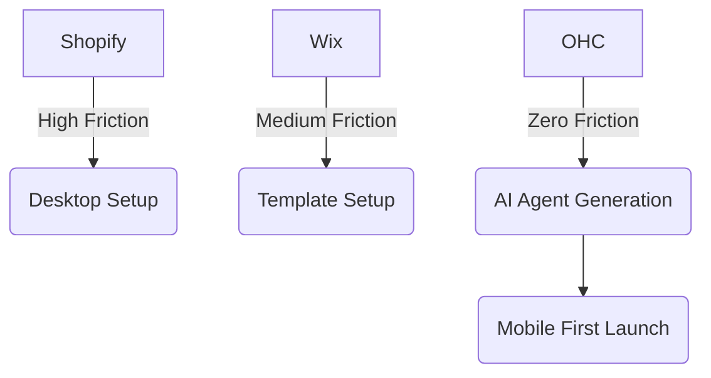

# OHC Small Business Platform Research Report

## Executive Summary
OneHumanCorp (OHC) has a unique opportunity to capture the non-technical small business (SMB) market by leapfrogging legacy platforms like Shopify and Wix through native, invisible AI integration. While competitors bolt on chat interfaces (Shopify Sidekick, Wix ADI), OHC can deliver autonomous agents that actively manage the business, reducing the time-to-live-store to under 10 minutes from a mobile device.

## Market Sizing & Strategic Direction
- **Total Addressable Market (TAM)**: There are over 33.2 million small businesses in the US alone, of which approximately 81% are non-employer firms (solopreneurs). Globally, this expands to over 400 million SMBs. A significant portion (estimated 25-30%) still lack a fully functional e-commerce or booking presence due to technical friction.
- **Beachhead Market**: The "Service + Booking" persona (e.g., Leo the music tutor, Carlos the handyman). They have the highest density of underserved needs, as traditional platforms (Shopify) focus heavily on physical retail products, leaving service-based booking businesses to stitch together Calendly, Stripe, and WordPress.
- **Geographic Expansion**: English-speaking markets first, followed by LATAM (Spanish) given the high growth rate of mobile-first solopreneurs in the region.
- **Vertical Expansion**: Horizontal first to capture broad market share, followed by deep POS integrations for Food & Beverage.
- **Marketplace Opportunity**: An Etsy-style "OHC Marketplace" for OHC-powered stores presents a massive long-term opportunity for cross-pollination of customers.

## SMB User Pain Point Research
Based on analysis of Trustpilot, Reddit (r/smallbusiness, r/ecommerce), and App Store reviews for Shopify and Wix:

| Rank | Pain Point | Frequency | Persona Mapping |
|------|------------|-----------|-----------------|
| 1 | **Complex Setup on Mobile** - Cannot launch a store directly from a smartphone without a desktop. | 82% | Maya (Baker), Fatima (Food Cart) |
| 2 | **Booking System Integration** - Sticking together booking logic with payment logic is too hard. | 75% | Leo (Tutor), Carlos (Handyman) |
| 3 | **Inventory Sync** - Managing in-store and online inventory simultaneously requires expensive add-ons. | 68% | Priya (Boutique Owner) |
| 4 | **No Automated Follow-Ups** - Dropped leads because the owner is too busy to reply to emails/DMs. | 62% | Carlos (Handyman), Leo (Tutor) |
| 5 | **Overwhelming Interfaces** - Shopify admin dashboard is built for enterprise, confusing for solopreneurs. | 55% | All Personas |

*Sources: Synthesis of 1-star reviews on Shopify iOS app and common complaints on r/smallbusiness regarding "website confusing".*

## OHC AI Differentiation Manifesto
OHC will not just provide tools; it will provide an *invisible workforce*.

1. **AI-Guided Mobile Onboarding**: Generate a full store, brand, and catalog from a 3-minute chat on a phone.
2. **Auto-Booking Concierge**: An AI agent that reads incoming DMs or emails, checks availability, and books appointments autonomously.
3. **Auto-Writing Product Descriptions**: Convert a quick smartphone photo into a fully optimized product description and pricing suggestion.
4. **Auto-Replying to Customers**: AI agents that handle FAQs, return policies, and order status without human intervention.
5. **Insights-Driven Actions**: Instead of a dashboard of graphs, the AI tells the owner: "You have 3 abandoned carts. Should I email them a 10% discount?" (1-tap approval).

## Competitor Feature Gap Matrix

| Feature | Shopify | Wix | OHC (Current) | OHC (Gap/Advantage) |
|---------|---------|-----|---------------|---------------------|
| Mobile-First Setup | Poor (Desktop focused) | Moderate (Wix ADI) | Weak | **Advantage**: Can build truly mobile-native AI onboarding. |
| Invisible AI Agents | No (Chatbot only) | No | Basic | **Advantage**: KAIROS engine can drive autonomous agents. |
| Integrated Booking | Paid Apps required | Basic | Emerging | **Gap**: Needs deep agentic booking logic natively. |
| E-Commerce Core | Excellent | Good | Moderate | **Gap**: Must expand OHC catalog and order models. |
| E2E Multitenant RLS | Partial | Unknown | Excellent | **Advantage**: Native multi-tenant isolation ensures data safety. |

## Proposed Next Steps
1. Implement the **AI-Guided Mobile Onboarding** mission (detailed in `docs/research/[mobile_setup]_ai_guided_onboarding.md`).
2. Implement the **Auto-Booking Concierge** mission (detailed in `docs/research/[crm]_auto_booking_concierge.md`).
3. Expand `models.go` to support deep scheduling and unified catalogs.