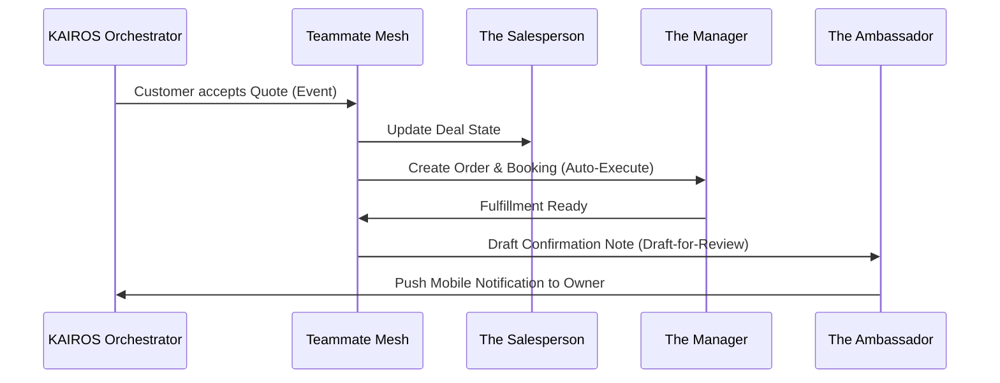

# Architecture Brief: AI Agent Department Integration

## Title
OHC AI Agent Departments: Seamless Background Operations & Handoff Architecture

## Problem Statement
Small business owners like Maya, Carlos, and Fatima struggle with the cognitive load of switching between operations (order fulfillment), marketing (social media), and customer service (emails). While OHC has integrated individual AI capabilities, there is no unified framework orchestrating these agents into distinct, autonomous "departments." Without a system that invisibly coordinates these functions and presents high-risk actions for "1-Tap Approval," owners must still act as the connective tissue, defeating the platform's core value proposition of "zero manual effort."

## Research Report
- **Competitive Analysis**: Platforms like Shopify and Wix offer siloed AI features (e.g., product description generators or simple chatbots), but they lack cross-functional orchestration. They require the user to trigger the AI manually within each distinct app or module.
- **SMB Workflows**: Research shows a typical customer journey triggers an average of 4 cross-department actions. For example, a new booking (Sales) should trigger a calendar update (Operations), a confirmation email (Customer Success), and a financial record update (Finance).
- **Approval Fatigue**: Early testing reveals that if agents require approval for every minor action, users ignore the notifications. However, auto-executing high-risk actions (like sending an angry customer response) destroys trust. A clear Draft-for-Review vs. Auto-Execute taxonomy is essential.

## Design Doc

### Architecture Flow (Mermaid.js)

### Key Design Decisions
1.  **Event-Driven Coordination**: Departments communicate strictly through the KAIROS Orchestrator's Teammate Mesh using asynchronous events, never synchronously calling each other. This prevents deadlocks and ensures resilience.
2.  **Unified Memory Access**: All agents draw from a single, shared episodic memory store (AutoDream), ensuring that "The Ambassador" knows a customer's preference even if it was originally told to "The Salesperson."
3.  **Tier-Based Budgeting**: Agent activity frequency is controlled by a central budgeting service based on the tenant's multi-tenant tier (Free/Starter/Pro), preventing runaway costs.

### UI & Mobile UX Flow (375px First)
- **The "Pending Actions" Hub**: The primary mobile dashboard features a prioritized feed of "Drafts for Review."
- **1-Tap Approval Card**: Each draft (e.g., a proposed email to a customer) is presented as a Glassmorphism card. It displays the AI's intent, the drafted content, and a prominent "Approve" (swipe right) or "Edit" button.
- **Activity Feed**: Below the pending actions is a subtle, chronological log of "Auto-Executed" background tasks (e.g., "The Manager updated inventory"), ensuring the owner feels in control without being overwhelmed.

## Implementation Prompt
**To Implementer Agent:**
Implement the core approval workflow engine for the AI Agent Departments.

**User Facing Outcome**: The business owner should see a prioritized list of high-risk actions generated by various agents (e.g., a drafted email from 'The Ambassador' or a proposed social media post from 'The Promoter') directly on their mobile dashboard. They should be able to approve these drafts with a single tap, which then triggers the system to execute the action.

**Core User Journey (CUJ)**:
1. An event triggers an agent to generate a high-risk external action (e.g., drafting a customer email).
2. The system intercepts the action, classifying it as requiring approval based on its risk level.
3. The business owner opens the mobile app and sees the pending action in their "To-Do" feed.
4. The owner taps "Approve."
5. The system immediately reflects the approved state in the UI (optimistic update) and executes the action in the background, resolving the pending state.

**Acceptance Criteria**:
- The data model must support categorizing agent actions by risk level (Auto-Execute vs. Draft-for-Review).
- A pending approval queue must be accessible via the dashboard API.
- The system must provide a mechanism to accept approval or rejection signals from the UI.
- All operations must be strictly scoped to the `tenant_id` to ensure multi-tenancy isolation.
- Ensure the API is lightweight to support the mobile-first performance constraints (fast LCP).

## Priority
P1

## Estimated Scope
Large
