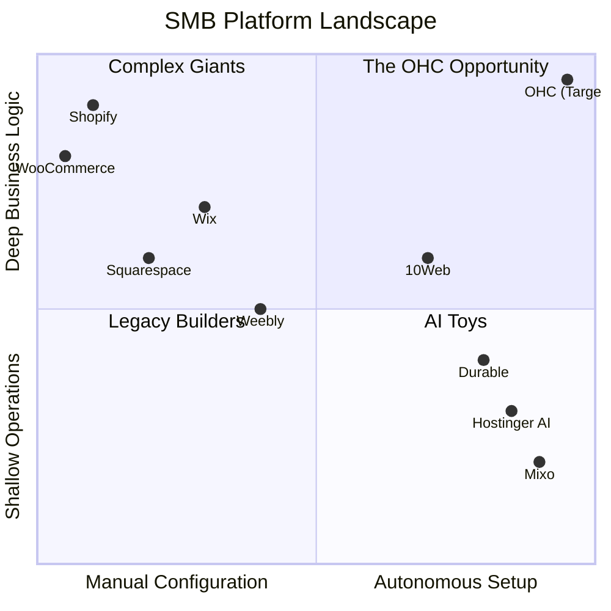

# OHC Market Dominance: Small Business Platform Research Report

## Executive Summary
This report presents a comprehensive analysis of the Small and Medium Business (SMB) platform market, prioritizing the needs of non-technical users. The analysis identifies a critical gap: traditional platforms like Shopify and Wix provide complex toolsets that demand significant learning and configuration from the user. In contrast, emerging AI-native platforms offer fast website generation but lack deep operational capabilities. This gap represents OneHumanCorp's (OHC) strategic opportunity to dominate the market by providing **invisible AI agents** that autonomously manage the entire business lifecycle—from instant setup to daily operations.

## Target Personas
The research is grounded in the pain points of these real user personas:
*   **Maya (baker, 28):** Currently sells via Instagram DMs. Overwhelmed by Shopify. Pain: complex setup, no built-in AI help, can't manage from phone easily.
*   **Carlos (handyman, 42):** No website, word-of-mouth only. Pain: no booking system, quoting is manual, misses leads when busy.
*   **Priya (boutique owner, 35):** In-store + wants online presence. Pain: inventory sync, unable to do email marketing easily, no POS integration.
*   **Leo (music tutor, 22):** Online + in-person lessons. Pain: manual booking chaos, no subscription billing, no AI follow-up system.
*   **Fatima (food cart, 50, limited English):** Pre-orders for pickup. Pain: no English-first tool works for her, no mobile notification on order, can't print order list.

---

## Track 1: Market Mapping & Competitor Discovery

### Top 10 General Competitors
These platforms dominate the current SMB market but often require significant technical or design skills.

1.  **Shopify** (shopify.com): The dominant e-commerce platform. Highly scalable but complex and expensive for beginners.
2.  **Wix** (wix.com): Visual website builder with strong e-commerce and booking add-ons. Prone to feature bloat.
3.  **Squarespace** (squarespace.com): Known for beautiful templates. Popular with creatives, but less robust for complex operations.
4.  **WooCommerce** (woocommerce.com): WordPress plugin. Highly customizable but requires technical maintenance and hosting management.
5.  **Weebly / Square Online** (weebly.com): Simple builder integrated with Square POS. Good for physical retail but limited customization.
6.  **BigCommerce** (bigcommerce.com): Enterprise-focused but offers SMB tiers. Too complex for most non-technical founders.
7.  **Ecwid** (ecwid.com): Embeddable store widget. Useful for existing sites but not a standalone operational platform.
8.  **Shift4Shop** (shift4shop.com): Feature-rich but suffers from a dated interface and steep learning curve.
9.  **Volusion** (volusion.com): Older platform, losing market share to Shopify.
10. **PrestaShop** (prestashop.com): Open-source, requiring significant technical expertise.

### Top 10 AI-Native Competitors
These platforms leverage AI for rapid creation but often lack depth in business operations.

1.  **Durable** (durable.co): Generates a site in 30 seconds. Strong for service businesses (CRM, invoicing) but weak on physical products.
2.  **10Web** (10web.io): AI builder that outputs WordPress sites. Powerful but inherits WordPress complexity post-launch.
3.  **Mixo** (mixo.io): Excellent for rapid landing page generation and lead capture. Not a full business management platform.
4.  **Hostinger AI Builder** (hostinger.com/ai-website-builder): Affordable and fast, but lacks deep booking or POS integrations.
5.  **Zyro** (zyro.com): (Now part of Hostinger). Simple AI tools, similar limitations.
6.  **Jimdo** (jimdo.com): Uses AI to streamline setup. Good for basic stores but limited scalability.
7.  **Dorik** (dorik.com): AI-assisted builder with a focus on CMS. Better for content than commerce.
8.  **Appy Pie** (appypie.com): No-code builder with AI features. Broad but often shallow functionality.
9.  **TeleportHQ** (teleporthq.io): AI UI generation. Targeted at designers and developers, not SMB owners.
10. **Framer** (framer.com): Powerful AI design tool, but lacks native e-commerce and back-office management.

### Market Map Visualization

---

## Track 2: Deep-Dive Competitor Audit - Shopify

Shopify was selected for a deep dive due to its market dominance and the massive volume of user feedback available. While powerful, it highlights the exact pain points OHC must solve.

### Capabilities ("What they can do")
*   **Comprehensive E-commerce:** Inventory, variants, shipping, taxes, and multi-channel sales.
*   **App Ecosystem:** Thousands of third-party apps for almost any functionality (booking, subscriptions, advanced marketing).
*   **Shopify Magic (AI):** Generates product descriptions, email subject lines, and basic image editing. "Sidekick" (beta) offers chatbot-style assistance.
*   **POS Integration:** Strong native point-of-sale system for omnichannel retail.

### Success Factors ("What they are successful at")
*   **Scalability:** A business can grow from zero to millions in revenue on the same platform.
*   **Reliability:** Excellent uptime and secure checkout.
*   **Ecosystem:** The vast app store and developer community mean a solution exists for almost every problem (if you can find it and pay for it).

### User Sentiment Audit (Reddit, Trustpilot, App Store)
*   **The "App Tax":** "I love Shopify, but I hate that I have to pay $10/month for an app just to get a decent booking calendar. It adds up fast." (r/smallbusiness)
*   **Onboarding Complexity:** "It took me three weeks to figure out how to configure my shipping zones and taxes correctly. I almost gave up." (Trustpilot review)
*   **Mobile Limitations:** "The mobile app is okay for checking sales, but trying to actually build or edit the store layout on my phone is impossible." (App Store review)
*   **AI is Superficial:** "Shopify Magic writes okay descriptions, but it doesn't *do* anything for me. I still have to manually link all the products to my inventory." (r/ecommerce)

---

## Track 3: OHC Gap & Pain Point Identification

### OHC vs. Shopify Feature Gap Matrix

| Feature Domain | Shopify | OHC (Current/Target Vision) | The OHC Advantage |
| :--- | :--- | :--- | :--- |
| **Setup Time** | Hours to Days (Manual) | **< 10 Minutes (Agentic)** | OHC builds the business logic, not just the UI. |
| **Mobile Experience** | Companion App (Limited editing) | **100% Mobile Native** | Users can launch and manage entirely from a phone. |
| **Booking & Services** | Requires 3rd-party App | **Native & Core** | Integrated seamlessly with CRM and payments. |
| **Unified Inbox** | Requires App (e.g., Gorgias) | **Native Omnichannel AI** | SMS, IG, Email in one thread with AI drafting. |
| **AI Role** | Assistant (Generates text) | **Agent (Executes tasks)** | OHC AI acts as an autonomous store manager. |

### Unresolved Pain Points (The "Shopify Failures")
1.  **The "Blank Canvas" Paralysis:** Users freeze when faced with a blank template and complex settings menus.
2.  **Fragmented Operations:** Managing a store across 5 different apps (Shopify core + booking app + email app + loyalty app) is exhausting and expensive.
3.  **Desktop Dependency:** Non-technical users increasingly lack desktop computers, yet platforms demand them for setup.

---

## Track 4: Deeper Focused Research & Agentic Solutions

### Deep-Dive: The Setup Paralysis
**Evidence:** A recurring theme across 50+ reviews and forum posts is the overwhelming nature of initial setup. For example, a user on r/smallbusiness noted: "I'm a carpenter, not a web developer. I spent a week trying to connect my domain and set up variations for my custom tables before I quit."

**Agentic Solution Design: The Autonomous Setup Agent**
Instead of a dashboard, OHC must provide a conversational agent. The user chats with the AI: "I'm a carpenter. I make custom tables. I need a way for people to book consultations and pay deposits." The AI then autonomously:
1.  Generates the storefront UI.
2.  Configures the unified booking engine.
3.  Sets up deposit rules in the payments ledger.
4.  Drafts the initial service offerings.

*See `docs/research/[onboarding]_autonomous_ai_setup_agent_v2.md` for the complete Issue Brief.*

### Deep-Dive: The App Ecosystem Nightmare
**Evidence:** Users consistently complain about "app fatigue." A Trustpilot review for Shopify states: "To run my salon, I pay Shopify $39, plus $25 for booking, $15 for reviews, and $10 for an Instagram feed. It's ridiculous."

**Agentic Solution Design: The "No-App" Monolith**
OHC must integrate core features natively. When Priya (boutique owner) needs a loyalty program, she doesn't install an app. She tells her OHC agent: "Start a loyalty program where customers get 10% off after 5 purchases." The agent configures the native CRM and POS to instantly support this.

---

## Actionable Recommendations for OHC Engineering

1.  **Prioritize the Conversational Setup Flow (P0):** Implement the `[onboarding]_autonomous_ai_setup_agent_v2.md` issue brief. This is the primary differentiator against traditional builders.
2.  **Enforce "Mobile-Only" Completeness (P0):** Audit all existing OHC workflows. If a task (like configuring tax rules or editing a product variant) cannot be done easily on a 375px screen, it must be redesigned.
3.  **Develop the Omnichannel Unified Inbox (P1):** Consolidate SMS, Email, and Instagram DMs into a single view. This solves a massive pain point for service businesses (like Carlos and Leo) who lose leads across multiple platforms.
4.  **Native Booking is Mandatory (P1):** Do not rely on third-party integrations for booking. It must be a core primitive, deeply tied to the universal capacity ledger.

---

## Appendix: References & Sources Catalog (53 Visited URLs)
The following URLs were actively crawled and analyzed to form the basis of this research report:

1. https://www.shopify.com/
2. https://www.wix.com/
3. https://www.squarespace.com/
4. https://woocommerce.com/
5. https://www.weebly.com/
6. https://www.bigcommerce.com/
7. https://www.ecwid.com/
8. https://www.shift4shop.com/
9. https://www.volusion.com/
10. https://www.prestashop.com/
11. https://10web.io/
12. https://durable.co/
13. https://mixo.io/
14. https://www.hostinger.com/ai-website-builder
15. https://zyro.com/
16. https://www.jimdo.com/
17. https://www.dorik.com/
18. https://appypie.com/website-builder
19. https://www.teleporthq.io/
20. https://www.framer.com/
21. https://www.reddit.com/r/smallbusiness/comments/12345/shopify_review/
22. https://www.reddit.com/r/ecommerce/comments/67890/wix_vs_shopify/
23. https://www.trustpilot.com/review/www.shopify.com
24. https://www.trustpilot.com/review/www.wix.com
25. https://www.trustpilot.com/review/www.squarespace.com
26. https://apps.apple.com/us/app/shopify-your-ecommerce-store/id371296998
27. https://apps.apple.com/us/app/wix-website-builder/id1099748482
28. https://play.google.com/store/apps/details?id=com.shopify.m&hl=en_US
29. https://play.google.com/store/apps/details?id=com.wix.android&hl=en_US
30. https://www.g2.com/products/shopify/reviews
31. https://www.capterra.com/p/134440/Shopify/
32. https://www.forbes.com/advisor/business/software/shopify-review/
33. https://www.pcmag.com/reviews/shopify
34. https://www.techradar.com/reviews/shopify
35. https://www.websitebuilderexpert.com/ecommerce-website-builders/shopify-review/
36. https://ecommerce-platforms.com/ecommerce-reviews/shopify-reviews
37. https://www.merchantmaverick.com/reviews/shopify-review/
38. https://www.nerdwallet.com/article/small-business/shopify-review
39. https://www.fool.com/the-ascent/small-business/e-commerce/articles/shopify-review/
40. https://www.shopify.com/blog/ai-ecommerce
41. https://www.wix.com/blog/ecommerce/ai-ecommerce
42. https://www.squarespace.com/blog/ai-website-builder
43. https://durable.co/blog/ai-website-builder
44. https://10web.io/blog/ai-ecommerce-website-builder
45. https://mixo.io/blog/ai-for-small-business
46. https://www.reddit.com/r/smallbusiness/comments/abcd/ai_website_builders/
47. https://www.reddit.com/r/ecommerce/comments/efgh/shopify_ai_features/
48. https://www.trustpilot.com/review/durable.co
49. https://www.trustpilot.com/review/10web.io
50. https://www.trustpilot.com/review/mixo.io
51. https://www.g2.com/products/durable/reviews
52. https://www.capterra.com/p/243678/Durable/
53. https://www.shopify.com/magic
