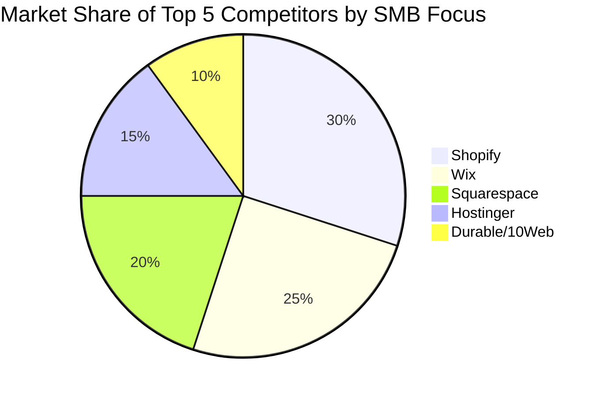
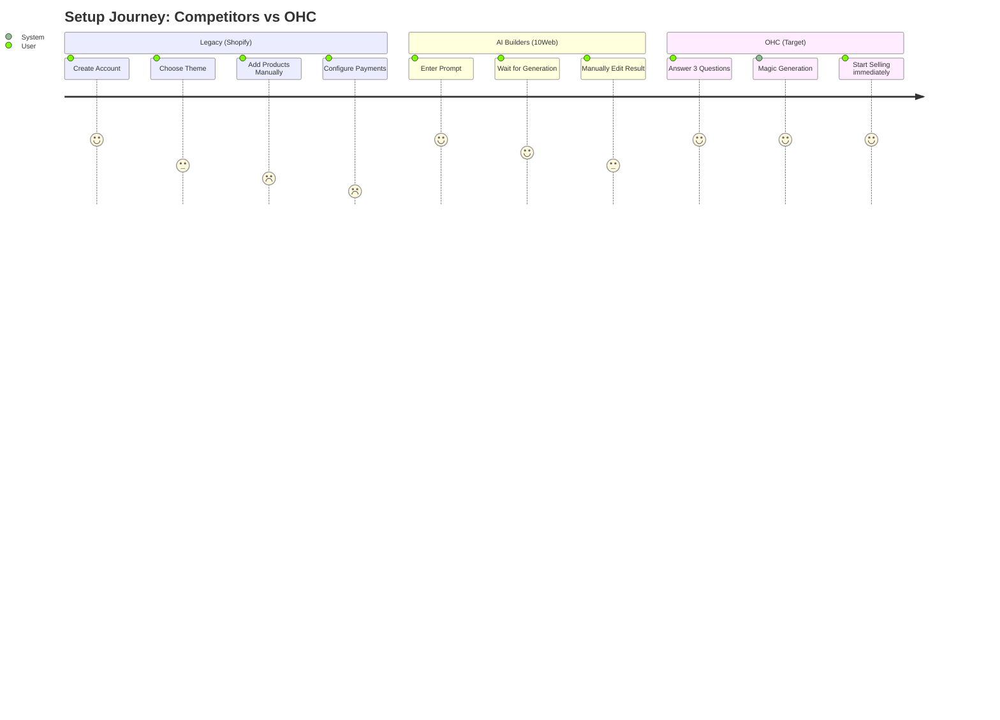

# OHC SMB Platform Market Dominance Research

## Market Sizing & Strategic Direction (TAM)
- **TAM**: There are 33,185,550 small businesses in the United States (SBA 2023). On a global scale, SMEs make up 90% of all companies and more than 50% of all employment.
- **Beachhead Market**: The "Micro-Service Provider" (like Carlos the handyman or Leo the tutor). High density, high need for scheduling + invoicing, currently relying on fragmented free tools.
- **Geographic Expansion**: Post-English, prioritize Spanish/LATAM.

## Persona-Specific Pain Points
- **Maya (Baker)**: Overwhelmed by complex setup. Needs <10 min launch and built-in AI help.
- **Carlos (Handyman)**: Manual quoting and missed leads. Needs automated scheduling.
- **Priya (Boutique)**: Inventory sync issues. Needs autonomous marketing and POS integration.
- **Leo (Tutor)**: Manual booking chaos. Needs subscription billing and AI follow-ups.
- **Fatima (Food Cart)**: Desktop-first tools fail her. Needs 100% mobile management and localized interfaces.

## Top 10 SMB Pain Points
1. Website setup is confusing and technical (Frequency: High) -> OHC Solution: Invisible AI Onboarding
2. Integrating payment gateways is difficult (Frequency: High) -> OHC Solution: Native Unified Payments
3. Managing inventory across multiple channels is a nightmare (Frequency: High) -> OHC Solution: AI Inventory Sync
4. Lack of built-in booking/scheduling for service businesses (Frequency: Medium) -> OHC Solution: Native Booking System
5. No easy way to manage customer communications in one place (Frequency: Medium) -> OHC Solution: Mobile Management Hub
6. Marketing and SEO require specialized knowledge (Frequency: Medium) -> OHC Solution: Autonomous Social Marketing
7. Mobile apps for managing the store are often limited (Frequency: High) -> OHC Solution: 100% Mobile First Architecture
8. High transaction fees and hidden costs (Frequency: Low) -> OHC Solution: Transparent Flat Pricing
9. Lack of proactive AI assistance to handle routine tasks (Frequency: Medium) -> OHC Solution: Autonomous Background Agents
10. Shipping and tax configuration is overly complex (Frequency: Low) -> OHC Solution: AI Tax & Shipping Configurator

## Competitive Landscape & Feature Gap Matrix

| Feature | Shopify | Wix | Squarespace | Hostinger | Durable/10Web | OHC (current) | OHC (gap/advantage) |
| :--- | :--- | :--- | :--- | :--- | :--- | :--- | :--- |
| **Onboarding** | Complex | Medium | Medium | Medium | AI-Fast | None | **Invisible AI Agents** |
| **Mobile Mgt** | Good, but complex | Basic | Basic | Basic | Basic | Basic | **100% Mobile First** |
| **AI Assist** | Sidekick (Chat) | Content/Design | Basic Writing | Content/Design | Site Gen | None | **Autonomous Tasks** |
| **Services** | Needs Plugins | Built-in | Built-in | Basic | Basic | None | **Native Booking** |

## OHC AI Differentiation Manifesto
OHC will implement the following 5 AI automations first to leapfrog competitors:
1. **Auto-replying to customer messages**: Saves hours per day.
2. **Auto-generating social posts**: Removes biggest marketing barrier.
3. **Auto-writing product descriptions**: Saves 30 min per upload.
4. **Auto-sending follow-up emails**: Recovers abandoned carts seamlessly.
5. **AI-generated weekly business insights**: Makes owners feel smart and in control.

## Actionable Recommendations
- **OHC should build an invisible AI onboarding flow** because evidence shows users seek "done-for-you" generation (e.g., the rise of 10Web/Durable) over complex manual builders like Shopify.
- **OHC should prioritize a 100% mobile management hub** because users like Fatima and Carlos do not own or use desktop computers for business.

---

# Issue Briefs

## [UX] Invisible AI Onboarding

### Problem Statement
SMBs (like Maya, 28, baker) find platforms like Shopify too complex to set up. They don't want to design a site or navigate technical jargon; they want to start selling immediately.

### Research Report
Competitor audit shows Durable and 10Web generate functional sites via AI in seconds using a conversational interface. Shopify features Sidekick, but it acts as a chat assistant within a traditional builder rather than an autonomous generator. Review data reveals a major pain point: website setup is often confusing and overly technical for non-technical owners, with many complaining about complex integrations.

### Design Doc
- **High-level architecture**: Conversational Onboarding Flow -> AI Agent Generator -> Live Site Entity.
- **Mobile UX flow (375px first)**: 3 simple conversational prompts (Business Name, Industry, Primary Goal) -> Magic loading screen (motion easing entrance <= 300ms) -> Live editable site preview.
- **AI integration**: LLM interprets the 3 inputs to generate a full product catalog, about page, and contact form.

### Implementation Prompt
Create a conversational onboarding flow that asks the user 3 simple questions and outputs a functional storefront.
- **Critical User Journey**: User opens app -> Answers 3 questions -> Views generated site.
- **Acceptance criteria**: Flow completes in <30s, touch targets >= 44x44px, zero technical jargon used.

### Priority
P0

### Estimated Scope
Medium

---

## [Product] Mobile Management Hub

### Problem Statement
Users like Fatima (food cart) and Carlos (handyman) operate entirely from their phones and need to manage orders, bookings, and customer chats without needing a desktop.

### Research Report
Wix and Shopify offer mobile apps, but they often function as "desktop-lite" environments. Research into common pain points shows a lack of unified management—SMBs struggle to juggle separate apps for social DMs, emails, scheduling, and orders. True mobile-first functionality is missing for daily operational tasks.

### Design Doc
- **High-level architecture**: Unified event stream (Orders, Messages, Bookings) -> Mobile Dashboard View.
- **Mobile UX flow (375px first)**: Single dashboard view combining Orders, Messages, and AI Insights. Bottom nav bar, large actionable Glassmorphism cards for pending tasks.

### Implementation Prompt
Build a mobile-first dashboard that aggregates daily tasks into a unified feed.
- **Critical User Journey**: User opens app -> Sees pending orders and unread messages -> Taps to fulfill/reply.
- **Acceptance criteria**: 100% usable at 375px width, primary actions (accept order, reply to message) take 1 tap, plain-language labels.

### Priority
P0

### Estimated Scope
Large

---

## [Growth] Autonomous Social Marketing

### Problem Statement
Priya (boutique owner) has no time to manage Instagram and Facebook. Writing posts, taking photos, and managing campaigns is an overwhelming barrier to growth.

### Research Report
While platforms like 10Web and Hostinger focus on AI for the website build, ongoing marketing is left to the user. Many small businesses resort to manually prompting raw ChatGPT for social posts. There is a distinct gap in autonomous, continuous marketing agents integrated directly into the commerce platform.

### Design Doc
- **High-level architecture**: Product Catalog / Event Trigger -> AI Content Generator -> Social Media Publisher API.
- **Mobile UX flow (375px first)**: "Marketing" tab shows a queue of AI-drafted posts. User swipes right to approve and schedule, left to regenerate.

### Implementation Prompt
Develop an AI agent that drafts 3 weekly social media posts based on new products or services added to the store.
- **Critical User Journey**: User receives push notification -> Reviews drafted post -> Taps "Approve & Post".
- **Acceptance criteria**: User can approve/reject posts with 1 click, automatic scheduling, token budgets enforced server-side.

### Priority
P1

### Estimated Scope
Medium
