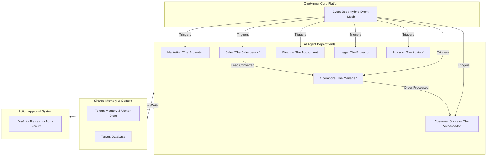

# 📏 Architect: AI Agent Department Architecture

## Title
AI Agent Department Architecture

## Problem Statement
Small business owners (like Maya the baker, Carlos the handyman, Priya the boutique owner, and Leo the music tutor) cannot afford to hire a full team (a manager, marketer, salesperson, customer support rep, accountant, legal advisor). However, running a successful business requires these roles to be fulfilled daily. When small business owners try to manage operations, marketing, sales, support, and finance simultaneously, they get overwhelmed, resulting in missed leads, late replies, and poor work-life balance. They don't want "AI agents"; they want an invisible team that handles the complexity of running a business in the background, working under friendly department names they understand, so they can focus on their craft.

## Research Report
The current small business software landscape (Shopify, Wix, Squarespace, GoDaddy) offers fragmented tools that require manual operation or complex third-party app integrations (Zapier, Klaviyo, Gorgias).
- **Shopify:** Requires installing 5-10 apps (e.g., email marketing, reviews, chat) that don't share context natively. AI features (like Shopify Magic) are mostly text generators, not autonomous agents operating in the background.
- **Wix/Squarespace:** Focused on the website builder. Business operations (booking, invoicing) are add-ons that require manual user action.
- **GoDaddy:** Basic tools that lack cross-functional intelligence.

No platform currently models software as a "company department." OHC's opportunity is to provide an invisible, out-of-the-box team of AI agents, categorized into familiar business departments, that proactively manage the business.

## Design Doc

### Architecture Diagram

### UI Wireframes & Mobile UX Flow (375px First)

**Screen 1: Home Dashboard (The Feed)**
- **Header:** Glassmorphism top bar with notification bell.
- **Body:** "Activity Feed" showing what the departments did today.
  - "Marketing posted an Instagram reel. (+22 views)"
  - "Operations automatically restocked 5 items."
  - "Customer Success replied to 3 missed DMs."
- **Floating Action Button (FAB):** "Chat with Team" to ask any department a question or give an instruction.

**Screen 2: Department Settings (e.g., Customer Success)**
- **Header:** "Customer Success (The Ambassador)"
- **Toggle:** "Auto-Execute" vs. "Draft for Review".
- **Tone Settings:** Slider from "Professional" to "Casual".
- **Recent Activity:** Log of recent replies and actions.
- **Budgeting/Limits:** Clear visual indicator of AI action usage this month.

**Mobile UX Flow:**
1. User receives a push notification: "Sales drafted a quote for Carlos. Review?"
2. User taps notification, opening the app.
3. User sees the drafted quote and a summary from the Sales agent.
4. User taps "Approve & Send" (large, 44x44px touch target).
5. The Sales agent sends the quote, and the Operations agent is notified to monitor for acceptance.

### AI Agent Integration Points
- **Operations:** Triggered on new orders, inventory changes, or booking events. Coordinates fulfillment and restocking.
- **Marketing:** Triggered on schedule (e.g., weekly) or on new product creation. Generates promotional content and SEO updates.
- **Sales:** Triggered on new leads (e.g., website contact form, social media DM). Generates quotes and follows up.
- **Customer Success:** Triggered on customer messages or order milestones (e.g., delivery). Sends updates and review requests.
- **Finance:** Triggered on payment events. Processes invoices and generates financial summaries.
- **Legal:** Triggered on new vendor relationships or product launches. Checks compliance and drafts disclaimers.
- **Advisory:** Triggered weekly. Analyzes data across all departments to provide health reports and recommendations.

### Key Design Decisions and Why
- **Familiar Naming:** Departments are named using business terms (Operations, Marketing) instead of technical terms (LLM Agents, Workers) to pass the grandmother test.
- **Centralized Memory:** All departments share context (Mem/DB) so the Sales agent knows what the Marketing agent promised.
- **Draft-for-Review Default:** To build trust, high-stakes actions (like sending a quote or refund) default to "Draft for Review" until the user explicitly enables "Auto-Execute".
- **Mobile-First Notifications:** The primary interaction model is push notifications for approvals and summaries, matching the on-the-go lifestyle of small business owners.

## Implementation Prompt
**Task:** Implement the core AI Agent Department framework.
**User-Facing Outcome:** The business owner should see a list of "Departments" in their app. Each department should be able to receive an event, process it, and either perform an action automatically or create a draft action for the user to review.
**CUJ:**
1. The business owner navigates to the "Team" or "Departments" tab.
2. They select the "Customer Success" department.
3. They change a setting to "Draft for Review" for customer replies.
4. An external event (e.g., a customer message) triggers the Customer Success agent.
5. The agent creates a draft reply and sends a notification to the business owner.
6. The business owner reviews the draft in the app and taps "Approve".
**Acceptance Criteria:**
- The system supports defining multiple distinct agent departments.
- Departments can subscribe to events and share tenant context.
- The approval system supports both "Auto-Execute" and "Draft for Review".
- The UI accurately reflects department activity and allows for reviewing/approving actions.
- Adheres to Mobile Parity and Visual Excellence mandates (Glassmorphism, touch targets).

## Priority
`P0`

## Estimated Scope
Large