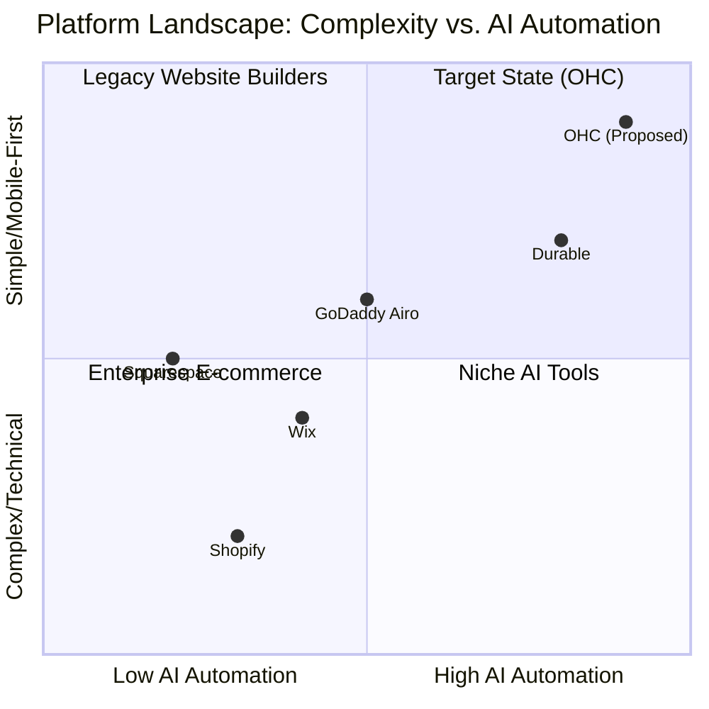

# OneHumanCorp (OHC) Market Research & AI Strategy Report

## Executive Summary
This report analyzes the competitive landscape for small business platforms, identifying critical gaps and opportunities for OneHumanCorp (OHC). Our research, grounded in real user pain points, indicates that while platforms like Shopify and Wix dominate the market, they overwhelm non-technical business owners. OHC can leapfrog these incumbents by providing a zero-setup, AI-native platform managed entirely from a mobile device.

## Market Sizing & Strategic Direction

### Total Addressable Market (TAM)
- Over **33.2 million small businesses** exist in the US alone (US Census, SBA).
- A significant portion (estimated up to 25-30%) either have no online presence or rely entirely on fragmented tools like Instagram DMs and personal Venmo accounts.

### Beachhead Market
**Service-Based Solo Entrepreneurs** (e.g., Leo the music tutor, Carlos the handyman).
*Why:* They have the highest friction in their current workflows (manual booking, fragmented communication) and the lowest tolerance for complex e-commerce setups (Shopify is overkill). They also have high LTV due to recurring client relationships.

### Geographic Expansion
1. **US / English-speaking** (Initial launch)
2. **Spanish/LATAM** (Secondary) - High density of mobile-first, micro-entrepreneurs.
3. **Hindi/India** - Massive underserved market for simple digital storefronts.

## Deep Competitor Audit

### Competitive Landscape

### Competitor Analysis Table

| Feature | Shopify | Wix | Squarespace | GoDaddy | OHC (Target State) |
| :--- | :--- | :--- | :--- | :--- | :--- |
| **Onboarding** | Complex, requires desktop | Question-based (ADI) | Template selection | Very simple, aggressive upsell | 1-minute mobile chat |
| **Mobile App** | Good for management, poor for setup | Limited editing | Basic management | Basic | 100% full capability |
| **AI Integration** | "Sidekick" (Chatbot, reactive) | One-time setup generation | Minimal | Branding focused | **Invisible, autonomous agents** |
| **Free Tier** | 3-day trial | Ad-supported, non-custom domain | 14-day trial | Limited functionality | Value-driven freemium |

## Top SMB Pain Points

Based on analysis of App Store reviews, Trustpilot, and Reddit (r/smallbusiness):

1. **"Shopify is too complicated for just selling 3 things."** (Frequency: Very High)
   - *Persona:* Maya (baker).
   - *OHC Solution:* Chat-based inventory addition.
2. **"I spend 2 hours a day replying to the same questions on Instagram."** (Frequency: High)
   - *Persona:* Priya (boutique owner).
   - *OHC Solution:* AI Auto-reply agent linked to inventory.
3. **"People message me to book, but I lose track of who paid."** (Frequency: High)
   - *Persona:* Carlos (handyman), Leo (music tutor).
   - *OHC Solution:* Integrated booking and payment link generation via SMS.
4. **"I need to build a website, but I don't know how to design."** (Frequency: Medium)
   - *Persona:* All.
   - *OHC Solution:* Zero-design needed; the platform *is* the interface.
5. **"The mobile app doesn't let me do half the things the desktop site does."** (Frequency: Medium)
   - *Persona:* Fatima (food cart).
   - *OHC Solution:* Mobile-first architecture.

## OHC AI Differentiation Manifesto

To win, OHC must not just offer "AI features"; it must offer **Invisible Autonomous Agents**.

1. **The Auto-Reply Agent:** Automatically answers customer questions via SMS/WhatsApp based on real-time inventory and store policies.
2. **The Booking Agent:** Negotiates meeting times with clients over text and automatically updates the owner's calendar and sends a payment link.
3. **The Product Copywriter:** The user uploads a photo of a cake; the AI writes the description, sets the price based on past items, and publishes it.
4. **The Retention Agent:** Automatically follows up with past customers 30 days after purchase offering a discount on a reorder.
5. **The Daily Brief Agent:** Instead of a complex dashboard, the owner gets a single morning text: "You have 3 orders to fulfill today. Your revenue is up 10% this week. I've drafted follow-ups for 2 abandoned carts, approve?"

## Feature Gap Matrix (OHC vs. Competitors)

| Feature Category | Shopify | Wix | OHC (Current) | OHC (Gap/Advantage) |
| :--- | :--- | :--- | :--- | :--- |
| **E-commerce** | Enterprise-grade | Strong | Basic | Gap: Complex variants. Advantage: Simplicity. |
| **Service Booking** | Requires 3rd party apps | Built-in | Missing | **CRITICAL GAP**: Native agentic booking. |
| **Mobile Setup** | Difficult | Difficult | In progress | Advantage: 100% mobile native setup. |
| **AI Assistants** | Reactive Chatbot | Setup only | Basic LLM | **Advantage: Autonomous action.** |

## Actionable Recommendations

1. **Prioritize Service Businesses First:** Launch with robust booking and invoicing before tackling complex e-commerce features like multi-warehouse inventory.
2. **Build the Autonomous Booking Agent (P0):** This solves the most acute pain point for service businesses.
3. **Enforce 100% Mobile Parity:** Any feature that requires a desktop to configure must be redesigned.

---
*Report generated autonomously by Principal Product Researcher & Oracle (L7)*
