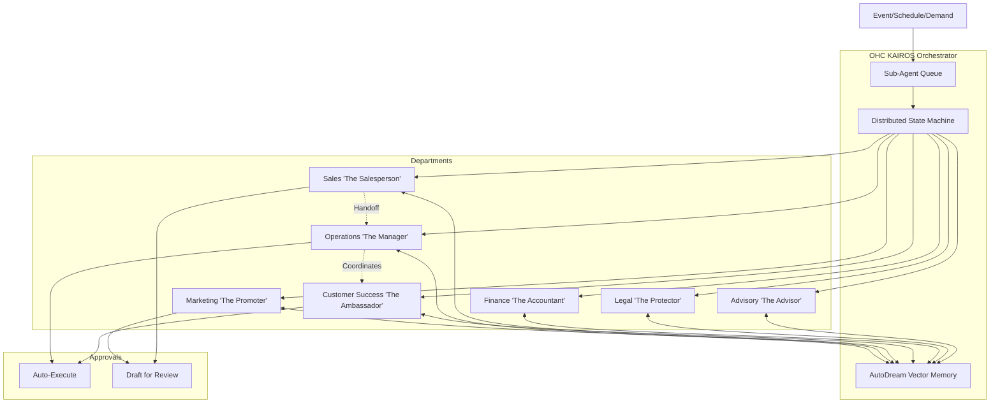

# [Architecture] AI Agent Department Architecture

## Title
AI Agent Department Architecture and Invisible Operations Design

## Problem Statement
Small business owners (like Maya the baker, Carlos the handyman, and Fatima the food cart operator) face significant operational overhead running their businesses. They need a system that invisibly handles their daily tasks without requiring them to become technical or learn complex software. They need an automated workforce organized in a way that matches a real business—departments like Operations, Marketing, and Customer Success—acting proactively, tracking state reliably, and respecting multi-tenant boundaries.

## Research Report
### Context
One Human Corp (OHC) aims to allow anyone to launch a business in under 10 minutes from their phone. While the basic multi-tenant API and standalone configurations exist, the underlying AI orchestrator (KAIROS) must be modeled as discrete, understandable "Departments" to ensure small business owners implicitly trust and comprehend what the AI is doing for them.

### Competitive Analysis
- **Shopify:** Relies on third-party apps for most automations. Highly fragmented and disjointed UX.
- **Wix/Squarespace:** Provides basic automations (e.g., "send email on form submit"), but lacks intelligent proactive agents that manage inventory, sales, and customer relations dynamically.
- **OHC Unfair Advantage:** Native AI Agent departments that coordinate automatically, driven by an invisible state machine and vector memory, mimicking an actual employee roster.

### Findings
- Business owners map responsibilities to roles: "The Manager", "The Promoter", "The Salesperson", "The Ambassador", "The Accountant", "The Protector", and "The Advisor".
- The orchestration layer must handle coordination between these agents without the owner micromanaging them.
- AI tasks need strict budgeting, throttling per tenant, and predictable execution boundaries (draft-for-review vs. auto-execute).

## Design Doc

### Architecture Diagram

### Key Design Decisions
1. **Department Isolation:** Each department is a specialized logical grouping of agents. They do not share execution state directly; they communicate via the Distributed State Machine and Sub-Agent Queue to prevent deadlocks.
2. **AutoDream Memory:** Agents retrieve context (e.g., past orders, customer preferences) from the AutoDream Pipeline's long-term vector embeddings.
3. **Execution Safety Boundaries:** Actions are split into "Auto-Execute" (e.g., fulfilling a digital order) and "Draft for Review" (e.g., creating a promotional post or drafting a custom quote). The owner retains final say for high-risk actions.
4. **Tenant Throttling:** The orchestrator enforces AI usage budgets at the tenant level. Once the monthly AI Action limit is reached, agents gracefully degrade to a "paused" state and notify the business owner with an upgrade prompt.

### UI & Mobile UX Flow (375px First)
1. **Dashboard Home:** The owner sees an "Active Roster" widget. Avatars of active agents (e.g., The Manager, The Promoter) show their current status ("Processing 3 orders...", "Drafting Friday Sale post").
2. **Draft Review Flow:**
   - Push notification: "The Promoter drafted a new Instagram post."
   - User taps -> opens a full-screen mobile view showing the image and caption.
   - Fixed bottom action bar: [Approve & Post] [Edit] [Reject].
3. **Budget & Throttling View:**
   - A subtle progress ring on the avatar indicates action budget.
   - Friendly soft-limit prompt: "The Salesperson has talked to 900 leads this month. Upgrade to Starter to unlock unlimited chats."

## Implementation Prompt
**To Implementer:**
Implement the logical routing layer for AI Agent Departments. The business owner should be able to view their AI workforce on the mobile dashboard. Create the database schemas and API endpoints needed to group existing agents into the 7 departments (Operations, Marketing, Sales, Customer Success, Finance, Legal, Advisory). Implement the "Draft for Review" vs "Auto-Execute" approval mechanism for agent actions. Ensure all actions are decremented from the tenant's AI action budget and gracefully pause the department with a friendly UI prompt if limits are exceeded. Use the Glassmorphism design tokens for the Agent Roster UI.

## Priority
P0

## Estimated Scope
Large
