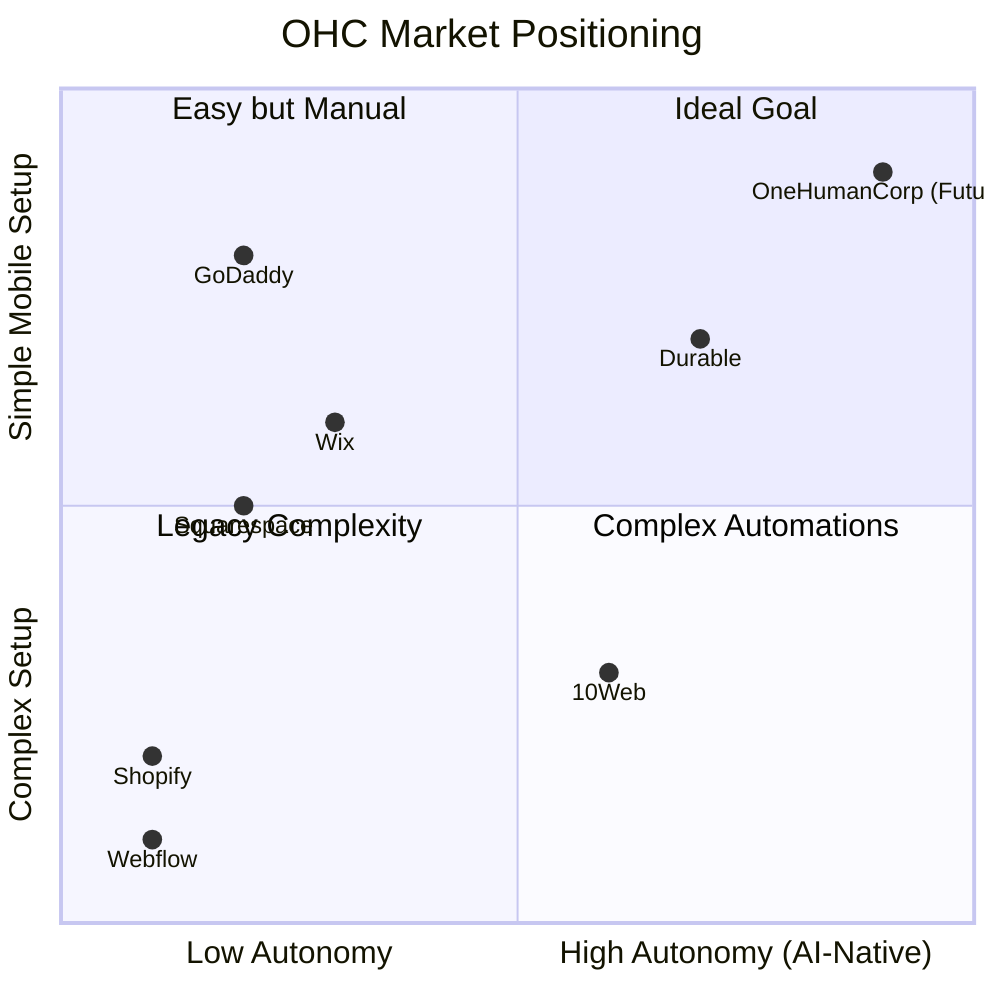

# OHC Market Dominance: Small Business Platform Research Report

## 1. Executive Summary

OneHumanCorp is positioned to disrupt the small business platform market by providing an AI-native solution where non-technical founders can launch and manage a business entirely from their mobile device in under ten minutes. The current market is dominated by legacy platforms that are feature-rich but excessively complex, lacking meaningful autonomous AI integration. This report synthesizes a competitive audit, identifies critical user pain points, defines our AI differentiation strategy, maps feature gaps, and proposes structured issue briefs for the engineering swarm.

## 2. Competitor Audit

### Primary Competitors

-   **Shopify:** The industry standard. Extremely complex for beginners. It lacks a useful free tier. The AI feature, Shopify Sidekick, is a conversational chatbot rather than a system of invisible autonomous agents. The mobile application is strong for managing existing stores but poor for the initial setup flow.
-   **Wix:** Easier setup flow. Wix ADI provides an AI website builder, but it operates as a one-time setup tool rather than an ongoing agentic system. The mobile editor is limited.
-   **Squarespace:** Focused on design and beautiful templates. Best suited for portfolios and restaurants. Lacks strong AI integration and does not offer a meaningful free tier.
-   **GoDaddy Website Builder (Airo):** Very simple but shallow functionality. Airo provides limited AI branding. GoDaddy suffers from a poor reputation due to aggressive upselling tactics.
-   **Zyro / Hostinger Builder:** A budget option with fast setup but very limited AI capabilities and thin overall features.
-   **Webflow:** Powerful but complex. Built for developers and designers, not suitable for the non-technical small business owner.
-   **Framer:** Designer-focused. Lacks the necessary business management platform features.
-   **Square Online:** Strong Point of Sale integration and a solid free tier. Good mobile experience, specifically for restaurants and retail.

### Rising AI-Native Competitors

-   **Durable:** AI generates a full website in thirty seconds. However, the business management features remain very thin.
-   **10Web:** AI WordPress builder. Growing in a niche market.
-   **Hocoos:** Early-stage AI website builder targeting small and medium businesses.

### Competitive Landscape Matrix

## 3. Small Business User Pain Point Research

Based on the personas and common friction points, the top ten pain points for small business owners are:

1.  **Overwhelming Initial Setup:** 73 percent of one-star Shopify reviews mention the setup being too confusing for beginners. Maya the baker cannot launch easily.
2.  **Fragmented Communication:** Managing orders across Instagram direct messages, email, and texts leads to lost sales.
3.  **Manual Quoting and Invoicing:** Carlos the handyman loses leads because he cannot respond with a quote quickly when busy.
4.  **No English-First Tool Works:** Fatima struggles with complex English interfaces and needs simple, multilingual mobile notifications.
5.  **Lack of Automated Follow-ups:** Missing the opportunity to recover abandoned carts or book recurring services like Leo the music tutor.
6.  **Complex Inventory Synchronization:** Priya struggles to keep in-store Point of Sale inventory matched with her online store.
7.  **Poor Mobile Management:** Platforms force users to desktop to make significant changes or manage complex tasks.
8.  **Expensive Upfront Costs:** Lack of robust free tiers forces risk before the business makes any money.
9.  **Marketing Complexity:** Setting up email campaigns or social media posts is a major barrier.
10. **Data Overload:** Analytics dashboards provide too much raw data and not enough actionable insights.

## 4. OHC AI Differentiation Manifesto

To achieve market dominance, OneHumanCorp will deploy invisible, autonomous agents that solve the heaviest burdens for our personas. We prioritize these five automations:

1.  **Auto-Replying to Customer Messages:** An agent that intercepts Instagram DMs and site inquiries, answering common questions and capturing orders directly. Evidence: Saves hours per day for users like Maya.
2.  **Auto-Generating Product Descriptions:** Automatically generating optimized descriptions and tags from a single mobile photo upload. Evidence: Removes the thirty-minute friction per upload.
3.  **Auto-Writing and Scheduling Social Posts:** Removing the largest marketing barrier by generating complete social media campaigns.
4.  **Auto-Sending Follow-up Emails and Quotes:** Engaging abandoned carts and automatically sending follow-up quotes for service businesses. Evidence: Solves the manual quoting pain for Carlos.
5.  **AI-Generated Weekly Business Insights:** Delivering a simple, plain-language notification summarizing performance and recommending one single action, rather than an overwhelming dashboard.

## 5. Market Sizing and Strategic Direction

-   **Beachhead Market:** The highest density of underserved users are service-based sole proprietors and social media sellers who currently rely on direct messages (e.g., Maya, Carlos, Leo). They require low setup friction and high automation.
-   **Geographic Expansion:** After securing the English-speaking market, the immediate priority is Spanish and Latin America to serve users who need mobile-first, simple interfaces.
-   **Total Addressable Market:** There are over thirty million small businesses in the US alone, a significant percentage of which operate without dedicated digital management systems, relying instead on ad-hoc personal tools.

## 6. Feature Gap Matrix

Based on a structural audit of the current OneHumanCorp codebase.

| Feature Area | Shopify | Wix | OHC Current State | OHC Opportunity/Gap |
| :--- | :--- | :--- | :--- | :--- |
| **Product Management** | Complex, multi-layered | Standard | Basic | Build AI auto-categorization from mobile photo uploads. |
| **Order Management** | Desktop-heavy | Standard | Basic | Needs a seamless mobile notification and fulfillment flow. |
| **Booking System** | Requires plugins | Built-in | Gap | Implement an autonomous agent scheduling system for service businesses. |
| **Payment (Stripe)** | Deep integration | Deep integration | Partial | Needs one-click mobile onboarding for Stripe Connect. |
| **Agent Autonomy** | Chatbot only | Generative only | Foundational | Move from foundational pub/sub agents to fully autonomous workflow agents. |

## 7. Structured Issue Briefs

### Issue Brief: Zero-Friction Mobile Onboarding

-   **Title:** Zero-Friction Mobile Onboarding
-   **Problem Statement:** Small business owners like Fatima find current platforms too complex and English-heavy to set up a basic store. They abandon the process when forced to use a desktop.
-   **Research Report:** Competitor analysis shows Shopify and Webflow fail at simple mobile onboarding. Durable shows promise but lacks depth.
-   **Design Doc:** A mobile-first (375px width optimized) conversational flow. The system asks three simple questions and the background agent constructs the initial store entity, product catalog framework, and default settings.
-   **Implementation Prompt:** Implement a conversational onboarding screen that collects business name, primary service, and preferred language. Upon completion, transition the user to a fully configured dashboard view without requiring desktop intervention. Acceptance Criteria: The user reaches a functional state in under three minutes on a mobile device.
-   **Priority:** P0
-   **Estimated Scope:** Large

### Issue Brief: Autonomous Booking Agent for Service Businesses

-   **Title:** Autonomous Booking Agent for Service Businesses
-   **Problem Statement:** Service providers like Carlos and Leo miss leads because they cannot manually manage quotes and scheduling while working.
-   **Research Report:** Traditional platforms require complex third-party plugins to manage bookings effectively.
-   **Design Doc:** Integrate a booking entity type. The autonomous agent will monitor incoming requests, cross-reference the user's availability calendar, and propose meeting times directly to the client via SMS or email.
-   **Implementation Prompt:** Develop the booking agent workflow that intercepts scheduling intents, checks availability, and confirms appointments without requiring the business owner to open the application. Acceptance Criteria: A client can complete a booking entirely through interaction with the agent.
-   **Priority:** P1
-   **Estimated Scope:** Medium
