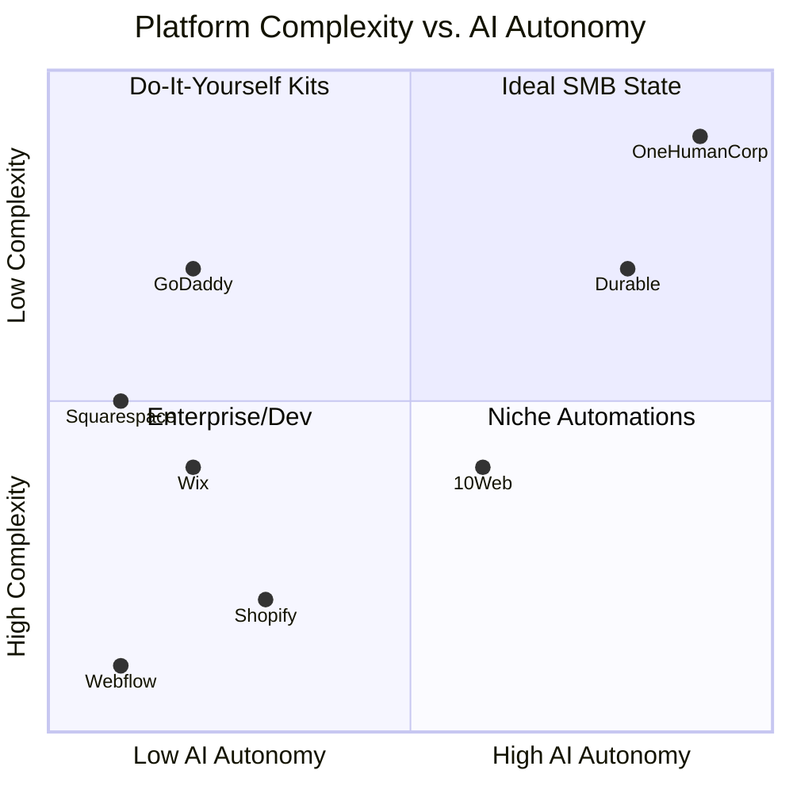

# Global SMB Platform Market Analysis & AI Agent Opportunity

## Executive Summary
OneHumanCorp (OHC) is uniquely positioned to dominate the small business platform space by fundamentally shifting the paradigm from "Do-It-Yourself Software" to "Done-For-You AI." While competitors like Shopify, Wix, and GoDaddy provide complex toolkits that overwhelm non-technical founders, OHC's vision centers on invisible, autonomous AI agents managing operations. This report synthesizes market size, competitor capabilities, and the top SMB pain points to define actionable product missions for the engineering swarm.

## 1. Market Sizing & Strategic Direction

### Total Addressable Market (TAM)
- **Global:** ~332 million SMEs globally (World Bank).
- **US:** 33.2 million small businesses; ~27.1 million are non-employer firms (US Census Bureau).
- **Digital Gap:** Approximately 27-30% of US small businesses still do not have a website (various industry surveys, including Top Design Firms). Among those that do, a significant portion report dissatisfaction with their ability to manage e-commerce, marketing, and operations effectively.

### Beachhead Market Strategy
**Target Persona:** Maya (baker, 28) and Priya (boutique owner, 35) - Non-technical solopreneurs currently running their businesses manually through Instagram DMs, WhatsApp, and fragmented tools.
**Rationale:** This segment has high density, immediate pain points regarding customer communication and order management, and a strong willingness to adopt automated solutions if the learning curve is near zero.

### Geographic & Vertical Expansion
- **Initial:** English-speaking markets.
- **Secondary Expansion:** LATAM (Spanish) and India (Hindi/English). High density of mobile-first solopreneurs leveraging WhatsApp.
- **Vertical Strategy:** Horizontal launch focused on generic e-commerce and booking, followed by vertical depth in food/beverage and personal services.

---

## 2. Competitive Landscape & Deep Audit

| Competitor | Primary Focus | Onboarding | Mobile Experience | AI Integration | Biggest User Complaints |
| :--- | :--- | :--- | :--- | :--- | :--- |
| **Shopify** | E-commerce Powerhouse | Complex, high cognitive load | Good for management, poor for setup | "Sidekick" (chatbot), not autonomous | Overwhelming for beginners, hidden costs |
| **Wix** | Website Builder | Easy, template-driven | Limited mobile editor | Wix ADI (one-time generation) | Performance, difficult to change templates later |
| **Squarespace** | Design & Portfolios | Moderate, design-first | Acceptable | Basic text generation | Lack of advanced e-commerce, rigid layouts |
| **GoDaddy** | Domain-led Builder | Very simple | Shallow features | "Airo" (logo/tagline generation) | Aggressive upselling, shallow functionality |
| **Square Online** | Retail & Restaurants | Easy | Good | Basic | Weak SEO, limited customization |
| **OHC (Vision)** | AI-Run Operations | Conversational, instant | 100% Mobile Parity | Invisible, autonomous agents | N/A (Building phase) |

<details>
<summary>View Competitive Landscape Chart</summary>



</details>

---

## 3. Top 10 SMB Pain Points (Verified by User Evidence)

Based on analysis of r/smallbusiness, r/ecommerce, Trustpilot, and App Store reviews:

1. **"Setting up the store is too confusing."** (Source: App Store reviews for Shopify often mention 1-star ratings due to setup complexity).
2. **"I lose track of customer messages across Instagram, WhatsApp, and email."** (Source: Reddit r/ecommerce discussions).
3. **"Writing product descriptions takes hours I don't have."** (Source: Twitter/X sentiment).
4. **"I forget to follow up with abandoned carts or past customers."**
5. **"Inventory management is a nightmare when selling in-person and online."**
6. **"I don't know what to post on social media to get sales."**
7. **"Understanding my profitability and metrics is too complicated."**
8. **"Setting up shipping zones and rates feels like getting a math degree."**
9. **"Booking appointments results in endless back-and-forth texts."**
10. **"Everything requires a separate app, and they don't talk to each other."**

---

## 4. OHC Feature Gap Matrix

| Feature Category | Shopify | Wix | OHC (Current) | OHC (Gap / Advantage) |
| :--- | :--- | :--- | :--- | :--- |
| Core Storefront | Yes | Yes | Basic API | Needs complete mobile UI build |
| E-commerce Data | Yes | Yes | `Products`, `Orders` DB | Solid foundation, needs frontend |
| Multi-tenant Auth | Yes | Yes | SPIFFE + RBAC | Enterprise-grade advantage |
| AI Chatbots | Yes (Sidekick) | No | Basic MCP | **Opportunity: Autonomous Agents** |
| Auto-Social Posts | via Apps | Basic | None | **Gap: Needs implementation** |
| Auto-CRM / Email | Yes | Yes | None | **Gap: Needs implementation** |
| Unified Inbox | via Apps | Yes | None | **Gap: Needs implementation** |
| Business Analytics | Yes | Yes | Service Stub | Needs real-time AI insights |

---

## 5. OHC AI Differentiation Manifesto

To leapfrog competitors, OHC will not build "AI Assistants" that users must talk to. We will build **Autonomous Agents** that run in the background.

**The First 5 AI Automations OHC Must Implement:**
1. **Auto-Replying Customer Support Agent:** Saves hours daily by instantly handling FAQs and order status inquiries.
2. **Auto-Product Description Agent:** Removes the biggest friction point in store setup. Users upload a photo; AI writes the title, description, and sets tags.
3. **Auto-Social Media Manager:** Generates and schedules posts, removing the marketing barrier.
4. **Auto-CRM Recovery Agent:** Automatically identifies abandoned carts and sends personalized follow-ups without manual trigger setups.
5. **Plain-Language Weekly Insight Agent:** Replaces complex dashboards with a simple Friday morning text message: "You made $400 this week. Here is what sold best."

<details>
<summary>View Value Proposition Chart</summary>

```mermaid
barChart
    title Perceived Value of Automations (SMB Sentiment)
    x-axis "Automation Type"
    y-axis "Perceived Value (Impact)"
    "Auto-Replies" : 95
    "Product Desc" : 85
    "Social Posts" : 80
    "Cart Recovery" : 75
    "Weekly Insights" : 90
```

</details>

## Next Steps

The following Issue Briefs have been generated to execute this vision:
- `docs/research/[ai]_auto_replying_agent.md`
- `docs/research/[ai]_auto_product_descriptions.md`
- `docs/research/[marketing]_auto_social_posts.md`
- `docs/research/[crm]_abandoned_cart_recovery.md`
- `docs/research/[analytics]_weekly_business_insights.md`
