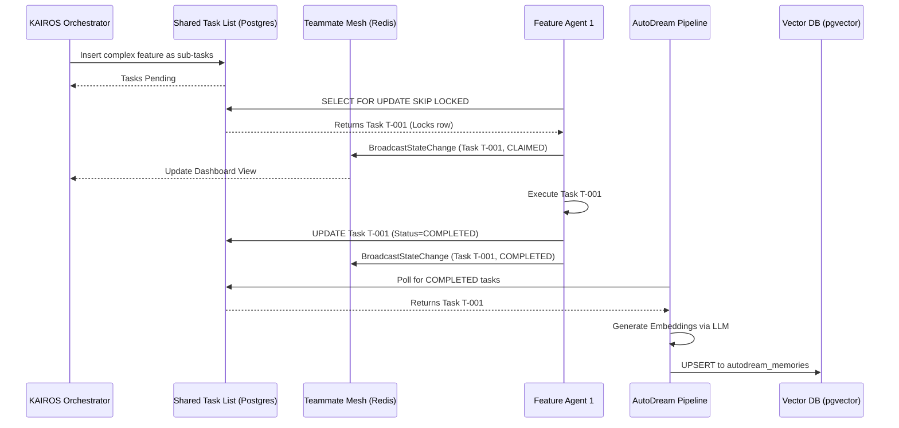

# KAIROS AI OS Orchestration (Phase 4): Master Design Doc

## 1. Introduction
This master design doc details the architecture and operational mechanics of the KAIROS Orchestration layer for the One Human Corp (OHC) AI Swarm. The OHC Hybrid OS relies on a triad of core systems—the Shared Task List, the Teammate Mesh, and the AutoDream Pipeline—to guarantee absolute autonomy and synchronization across scalable multi-tenant cloud environments and isolated standalone desktops.

## 2. Core Triad Architecture

### 2.1 The Shared Task List (The Brain)
To facilitate KAIROS task decomposition and UltraPlan deep-deliberation, the Swarm utilizes a centralized durable queue stored natively in the SQL database.

*   **Concurrency Model:** Relies on PostgreSQL's `SELECT ... FOR UPDATE SKIP LOCKED` for Cloud Mode, preventing worker collisions and race conditions. Gracefully falls back to atomic transactions in SQLite for Standalone Mode.
*   **State Machine Tracks:** Tasks transit through distinct lifecycle states (`PENDING`, `CLAIMED`, `IN_PROGRESS`, `BLOCKED`, `COMPLETED`), maintaining strong consistency under high load.
*   **Decomposition:** Parent tasks can span multiple sub-tasks. Task hierarchy is defined through a `parent_task_id` and explicitly managed lock states.

### 2.2 The Teammate Mesh (The Nerves)
A real-time, low-latency, and highly available internal communication mesh.

*   **Transport Layer:** WebSockets and gRPC, managed by the `CentrifugeNode` integration.
*   **Data Backbone:** `rueidis` for Redis Pub/Sub in multi-pod cloud deployments. Go native channels provide an in-memory equivalent for zero-dependency standalone execution.
*   **API Interactions:**
    *   `BroadcastStateChange`: Pushes lifecycle updates to all subscribed Swarm members.
    *   `AdvertiseCapabilities`: Dynamically registers new agents or available worker profiles upon scale-up.

### 2.3 AutoDream Memory Consolidation (The Memory)
The asynchronous persistence layer that translates short-term transactional actions into long-term semantic knowledge, mitigating swarm context limits.

*   **Pipeline:** Completed shared tasks trigger the AutoDream worker pool. Minimax LLMs compress the task's context and outcome into a dense embedding (1536 dimensions).
*   **Storage Medium:** Utilizes the `pgvector` extension in PostgreSQL for fast, scalable L2 distance (`<->`) searches. For SQLite, the embeddings serialize to JSON/Text, handled via brute-force in-memory cosine similarity search in the Go layer.
*   **Continuous Evolution:** Extracted insights and resolutions are surfaced to the `autodream_memories` table, allowing agents to pre-query historical resolutions for repeating error patterns.

## 3. Sequence Diagrams

### 3.1 Task Execution Cycle

## 4. Verification and Observability
*   **Telemetry:** All operations in the KAIROS Triad must expose OpenTelemetry histograms (e.g., `autoDreamSyncDuration`, `taskClaimLatency`) linked directly to the `otel.Meter` instance.
*   **SPIFFE Identity:** Agent-to-Agent Mesh communications must be authenticated via mutually validated SPIFFE certificates.

