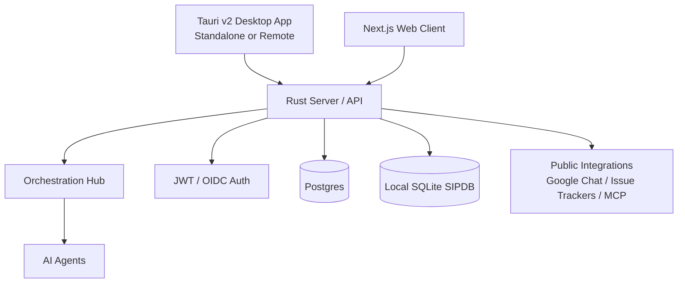

# One Human Corp

## Getting Started (Day One Onboarding)

To begin your onboarding journey, we provide a **unified Master CLI** that handles all developer setup, environment configuration, and agent provisioning in a single interactive experience.

From the root of the repository, you must explicitly run the onboarding CLI:

```bash
./deploy/scripts/ohc_hybrid_cli.sh
```

**What this does:**
- 🚀 Guides you through the **Developer Setup**
- ⚙️ Configures your **Environment Variables**
- 🩺 Runs deep system **Diagnostics**
- 🔄 Allows seamless switching between `cloud`, `standalone`, and `headless` modes

This premium onboarding flow eliminates friction and ensures maximum developer velocity for Day One setup.

## Identity

One Human Corp is a hybrid cloud-native and local-first agentic platform. The same product can run as a horizontally scalable multi-tenant cloud service, a headless API for remote mobile or desktop clients, or a standalone desktop deployment that runs its own local backend.

## Product Vision & Market Strategy

One Human Corp (OHC) is the world's first **Hybrid Agentic OS**. For a deep dive into our competitive advantages and "Unfair Advantage" against Claude Code and Replit Agent, see the **[OHC Market Strategy](docs/vision/market_strategy.md)**.

## Architecture

The platform supports four operating modes:

| Mode | Local footprint | Remote footprint | Notes |
|------|-----------------|------------------|-------|
| **Cloud-native shared service** | Tauri v2 desktop or web client | Rust API server, Postgres, agents, optional Redis and Chatwoot | Set `OHC_MULTITENANT=true`. Scale stateless API pods horizontally while Postgres remains the consistency boundary. |
| **Headless cloud API** | Tauri desktop client | API-only Rust server | Set `OHC_HEADLESS=true` when the backend should expose APIs, health probes, metrics, and auth without serving the web UI. |
| **Desktop standalone** | Tauri v2 desktop shell plus local Rust backend and SQLite-backed SIPDB | Optional public SaaS integrations only | Optimized for local resource usage; Redis and Chatwoot are not required for the standalone wrapper flow. |
| **Single-machine integration stack** | Full local Docker Compose stack | None | Useful for development, demos, and end-to-end verification on one machine. |



### Source layout

| Directory | Language | Purpose |
|-----------|----------|---------|
| `src/ui/next/` | **React/TypeScript** | Next.js 14 web client with 67 components |
| `src/ui/tauri/` | **Rust/JSON** | Tauri v2 desktop wrapper |
| `src/app/` | **Rust** | Backend agent client (formerly Slint UI, deprecated) |
| `src/server/` | **Rust** | API server, auth, dashboard handlers, integrations, billing, and runtime wiring |
| `src/agents/` | **Rust** | Built-in agent implementations |
| `src/proto/` | **Protobuf** | gRPC service definitions |
| `src/tests/` | **Python / Shell** | Repository-local validation helpers and test utilities |
| `src/e2e/` | **TypeScript** | Playwright E2E tests |
| `deploy/` | **YAML / Shell** | Docker Compose, Helm charts, and deployment helpers |
| `docs/` | **Markdown** | Architecture, roadmap, feature specs, and developer documentation |

### KAIROS Orchestration Documentation

The Swarm is powered by the KAIROS engine which maintains stability via three core pillars. For deep architectural dives into these systems, consult the feature documentation:
- **[Distributed State Machine](docs/features/kairos/distributed_state_machine.md):** Learn how agent transitions are rigorously tracked to prevent deadlocks.
- **[Sub-Agent Queue](docs/features/kairos/sub_agent_queue.md):** Learn how vast amounts of agent tasks are routed securely in the background.
- **[AutoDream Pipeline](docs/features/kairos/autodream_pipelines.md):** Learn how episodic memory is intelligently converted to long-term embedded vector truth.

### Remote clients and standalone mode

The Tauri v2 desktop app supports a configurable Backend URL and a standalone-mode toggle. In standalone mode the desktop app manages a local backend lifecycle. In remote-client mode the same app acts as a pure UI and talks to a cloud-hosted OHC server over the API.

Headless server deployments keep the API, auth, health probes, and metrics online while skipping static UI serving. That is the intended mode for mobile clients and desktop clients that should connect to cloud-hosted services instead of running a local backend.

### Multi-tenancy

In cloud-native mode (`OHC_MULTITENANT=true`) the `TenantRegistry` in
`src/server/dashboard/tenant.go` lazily provisions an organisation-scoped
`Server` per `organization_id` and routes authenticated requests to the correct
tenant handler. Dashboard snapshots, meetings, agent operations, approvals,
handoffs, and other server-local state are isolated per tenant handler, and the
HTTP layer filters org-visible data when shared persistence is used.

Shared-database persistence hardening is still ongoing, so the repo should not
yet claim perfect end-to-end schema-level tenant isolation for every future
query path. The runtime now supports the correct routing model and org-scoped
API surface for shared-service deployments.

New organisations are provisioned via:
```
POST /api/orgs/register   { "id": "acme", "name": "Acme Corp", "domain": "acme.com" }
```
After provisioning, users whose JWT includes `"organization_id": "acme"` are
routed exclusively to the Acme tenant.

## Quick Start

### Docker (single-machine deployment)

```bash
bazelisk run //:deploy_dev
```

Services:
| Service | Port | Description |
|---------|------|-------------|
| `server` | 8080 | Rust API server, auth endpoints, and optional embedded UI |
| `postgres` | 5432 | PostgreSQL |
| `redis` | 6379 | Redis |
| `prometheus` | 9090 | Metrics |
| `grafana` | 3000 | Dashboards |

When the backend starts with an empty workforce, it now bootstraps an **internal default agent** backed by the built-in provider so a single-container deployment has an immediately available agent runtime.

For API-only remote-client deployments, set `OHC_HEADLESS=true` on the server.

### Bazel (full build + test)

```bash
# Build & Test the full system
bazelisk build //...
bazelisk test //...

# Run E2E tests (requires Docker for postgres/redis)
bazelisk test //src/e2e:playwright

# Quick Local Dev (run these in separate terminals)
bazelisk run //src/server:server
bazelisk run //src/ui/tauri:app
```

### E2E Tests with Playwright

The `//src/e2e:playwright` target runs 56 Playwright E2E tests covering:
- Login, authentication, social auth
- Dashboard, navigation, UX flows
- Agents, chat, inbox, tasks
- Integrations, billing, settings
- Onboarding, meetings, referrals
- And 30+ more feature areas

Tests capture screenshots on every page to `test-results/screenshots/` and explicit `page.screenshot()` calls save to `test-results/*.png`.

### Tauri v2 Desktop App

```bash
bazelisk run //src/ui/tauri:app
```

The app connects to the server at `http://127.0.0.1:18789` by default.

### Web UI (Next.js)

```bash
cd src/ui/next && npm run dev
```

This starts the Next.js development server on `http://localhost:3000`.

### Server binary

```bash
bazelisk run //src/server:server
```

## Configuration

| Variable | Description |
|----------|-------------|
| `GEMINI_API_KEY` | Google Gemini API key |
| `ANTHROPIC_API_KEY` | Anthropic API key |
| `OPENAI_API_KEY` | OpenAI API key |
| `DATABASE_URL` | PostgreSQL DSN. When unset, the server falls back to in-memory repositories and local SQLite-backed SIPDB support |
| `OHC_MULTITENANT` | Set `true` for multi-tenant cloud-native mode |
| `OHC_HEADLESS` | Set `true` for API-only deployments that should not serve the web UI |
| `OHC_SERVE_UI` | Optional override to force UI serving on or off |
| `OHC_CORE_URL` | URL of the Rust `ohc-core` sidecar |
| `MCP_BUNDLE_DIR` | Directory for MCP bundles |
| `FRONTEND_STATIC_DIR` | Path to compiled frontend assets (e.g. `src/ui/next/out`) |
| `OHC_BOOTSTRAP_ORG_ID` | Optional bootstrap tenant ID used to serve unauthenticated routes in multi-tenant mode |
| `OHC_BOOTSTRAP_ORG_NAME` | Optional bootstrap tenant display name |
| `OHC_BOOTSTRAP_CEO_NAME` | Optional bootstrap tenant CEO name |
| `OHC_DEFAULT_AGENT_NAME` | Optional display name for the bootstrapped internal default agent |
| `OHC_DEFAULT_AGENT_ROLE` | Optional role for the bootstrapped internal default agent |
| `OHC_DEFAULT_AGENT_REGION` | Optional region/runtime label for the bootstrapped internal default agent (defaults to `docker`) |

Kubernetes secrets are used to inject credentials at runtime without committing them to source.

## Developer Workflow

### Setup and Mode Switching (Manual)

We provide helper scripts in `deploy/scripts/` to smooth the friction of developing against multiple hybrid targets. For day one setup, we recommend using the unified Master CLI (`./deploy/scripts/ohc_hybrid_cli.sh`) from the repository root instead.

- **Initial Setup:** `./deploy/scripts/ohc-setup.sh` (Generates `.env`, verifies builds, and provisions the workspace)
- **Mode Switching:** `source deploy/scripts/ohc-mode.sh [cloud|standalone|headless]` (Configures environment variables for the current terminal session)

### Build and Test

- **Build all modules:** `bazelisk build //...`
- **Run all tests:** `bazelisk test //...`
- **Run E2E tests:** `bazelisk test //src/e2e:playwright`
- **Run the server:** `bazelisk run //src/server:server`
- **Launch the Tauri app:** `bazelisk run //src/ui/tauri:app`
- **Build the Next.js UI:** `cd src/ui/next && npm run build`
- **Build the docs site:** `bazelisk run //:docs_build`

## Deprecated

### Slint UI (Deprecated)

The `src/app/slint_deprecated/` directory contains 72 legacy `.slint` files that were part of the old Slint-based UI. These files are no longer used - the UI has been migrated to Next.js + Tauri v2.

Historical Slint components included: dashboard, login, wizard flows, agents, chat, channels, integrations, security, meetings, logs, pricing, scaling, swarm memory, website builder, setup wizard, task list, help center, release notes, tutorials, and API docs.
