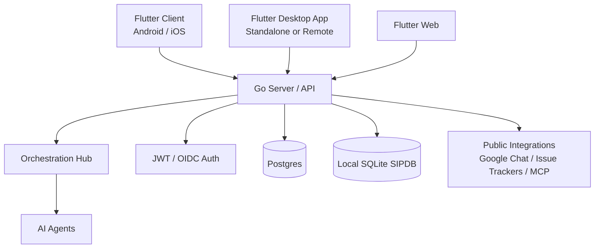

# One Human Corp

## Getting Started (Day One Onboarding)
To begin your onboarding journey and easily set up the platform in your desired mode, run the setup and mode helpers from the root of the repository:

```bash
./deploy/scripts/ohc-setup.sh
source deploy/scripts/ohc-mode.sh standalone
```

This initializes local configuration and lets you switch between `cloud`, `standalone`, and `headless` modes without an extra wrapper layer.

## Identity
One Human Corp is a hybrid cloud-native and local-first agentic platform. The same product can run as a horizontally scalable multi-tenant cloud service, a headless API for remote mobile or desktop clients, or a standalone desktop deployment that runs its own local backend.

## Product Vision & Market Strategy
One Human Corp (OHC) is the world's first **Hybrid Agentic OS**. For a deep dive into our competitive advantages and "Unfair Advantage" against Claude Code and Replit Agent, see the **[OHC Market Strategy](docs/vision/market_strategy.md)**.

## Architecture

The platform supports four operating modes:

| Mode | Local footprint | Remote footprint | Notes |
|------|-----------------|------------------|-------|
| **Cloud-native shared service** | Flutter mobile, desktop, or web client | Go API server, Postgres, agents, optional Redis and Chatwoot | Set `OHC_MULTITENANT=true`. Scale stateless API pods horizontally while Postgres remains the consistency boundary. |
| **Headless cloud API** | Flutter mobile or desktop client | API-only Go server | Set `OHC_HEADLESS=true` when the backend should expose APIs, health probes, metrics, and auth without serving the web UI. |
| **Desktop standalone** | Flutter desktop shell plus local Go backend and SQLite-backed SIPDB | Optional public SaaS integrations only | Optimized for local resource usage; Redis and Chatwoot are not required for the standalone wrapper flow. |
| **Single-machine integration stack** | Full local Docker Compose stack | None | Useful for development, demos, and end-to-end verification on one machine. |



### Source layout

| Directory | Language | Purpose |
|-----------|----------|---------|
| `srcs/app/` | **Flutter/Dart** | Primary client for web, iOS, Android, macOS, Windows, and Linux |
| `srcs/server/` | **Go** | API server, auth, dashboard handlers, integrations, billing, and runtime wiring |
| `srcs/server/lib/` | **Go** | Shared backend support libraries used by benchmarks, integrations, and resilience flows |
| `srcs/server/services/` | **Go** | Lightweight backend service packages kept alongside the server source tree |
| `srcs/server/orchestration/` | **Go** | Agent hub, meeting rooms, task delegation, realtime transport |
| `srcs/server/agents/` | **Go** | Agent provider registry, worker logic, and MCP bundles |
| `srcs/server/checkpointer/` | **Go** | LangGraph checkpoint persistence |
| `srcs/examples/` | **Go / YAML** | Example agent binaries and supporting assets |
| `srcs/benchmarks/` | **Go** | Performance benchmarks for coordination and messaging helpers |
| `srcs/proto/` | **Protobuf** | gRPC service definitions |
| `deploy/` | **YAML / Shell** | Docker Compose, Helm charts, and deployment helpers |
| `docs/` | **Markdown** | Architecture, roadmap, feature specs, and developer documentation |

### KAIROS Orchestration Documentation
The Swarm is powered by the KAIROS engine which maintains stability via three core pillars. For deep architectural dives into these systems, consult the feature documentation:
- **[Distributed State Machine](docs/features/kairos/state_machine.md):** Learn how agent transitions are rigorously tracked to prevent deadlocks.
- **[Sub-Agent Queue](docs/features/kairos/sub_agent_queue.md):** Learn how vast amounts of agent tasks are routed securely in the background.
- **[AutoDream Pipeline](docs/features/kairos/autodream_pipeline.md):** Learn how episodic memory is intelligently converted to long-term embedded vector truth.

### Remote clients and standalone mode

The Flutter app already supports a configurable Backend URL and a standalone-mode toggle. In standalone mode the desktop app manages a local backend lifecycle. In remote-client mode the same app acts as a pure UI and talks to a cloud-hosted OHC server over the API.

Headless server deployments keep the API, auth, health probes, and metrics online while skipping static UI serving. That is the intended mode for mobile clients and desktop clients that should connect to cloud-hosted services instead of running a local backend.

### Multi-tenancy

In cloud-native mode (`OHC_MULTITENANT=true`) the `TenantRegistry` in
`srcs/server/dashboard/tenant.go` lazily provisions an organisation-scoped
`Server` per `organization_id` and routes authenticated requests to the correct
tenant handler. Dashboard snapshots, meetings, agent operations, approvals,
handoffs, and other server-local state are isolated per tenant handler, and the
HTTP layer filters org-visible data when shared persistence is used.

Shared-database persistence hardening is still ongoing, so the repo should not
yet claim perfect end-to-end schema-level tenant isolation for every future
query path. The runtime now supports the correct routing model and org-scoped
API surface for shared-service deployments.

New organisations are provisioned via:
```
POST /api/orgs/register   { "id": "acme", "name": "Acme Corp", "domain": "acme.com" }
```
After provisioning, users whose JWT includes `"organization_id": "acme"` are
routed exclusively to the Acme tenant.

## Quick Start

### Docker (single-machine deployment)

```bash
cd deploy
docker compose up
```

Services:
| Service | Port | Description |
|---------|------|-------------|
| `server` | 8080 | Go API server, auth endpoints, and optional embedded UI |
| `postgres` | 5432 | PostgreSQL |
| `redis` | 6379 | Redis |
| `chatwoot` | 3002 | Chat platform |
| `prometheus` | 9090 | Metrics |
| `grafana` | 3000 | Dashboards |

When the backend starts with an empty workforce, it now bootstraps an **internal default agent** backed by the built-in provider so a single-container deployment has an immediately available agent runtime.

For API-only remote-client deployments, set `OHC_HEADLESS=true` on the server.

### Bazel (full build + test)

```bash
# Build & Test the full system
bazelisk build //...
bazelisk test //...

# Quick Local Dev (run these in separate terminals)
bazelisk run //srcs/server:ohc
bazelisk run //srcs/app:start

# Standalone desktop source launcher
bazelisk run //:desktop

# Linux desktop/runtime packages
bazelisk build //srcs/app:app_deb
# Requires rpmbuild on the host
bazelisk build //srcs/app:app_rpm
```

### Flutter app

```bash
cd srcs/app
flutter pub get
flutter run -d macos    # or -d windows / -d android / -d ios / -d chrome
```

### Server binary

```bash
bazelisk run //srcs/server:ohc
```

## Configuration

| Variable | Description |
|----------|-------------|
| `GEMINI_API_KEY` | Google Gemini API key |
| `ANTHROPIC_API_KEY` | Anthropic API key |
| `OPENAI_API_KEY` | OpenAI API key |
| `DATABASE_URL` | PostgreSQL DSN. When unset, the server falls back to in-memory repositories and local SQLite-backed SIPDB support |
| `OHC_MULTITENANT` | Set `true` for multi-tenant cloud-native mode |
| `OHC_HEADLESS` | Set `true` for API-only deployments that should not serve the web UI |
| `OHC_SERVE_UI` | Optional override to force UI serving on or off |
| `OHC_CORE_URL` | URL of the Rust `ohc-core` sidecar |
| `MCP_BUNDLE_DIR` | Directory for MCP bundles |
| `FRONTEND_STATIC_DIR` | Path to compiled frontend assets (e.g. `srcs/app/build/web`) |
| `OHC_BOOTSTRAP_ORG_ID` | Optional bootstrap tenant ID used to serve unauthenticated routes in multi-tenant mode |
| `OHC_BOOTSTRAP_ORG_NAME` | Optional bootstrap tenant display name |
| `OHC_BOOTSTRAP_CEO_NAME` | Optional bootstrap tenant CEO name |
| `OHC_DEFAULT_AGENT_NAME` | Optional display name for the bootstrapped internal default agent |
| `OHC_DEFAULT_AGENT_ROLE` | Optional role for the bootstrapped internal default agent |
| `OHC_DEFAULT_AGENT_REGION` | Optional region/runtime label for the bootstrapped internal default agent (defaults to `docker`) |

Kubernetes secrets are used to inject credentials at runtime without committing them to source.

## Developer Workflow

### Day One Setup (Recommended)
To simplify setup and environment management, use the maintained deploy scripts directly:

```bash
./deploy/scripts/ohc-setup.sh
source deploy/scripts/ohc-mode.sh standalone
```
These scripts generate local config, switch runtime modes, and keep setup logic in one place under `deploy/scripts/`.

### Setup and Mode Switching (Manual)
We provide helper scripts in `deploy/scripts/` to smooth the friction of developing against multiple hybrid targets:

- **Initial Setup:** `./deploy/scripts/ohc-setup.sh` (Generates `.env`, verifies builds, and provisions the workspace)
- **Mode Switching:** `source deploy/scripts/ohc-mode.sh [cloud|standalone|headless]` (Configures environment variables for the current terminal session)

### Build and Test
- **Build all modules:** `bazelisk build //...`
- **Run all tests:** `bazelisk test //...`
- **Run the Go backend:** `bazelisk run //srcs/server:ohc`
- **Serve the Bazel-built Flutter web app:** `bazelisk run //srcs/app:start`
- **Launch standalone desktop mode:** `bazelisk run //:desktop`
- **Build Linux package artifacts:** `bazelisk build //srcs/app:app_deb` and `bazelisk build //srcs/app:app_rpm` (`app_rpm` requires `rpmbuild` on the host)
- **Use mobile platform profiles:** `--config=android` and `--config=ios`
- **Format Go code:** `gofmt -w ./...`
- **Format frontend:** `cd srcs/app && flutter format .`
- **Analyze Flutter app:** `cd srcs/app && flutter analyze`
