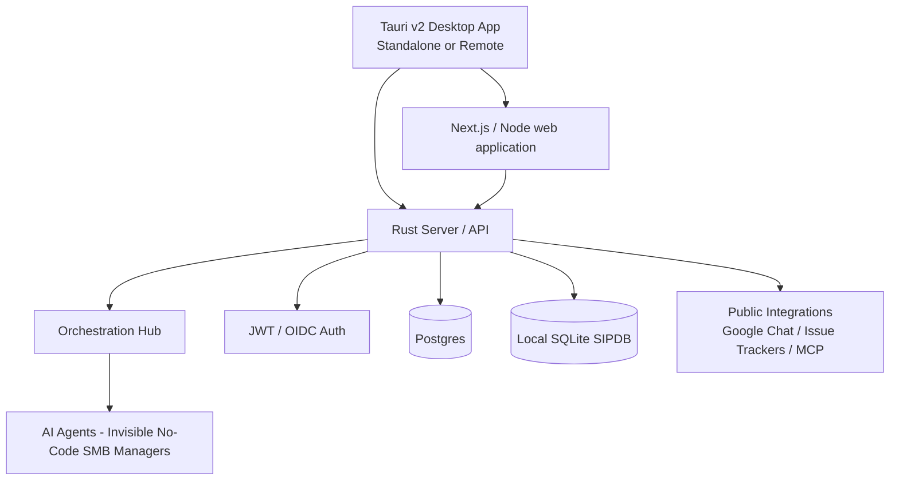

# OmniSolo OneHumanCorp

**OmniSolo** is our brand. **OmniSolo OneHumanCorp** is this business operations product.

> [!IMPORTANT]
> This repository is auto-maintained and developed with AI bots. No human is interacting with issues or pull requests in this repository. If you have a question, start a Discussion instead.

## Agent Harnesses

OmniSolo retains its first-party harness while exposing a session/task-based
middleware for Codex app-server v2, OpenCode, DeepSeek Harness, Pi, Kimi ACP,
OpenHands Agent Server, and AgentBoardTT OpenHarness. Portable session capsules,
canonical events, model bindings, and fenced worker leases allow a task to move
between harnesses without transferring credentials or process authority. Each
harness worker and model-runtime pool can scale independently in Docker Compose
or Kubernetes.

The public OpenAI-compatible worker contract is `OPENAI_API_KEY`,
`OPENAI_API_BASE_URL`, `OPENAI_MODEL`, and `OPENAI_REASONING_EFFORT`; the default
model and effort are `gpt-6-luna` and `max`. See the
[harness compatibility inventory](docs/omnisolo-harness-compatibility-inventory.md)
for native protocol and lifecycle support.

### Visual/Low-Code Orchestration

The harness provides a **Block-based Visual Workflow** engine (`visual_workflow.rs`) allowing no-code agent assembly.

- **Parallel Fan-out/Fan-in**: Use `ParallelFork` to run multiple execution branches concurrently, and `ParallelJoin` to merge the state values.
- **Client API endpoint**: Workflows can be submitted and run dynamically through the `/api/v1/workflow/run` endpoint using the Visual Workflow Client API (`visual_workflow_client.rs`).

## Developer setup

From a checkout, run as your normal user:

```bash
make init
make doctor
```

`make init` installs the pinned Rust/Node toolchains, native Tauri libraries, locked npm trees (including the test harness), isolated Python tooling and Playwright Chromium. Repeat runs reuse matching successful dependency installs. It asks before elevated system-package installation and does not change global toolchain defaults, shell profiles, account permissions or application secrets.

Start with Git, GNU Make and Python (3.11+ with venv support for the installed test environment), plus a local Docker installation with Compose and Buildx. On macOS, install Homebrew and Apple command-line tools first. Windows developers can use WSL2 for the full POSIX-based build/test environment; native Windows release prerequisites remain in the release guide. Missing prerequisites fail explicitly rather than reporting a partial setup as ready.

See [native development setup](docs/development/native-build.md) for noninteractive, preview and no-sudo modes. Application/deployment configuration through `deploy/scripts/omnisolo_hybrid_cli.sh` is separate from developer dependency setup.

### Native build system

The build uses **Cargo for Rust, npm for the Next.js application, and the Tauri CLI for desktop/mobile packaging**. Bazel is no longer a build or test dependency. Install the Rust toolchain in `rust-toolchain.toml` and Node version in `.node-version`, then follow [Native development and caching](docs/development/native-build.md).

```bash
make init
make lint
make test
```

`make test` runs the full Rust workspace, Node/frontend/CLI/desktop UI tests, contract checks and real-stack E2E after fresh builds. It requires native desktop dependencies, Docker and Playwright browsers; see the setup guide. `make lint` checks Rust formatting/Clippy, ESLint and TypeScript. `make test-backend` offers a focused headless lane. CI reuses dependency/compiler caches and passes built artifacts to consumers; a cache hit never substitutes for running tests.

## Identity

OmniSolo employs the **OmniSolo-HA Hybrid Architecture** for its identity and security framework, supporting identity verification across local and cloud deployments.

The platform implements a hybrid identity model:
- **Agent Identity**: Relies on SPIFFE/SPIRE for universal workload identity, ensuring every inter-agent communication and tool call is cryptographically signed and mTLS validated.
- **Human Identity**: Utilizes OIDC (OpenID Connect) for human users, mapping human authentication directly into the internal SPIFFE trust domain.

## Product Vision & Market Strategy

OmniSolo OneHumanCorp aims to be an **AI operations team for small business owners**, carrying supported work to verifiable results under delegated authority. The initial customer segment and commercial packaging remain under investigation; the previous exclusive digital-service segment and fixed subscription price are not settled decisions.

Read the current section of **[RESEARCH.md](RESEARCH.md)** and the **[capability and usage-economics audit](docs/research/business_capability_and_usage_economics_audit.md)** for implemented assets, observed gaps, owner evidence, current competitors, and compute/API/BYOK evaluation. They supersede conflicting earlier pricing, segment and roadmap assumptions. The hybrid runtime is an implementation foundation, not proof that a business workflow is ready.

## Architecture

The platform supports four operating modes:

| Mode | Local footprint | Remote footprint | Notes |
|------|-----------------|------------------|-------|
| **Cloud-native shared service** | Tauri v2 desktop client | Rust API server, Postgres, agents, optional Valkey and PowerSync | Set `OMNISOLO_MULTITENANT=true`. Scale stateless API pods horizontally while Postgres remains the consistency boundary. |
| **Headless cloud API** | Tauri desktop client | API-only Rust server | Set `OMNISOLO_HEADLESS=true` when the backend should expose APIs, health probes, metrics, and auth without serving the web UI. |
| **Desktop with local backend** | Tauri/Node client plus separately started Rust backend and SQLite-backed SIPDB | Optional explicitly configured integrations | Configure and validate local backend prerequisites; the desktop shell does not provision a missing backend. |
| **Single-machine integration stack** | Full local Docker Compose stack | None | Useful for development, demos, and end-to-end verification on one machine. |



### Source layout

| Directory | Language | Purpose |
|-----------|----------|---------|
| `src/ui/tauri/` | **Rust/HTML/JSON** | Tauri desktop/mobile shell; desktop owns its packaged loopback Node server |
| `src/ui/next/` | **React/TypeScript** | Maintained Next.js web UI and authenticated server routes, packaged from a fresh standalone build |
| `src/server/` | **Rust** | API server, auth, dashboard handlers, integrations, billing, and runtime wiring |
| `src/agents/` | **Rust** | Built-in agent implementations |
| `src/proto/` | **Protobuf** | gRPC service definitions |
| `src/e2e/` | **TypeScript** | Playwright E2E tests |
| `deploy/` | **YAML / Shell** | Docker Compose, Helm charts, and deployment helpers |
| `docs/` | **Markdown** | Architecture, roadmap, feature specs, and developer documentation |

### Swarm Orchestration Documentation

The Swarm is powered by our custom orchestration engine which maintains stability via three core pillars. For deep architectural dives into these systems, consult the feature documentation:
- **[Distributed State Machine](docs/features/kairos/distributed_state_machine.md):** Learn how agent transitions are rigorously tracked to prevent deadlocks.
- **[Sub-Agent Queue](docs/technical/architecture/kairos/sub-agent-queue-design.md):** Learn how agent tasks are routed securely in the background.
- **[AutoDream Pipeline](docs/features/kairos/autodream_pipelines.md):** Learn how episodic memory is intelligently converted to long-term embedded vector truth.

### Remote clients and standalone mode

The Tauri desktop shell owns the packaged Node web-server lifecycle and connects it to the Rust API at `BACKEND_URL` (default `http://127.0.0.1:18789`). Start/configure the Rust backend separately with native tooling or Compose. Remote backends require HTTPS; loopback development may use HTTP. Mobile packages connect to an explicitly configured HTTPS web deployment and do not try to run Node on a phone.

Headless server deployments keep the API, auth, health probes, and metrics online while skipping static UI serving. That is the intended mode for mobile clients and desktop clients that should connect to cloud-hosted services instead of running a local backend.

### Multi-tenancy

In cloud-native mode (`OMNISOLO_MULTITENANT=true`), tenant isolation is enforced in the
Rust server through authenticated `organization_id` claims, org-scoped service
methods, and shared-database query filtering. The active server entrypoint is
`src/server/lib.rs`, with Axum HTTP routes, tonic gRPC services, and service
modules under `src/server/services/`.

Shared-database persistence hardening is still ongoing, so the repo should not
yet claim perfect end-to-end schema-level tenant isolation for every future
query path. The runtime supports org-scoped authentication, dashboard, billing,
onboarding, orchestration, and growth surfaces for shared-service deployments.

## Quick Start

### Docker (single-machine deployment)

Because we use local images built from source instead of pulling from Docker Hub, you must first build and load the required images locally into your Docker daemon before starting the stack:

1.  Build and load the local images into your Docker daemon:
    ```bash
    bash deploy/load_all_images.sh
    ```
    This uses native multi-stage Docker builds and local image tags. Base images still need to be available locally or pulled from their registry; building locally does not bypass registry authentication or rate limits.

2.  Use Docker Compose to launch the stack with the locally built images:
    ```bash
    ./deploy/scripts/prepare-compose-env.sh
    docker compose --env-file .omnisolo-compose/compose.env \
      -f deploy/docker-compose.yml \
      -f deploy/docker-compose.override.yml \
      up -d
    ```

The image loader only builds/loads local images; starting the configured Compose stack is a separate explicit operation.

> **Note:** Keep registry credentials outside the repository and authenticate or supply cached base images when required. Include the override file when using local image tags:
> ```bash
> ./deploy/scripts/prepare-compose-env.sh
> docker compose --env-file .omnisolo-compose/compose.env -f deploy/docker-compose.yml -f deploy/docker-compose.override.yml up -d
> ```

Services:
| Service | Port | Description |
|---------|------|-------------|
| `server` | 8080 | Rust API server, auth endpoints, and optional embedded UI |
| `postgres` | 5432 (loopback only) | PostgreSQL |
| `valkey` | 6379 (loopback only) | Valkey cache |
| `prometheus` | 9090 | Metrics |
| `grafana` | 3000 | Dashboards |

When the backend starts with an empty workforce, it now bootstraps an **internal default agent** backed by the built-in provider so a single-container deployment has an immediately available agent runtime.

For API-only remote-client deployments, set `OMNISOLO_HEADLESS=true` on the server.

### Native Rust and web checks

```bash
# Fast, focused checks; the Tauri package is deliberately separate.
cargo test --locked -p server_services_billing
cargo test --locked -p server_harness
cargo test --locked -p server_pricing

# Headless regression suite and web checks.
cargo test --locked --workspace --exclude app
npm run test:contracts
npm run typecheck:web
npm run test:web
npm run build:web

# Development (separate terminals, with the backend environment configured).
cargo run --locked -p omnisolo --bin server
npm run dev:web
npm run desktop:dev
```

### E2E Tests with Playwright

The native Playwright runner builds on the actual Rust binaries, freshly packaged Next application, and isolated PostgreSQL/Valkey containers. CI partitions the complete discovered browser suite into four shards; it does not replace it with a smoke-test allowlist. See `playwright.config.ts` and `scripts/native-e2e.mjs` for the current discovery and environment contract.

E2E tests follow a strict no-substitution contract:
- Test data is seeded only through the database, using `src/e2e/e2e-seed.sql`.
- The Playwright global setup in `src/e2e/global-setup.ts` waits for the real app, seeds Postgres, and signs in through the visible login UI.
- Every browser spec imports `src/e2e/fixtures.ts`, which logs in as the seeded admin user before each test.
- A seeded regular team member is also available through the `memberPage` fixture, so role-sensitive tests can verify the real member experience.
- Playwright network substitution is blocked in the shared fixture. Tests should exercise product UI and backend behavior, not intercepted API responses.

Seeded E2E users:

| Role | Email / username | Password |
|------|------------------|----------|
| Admin | `test@example.com` | `password123` |
| Team member | `member@example.com` | `MemberPass123!` |

Build the real native inputs and run the isolated suite:

```bash
cargo build --locked -p omnisolo -p omnisolo_builtin_agent -p omnisolo_harness_worker --bins
npm run build:web
npx --no-install playwright install chromium
npm run test:e2e
# Focus one test without changing complete CI discovery:
npm run test:e2e -- src/e2e/native_business_regression.spec.ts --workers=1
```

The runner does not inherit production database or provider credentials. External integrations use explicit provider-boundary contract tests or clearly reported unavailable states. Live model/provider evaluations require a separately authorized environment and are not implicitly enabled by `npm run test:e2e`. A model judge or a visible heading is not proof of payment, persistence or business completion.

Tests capture screenshots on every page to `test-results/screenshots/` and explicit `page.screenshot()` calls save to `test-results/*.png`.

### Tauri desktop, mobile and server builds

```bash
npm run desktop:build -- --debug --no-bundle
npm run build:server
npm run build:worker
```

Desktop release installers require the platform's native dependencies and signing configuration. Android/iOS builds require their SDKs and an explicit `OMNISOLO_MOBILE_WEB_URL`; see the native-build guide. These commands build artifacts—they do not publish or deploy them.

## Configuration

| Variable | Description |
|----------|-------------|
| `GEMINI_API_KEY` | Google Gemini API key |
| `MINIMAX_API_KEY` | MiniMax API key for explicitly configured agent/evaluation runs; never inherited by the isolated native E2E runner |
| `ANTHROPIC_API_KEY` | Anthropic API key |
| `OPENAI_API_KEY` | OpenAI API key |
| `OMNISOLO_LLM_PROVIDER` | Builtin agent provider: `openai`, `openai-compatible`, `minimax`, `anthropic`, or `ollama` |
| `OMNISOLO_LLM_MODEL` | Builtin agent model name. Defaults are provider-specific when unset |
| `OMNISOLO_LLM_API_KEY` | Generic API key for `openai-compatible` providers, or fallback key for OpenAI/MiniMax |
| `OMNISOLO_LLM_BASE_URL` | Generic OpenAI-compatible API root such as `https://api.example.com/v1`; endpoint URLs ending in `/chat/completions` are normalized |
| `OPENAI_BASE_URL` | Optional OpenAI-compatible API root for `OMNISOLO_LLM_PROVIDER=openai` |
| `MINIMAX_BASE_URL` | Optional MiniMax-compatible API root; defaults to `https://api.minimax.chat/v1` |
| `DATABASE_URL` | PostgreSQL DSN by default. Use a `sqlite://...` URL plus `OMNISOLO_SQLITE_KEY` for standalone SQLite-backed state |
| `OMNISOLO_PORT` | HTTP/Axum port. Defaults to `18789` in the Rust server; Docker Compose maps the packaged server on `8080` |
| `OMNISOLO_GRPC_PORT` | gRPC/tonic port. Defaults to `8081` |
| `OMNISOLO_STANDALONE_MODE` | Set `true` to force standalone mode and SQLite enforcement |
| `OMNISOLO_SQLITE_KEY` | Required when using standalone SQLite-backed state |
| `OMNISOLO_MULTITENANT` | Set `true` for multi-tenant cloud-native mode |
| `OMNISOLO_HEADLESS` | Set `true` for API-only/headless integration behavior |
| `OMNISOLO_CORE_URL` | URL of the Rust `omnisolo-core` sidecar |
| `MCP_BUNDLE_DIR` | Directory for MCP bundles |
| `OMNISOLO_BOOTSTRAP_ORG_ID` | Optional bootstrap tenant ID used to serve unauthenticated routes in multi-tenant mode |
| `OMNISOLO_BOOTSTRAP_ORG_NAME` | Optional bootstrap tenant display name |
| `OMNISOLO_BOOTSTRAP_CEO_NAME` | Optional bootstrap tenant CEO name |
| `OMNISOLO_DEFAULT_AGENT_NAME` | Optional display name for the bootstrapped internal default agent |
| `OMNISOLO_DEFAULT_AGENT_ROLE` | Optional role for the bootstrapped internal default agent |
| `OMNISOLO_DEFAULT_AGENT_REGION` | Optional region/runtime label for the bootstrapped internal default agent (defaults to `docker`) |
| `OMNISOLO_DEFAULT_TENANT_ID` | Default tenant used by local E2E login when the browser form does not submit an explicit organization ID; defaults to `e2e-tenant` in the test harness |
| `OMNISOLO_CONNECTION_KEYS` / `OMNISOLO_CONNECTION_ACTIVE_KEY` | Runtime keyring and active key ID for encrypted, tenant-scoped provider connections; provision securely outside source control |

Tauri packages a fresh Next standalone server from `target/native-web` plus a pinned, checksum-verified Node executable. The source/platform/architecture/Node/dependency manifest rejects stale or foreign build output. Historical `next_out`/`out` exports are not used as a fallback.

Kubernetes secrets are used to inject credentials at runtime without committing them to source.

## Developer Workflow

### Setup and Mode Switching (Manual)

We provide helper scripts in `deploy/scripts/` to smooth the friction of developing against multiple hybrid targets. For day one setup, we recommend using the unified Master CLI (`./deploy/scripts/omnisolo_hybrid_cli.sh`) from the repository root instead.

- **Initial Setup:** `./deploy/scripts/omnisolo-setup.sh` (Generates `.env`, verifies builds, and provisions the workspace)
- **Mode Switching:** `source deploy/scripts/omnisolo-mode.sh [cloud|standalone|headless]` (Configures environment variables for the current terminal session)

### Build and test references

[Native development and caching](docs/development/native-build.md) documents focused and complete test commands, cache boundaries, resource limits and release prerequisites. [Migration and remediation ledger](docs/research/native_migration_and_remediation.md) records implemented fixes, actual test evidence and remaining external validation. Historical documents may refer to deleted Bazel targets; they are not active build instructions.

## Deprecated

Bazel build files and wrappers have been removed. Do not restore the old Bazel toolchain or substitute tracked HTML exports for fresh UI builds. The old Slint/Flutter UI is also removed; the maintained UI is Next.js inside the Tauri shell or a Node web deployment.
