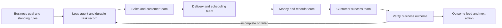

# Current research direction — evidence before a new plan

**Revision: 2026-09-18-usage-audit.** This section supersedes the earlier strategy draft retained below and conflicting role-prompt assumptions.

The user has asked us to evaluate charging for **compute and AI API usage**, plus **customer BYOK or provider-permitted native subscription access**, and to understand existing code and real owner needs before committing to another plan.

**Read the [capability, owner-needs and usage-economics audit](docs/research/business_capability_and_usage_economics_audit.md) first.** It contains source paths, route/caller evidence, concrete gaps, public owner stories, current ChatGPT/Gemini/Claude capabilities, provider access boundaries and cost-accounting prerequisites.

## Native-build evidence — 2026-09-19

The [measured cleanup record](docs/research/native_build_measurements_2026-09-19.md) documents the current Cargo/Tauri/Node implementation, substantive safety/test fixes and exact cache conditions. A Linux backend build from empty compiler outputs completed in **8m 33.94s** with downloaded dependencies already available; an unchanged rerun took **1.87s**. A fresh Node proxy build took **31.40s** without stderr warnings. The **10-minute core compilation goal** is distinct from the **30-minute full required-CI target**, which is not yet demonstrated: strict repository-wide lint and full execution/release gates remain outstanding. These engineering measurements are not customer validation, measured serving economics, or permission to enable billing.

## Decisions that remain open

The earlier **$99 subscription, 300-step allowance, $299 setup, fixed cohort/margin targets and exclusive web/design/marketing segment are suspended hypotheses**, not accepted requirements. Do not turn them into billing settings, launch claims or automatically dispatched features. Public owner stories do not establish willingness to pay or a statistically dominant customer segment. Existing OHC-01–12 IDs remain useful references, not permission to implement their former scopes.

The durable goal remains an AI team that handles useful business work with owner authority and verifiable outcomes. Current evidence suggests investigating cash collection, connected operating data, manageable recurring administration and correct business context across more than one business type. These are hypotheses to test against real workflows and existing AI products, not a new broad-platform mandate.

## What the code audit changed

There are substantial reusable onboarding, proposal, calendar, payment, commerce, fulfillment, approval and provider-runtime components. Important gaps are in integration readiness and correctness, not just absent feature categories. Source findings include a usage-event feedback path (`hub.rs` and billing `auditor.rs`), a global-cost organization summary, post-spend rather than reserving budget behavior, incomplete customer connection handling and hardcoded proposal/payment output. Rich provider usage records also exist and should be reused rather than replaced.

The original audit found the desktop shell consuming exported `next_out` assets. The subsequent native migration now documents fresh Next standalone assets and a pinned Node runtime packaged through Tauri. Use [the current build contract](docs/development/native-build.md) and [remediation ledger](docs/research/native_migration_and_remediation.md) for current implementation and verification status; do not turn an earlier source finding into a claim that a defect remains unfixed. Trace actual loaded frontend code rather than dismissing Next as legacy or initiating a Go/Flutter rewrite.

These are **source-level observations from the original audit**, not full runtime certification. That audit's pricing-budget Bazel test timed out during analysis after 180 seconds, before test results. Subsequent implementation and native verification belong to the remediation ledger. This research document itself does not establish that a repair passed, that a provider action succeeded, or that a business outcome was achieved.

## Active business-capability map

Implementation acceptance uses `make lint` and `make test`; the latter covers Rust, Node/frontend/CLI/desktop UI, contracts and freshly built real-stack E2E. Use focused Make targets during iteration and record exact failures/prerequisites. Research evidence alone does not certify these gates or a shipped business outcome.

Updated 2026-09-19. This map restores the whole-business requirement to the active research section without reviving the superseded segment, subscription price or numerical cohort targets below. It is a coverage and evidence map, not authorization to build every capability concurrently.

**The owner experience:** describe an intended business or connect an existing one; establish operating rules and authority; let the AI team prepare and execute supported work; see completed outcomes, money, costs and precise remaining dependencies. Owners should not need to choose agent frameworks, assemble workflows or repeatedly tell departments what happens next.

| Business responsibility | Features needed for full support | What proves the team completed the work | Preferred research/implementation lane |
|---|---|---|---|
| Validate an idea and offer | Skills/context intake, demand and competitor evidence, cost/pricing assumptions, a bounded validation experiment | Saved offer and assumptions; measured qualified responses, with uncertainty retained | Product research / activation |
| Establish the operation | Business profile, supported-region checklist, connected accounts, import/export, offer publishing, standing authority | Persistent business context and verified readiness; provider/identity prerequisites shown accurately | Onboarding / integrations |
| Acquire customers | Listings/site/content, lead capture, consent-aware outreach/campaigns, spend and attribution | Qualified inquiries and attributable paid work, not impressions or generated copy alone | Growth |
| Answer and qualify inquiries | Connected inbox, shared customer history, grounded replies, qualification, missed-lead recovery | Persisted lead, actual response artifact/delivery state and next action | Backend / integrations |
| Sell work or goods | Pricing rules, quote/proposal, scope, contract/signature integration, follow-up | Accepted versioned scope and terms, linked to the customer and resulting work | Backend |
| Reserve capacity | Calendar/stock availability, deposits, buffers, timezones, changes/cancellation | Confirmed reservation without double booking or overselling; released capacity on cancellation | Backend / reliability |
| Fulfill the promise | Digital deliverables and review; project milestones; physical-work/supplier coordination; shipping or access entitlements | Actual artifact, customer acceptance, shipment/entitlement or physical-work evidence | Backend / agent runtime |
| Collect and reconcile money | Real payment requests, invoices, partial payments, deposits, refunds, disputes, overdue follow-up | Provider IDs and receipts agree with invoice balance and ledger; retries do not double-charge | Backend / finance |
| Know cash and profitability | Expenses, fees, receivables/payables, reconciliation, source-linked forecasts, accountant exports | Fresh source-linked records; collected revenue, profit and available cash remain distinct | Finance |
| Support and retain customers | Case resolution, changes, authorized refunds, rebooking, recurring-value delivery | Resolved case or verified business action; repeat paid work measured separately | Growth / backend |
| Coordinate suppliers and people | Purchasing, delivery tracking, contractor/staff assignments, proof of work and provider payroll integration | Acknowledged order/assignment, receipt/work evidence and recorded liability | Architecture / integrations |
| Handle obligations | Sourced regional requirements, deadlines/documents, specialist/provider handoff and submission tracking | Actual acknowledgement where supported; preparation is never mislabeled as filing or certification | Governance |
| Run the AI team | Durable goals, delegated specialists, shared context, acknowledged handoffs, timers, retries, cancellation and verification | Goal survives restart; completion has evidence; unresolved dependencies remain visible | Agent runtime / reliability |
| Control authority and cost | Tenant/client scoping, standing policies, hard spend reservations, revoke/stop, audit trail and recovery | Server-enforced limits, no unauthorized effect, truthful outcome feed, tested export/restore | Security / finance / UX |
| Choose and pay for AI resources | Managed API, supported customer-key/account modes, permitted native clients, local inference; usage and payer attribution | Usage reconciles once to the right tenant/payer; customer-direct inference is not charged twice | Cost / integrations |

These requirements synthesize the earlier cited market research and the [current owner-needs/capability audit](docs/research/business_capability_and_usage_economics_audit.md). They are product judgments to validate, not a new survey result. The Federal Reserve evidence points toward sales and integration/accuracy pain; the workflow references below show connected sales, delivery and collection patterns. Neither establishes one universally best first segment.

### Scope and task priorities

1. **Correctness before expansion:** recheck F01–F15 against the current code and remediation evidence. Prioritize unresolved false payment/completion claims, usage feedback/double accounting, tenant leakage, authority and budget defects. Do not reopen an already repaired defect from its historical description.
2. **Prove a reusable operating loop:** choose one observed owner workflow and trace inquiry/need → agreed work → delivery → collection/records → follow-up. State which steps are implemented, tested, sandbox-verified or owner-verified. Reuse the existing business modules; a working screen is not the whole loop.
3. **Resolve unknowns with research:** compare service, professional, retail and physical-operation needs rather than enforcing the superseded exclusive agency segment. Establish owner pain, existing alternatives, integration prerequisites and measurable benefit before proposing a new epic.
4. **Measure cost before setting rates:** verify attribution, reservations, settlement and reconciliation before selecting compute/API prices or allowances. Include failed attempts and reserved/idle resources. Keep owner time saved, customer revenue and OHC economics separate.
5. **Expand from evidence:** add vertical-specific fulfillment, channels, HR/payroll, MRP or additional harnesses only when a current issue demonstrates why the reusable loop cannot satisfy the observed need. No feature quota, random framework upgrade or forced cosmetic diff.

Existing OHC-01–12 identifiers remain cross-references; F01–F15 are audit/remediation references. Neither list is a substitute for a current GitHub issue with reproduced evidence, a bounded scope and acceptance criteria. A research session may return no new work without creating a duplicate issue.

### Autonomous execution and its boundaries

The AI team should complete routine digital work under standing authority, including preparing actual customer deliverables where supported. It should verify outcomes and recover failures without requiring the owner to supervise each agent handoff. Use a durable work record with goal, customer, assignee, dependencies, deadline, authority, cost allowance, attempts and evidence. Agent messages are coordination, not proof of external success.

When a workflow requires physical labor, missing identity/account access, a customer's acceptance or an action beyond granted authority, complete the preparatory work and expose that exact dependency. Continue unrelated authorized work. This is accurate business coordination, not a blanket human-approval gate. The development swarm must likewise report evidence and bounded recovery actions rather than ask a person to manage its normal task flow.

Research issues must name the business responsibility from the map, current-code reuse, observed versus inferred need, expected outcome, dependencies, authority and cost behavior, and acceptance checks for both success and relevant failure/restart cases. The general mission worker retains a path for older unlabeled issues; new labels must not make existing business needs disappear. Prompt text cannot supply atomic task claims, provider idempotency or runtime recovery—those remain implementation requirements.

## Economics and access investigation

Keep managed API, customer API-key billing, permitted native-client subscription access and local inference as separate modes. An API key and a ChatGPT/Claude/Gemini subscription are not interchangeable. Confirm each provider's actual permitted authentication/hosting pattern; do not proxy consumer session tokens or promise universal subscription reuse. The audit records an important distinction between permitted unmodified Claude Code hosting and prohibited third-party Claude.ai credential relay.

Before choosing rates, measure actual model/tool usage, compute and reserved capacity, storage/network/queues, failed attempts, idle allocation, payment collection and support. Separate OHC-funded charges from provider bills paid directly by the customer; no duplicate inference charging in BYOK mode. Use durable usage identity, model/payer/rate attribution, tenant-specific reads, atomic reservations and invoice reconciliation. The former $26 monthly serving-cost illustration is not a measured baseline.

## Development task gate

Read current code and the audit before proposing features. Establish what is source-present, mounted, tested, provider-sandbox verified and owner verified. Prioritize reproducing/triaging concrete correctness and billing defects; preserve existing components and unrelated work. Research may document an uncertainty without manufacturing an issue. Existing authorized defect work may continue, but new segment, pricing or feature epics require evidence and an explicit decision. Keep all deployment, communication, spending and professional-action authorization boundaries.

---

# Superseded strategy draft — retained for traceability

**The material below is historical hypothesis/reference, not the current dispatch contract. The current section and linked audit take precedence, including over statements below calling themselves canonical.**

# OmniSolo: an AI team that runs a small business

Research and repository review: 2026-09-18. Commercial strategy version: **2026-09-18**.

**Decision:** Start with solo web, design, and marketing service professionals selling repeatable projects or retainers. Offer an AI operations team for **winning, delivering, and getting paid for client work**. Prove one client-to-cash loop and a paid subscription before expanding across industries. Geography/language for the first pilot: US, English. Segment, price, allowances, and numerical goals below are hypotheses to validate, not established customer demand or current billing settings.

## Product decision

OmniSolo should let one person describe the business they want to build, give their AI team the necessary business context and authority, and receive completed, verifiable business outcomes. The team should find customers, sell an offer, coordinate delivery, collect payment, keep records, support customers, and improve the business. The owner should not have to become an expert in software, prompting, marketing operations, or managing agents.

The initial product promise is: **“Tell your AI team what business you want to run. It sets up the operation and handles the routine work, shows what it accomplished, and makes unresolved exceptions clear.”**

This file is the canonical product-priority reference for the development agents. Existing architecture and brand documents still describe their respective domains; conflicting older product priorities, completion labels, random harness expansion, cosmetic churn, and viral-widget mandates do not supersede this strategy. GitHub issues remain the active work tracker. Research findings, proposed targets, and observed code behavior are distinguished below. None of the proposed targets is a claim about current production capability. Editing this strategy does not change customer billing or authorize deployments or live business actions.

Full business support means every responsibility has an explicit path: **execute, assist, integrate, or hand off**. It does not mean AI guarantees demand or profit, performs physical labor, supplies missing professional expertise, or removes owner accountability. The product must help prepare actual digital deliverables as well as administer the business; otherwise it is an administrative assistant, not the proposed AI team.

## What the evidence says

The Federal Reserve's March 2026 employer-firm report identifies reaching customers/growing sales as the leading operational challenge. Among AI users, 46% report accuracy challenges and 43% difficulty adapting tools to business needs; only 7% report full business integration. This suggests a gap between access to AI and reliable execution of actual business processes. The survey covers US employer firms, uses a convenience sample, and is not direct validation of solo-founder demand. [Federal Reserve, 2026 employer report](https://www.fedsmallbusiness.org/reports/survey/2026/2026-report-on-employer-firms).

Nonemployer businesses require separate attention: the 2025 Federal Reserve report distinguishes stable solo businesses from firms planning to hire and finds early-stage potential employers more reliant on owners' personal funds. We should make solo operation viable without assuming the customer wants employees or enterprise complexity. [Federal Reserve, nonemployer report](https://www.fedsmallbusiness.org/reports/survey/2025/2025-report-on-nonemployer-firms).

The OECD's survey of over 5,000 SMEs in seven countries found generative AI use in 31% of firms and workload reductions in about one-third of SMEs. It also finds continuing skill needs. AI availability alone does not establish that a product can run an entire business; autonomous completion and workload reduction need direct measurement. [OECD, Generative AI and the SME Workforce](https://www.oecd.org/en/publications/generative-ai-and-the-sme-workforce_2d08b99d-en.html).

Our product hypothesis is therefore: **a reliable AI-operated business process is more valuable to an owner than access to additional agent roles or another dashboard.** Validate this with owner outcomes; these sources do not establish willingness to pay, a winning segment, or guaranteed revenue.

### What existing products teach us

| Reference | Documented workflow | Implication for OmniSolo |
|---|---|---|
| [Jobber](https://www.getjobber.com/features/) | Requests, quotes, scheduling, invoices, payments, follow-ups | Deliver the connected customer-to-cash process; isolated booking/quote screens are insufficient |
| [HoneyBook automations](https://help.honeybook.com/en/articles/6613606-start-automating-your-booking-process-in-honeybook) | Automated client files, contracts, and invoices within booking | Preserve customer/project context across handoffs and automate the next step |
| [Shopify Sidekick](https://help.shopify.com/en/manual/ai-powered-tools/sidekick) | Commerce assistance and tasks through everyday language | Natural-language interaction is becoming expected; execution quality and business context must differentiate us |
| [QuickBooks reconciliation](https://quickbooks.intuit.com/accounting/bank-reconciliation/) | Match books with banking records | Payment collected, payment settled, profit, and available cash must remain distinct |
| [SBA launch guide](https://www.sba.gov/counseling/launch-your-business/) | Business structure, registration, tax IDs, permits, banking, insurance | Starting a business includes jurisdiction-specific prerequisites as well as a website |

These are workflow references, not independently tested rankings or assertions that competitors lack our proposed capabilities. Pricing, region availability, API access, licenses, and maintenance must be checked when a concrete integration is selected.

### Current competitive baseline and positioning

Public product pages were checked on **2026-09-18**. Vendor descriptions establish advertised capabilities, not independently measured effectiveness.

| Alternative | Observed offering | What OHC must prove |
|---|---|---|
| [HoneyBook US pricing](https://www.honeybook.com/pricing) | Starter $29/month and Essentials $49/month, both billed annually; proposals, contracts, payments, portal and AI, with scheduling/automations on Essentials | These are table stakes. A higher-priced OHC offer must reduce owner work or complete a better commercial outcome, not merely add a CRM. Annual rates are not month-to-month prices; promotions can change |
| [Claude for Small Business](https://www.anthropic.com/news/claude-for-small-business), announced 2026-05-13 | 15 workflows and 15 skills; connectors including Google Workspace, QuickBooks, HubSpot, PayPal, Canva and Docusign; approval before sending, posting or paying | Chat, agents, integrations and approvals are not unique. Compare OHC against the current product, not an obsolete chat-only baseline |
| [Jobber feature/pricing comparison](https://www.getjobber.com/pricing/) | Service scheduling, quotes, invoices, follow-ups, customer records and AI receptionist capabilities | A local-services launch faces mature vertical workflows. Do not presume competitors cannot automate |
| Owner's present process | Must be observed in interviews, including actual bills, corrections, tools and time | Incremental adoption must beat the cost and disruption of switching; offer export and avoid mandatory migration |

**Differentiation hypothesis:** a service-specific operating loop that preserves context across sales, delivery and collection, runs routine work under standing authority, verifies provider results, recovers failures, and presents only meaningful owner decisions. Test whether this is better than existing SaaS automation or general AI tools. It is not yet a proven moat.

Potential defensibility is in reliable integration/recovery behavior, reusable service playbooks, consented outcome data and trusted distribution—not the number of agent roles, model exclusivity, or unsupported claims that competitors exfiltrate data.

The SBA's [business-planning guidance](https://www.sba.gov/counseling/plan-your-business/) emphasizes demand, competition, pricing and startup costs. The 2025 [BizChat design study](https://arxiv.org/abs/2505.08493), based on workshops and 15 interviews, highlights digital-skill barriers beyond prompting and activity-based guidance. Together these support a guided business launch rather than a blank chat or agent graph; neither validates OHC's willingness to pay or market fit.

## Who to serve first

Keep the long-term ambition broad, but prove one repeatable business loop before adding every industry.

| Segment | Outcome the owner needs | First complete journey | Sequence |
|---|---|---|---|
| Independent professional or small agency: Nora | Win and deliver repeatable web/design/marketing engagements | Lead → proposal/contract → booking/deposit → digital milestone work → client acceptance → collection → repeat work | **First proving ground**: one owner, optionally up to four contractors |
| Solo service owner: Carlos the repair specialist, Leo the tutor | Respond while busy, book profitable work, get paid | Inquiry → qualification → quote → booking/deposit → delivery → invoice → receipt → rebooking | Adjacent vertical after the first loop is validated; physical work remains with the owner/provider |
| Maker, baker, boutique: Maya/Priya | Sell without overselling or losing margin | Offer → order → stock/capacity reservation → payment → fulfillment → return/repeat purchase | After reliable payment and reservation foundations |
| Food/preorder operator: Fatima | Accept feasible orders and prepare on time | Menu/availability → prepaid pickup slot → prep list → ready notification → pickup | Vertical extension with capacity and language needs |
| Digital creator/subscription owner | Deliver access and recurring value | Offer → subscription → entitlement → usage/delivery → renewal/recovery/cancellation | After recurring payment and entitlement integrity |
| Employer/multi-location operator: Jun | Delegate physical work and coordinate people | Demand → staff/contractor assignment → proof of work → payables/payroll integration | Later; do not make HR/MRP prerequisites for solo owners |

The first supported geographic market and payment/channel providers must be explicit per deployed business. Do not imply universal tax, payment, identity, language, or offline support. The examples are product-design personas, not interview evidence.

### Why this segment first

This is a strategic judgment, not a measured market ranking. Digital service work makes it possible to test AI-assisted fulfillment as well as sales and administration. Each engagement has an identifiable buyer, agreed scope, deliverable, acceptance and payment. Field services add physical work, routing and materials; retail/manufacturing add inventory, POS and supply-chain correctness. These remain expansion paths, not parallel launch requirements.

Recruit owners with an established skill, a repeatable offer, some real inquiries or identifiable prospects, permission to connect their own tools, and willingness to supply baseline workflow examples. “Everyone with an idea” is the long-term audience, not a sufficiently specific first buyer. Support new founders through a **Launch** track: skill and buyer hypothesis → evidence-backed offer/cost model → small demand test → approved page/intake → first qualified conversation. Measure first payment without promising it. Existing businesses use the **Run** track below.

### Build, integrate, and defer

| Layer | Initial responsibility | Boundary |
|---|---|---|
| Native OHC | Business/offer context; customer/project state; scoped authority; durable orchestration; owner decisions; evidence/exception feed; usage and outcome measurement | This is the differentiated operating layer; reuse existing implementation rather than duplicate it |
| Connected systems | One email/calendar stack and one payment processor; existing document/artifact tools for one supported deliverable | Initial hypothesis: Google Workspace + Stripe. Verify connector/API access, OAuth scopes, provider review, costs and actual owner preference before committing |
| Assisted handoffs | Contract templates/e-sign, business setup checklist, accountant export, specialized professional review | Integrate when required by the selected loop; no invented compliance certification or autonomous filing |
| Gated expansion | Additional channels, industry packs, accounting integrations, physical operations, HR/payroll, POS, manufacturing, marketplaces and more harnesses | Require retained-customer need, measurable value and explicit strategy approval; existing capabilities are preserved |

The capability matrix below maps the whole business, not a mandate to build every row concurrently. “P1” applies only to a bounded slice required by the selected pilot journey. Keep cloud/standalone compatibility and existing licensing; a managed commercial offer is not permission to remove local functionality.

## Capabilities needed to support the whole business

| Owner need | What the AI team does | Durable output and proof | Priority |
|---|---|---|---|
| Decide what to sell | Research demand/competition; turn skills into a clear offer, price range, costs, and a small validation experiment | Evidence-backed offer, assumptions, experiment budget and measured responses | P1 launch |
| Set up the business | Build a business profile; identify jurisdiction/provider prerequisites; import existing customers/catalog; configure operating rules | Saved profile, connected accounts, readiness checklist, working offer/intake path | P1 launch |
| Be discoverable | Publish a usable offer/site; prepare listings/content; run authorized acquisition experiments | Published asset, qualified leads and attributable bookings/revenue | P1 |
| Capture every inquiry | Monitor connected channels, unify customer history, answer grounded questions, recover missed inquiries | Persisted inquiry, delivered response, delivery status and next action | P1 |
| Turn interest into revenue | Qualify, propose scope, calculate from price/cost rules, send quotes/contracts, follow up | Accepted versioned quote/contract with explicit scope and terms | P1 |
| Promise only feasible work | Check capacity, calendars, stock, travel/buffers, deposits, timezones and changes | One reservation, confirmed booking/order and customer confirmation | P0 correctness / P1 completion |
| Deliver the work | Coordinate tasks, documents, subcontractors, materials, shipping or digital access | Actual deliverable/service proof, customer acceptance, unresolved items | P1 for first segment |
| Collect and keep money records | Create real payment requests, reconcile provider events, manage partial payments/refunds/disputes and overdue follow-ups | Payment IDs, receipts, balances, reconciliation records; no fabricated success | P0 correctness / P1 completion |
| Understand cash and margin | Match income/expenses/fees, flag overdue balances, forecast with assumptions, prepare accountant exports | Source-linked cash/receivables/payables and per-job margin, freshness indicators | P1 |
| Support and retain customers | Resolve issues, coordinate changes/refunds within policy, rebook and request appropriate feedback | Resolved case, confirmed refund/change, measured repeat business | P1 |
| Manage suppliers and helpers | Order within stock/budget policy; track delivery, contractor work and liabilities | Confirmed purchase/work order, receipt and payable | P2 after core loop |
| Meet obligations | Maintain sourced, location-specific deadline/document checklists; prepare provider/professional handoffs | Evidence of submission/acknowledgement when supported; explicit pending prerequisites | P1 preparation; advanced filings/payroll later |
| Know the business is being handled | Coordinate the specialist team, verify results, repair failures, summarize outcomes and exceptions | Traceable goals, accepted handoffs, deadlines, recovery and owner-readable outcome feed | P0 foundation |
| Retain control and portability | Apply standing authority/spend rules, protect customer data, export/restore records, cancel safely | Tenant isolation, audit trail, budget enforcement, export/restore proof | P0 foundation |

P0 means money/data loss, false completion, unauthorized action, or a verified blocker to the selected core journey. It does not mean every inconvenience, every onboarding detail, or every new feature.

## How the AI team should actually work

The owner provides intent, business facts, connections and standing operating authority once, then changes them when the business changes. The product chooses the necessary specialists; owners should not build agent graphs, select models, or manually pass messages between departments.

Use roles as responsibilities, not a requirement to run a fixed number of agents on every action. Start with a lead/coordinator, sales/customer specialist, delivery specialist, money/records specialist, and verifier. Add marketing, knowledge, supplier or compliance specialists when a task needs them. Parallelize independent investigation; serialize conflicting reservations, payments, refunds, and shared customer updates.

Every business task needs a stable ID, owner goal, customer/work record, acceptance criteria, assigned agent, dependency state, deadline, attempt history, permitted actions, spend allowance, provider references, and completion evidence. A handoff needs a recipient and acknowledgement. A message such as “invoice sent” is not proof of delivery or collection. A summary saying “finished” must not complete a task whose business record is still pending.

Persist timers and work before sending external requests. Recover after app/worker restarts, deduplicate webhooks, reconcile uncertain writes before repeating them, and account for late/out-of-order provider events. A provider outage leaves a visible unresolved task with a retry time, not an invented result. Completion is a verified business-state transition, not an LLM response or a count of tool calls.

Routine work inside standing authority should execute without repeated approval dialogs: grounded replies, agreed-price quotes, reminders, allowed bookings, records updates and budgeted campaigns. Where an action exceeds granted authority or requires a person's identity, signature, physical work or professional responsibility, finish all preparatory work and expose that exact dependency. Continue unrelated authorized work. Never make “ask the owner what to do next” the default recovery path.

This distinguishes **zero human supervision of the development swarm** from **business authority**. AI cannot invent consent, bank identity, funds, a completed repair visit, or a legally necessary signature. The product minimizes owner effort by completing everything it can and accurately coordinating the remaining real-world step. For physical businesses, an AI team can run operations while a person or supplier delivers the physical service.

### Delegated authority and safe execution

| Action class | Default behavior |
|---|---|
| Read/draft | Work within scoped access; preserve source links; do not imply an external action occurred |
| Reversible internal changes | Execute under workspace policy with an audit record and undo where supported |
| Routine external work | Execute only under an owner-approved standing policy specifying recipients, allowed content/terms, frequency, amount/budget, expiry and stop conditions; otherwise queue approval |
| New commitments or high-impact changes | Require fresh approval of the exact payload, recipient, amount/scope and version for new/changed contracts, public publication, refunds/transfers, new ad spend, bulk outreach or destructive actions; changed payload invalidates approval |
| Professional/physical responsibility | Prepare and coordinate; the owner or qualified provider handles the applicable legal, tax, payroll, regulated or physical work. Do not present preparation as completed professional service |

An AI cannot approve its own action. Customer messages, attachments, retrieved memory, websites and tool outputs are untrusted data, not permission to expand authority or change prices. Enforce authorization, budget caps, tenant/client scoping, cancellation and revocation in server-side tools, not just prompts. Third-party OAuth credentials still need secure handling; workload identity alone does not replace them.

A timeout with an unknown external outcome requires reconciliation before retry. Stripe's [webhook documentation](https://docs.stripe.com/webhooks) explicitly describes duplicate and out-of-order delivery; require signatures, deduplication, provider identifiers, durable checkpoints and bounded recovery. Offline preparation must not turn into stale sends/bookings/payments on reconnect.

Hard dollar caps pause new spending safely, with advance warnings and a clear recovery path. Keep records readable/exportable and allow reconciliation of in-flight work. Do not silently buy more compute, bypass approval, or retry a financial action merely to achieve a green status.

## Repository review: what exists and what needs proof

This was a source/document review, not a running-product audit. Existing uncommitted brand/docs work was left alone. Paths identify investigation starting points; verify active route registration, authentication, database mode and deployment configuration before changing behavior.

| Area | Evidence inspected | Finding and next investigation |
|---|---|---|
| Canonical architecture | `README.md`, `src/server/lib.rs`, `src/ui/tauri/`, `src/ui/next/` | README identifies Rust API/agents, canonical Tauri UI, legacy Next.js. Old development prompts still mandate Go/Flutter in places; discover the active path instead of starting another frontend |
| Booking/payment integrity | `src/server/api/booking/public.rs` | Deposit branches construct checkout-looking URLs from a local booking ID. Investigate the public route and replace fake provider success with real session creation plus verified payment handling |
| Invoice integrity | `src/server/api/invoice.rs` | The inspected invoice service builds a checkout-looking URL using a UUID. A persisted invoice does not prove a usable payment session |
| Booking behavior | `src/server/services/booking.rs` | Contains a fixed example time-slot path, simulated pricing comments, and generated payment URLs. Establish which paths are active and consolidate on truthful capacity/payment behavior |
| Receivables automation | `src/agents/builtin/finance/agentic_receivables.rs` | Records a “Drafted overdue reminder” action where drafting remains a comment. Prove content creation, delivery, dedupe and stopping after payment before calling this autonomous collection |
| Financial foundation | `src/server/services/ledger/service.rs`, `src/server/services/capital/` | Transaction/account code exists. Audit money representation, retries, source linkage, reconciliation, org isolation and ledger-to-business-record consistency rather than creating a competing ledger |
| End-to-end evidence | `src/e2e/full_journey_e2e.spec.ts`, `src/e2e/autonomous_ops.spec.ts`, `src/e2e/current_app_smoke.ts` | These named journeys call a shared smoke helper that checks many pages/styles. They do not by themselves establish lead → service → payment → reconciliation completion |
| Agent/department foundation | `src/agents/builtin/`, `src/server/orchestration/departments/` | Many runtime and department components already exist. Trace one business goal through actual execution/verification before adding another harness or specialist |
| Strategy drift | `docs/vision/market_strategy.md`, Automator's OHC job prompts | Broad superiority claims, architecture catalogs and viral-feature mandates are not verified demand evidence. Use current primary sources and selected journey gaps |

These findings justify a correctness-first audit. They do not establish that every booking or invoice route is broken or that the whole application has been exercised.

## Ordered delivery targets

Stable target IDs support deduplication; they are not claims that GitHub issues already exist. A researcher should check the current implementation and existing issues/PRs before turning one target into one bounded issue. Put the target ID, actual evidence, dependencies and acceptance criteria into that issue.

| ID | Target and preferred lane | Dependency | Completion evidence |
|---|---|---|---|
| OHC-01 | Trace the active service journey; eliminate false booking/invoice payment success (`revenue`) | None | Real provider test session or explicit unavailable state; no fake checkout URL; route and deployment mode documented |
| OHC-02 | Durable goal execution and verified departmental handoff (`agents`) | None; can run alongside OHC-01 | Worker restart resumes the same goal; unacknowledged handoff is recovered; no duplicate external effect or false completion |
| OHC-03 | Intent-to-operating-business onboarding (`activation`) | OHC-01/02 for enabled paid actions | Saved offer, business policy and connections; publish/intake readiness verified; setup resumes without losing work |
| OHC-04 | Customer inquiry → qualified quote (`revenue`) | Customer/offer context from OHC-03 | Real inbound message creates one lead, grounded response and priced quote; follow-up has delivery evidence |
| OHC-05 | Accepted quote → deposit → conflict-free booking (`revenue`) | OHC-01/04 | Accepted scope/pricing preserved; payment verified; concurrent requests cannot double-book; expiry/cancellation releases capacity |
| OHC-06 | Delivery → invoice → collected/reconciled balance (`finance`) | OHC-05 | Work acceptance, final amount, deposit deduction, provider payment, receipt and ledger reconcile after duplicate events/restart |
| OHC-07 | Autonomous exceptions and owner outcome feed (`ux`) | OHC-02; integrate each completed stage | Owner sees completed results, evidence, costs and precise remaining dependency; routine decisions require no repeated clicks |
| OHC-08 | Overdue collection, refunds and customer recovery (`finance`) | OHC-06 | Real reminders stop after payment; partial refund/dispute recorded correctly; repeated job cannot resend/refund twice |
| OHC-09 | Measurable retention/acquisition experiment (`growth`) | Verified (No-Work) | Consent-aware campaign/rebooking loop attributes qualified leads, paid work, spend and margin; automatically respects limits |
| OHC-10 | Cash, cost and business portability (`finance`) | OHC-06 | Source-linked money view, freshness, AI/provider costs, accountant export and tested restore; platform fees distinct from customer revenue |
| OHC-11 | Second business pack: adjacent consulting/tutoring or field services; commerce later (`revenue`) | First digital-service loop meets paid retention, reliability and economics gates | Reuses customer/task/money records; adds only the validated domain difference without duplicating engines |
| OHC-12 | Jurisdiction and employer extensions (`governance`) | Proven owner demand and provider coverage | Region-specific sourced requirements, connected specialist/provider handoff and truthful status; no universal compliance claim |

Tenant isolation, authorized action, money correctness and recovery tests apply to every target. The sequence is dependency-driven, not a mandate to wait for unrelated cosmetic work. Break large targets into linked acceptance-preserving slices; do not close a parent merely because its first screen shipped.

### Release gate: one business runs without agent babysitting

Use a real local product stack with official provider test mode or documented external adapters. Test data must flow through the real internal UI/API/database; keep provider simulation explicitly test-only. All automated tests run through `bazel test`, including Playwright through its Bazel target.

For Nora's fixed-scope web/design/marketing service, demonstrate:

1. Owner describes the offer, operating hours, price rules and standing authority; business context persists.
2. A customer inquiry is ingested and answered; a quote links to the same customer and work item.
3. Customer accepts, pays a deposit through the provider test flow, and receives a valid appointment confirmation.
4. Produce one supported draft digital deliverable, obtain owner quality review and client acceptance through the supported product flow, then invoice the remaining balance and record collection/receipt/reconciliation. Test fixtures may simulate client acceptance but must be labeled; a generated draft is not proof of real customer acceptance.
5. A follow-up/rebooking action executes within policy, with delivery and attribution evidence.
6. Repeat with a declined payment, duplicate webhook, concurrent booking, refund, channel outage, lost response and worker restart. State remains truthful and no action is duplicated.
7. Repeat tenant-isolation checks and inspect the owner feed: completed, pending, failed and externally dependent work are distinguishable.

Do not count heading visibility, a generated URL, a mocked success response, a “sent” log entry, or the number of agents as business completion. Stripe specifically documents webhook-driven fulfillment and repeated/concurrent fulfillment handling; use provider facts rather than the checkout redirect alone. [Stripe fulfillment documentation](https://docs.stripe.com/checkout/fulfillment).

## Product metrics and validation

Primary metric: **verified business outcomes completed per active business per week**, with owner minutes/interventions, failure rate and cost reported alongside it. Break outcomes down by accepted quote, completed delivery, collected/reconciled invoice, resolved support case and repeat paid work. Avoid combining unrelated actions into an inflated “AI tasks completed” number.

Track activation time, qualified-lead response time, quote-to-paid conversion, booking conflicts, overdue balance/collection time, fulfillment failure rate, repeat purchase, contribution margin and integration freshness. Track business outcomes separately from OmniSolo subscription conversions, agent tokens and PR counts.

### Proposed decision thresholds — not achieved results

| Measure | Definition and first gate |
|---|---|
| Problem validation | 15 interviews with selected service owners about recent real behavior; at least 10 describe a recurring problem fitting the same loop. Prepare scripts when participants are unavailable; never fabricate results |
| Paying cohort | 10 design partners using their own authorized workflow; at least 5 pay $99/month after evaluation. A waitlist or letter of intent is not payment |
| Activation | At least 8/10 reach their first useful owner-approved proposal/reply backed by real context; median under 30 minutes of owner effort. Disclose assistance and provider verification delays separately |
| Week-4 retention | At least 8/10 design partners complete an eligible real workflow milestone in week 4; report the paying subgroup and cancellations separately |
| Net time saved | Median at least 3 hours/week among retained owners: baseline time minus review, corrections, supervision and new tool administration. Use diaries and sampled observation |
| Verified execution | At least 95% of eligible attempted workflow steps finish correctly with evidence within the declared service window, over at least 200 attempts across at least 5 businesses; report confidence limits and failures |
| Routine autonomy | At least 90% of supported routine test scenarios finish under standing authority without another owner intervention; measure separately from real-world pilot execution |
| Response readiness | p95 under 5 minutes from authorized inbound event to useful draft when input/provider is available; separately report outages, missing information and approval waits |
| Cost and safety | All variable serving costs at most 30% of subscription revenue after onboarding; zero observed unauthorized commitments/spend, duplicate charges/bookings/refunds or cross-tenant disclosure. Any such event blocks expansion; zero observed is not a guarantee |

Select eligible work before the run; do not remove failures afterward. Legitimate approval waits, out-of-scope requests and unavailable providers are separate visible categories, not fabricated successes. Track full client-to-cash cycles separately from individual steps. A customer's decision not to buy is not necessarily a software failure; a payment record alone does not prove OHC caused incremental revenue. Agent count, word count, PR count and token volume are not business outcomes.

Run pilots with a small set of service owners before claiming broader fit. Research sessions can prepare interview scripts, review existing permissioned feedback, and analyze results; they must not invent interviews or contact people without authorization. Outstanding questions: which service niche has the strongest repeated pain, which channel/payment integrations owners will connect, acceptable monthly cost, acceptable autonomy limits, and whether owners trust the outcome evidence. Public research alone cannot answer them.

## Commercial offer, economics and go-to-market

### Offer to test

**Managed subscription: $99/business/month**, initially one owner, one supported service playbook and one mailbox/calendar/payment connection set. Sell reliably completed client work, not agent seats. Proposed pilot allowance: **300 completed routine workflow steps/month**, with supported step types, complexity bounds and dollar caps explained before enrollment. A prepared proposal or processed inquiry is a customer step; internal model calls and failed retries are not additional successful steps. Measure usage before publishing permanent allowances.

Test a **14-day guided evaluation**, followed by an actual paid commitment. Offer optional **$299 one-time assisted setup** for importing the offer and configuring one workflow; measure setup labor separately. These are pricing and packaging hypotheses, not existing billing values. Do not change production billing from this document.

Owners retain their payment and communication accounts. Disclose their processor fees, existing SaaS subscriptions, domains and optional advertising separately. Avoid a percentage of all customer revenue, hidden inference markup, “unlimited AI,” and automatic overages. Higher-volume/team tiers follow measured demand. Preserve existing standalone availability and licensing; managed hosting, reliable operations and support are the paid value, not artificial lock-in.

### Illustrative monthly unit economics

| Variable cost per $99 business | Base budget assumption | Downside assumption |
|---|---:|---:|
| Model/tool compute, including failed attempts/retries | $10 | $24 |
| Incremental infrastructure, storage and communication | $5 | $8 |
| Support/operations labor at a disclosed loaded rate | $8 | $17 |
| OHC subscription collection and other variable costs | $3 | $3 |
| **Total serving cost** | **$26** | **$52** |
| **Contribution before fixed costs** | **$73 / 73.7%** | **$47 / 47.5%** |

These are assumptions, not vendor quotes or observed costs. Target serving costs at or below **$29.70/month (30% of $99)** after onboarding. Include support and failures; report onboarding separately. Fixed engineering, administration, acquisition, compliance, taxes and founder compensation are not included, so contribution is not company profit. The customer's payment processing and business revenue are distinct from OHC subscription economics.

At $99, 10 subscriptions produce $990 MRR and 100 produce $9,900 MRR before churn, discounts and costs. This is arithmetic, not a market-size estimate. Do not treat every small business as an addressable payer. At an illustrative $30/hour owner-time value, four hours saved monthly equals $120; this can frame a price conversation but does not establish willingness to pay.

### First customers and acquisition

Recruit directly from independent-service communities, entrepreneur networks and introductions from web/marketing specialists or bookkeepers. These are proposed channels, not existing partnerships. Start with one repeatable service template and permissioned hands-on setup. Record previous tools, real bills, inquiry volume and administrative effort. Begin in shadow/draft-only mode, then turn on narrowly scoped standing actions after review.

Separate OHC acquiring owners from the owner's own customer acquisition. Initially improve qualified replies, proposal conversion, fulfillment and repeat work; defer referral gamification, broad paid acquisition and marketplace commissions. Use consented, evidence-backed case studies only. Measure acquisition cost including founder/partner time; test contribution-based CAC payback within six months only after retention evidence exists.

## Sequenced 90-day plan and stop criteria

Timing is relative to an agreed pilot start, not an assertion that these stages have begun. Stable OHC target IDs below remain available for issue deduplication; apply this segment and stage scope to them.

| Stage | Focus | Decision evidence |
|---|---|---|
| Days 1–14 | OHC-01/02 investigation, interviews, workflow inventory, offer/authority policy and baseline economics | Documented / implemented / test-verified / provider-sandbox-verified / pilot-verified matrix; real workflow examples when available; one honest sandbox journey |
| Days 15–45 | OHC-03–08 slices: onboarding, inquiry/proposal, booking/deposit, delivery/review, final payment, durable exceptions | 10 design partners progressively onboarded; enforce isolation, budgets, authorization, deduplication, revocation and restart recovery **before** enabling external automation |
| Days 46–90 | OHC-09/10 measurement, paid conversion, retention and support-cost reduction | Meet the cohort, net-time, execution and serving-cost gates above; compare with the owner's baseline and current alternatives |
| After gates | Evaluate OHC-11/12 or an additional connector/channel | A retained customer's observed need, willingness-to-pay evidence, reuse/integration comparison and explicit expansion decision |

If fewer than five partners pay, retained use is weak, owner correction erases time savings, or serving cost remains too high, narrow the workflow, revise price/packaging or reassess the segment. Do not respond by adding ten more departments. Any critical safety event pauses the affected autonomous path and triggers incident handling. A no-change or failed-validation result is valuable evidence.

## Development swarm task contract

Automator builds this product; the in-product AI team runs customers' businesses. Keep these two task lifecycles distinct. A merged development PR is not evidence that a customer's business goal was completed.

- Research/architecture/integration scouts read this file and propose one evidence-backed issue at a time. Reuse existing issue IDs and research target IDs; do not multiply reports for the same gap.
- Implementation workers consume an assigned GitHub issue. Their role is a preferred lane, not permission to invent unrelated work. The general mission worker also consumes legacy issues without new labels.
- Required issue content: target ID, persona/journey, observed versus inferred gap, source/code evidence, current behavior, expected business result, scope/non-goals, dependencies, stable acceptance criteria, recovery/authority/cost requirements, and Bazel verification.
- Suggested routing labels: `agent-report`, `agent-ready`, `ohc:lane:<lane>`, `ohc:journey:J1` for the service loop. Lanes: `revenue`, `agents`, `activation`, `finance`, `growth`, `integrations`, `ux`, `ui`, `reliability`, `performance`, `security`, `governance`, `documentation`, `maintenance`, `release`. Add ready only for a bounded implementable issue; unresolved research/dependencies remain draft.
- Preserve Automator's current report schema: `.agent-task/report/task_output.md` contains `issue_title`, `issue_description`, `issue_priority`, `issue_category`, `issue_type`, `issue_label`, `assignees`. Put richer research metadata inside `issue_description`; do not invent incompatible top-level fields.
- Implement one complete bounded acceptance slice, verify it, and link its issue. Independent review must check the actual revision, test evidence and business result. The coordinator verifies merge and issue closure. Report blockers/next actions without asking a human to manage the development process.
- No eligible task or already-satisfied criteria means an evidence-backed no-work result. Do not manufacture refactors, viral tools, new harness integrations or changed files to justify a session.

Prompts guide agent behavior; they do not provide atomic claims, exactly-once external writes, independent review scheduling or crash recovery. Those require the Automator lifecycle implementation. Until those mechanisms exist, check active issue/session/PR ownership and report conflicts; never assume a label is a distributed lock.

## What to defer

Defer new viral generators, referral badges, paywalls, agent marketplaces, additional harness adapters, visual workflow builders, simultaneous HR/payroll/MRP coverage, generic UI restyling and unsupported global compliance claims unless an accepted issue shows they block the selected business outcome. Retain useful existing implementations; avoid deletion or a platform rewrite just to fit this document.

Prefer popular, actively maintained libraries for standard infrastructure and established providers for payments, delivery, messaging, banking and specialized obligations. Verify licenses and maintenance at selection time. Build OmniSolo's differentiated layer: persistent business context, specialist coordination, reliable cross-tool execution, verification and recovery, and a simple owner experience.
