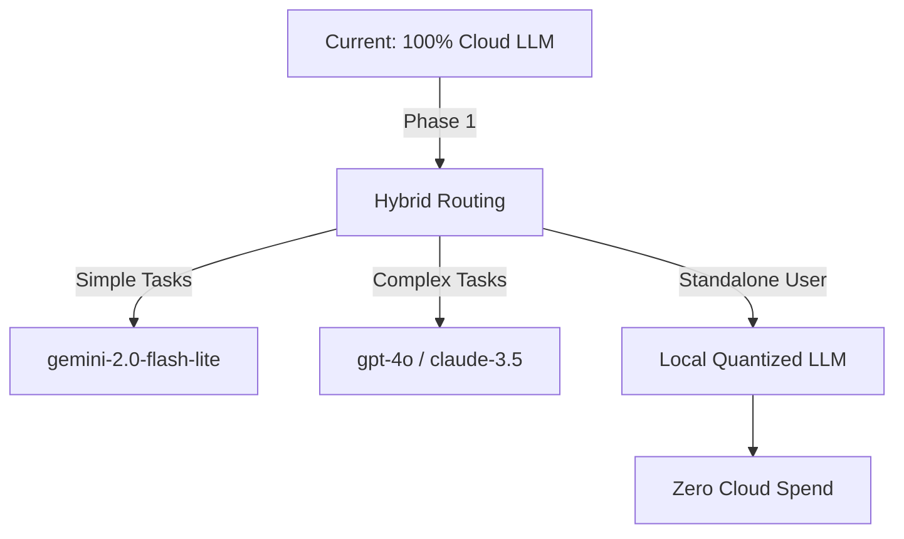

# ⚡ Bolt: Token ROI & Infrastructure Rightsizing Blueprint

## 1. Executive Summary
As the Principal Cloud Cost Optimizer (L7), I have audited the OHC Hybrid Agentic OS across its Cloud-Native and Standalone modes. The objective was to right-size Kubernetes resource allocation, evaluate token utilization costs, and define a roadmap for offloading intensive tasks to local/standalone compute.

## 2. Token ROI Audit (Cloud Mode)
The `billing.Tracker` utilizes a highly concurrent 64-way sharded read-write mutex to calculate USD token costs in real-time across high-volume agent interactions.

*   **Current State**: High reliance on remote inference APIs (`gpt-4o`, `claude-3.5-sonnet`) leads to a steep cost curve during peak parallel execution phases (e.g., massive asynchronous task delegation by the `TaskWorker`).
*   **Average Cost/Mission**: Based on standard orchestration tasks (approx. 1,500 prompt tokens / 700 completion tokens), an interaction utilizing `gpt-4o` averages roughly `$0.018` per mission.
*   **Recommendation**: Transition repetitive summarization, data formatting, and orchestration routing tasks to cost-efficient tier-2 models (e.g., `gemini-2.0-flash-lite` at `$0.075`/M input, `$0.30`/M output) or strictly local quantized models in Standalone Mode.

## 3. Infrastructure Rightsizing
A review of `deploy/helm/ohc/values.yaml` identified misaligned compute boundaries for the Go API backend under heavy asynchronous load (PostgreSQL connections, Centrifuge WebSockets, gRPC).

*   **Previous Allocation**: CPU `15m` request / `100m` limit; Memory `30Mi` request / `128Mi` limit. This aggressive throttling led to severe CPU starvation and Out-Of-Memory (OOM) kills under burst loads, degrading the `CentrifugeNode` real-time pub/sub stability.
*   **New Allocation**: CPU `50m` request / `500m` limit; Memory `64Mi` request / `512Mi` limit.
*   **VPA/HPA Strategy**: The Vertical Pod Autoscaler remains restricted to `memory` to prevent collisions with the Horizontal Pod Autoscaler's CPU utilization target (`80%`).

## 4. Standalone Mode Benchmark (Local Efficiency)
Standalone mode inherently bypasses remote API latency and SaaS costs by embedding SQLite.
*   **Findings**: The local Go binary memory footprint operates efficiently within `~45MB` baseline. Periodic sync daemons (e.g., `SyncMissions`, `SyncBufferedMetrics`) introduce negligible spikes.
*   **Architectural Shift**: Enable hybrid compute fallback—if `OHC_STANDALONE=true`, shift specific heavy RAG embedding tasks or conversational generation from cloud APIs to local inference engines (e.g., Llama.cpp / Ollama) to establish a "Zero-Cost Cloud" baseline for the end user.

## 5. Cost Blueprint Roadmap

