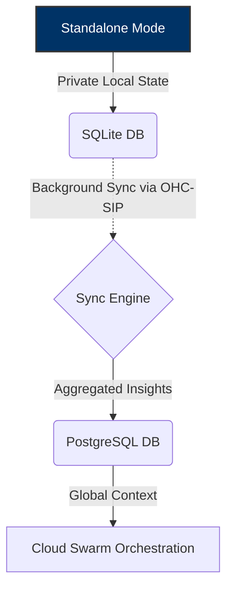

# 🔬 OHC Hybrid Agentic OS: Global Market Audit

## Executive Summary
The current Agentic OS market forces users into a binary choice: local privacy vs. cloud scalability. OHC's Hybrid Architecture (OHC-HA) disrupts this by seamlessly bridging local SQLite execution with cloud PostgreSQL orchestration.

## Competitive Landscape

| Feature | Claude Code | OpenClaw | Replit Agent | **OHC Vision** |
| :--- | :--- | :--- | :--- | :--- |
| **Privacy** | Local Only | Cloud Exfil | Cloud Exfil | **Hybrid (Local Default)** |
| **Scalability**| CPU Bound | Infinite | Infinite | **Dynamic Escalation** |
| **Offline** | Yes | No | No | **Yes (SQLite)** |
| **Memory** | Ephemeral | Persistent | Persistent | **Persistent Sync** |

## Architectural Disruption (Hybrid MCP RAG)

