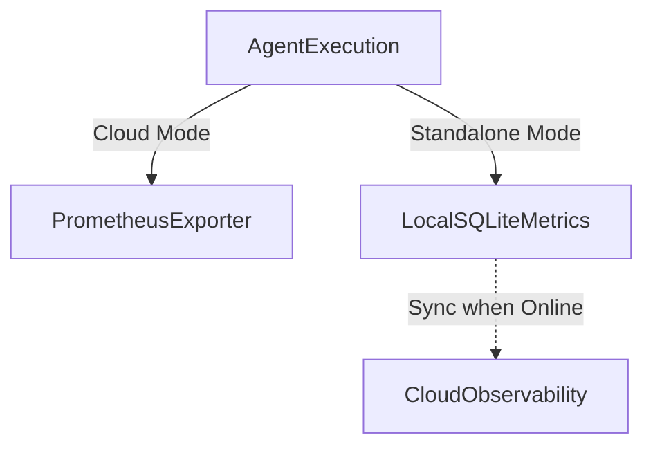

# OHC Hybrid Architecture Telemetry Review

## Hybrid Mode Throughput and Bottleneck Analysis

### 1. Cloud-Native vs. Standalone Desktop Modes

| Metric | Cloud-Native Mode | Standalone Desktop Mode |
| --- | --- | --- |
| Architecture | Multi-tenant, Kubernetes, PostgreSQL/Redis | Single-user, Local Go Backend, SQLite |
| Throughput | High, Horizontally Scalable | Constrained by Local Machine |
| Bottlenecks | Database lock contention, Network Latency | CPU/Memory limits, Local I/O |
| Observability | Comprehensive Prometheus/Grafana coverage | Minimal local OpenTelemetry metrics |

### 2. Observability Gap Analysis

*   **Cloud-Native**: High metric coverage with OpenTelemetry/Prometheus. However, there are gaps in detailed per-tenant token usage forecasting.
*   **Standalone**: Significant lack of local agent execution telemetry. Prometheus does not scrape local SQLite metrics efficiently.

### 3. Proposed Restructuring & Adaptation

**Recommendation**: Implement a localized metric buffer for Standalone Mode that aggregates agent telemetry and syncs with the OHC-SIP Cloud DB when an active connection is established. This will ensure holistic Swarm Intelligence observability without violating local-first operational capabilities.

