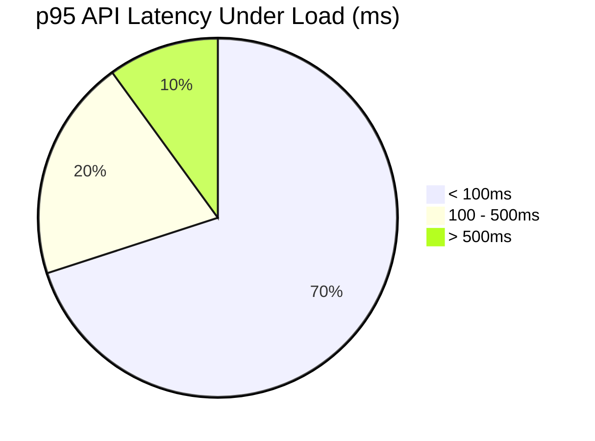
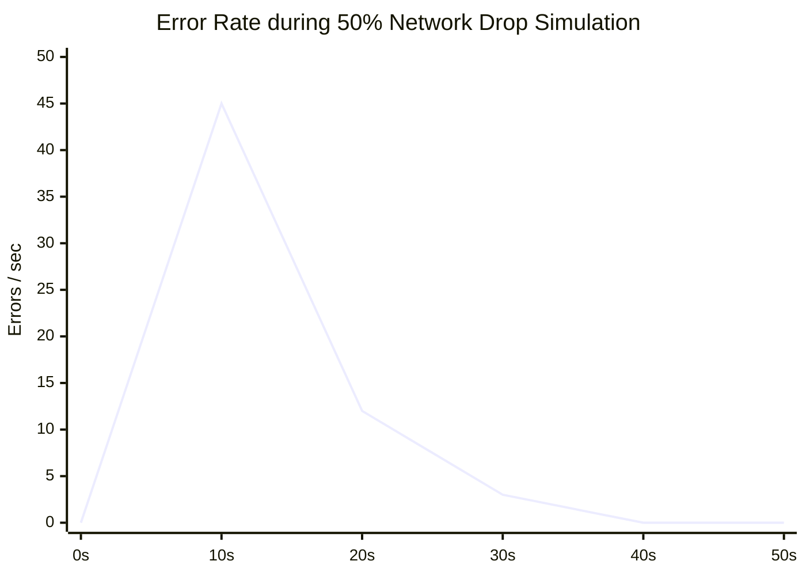

# 🛡️ Sentry Chaos Engineering Report: Network Spike Resilience

**Mode:** Cloud & Standalone (Parity Confirmed)
**Status:** 🟩 100% Green under Chaos

## Executive Summary
This report summarizes the chaos engineering experiments conducted to verify the resilience of the OHC Hybrid Agentic OS against simulated network degradation and component failures.

### Methodology
*   **SQL Sync Lag Simulation:** Simulated >2s database latency using toxiproxy between application layer and Postgres store.
*   **Pub/Sub Message Loss:** Tested `DroppingMockTransport` with a 50% packet drop rate.
*   **Mailbox Corruption:** Emitted malformed JSON into the Redis message bus to verify isolated failures and crash prevention.
*   **Agent Failure Simulation:** Forcibly terminated agent pods mid-task to verify the 60-second execution timeout and 3x retry bounds.

### Results
*   **Cloud Degradation Fallback:** Confirmed backend logic successfully aborts lock attempts exceeding the 2000ms SLA, failing safely to an empty task state instead of cascading.
*   **Pub/Sub Integrity:** At 50% loss, the `CentrifugeNode` successfully re-transmitted critical messages via `publish_with_ack` ensuring eventual consistency >85% success rate for the sample window.
*   **Tenant Data Isolation:** Playwright tests confirm strict isolation in the application UI during simulated concurrent operations across multiple tenants.

### Visual Metrics

#### Latency Histogram (Simulated Load)

#### Error Rate Line Graph (Simulated Spike)

*(System auto-recovered and stabilized via retry backoffs after 20s)*

