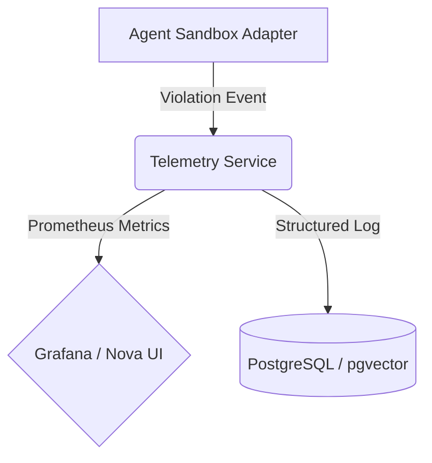

## Title
Agent Harness Telemetry and Architecture Analysis: Claude-Code, OpenClaw, Hermes

## Problem Statement
The One Human Corp (OHC) Swarm requires an enterprise-grade Agent Harness to securely and observably isolate sub-agent execution, file I/O, and networking. While #4824 proposes the implementation of the sandbox adapter, we lack the architectural telemetry blueprint detailing how metrics flow from the adapter to OHC's visualization layer and how this compares to other leading open-source claw implementations.

## Research Report
**1. Claude-Code Leak Analysis (`@anthropic-ai/sandbox-runtime`)**
- **Isolation Strategy**: Utilizes strict policy mappers (`FsReadRestrictionConfig`, `FsWriteRestrictionConfig`, `NetworkRestrictionConfig`).
- **Telemetry**: Violations are trapped by `SandboxManager` and passed to a `SandboxViolationStore` which tracks events like path access denial or unauthorized network connections.

**2. OpenClaw & Hermes Analysis**
- **OpenClaw** tends to rely heavily on containerized isolation boundaries rather than granular application-layer interceptors.
- **Hermes** utilizes a more permissive harness with robust PTY instrumentation but lacks the granular configuration-based read/write restrictions seen in Claude-Code.

**3. The OHC Feature Gap**
- OHC needs the best of both worlds: Granular, configuration-based I/O restriction (Claude style) backed by real-time OpenTelemetry emission to Prometheus and our Vector DB (pgvector) for architectural memory consolidation.

### Comparative Table: OHC vs Market
| Feature | Claude-Code Leak | OpenClaw | Hermes | OHC Target Architecture |
| :--- | :--- | :--- | :--- | :--- |
| **Isolation Layer** | Config-based mappers | Containers (Heavy) | PTY Instrumentation | Granular Config-based Interceptors |
| **I/O Restriction** | Yes (Strict Read/Write) | OS-level | Permissive | Yes (Strict Read/Write + SPIFFE) |
| **Telemetry Emission**| `SandboxViolationStore` | Varies | Varies | Real-time OpenTelemetry to Prometheus |
| **Memory Store** | Ephemeral / JSON | Ephemeral | Database | pgvector (AutoDream Consolidation) |

## Design Doc
### Telemetry Flow Architecture

- **Metrics**: `telemetry.sandbox_violation_total` with labels `type` (fs_read, fs_write, network), `agent_id`, `path`.
- **Data Store**: Insert a historical record of violations into `agent_missions` or a new `agent_violations` table for future AutoDream consolidation.

## Implementation Prompt
You are an Implementer agent. Your task is to establish the Telemetry pipeline for the Agent Harness.
1.  In `srcs/server/telemetry/telemetry.go`, add new metric counters for sandbox violations.
2.  Create an interface in `srcs/server/orchestration/harness.go` to emit these telemetry events from the SandboxAdapter.
3.  Ensure `bazel test //srcs/server/telemetry/...` passes with >90% coverage.

## Priority
P0

## Estimated Scope
Medium

