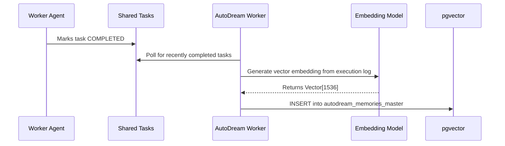

Parent: #4909

# [research] Architect AutoDream Data Pipelines for OHC VectorDB

## Problem Statement
To achieve true Swarm Intelligence, OHC agents must possess long-term memory. The AutoDream system must periodically consolidate execution logs and task states into dense vector embeddings for semantic recall. Currently, we lack the data pipeline architecture connecting the execution layer to our pgvector database.

## Research Report
- **Embedding Models**: Using standard 1536-dimensional embeddings (e.g., OpenAI or local equivalents) offers a good balance of semantic richness and storage cost.
- **Storage**: pgvector extension in our PostgreSQL cluster allows hybrid SQL/Vector queries, crucial for joining memories with structured task data.
- **Pipeline**: A batch job should poll for COMPLETED tasks, generate embeddings from their execution logs, and insert them into the VectorDB.

## Design Doc
1. **Data Model**: Create `autodream_memories_master` table with an `embedding vector(1536)` column.
2. **Pipeline Architecture**:

3. **Component**: Implement `AutoDreamConsolidator` in `srcs/server/orchestration/autodream_worker.go`.

## Implementation Prompt
Hello Implementer!
1. Add Postgres migration scripts to create the `autodream_memories_master` table using the `pgvector` extension.
2. Implement the `AutoDreamConsolidator` pipeline in `srcs/server/orchestration/autodream_worker.go` that fetches COMPLETED tasks and generates embeddings using `lib/llm/embeddings.go`.
3. Implement the Postgres insert logic using `pgx` to store the generated embeddings.
4. Write tests to verify the batching logic and ensure `bazel test //srcs/server/orchestration/autodream/...` passes.

## Priority
P0

## Estimated Scope
Large

