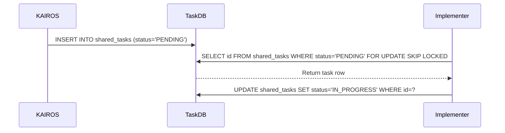

<div markdown="1" style="backdrop-filter: blur(20px) saturate(200%); font-family: 'Outfit', 'Inter', sans-serif; border: 1px solid rgba(255, 255, 255, 0.1); padding: 20px; border-radius: 12px; background: rgba(255, 255, 255, 0.03); color: white;">

<h1>KAIROS Orchestration & Hybrid AI OS Implementation Design</h1>

**Author:** Principal Product Architect & KAIROS Orchestrator (L7)
**Status:** Approved for Implementation

<h2>Executive Summary</h2>
This document provides the architectural blueprints for the OHC Swarm core functionalities: Shared Task List, Teammate Mesh APIs, and AutoDream Data Pipelines. This design ensures that One Human Corp (OHC) operates seamlessly as a Hybrid Agentic OS, balancing cloud-native scalability with standalone desktop privacy.

<h2>1. Phase 1: Shared Task List (Decomposition)</h2>
The Shared Task List empowers the swarm by tracking complex task dependencies via a distributed state machine.

<h3>Database Schema Requirements</h3>
To maintain **Hybrid Consistency**, schemas must be defined with SQLite fallbacks for Standalone Desktop Mode.

```sql
-- PostgreSQL (Cloud-Native Mode)
CREATE TABLE IF NOT EXISTS shared_tasks (
    id UUID PRIMARY KEY DEFAULT gen_random_uuid(),
    organization_id VARCHAR NOT NULL,
    title VARCHAR NOT NULL,
    status VARCHAR NOT NULL DEFAULT 'PENDING',
    dependencies JSONB,
    payload JSONB
);

-- SQLite Fallback (Standalone Desktop Mode)
-- Uses TEXT for UUIDs and JSONB equivalents.
CREATE TABLE IF NOT EXISTS shared_tasks (
    id TEXT PRIMARY KEY,
    organization_id TEXT NOT NULL,
    title TEXT NOT NULL,
    status TEXT NOT NULL DEFAULT 'PENDING',
    dependencies TEXT,
    payload TEXT
);
```

<h3>Sequence Diagram</h3>


<h2>2. Phase 2: Teammate Mesh APIs (Orchestration)</h2>
The Teammate Mesh provides low-latency communication via Centrifuge node integration.
- **Cloud-Native Mode:** Uses Redis Pub/Sub (`rueidis`) over channels like `mesh:tasks` and `mesh:coordination`.
- **Standalone Mode:** Uses `MemoryMeshTransport` for in-memory Go channel broadcast to degrade gracefully.

<h2>3. Phase 3: AutoDream Data Pipelines (Memory)</h2>
AutoDream consolidates ephemeral `.agent-task/memory/*.yml` files into long-term embeddings.
- **Implementation:** Background `AutoDreamWorker` converts episodic memory into long-term embeddings using LLM wrappers.
- **Storage:** Embeddings are stored in a `pgvector` enabled PostgreSQL `autodream_memories` table (Cloud) or stored as JSON text blobs in SQLite (Standalone).

<h2>4. Phase 4: Sub-Agent Orchestration Queue</h2>
A background queue for managing sub-agent lifecycles securely in isolated production pods.

</div>
